# Array & Linkedlist

---
## Array

### 1.정의와 성질

캐시 히트율 이란, 캐시된 데이터를 요청할 때 해당 키 값이 메모리에 존재하여 얼마만큼의 비율로 잘 찾았는지에 대한 여부를 말합니다. 캐시 데이터를 잘 찾았다면 Cache hits 이라고 하며 반대로 캐시가 존재하지 않아 찾지 못했을 경우 Cache Misses 라고 합니다. 캐시 히트율이 높다는 것은 데이터베이스에서 읽어오는 비율보다 메모리에 캐시된 데이터를 읽어오는 비율이 높다는 의미이기 때문에 효율적으로 캐시를 사용하고 있다는 것입니다.  
> 캐시 히트율 = Keyspace-hits / (Keyspace-hits + Keyspace-misses)

### 2. 기능

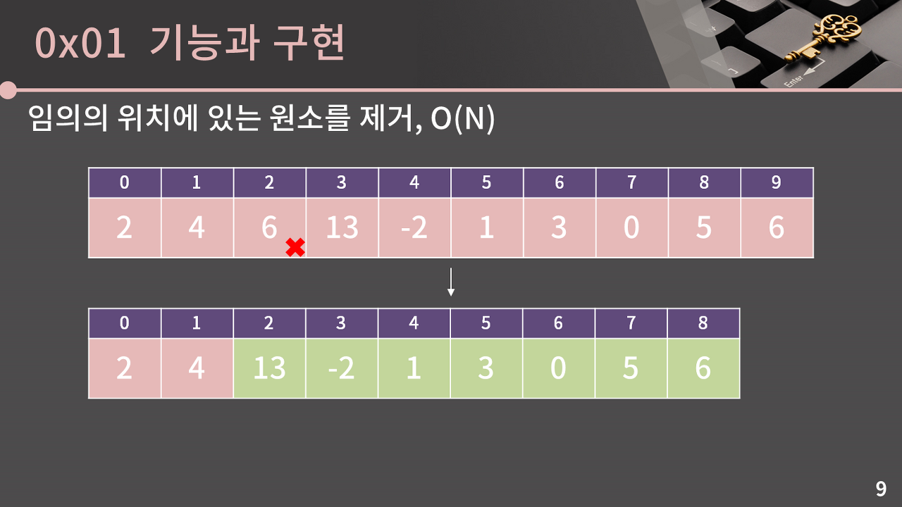

---
**INSERT 에 대해서만 자세히 보면** 
특정 Index에 특정 값(num) 을 중간에 삽입하려고 하면 삽입하려고 하는 index의 다음 index가 사라지는 문제
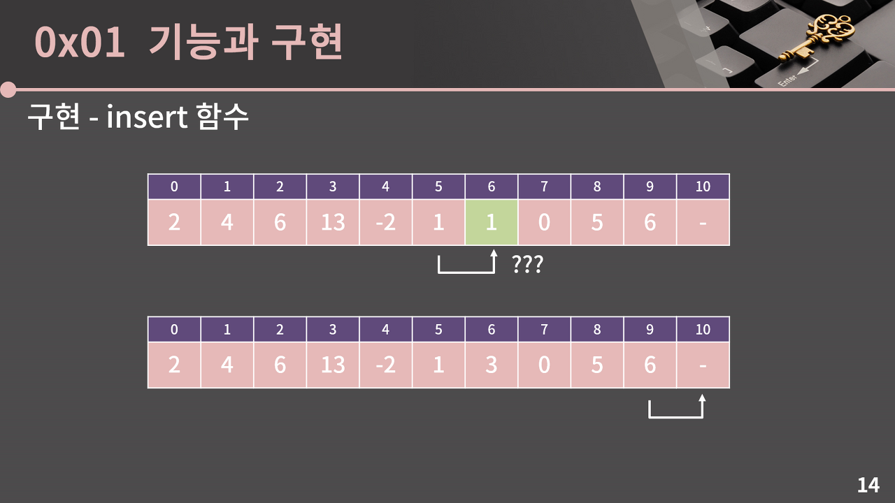
따라서 배열의 끝에서부터 삽입하려고 하는 Index까지 모두 +1씩 오른쪽으로 옮겨야 한다. 
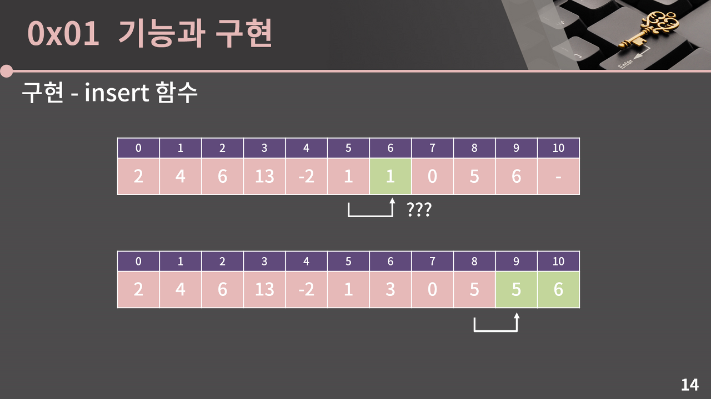
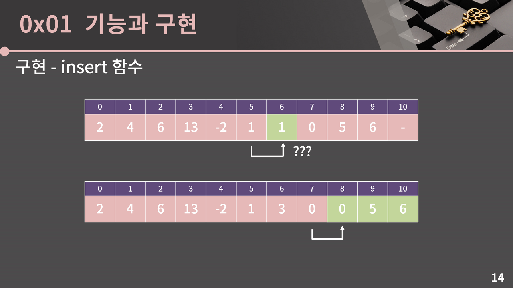

다 옮긴 뒤에 넣고자 하는 Index에 넣으려고 했던 num을 넣을 수 있다. 
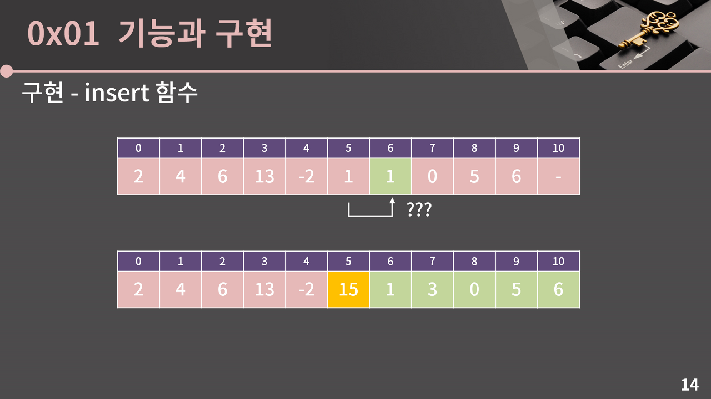

**ERASE** 
배열의 특정 Index의 값을 삭제하는 것은 그 Index부터 배열의 끝까지 -1씩 왼쪽으로 옮기면 된다. 
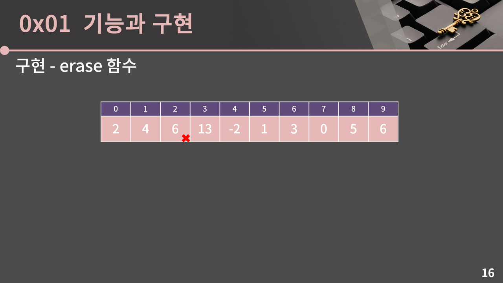
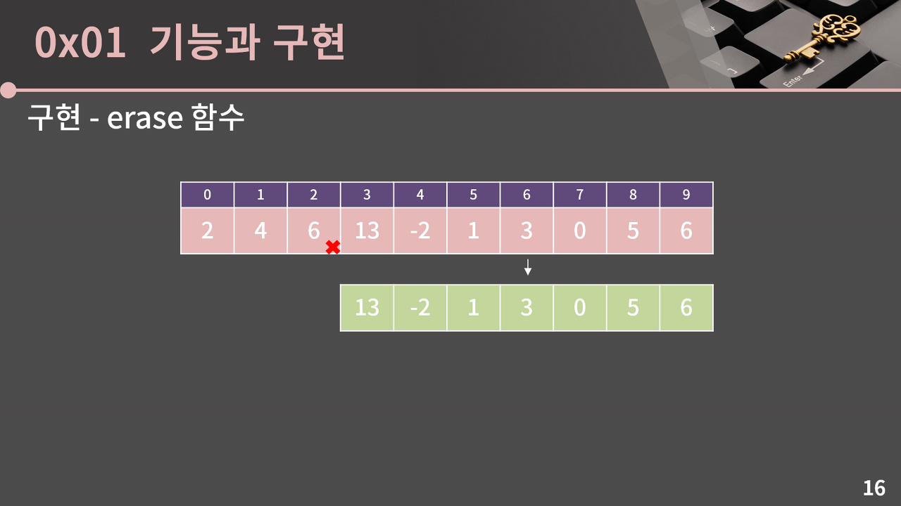
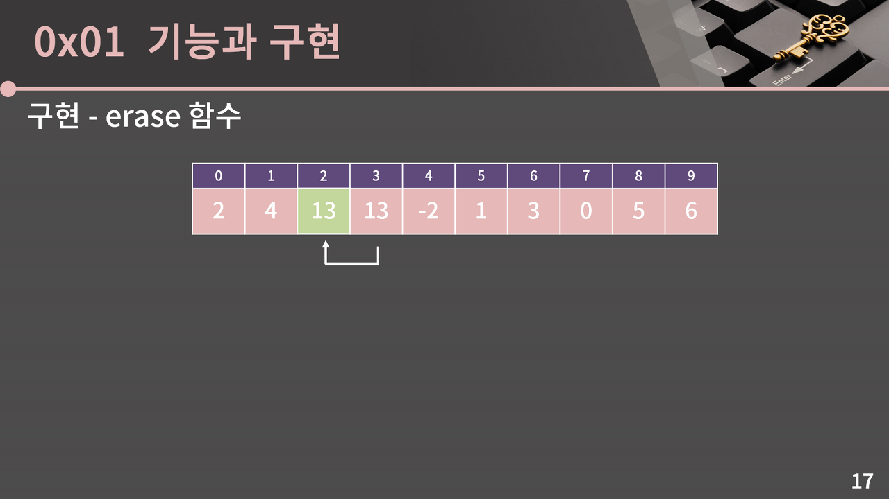
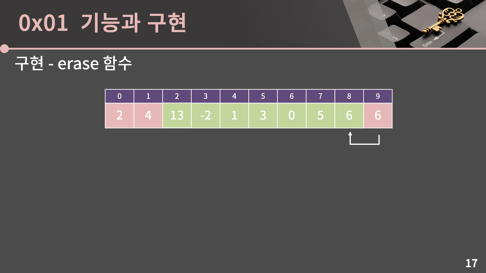

**메모리구조** 

배열을 가리키는 참조변수는 스택영역에 할당되며, 참조변수가 가리키고 있는 주소값은 실제 힙영역에 생성되는 배열의 주소값이다. 
힙 내부에 요소들이 순서대로 저장된다. 

출처:
https://jane096.github.io/project/redis-caching/
 https://blog.encrypted.gg/927
 https://structuring.tistory.com/152

---
## Linked List

### 1.정의와 성질
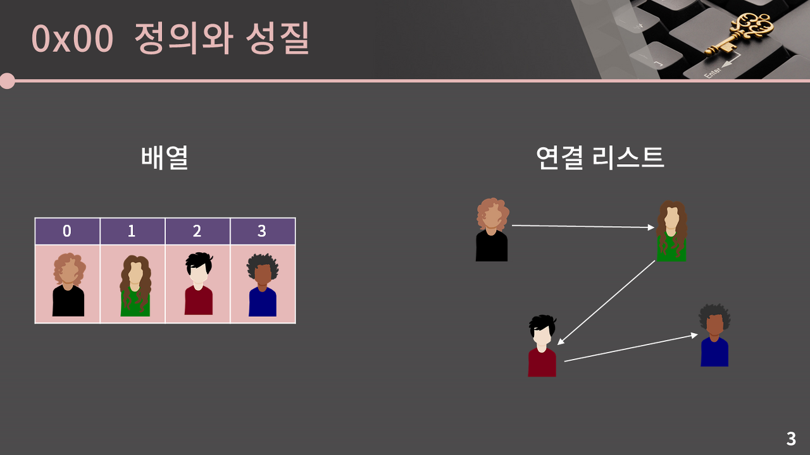   
연결리스트란, 원소들을 저장할 때 그 다음 원소가 있는 위치를 포함시키는 방식으로 저장하는 자료구조이다. 
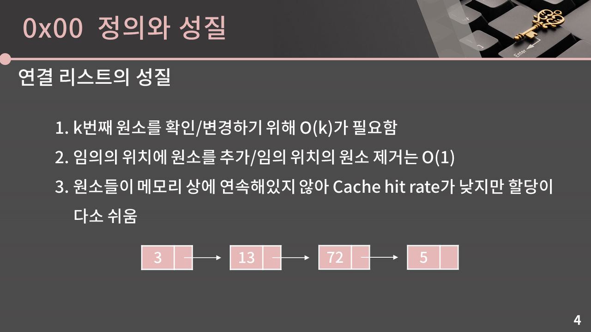

1. 이 그림은 3, 13, 72, 5를 저장하는 연결 리스트이다. 여기서 3번째 원소인 72를 찾고 싶으면 3을 거쳐서 13을 가고, 13을 거쳐서 72를 가야하기 때문에 O(k)의 시간이 필요. 
2. 연결 리스트에서는 임의의 위치에 원소를 추가하거나 임의 위치의 원소 제거가 O(1)이다. 배열과 비교했을 때 큰 차이가 있는 성질.
3. 메모리 상에 데이터들이 연속해있지 않으니까 Cache hit rate가 낮지만 할당이 쉽다.

### 2. 종류

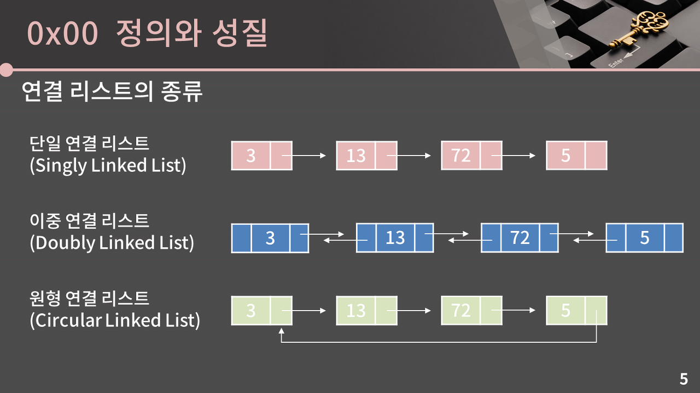

- 각 원소가 자신의 다음 원소의 주소
- 각 원소가 자신의 이전 원소와 다음 원소의 주소를 둘 다
- 끝이 처음과 연결(각 원소가 이전과 다음 원소의 주소를 모두 들고 있어도 상관이 없다.)
 
 

**임의의 위치에 있는 원소를 확인/변경하는 방법** 
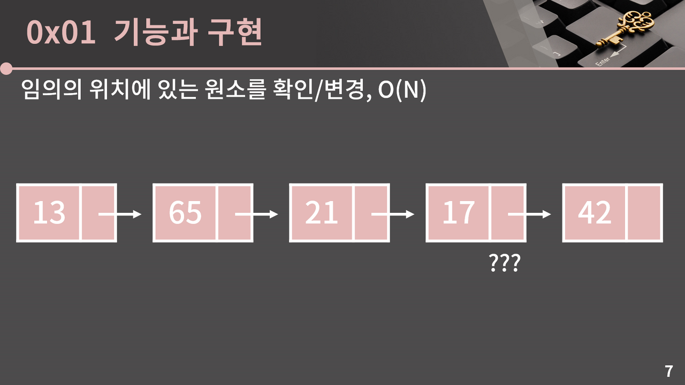
배열과는 다르게 임의의 위치에 있는 원소로 가기 위해서는 그 위치에 도달할 때 까지 첫 번째부터 순차적으로 방문.
 > 첫 번째 원소의 주소만 알고 있기 때문.
 
네 번째 원소의 값을 확인하고 싶다고 할 때, 첫 번째 원소에 기록된 주소를 보고 두 번째 원소로 넘어가고, 두 번째 원소에 기록된 주소를 보고 세 번째 원소로 넘어가고, 세 번째 원소에 기록된 주소를 보고 네 번째 원소로 넘어가서 확인할 수 있다.

> 그렇기 때문에 k번째 원소를 보기 위해서는 O(k)의 시간이 필요하고, 전체에 N개의 원소가 있다고 하면 평균적으로 N/2의 시간이 걸릴테니 O(N).
 
 

**임의의 위치에 INSERT**
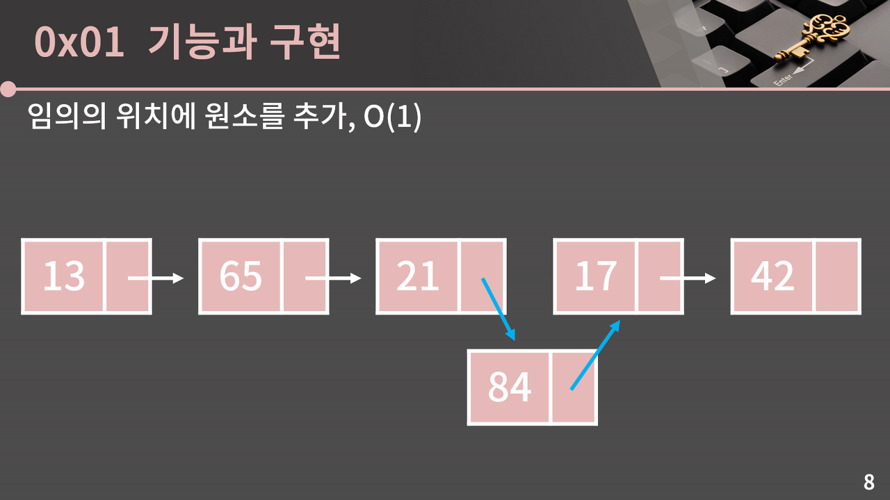
 O(1). 21 뒤에 84를 추가하고 싶다고 할 때, 배열처럼 그 뒤의 원소들을 전부 옮기는 작업을 할 필요가 없고 그냥 21과 84에서 다음 원소의 주소만 변경.

 > 단, 추가하고 싶은 위치의 주소를 알고 있을 경우에만 O(1). 만약 21의 주소를 준 것이 아니라 그냥 84라는 원소를 세 번째 원소 뒤에 추가하라는 명령의 경우에는, 세 번째 원소까지 찾아가야 하는 시간이 걸려서 O(1)이라고 말할 수 없다.

 **임의의 위치에 DELETE**
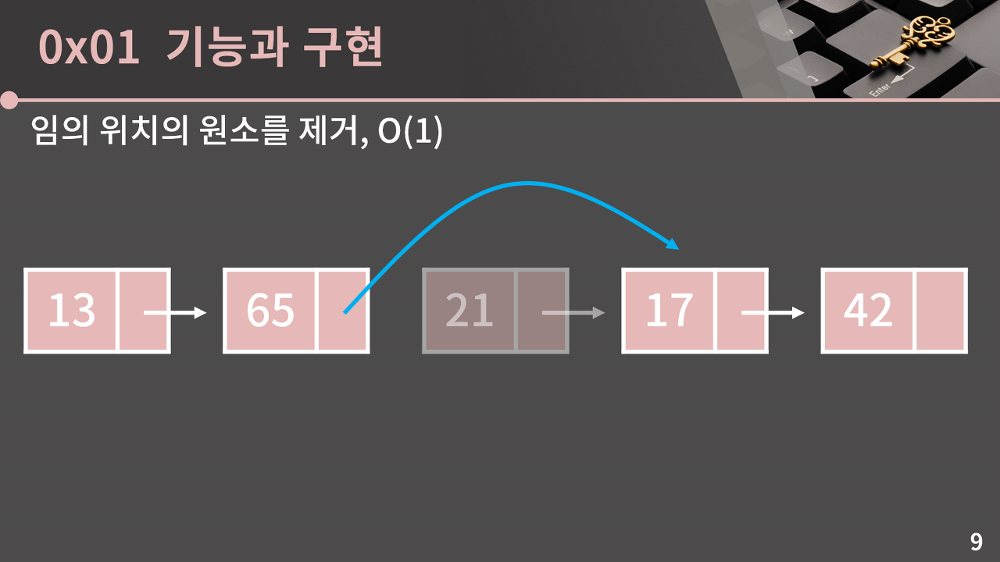
O(1). 21을 지우려고 하면 65에다가 "너의 다음 원소가 21이 아닌 17이다"라고만 알려주면 된다. 

**메모리구조** 
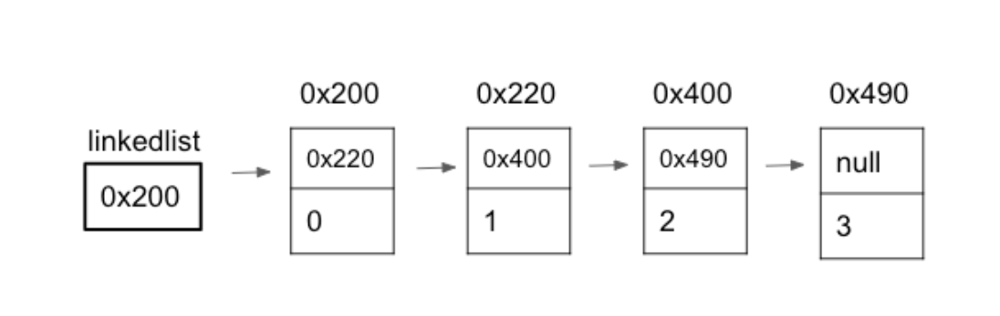
삭제할때 메모리측면
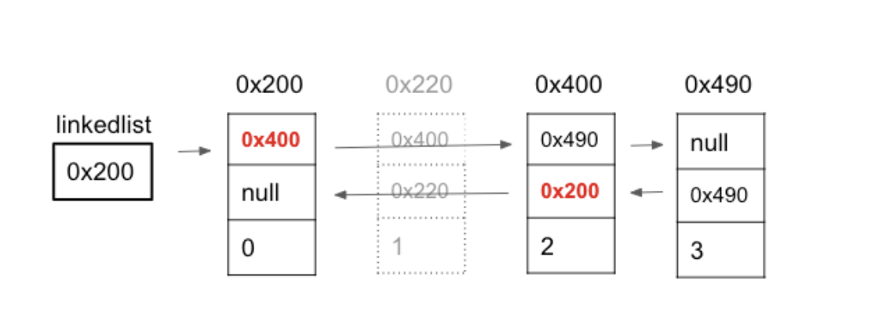

### 배열과 연결리스트의 차이

Overhead => 배열은 데이터만 저장하면 될 뿐 딱히 추가적으로 필요한 공간이 없습니다. 그런데 연결 리스트에서는 각 원소가 다음 원소, 혹은 이전과 다음 원소의 주소값을 가지고 있어야 한다. 그래서 32비트 컴퓨터면 주소값이 32비트(=4바이트) 단위이니 4N 바이트가 추가로 필요하고, 64비트 컴퓨터라면 주소값이 64비트(=8바이트) 단위이니 8N 바이트가 추가로 필요하게 된다. 즉 N에 비례하는 만큼의 메모리를 추가로 쓰게 된다.

출처:
https://freestrokes.tistory.com/84
https://blog.encrypted.gg/932
https://donghoson.tistory.com/m/157?category=799812

---

## :studio_microphone: 면접 대비

:question: Array와 Linked List의 차이점을 설명해보세요

 정답보기

먼저, Array는 연속된 메모리 공간을 사용하고, Linked List는 연속되지 않은 메모리 공간을 사용합니다.

그래서 Array의 경우, index를 통해 각 요소에 접근할 수 있고, 탐색에 필요한 시간복잡도는 O(1)입니다.
-> 정확히는 찾고자 하는 값의 index를 알 경우 O(1)이고, 특정 값을 탐색하는것은 결국엔 배열을 다 뒤져야하는것이기 때문에 O(n)입니다

하지만 삽입이나 삭제의 경우에는 shift에 필요한 연산이 발생하여 O(n)의 시간복잡도를 가집니다.
-> 정확히는 삽입 삭제의 경우 배열을 복사하는 과정이 필요하기 때문에 O(n)입니다.

반면 Linked List의 경우, shift가 필요없고, 노드 간의 연결을 이어주고 끊어주는 과정을 통해 삽입과 삭제를 O(1) 시간복잡도로 수행합니다. 탐색은 O(n) 시간복잡도로 수행합니다.

정리하면, Array는 추가나 삭제보다 빠른 접근의 이점을 필요로 할때 사용하고, Linked List는 탐색보다는 추가나 삭제에서의 이점을 필요로 할 때 사용합니다. 

 

출처 : https://dev-coco.tistory.com/159  
https://velog.io/@kkyes1210/CS-%EC%A0%95%EB%A6%AC-%EA%B8%B0%EC%88%A0-%EB%A9%B4%EC%A0%91-%EC%A7%88%EB%AC%B8-%EC%A0%95%EB%A6%AC-%EC%9E%90%EB%A3%8C%EA%B5%AC%EC%A1%B0

---

### Time Complexity

입력값의 크기에 따른 함수의 증가량  == 성장률   
중요하지 않은 상수와 계수들을 제거, 성장률에 집중하는 것을 **점근적표기법** 이라고 한다.     
가장 큰 영향을 주는 항만 계산      
점근적 표기법에는 세가지가 있다.   
- 최상의 경우 : 오메가 표기법 Big-Ω(빅-오메가)
- 평균의 경우 : 세타 표기법 Big-θ(빅-세타)
- 최악의 경우 : 빅오 표기법 Big-O(빅-오)        

평균인 세타표기를 하면 가장 정확하지만 평가하기 까다로워 최악의 경우인 빅오를 사용하는 알고리즘이 최악일때의 경우 판단하면 평균과 가까운 성능으로 예측할 수 있다.     
 
Big-O로 측정되는 복잡성에는 시간과 공간복잡도가 있는데
- 시간복잡도는 입력된 N의 크기에 따라 실행되는 조작의 수를 나타낸다. 
- 공간복잡도는 알고리즘이 실행될 때 사용하는 메모리의 양을 나타낸다. 요즘에는 데이터를 저장할 수 있는 메모리의 발전으로 중요도가 낮아졌다. 

### 시간복잡도
> 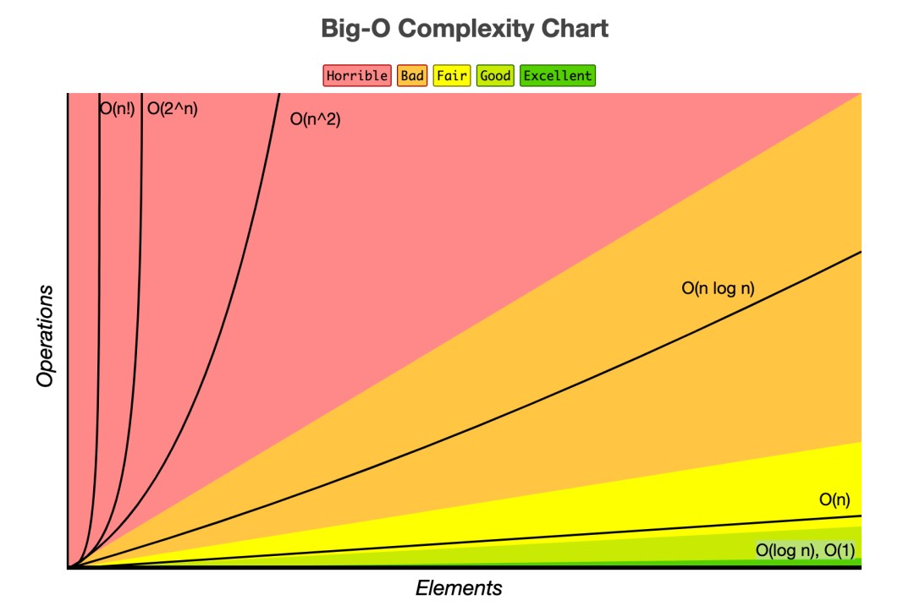
 

**O(1)**
> 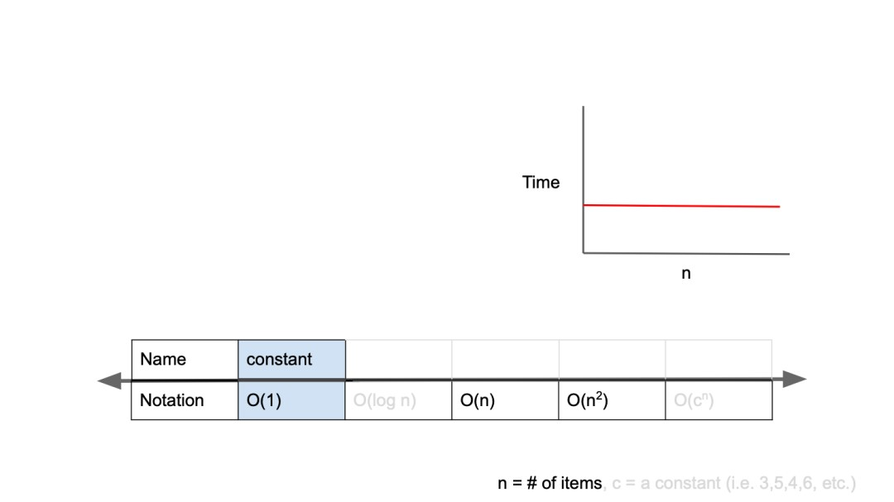
>&nbsp;&nbsp;O(1)는 일정한 복잡도(constant complexity)라고 하며, 입력값이 증가하더라도 시간이 늘어나지 않는다. 다시 말해 입력값의 크기와 관계없이, 즉시 출력값을 얻어낼 수 있다는 의미이다.
 

**O(log n)**
>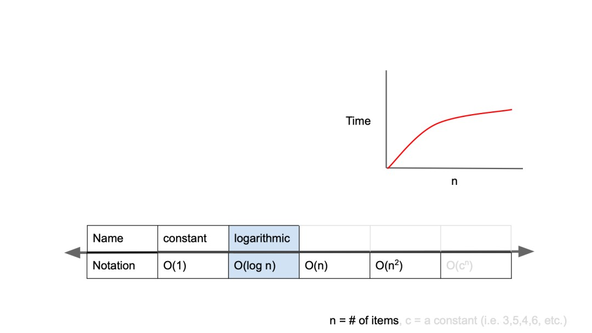
>&nbsp;&nbsp;O(log n)은 로그 복잡도(logarithmic complexity)라고 부르며, Big-O표기법중 O(1) 다음으로 빠른 시간 복잡도를 가진다.  
>&nbsp;&nbsp;BST(Binary Search Tree)가 대표적인 예시이며, 노드를 이동할 때마다 경우의 수가 절반으로 줄어든다.
 

**O(n)**
>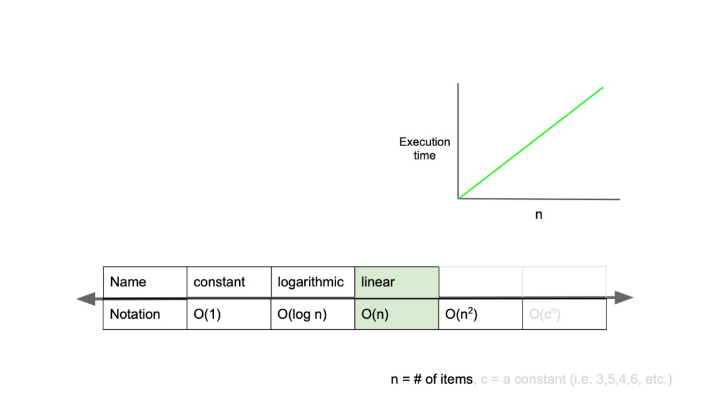
>&nbsp;&nbsp;O(n)은 선형 복잡도(linear complexity)라고 부르며, 입력값이 증가함에 따라 시간 또한 같은 비율로 증가하는 것을 의미한다. 
>&nbsp;&nbsp;Array, Linked List, Stack, Hash table이 대표적인 예시이다. 
 

**O(n2)**
>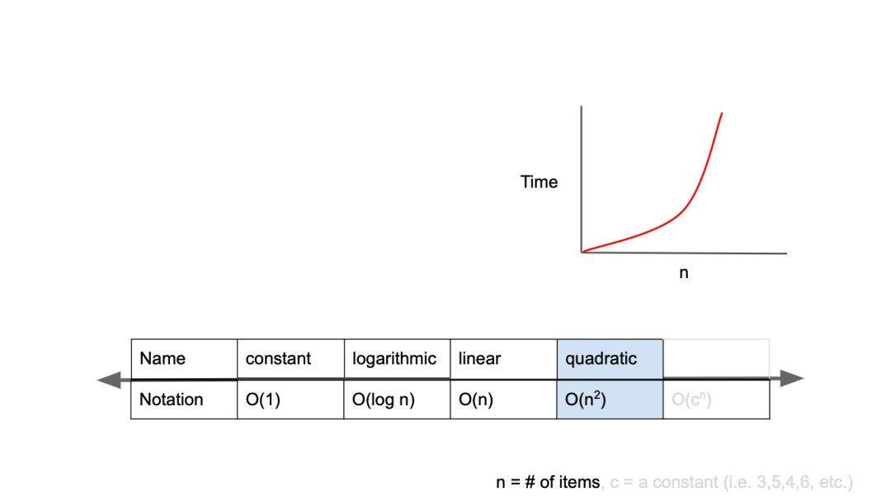&nbsp;&nbsp;O(n2)은 2차 복잡도(quadratic complexity)라고 부르며, 입력값이 증가함에 따라 시간이 n의 제곱수의 비율로 증가하는 것을 의미한다.
 

**O(2n)**
>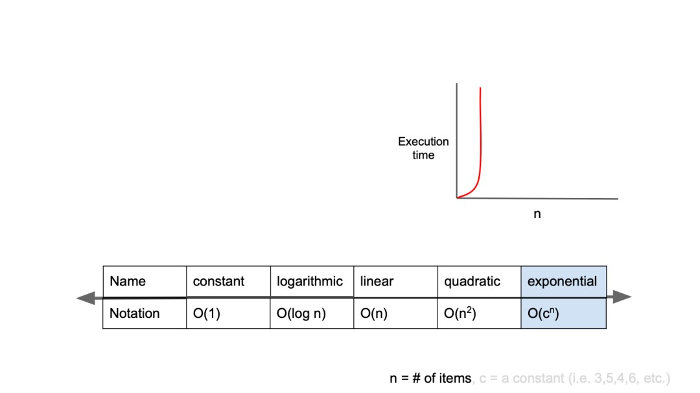
>&nbsp;&nbsp;O(2n)은 기하급수적 복잡도(exponential complexity)라고 부르며, Big-O 표기법 중 가장 느린 시간 복잡도를 가진다.라 시간이 n의 제곱수의 비율로 증가하는 것을 의미한다. 
> &nbsp;&nbsp;재귀로 구현하는 피보나치 수열은 O(2n)의 시간 복잡도를 가진 대표적인 알고리즘이다. 
 

출처 : https://blog.chulgil.me/algorithm/ 
https://hanamon.kr/%EC%95%8C%EA%B3%A0%EB%A6%AC%EC%A6%98-time-complexity-%EC%8B%9C%EA%B0%84-%EB%B3%B5%EC%9E%A1%EB%8F%84/

     
       

--- 

