# 이진탐색트리
## 정의
- 이진탐색트리는 이진탐색의 효율적인 탐색 능력을 유지하면서도 빈번한 자료 입력과 삭제를 가능하게끔 이진탐색과 연결리스트를 결합한 자료구조의 일종이다.
## 특징
- 이진탐색트리는 각 노드에 중복되지 않는 키(key)가 있으며 루트노드 좌측 서브 트리에는 해당 노드의 키보다 작은 키를 갖는 노드들로 구성되어 있으며 우측 서브 트리는 해당 노드의 키보다 큰 키를 갖는 노드들로 구성되어 있다.

- 또한 좌우 서브 트리도 모두 이진탐색트리여야 하며 중복된 노드가 없어야 한다.

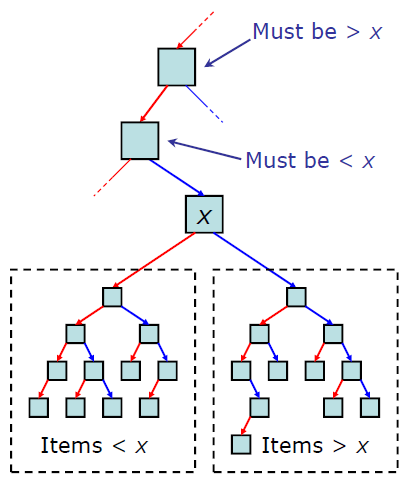

## 순회
### 중위 순회(inorder traversal)
 - 중위 순회는 재귀적으로 왼쪽 서브트리 순회를 진행한다. 먼저 현재 노드를 방문하고 재귀적으로 오른쪽 서브트리를 순회한다.

 순서대로 보자면
 1. 계속해서 왼쪽 서브트리로 순회를 하는데 더 이상 왼쪽으로 갈 수 없다면 해당 노드를 방문하고 오른쪽 서브트리로 이동한다.

 2. 그 이후에 오른쪽 서브트리도 갈 곳이 없다면 해당 노드를 방문한다.

 3. 왼쪽 서브트리 순회가 끝나면 자신노드를 방문한다.
 이렇게 중위 순회를 한다면 값들을 순서대로 방문하는 특징을 가진다.

 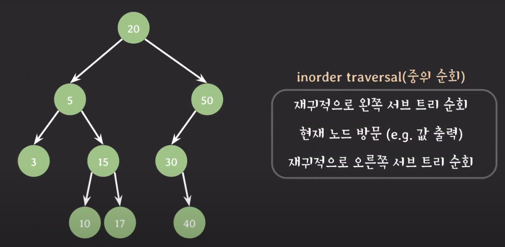

      출력 순서 : 3, 5, 10, 15, 17, 20, 30, 40, 50

### 전위 순회(preorder traversal)
- 전위 순회는 먼저 현재 노드를 방문한다. 그리고 재귀적으로 왼쪽 서브트리를 순회하고 오른쪽 서브트리를 재귀적으로 순회한다.

- 중위 순회는 더 이상 진행할 서브트리가 없다면 방문했다면 전위 순회는 먼저 자신의 노드부터 방문하고 순회하면서 바로 방문한다는 특징이 있다.

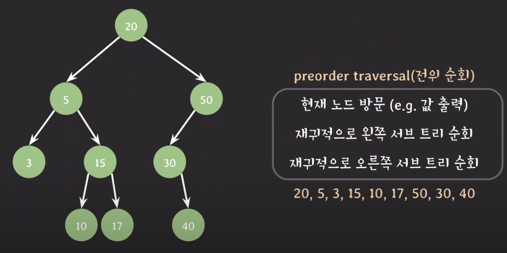

### 후위 순회(postorder traversal)
- 후위 순회는 먼저 재귀적으로 왼쪽 서브트리를 순회하고 오른쪽 서브트리를 순회한 후 현재 노드를 방문한다.

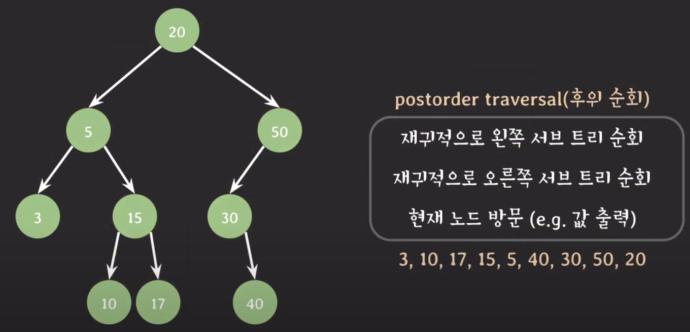

## 삽입
1. 삽입할 값을 루트노드와 비교해 같다면 오류를 발생시킨다.(중복값 허용 x)

2. 삽입할 값이 루트노드의 키보다 작다면 왼쪽 서브트리를 탐색해서 비어있다면 추가하고, 비어있지 않다면 다시 값을 비교한다.

3. 갑입할 값이 루트노드의 키보다 크다면 오른쪽 서브트리를 탐색해서 비어있다면 추가하고, 비어있지 않다면 다시 값을 비교한다.

## 삭제
삭제의 경우 크게 3가지 경우로 나눌 수 있다.
1. 삭제하려는 노드가 단말 노드일 경우(자식이 없는 노드)

    - 자식이 없는 단말 노드의 경우, 노드를 삭제하고 삭제될 노드를 가리키던 레퍼런스를 가리키는 것이 없도록 null을 대입해 처리한다.
2. 삭제하려는 노드의 서브트리가 하나인 경우(자식이 하나인 노드)

    - 삭제될 노드를 가리키던 레퍼런스를 삭제될 노드의 자녀를 가리키게 변경한다.
3. 삭제하려는 노드의 서브트리가 두 개인 경우(자녀가 두 개인 노드)

    - 삭제될 노드의 오른쪽 서브트리에서 가장 값이 작은 노드가 삭제될 노드를 대체한다.

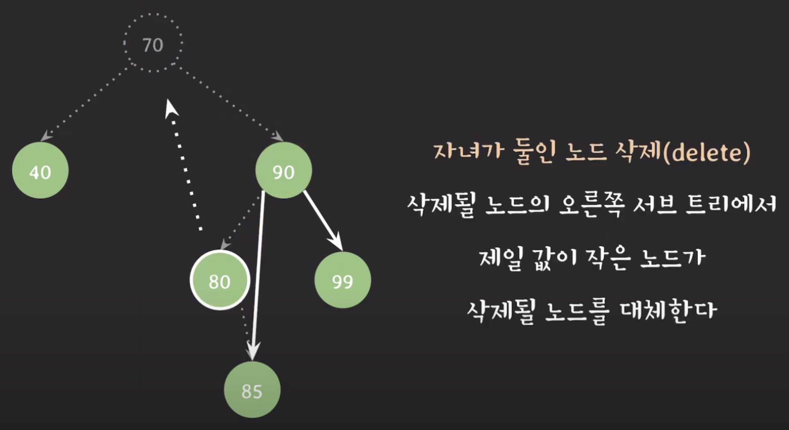

## 이진탐색트리의 시간 복잡도
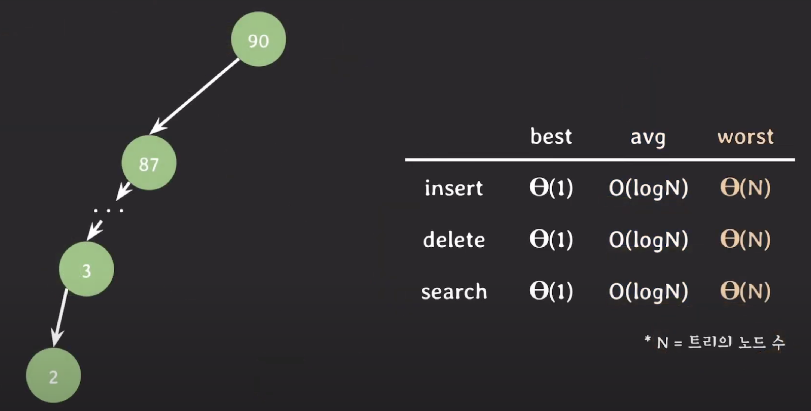

## 장점
- 이진탐색트리는 삽입, 삭제 시 레퍼런스 조정만 하면 되기 때문에 이러한 부분에서 유연하다.

- 값의 크기에 따라 좌우 서브트리가 나눠지기 때문에 삽입, 삭제, 검색이 보통은 빠르다.

- 값의 순서대로 순회가 가능하다.

## 단점
- worst case의 경우, 모든 노드트리를 방문해야 하는 경우가 있다.

- 트리가 구조적으로 한 쪽으로 편향된 트리(skewed tree)라면 삽입, 삭제, 검색 등 여러 동작들의 수행 시간이 악화된다.

이 문제들을 해결하기 위해 스스로 균형을 잡는 AVL 트리, Red-Black 트리와 같은 이진탐색트리가 사용된다.

## 면접 질문 예시
질문 :

Hash table을 사용하면, 삽입과 탐색 그리고 삭제 연산을 평균 O(1) 시간복잡도로 사행할 수 있는데 굳이 Binary Search Tree를 사용하는 경우는 언제일까?

답변 : 

1. inOrder 순회를 통해 Tree 속 데이터를 정렬하여 갖고 올때

Hash Table은 데이터 간의 순서 관계를 저장할 수 없는 자료구조이기 때문에, 일반적인 정렬 알고리즘이 필요한 반면, Binary Search에서는 inOrder 순회만으로 빠르게 정렬이 가능하다.

2. 메모리가 제한되어있을 때

Binary Search Tree는 필요한 원소만큼의 공간을 할당하는 반면, Hash Table은 적중률을 높이기 위해 원소의 개수 이상의 메모리를 항상 유지하며 적재율을 관리해야 한다.

# AVL 트리
AVL 트리는 이진탐색트리의 한 종류이며 balance factor를 통해 스스로 균형을 잡는 트리이다.

balance factor란 임의의 노드 x에 대한 다음의 식이다.

$$ BF(x) = h(\text{LeftSubtree}(x)) - h(\text{RightSubtree}(x)) $$

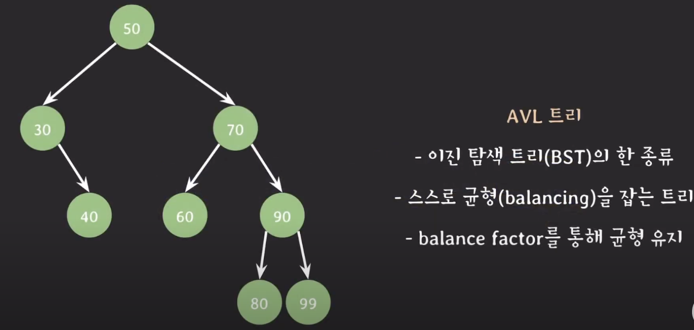

## AVL 트리의 특징
- AVL 트리의 모든 노드들은 아래와 같은 특징을 가진다.

$$ BF(x) \in \{-1, 0, 1\} $$

## AVL 트리의 균형 잡기
- 트리에 삽입 혹은 삭제 후 BF(x) 중 {-1, 0, 1}에 포함되지 않는 노드가 생기면 균형을 맞추는 작업을 수행한다.

## AVL 트리의 동작 방식
1. 노드가 삽입된 후 트리 높이인 h를 비교하여 {-1, 0, 1}에 포함된다면 그대로 진행한다.

2. 만약 노드를 추가 했을 때 (왼쪽 서브트리 높이 - 오른쪽 서브트리 높이)가 {-1, 0, 1}를 벗어난다면 재조정한다.

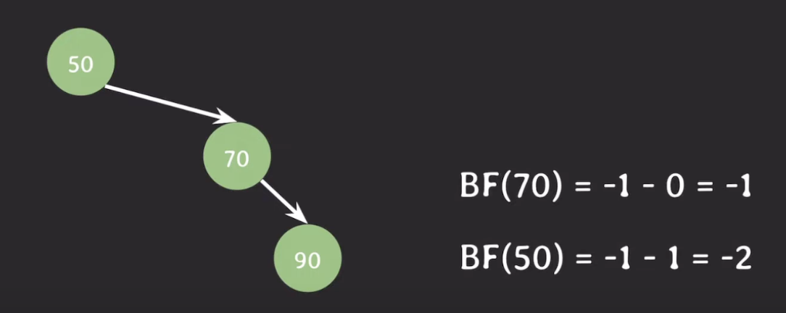

### 추가예시

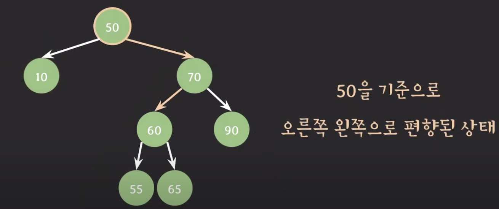

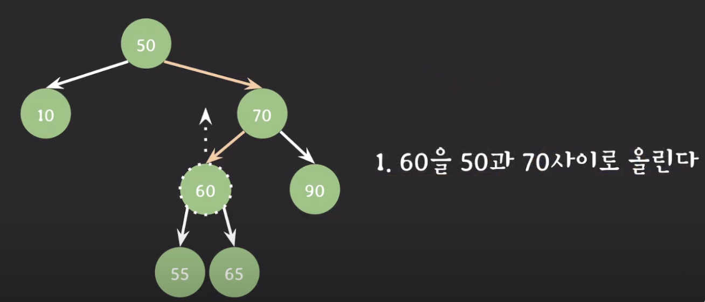

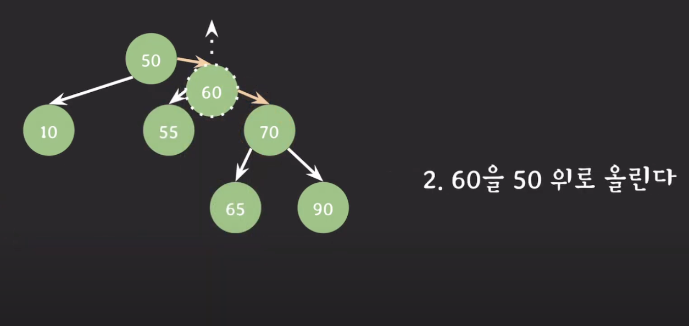

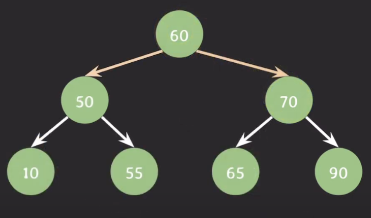

## AVL 트리에서의 삽입
- 이진탐색트리의 과정과 같지만 삽입 후 해당 노드 위의 노드들의 트리 높이를 확인해 편향되지 않았는지 확인한다.

## AVL 트리의 삭제
- 이 또한 이진탐색트리의 과정과 같다.

- 다만 삭제 후에 높이를 다시 확인하고 만약 편향된 트리가 된다면 편향된 노드들을 따라가서 재조정 해주어야 한다.

## AVL 트리의 시간 복잡도와 장단점
- worst case의 경우에도 삽입, 삭제, 검색의 시간 복잡도는 O(log N)이다.

- 단점으로는 엄격하게 균형을 유지하기 때문에 삽입, 삭제 시 트리 균형을 확인하고 만약 균형이 깨졌다면 트리 구조를 재조정 해야하기 때문에 시간이 꽤 소요된다.

- 이를 해결한 것이 Red-Black 트리이다.

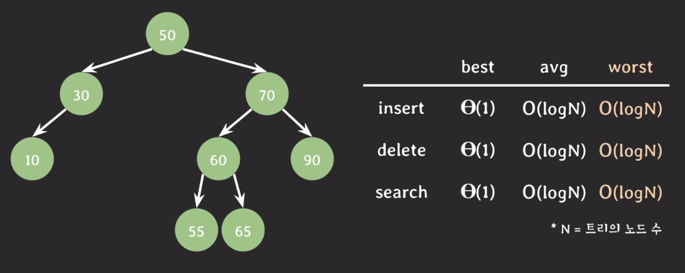

## 출처
- https://code-lab1.tistory.com/10
- https://www.youtube.com/watch?v=syGPNOhsnI4
- https://ratsgo.github.io/data%20structure&algorithm/2017/10/22/bst/