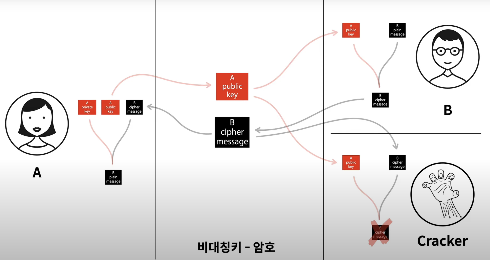
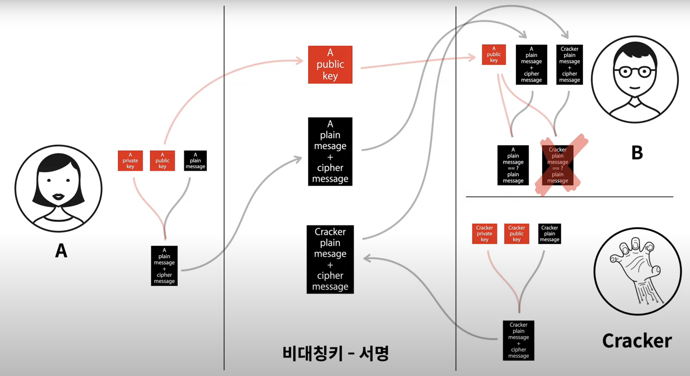

# 암호화 알고리즘

## 용어
- 평문(Plain text)  : 암호화 전 메시지로 해독 가능한 형태의 메시지이다.

- 암호문(Ciper text) : 암호화 된 메시지로 해독이 불가능한 형태의 메시지이다.

- 암호화(Encryption) : 평문을 암호문으로 변환하는 과정이다.

- 복호화(Decryption) : 암호문을 평문으로 변환하는 과정이다.

- 전자서명
  - 송신자의 Private Key로 메시지를 서명하여 전달한다.
  - 수신자 측에서는 송신자의 Public Key를 이용하여 서명값을 검증한다.

- 단방향 암호화 : Hasing을 이용한 암호화 방식으로 양방향 암호화와는 다른 개념이다. 평문을 암호문으로 암호화는 가능하지만 암호문을 평문으로 복호화 하는 것은 불가능한다.

- 양방향 암호화 : 암호화와 복호화 과정을 통해 송, 수신간 주고받는 메시지를 안전하게 암호화, 복호화 하는 과정이다.

## 단방향 암호화
- Hashing을 이용하여 암호화 하는 과정이다.

- 평문을 암호화 할 수는 있지만 복호화는 불가능하다.

- 데이터의 진위여부는 확인하고 싶으면서 본 데이터의 Privacy를 지키고 싶은 경우 사용한다.

- 단방향 암호화 알고리즘 예시 : CRC, MDS, RIPEMD160, SHA-1, SHA-256, SHA-512

- 사용 이유 및 사용 예시 : 무결성, 전자서명, 파일의 식별자 확인, 사용자 비밀번호 서버 보관, 블록체인 / 가상화폐 / 비트코인 채굴 시 작업증명

## 양방향 암호화
- 양방향 암호화는 대칭키를 사용하는 방식과 비대칭키를 사용하는 방식이 있다.

### 대칭키 암호화 방식
- 대칭키 암호화 방식은 같은 키를 이용하여 메시지를 암호화, 복호화 한다.

- 수신자 측에 키를 전달하는 과정에서 유출될 수 있다는 문제점이 있다.

- 대칭키 암호화 방식은 스트림 기반과 블록기반의 암호화로 나눌 수 있다.

#### 스트림기반 암호화
- 비트 단위로 암호화 하는 방식이다.

- 속도가 빠르고 오류 전파 현상이 없다는 장점이 있으며 주로 오디오, 비디오 스트리밍에서 사용된다.

- 스트림기반 암호화 알고리즘으로는 LFFSR, MUX generator 등이 있다.

#### 블록기반 암호화
- 블록 단위로 암호화를 수행하는 방식이다.

- 문자열 단어 하나하나를 블록으로 나누어 암호화하는 과정이다.

- 블록기반 암호화 알고리즘 예시로는 DEX, AES, SEED 등이 있다.

### 비대칭키 암호화 방식
- 비대칭키 암호화 방식은 Private Key와 Public Key, 2개의 Key Pair을 이용하여 암호화하는 방식이다.

- Public Key는 공개해도 문제되지 않지만 Private Key는 노출되지 않도록 유의해야 한다.

- 대칭키 암호화 방식에 비해 느리다는 단점이 있다.

- 종류로는 DSA(전자서명), RSA(메시지 암, 복호화)가 있다.

- 인수분해, 이산대수, 타원곡선 암호화로 나뉜다.

### ECC(Elliptic Curve Cryptography)
- 타원곡선 암호화로써 RSA에 비해 짧은 길이의 키를 사용하면서도 비슷한 수준의 안정성을 제공

- 비트코인 및 이더리움에서 ECC 알고리즘을 이용

### ECC 기반의 암호화
- ECDSA(Elliptic Curve Digital Signature Algorithm)
  - 전자서명(ECC 암호화 알고리즘을 전자서명에 사용한 것)

- ECDH(Elliptic Curve Diff-Hellman)
  - 키교환 알고리즘(자신의 Private Key와 상대방의 Public Key를 사용하여 공통된 Secret Key를 도출)

- ECIES(Elliptic Curve Integrated Encryption Scheme)
  - 통합 암호화 방식(Public Key로 암호화하고 Private Key로 복호화)

## 면접 질문 예시
Q1. 비대칭키 알고리즘에 대해 알고 있는지?

Q2. AES 방식은 대칭키 알고리즘인지? 비대칭키 알고리즘인지?

Q3. 대칭키 알고리즘과 비대칭키 알고리즘은 어떤 차이가 있는지?

## 출처
- https://velog.io/@inyong_pang/Programming-암호화-알고리즘-종류와-분류

- http://www.jidum.com/jidums/view.do?jidumId=614

- https://www.youtube.com/watch?v=NBrcJSkgYmA&list=PLuHgQVnccGMD-9lk4xmb6EG1XK1OmwC3u&index=1
