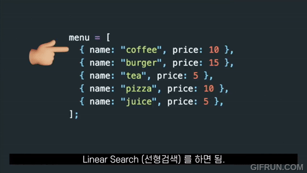
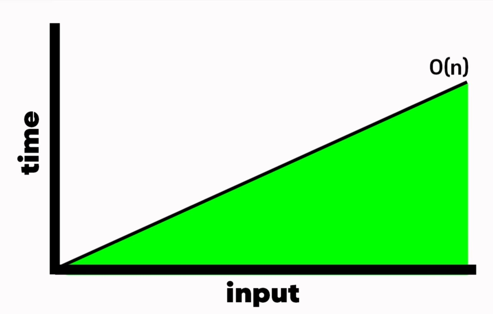
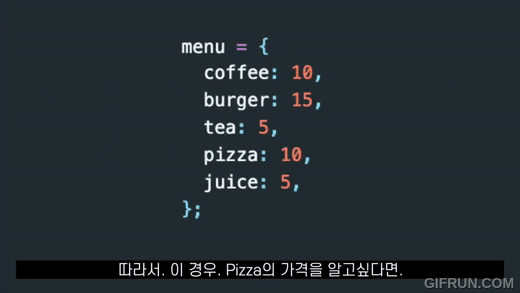
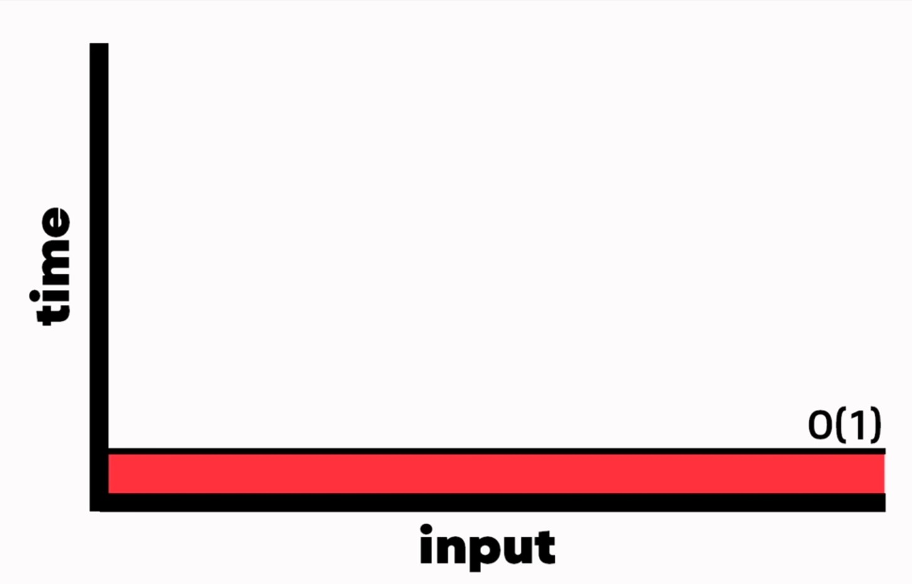
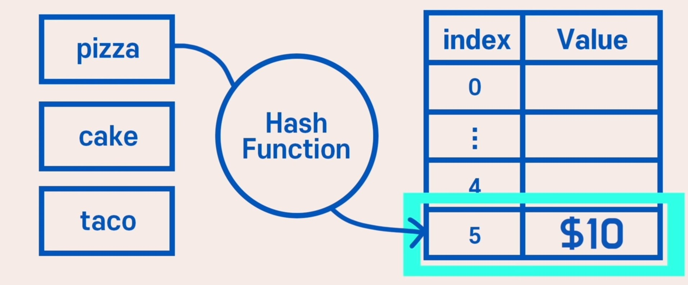
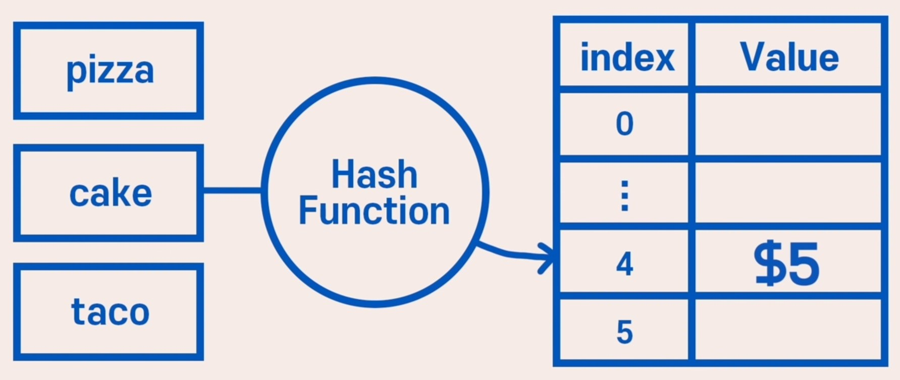
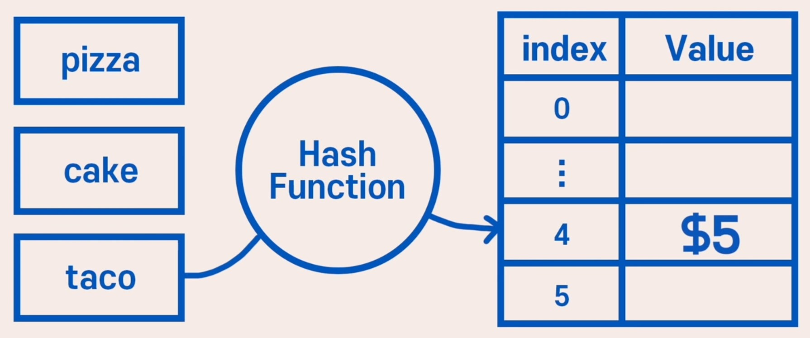
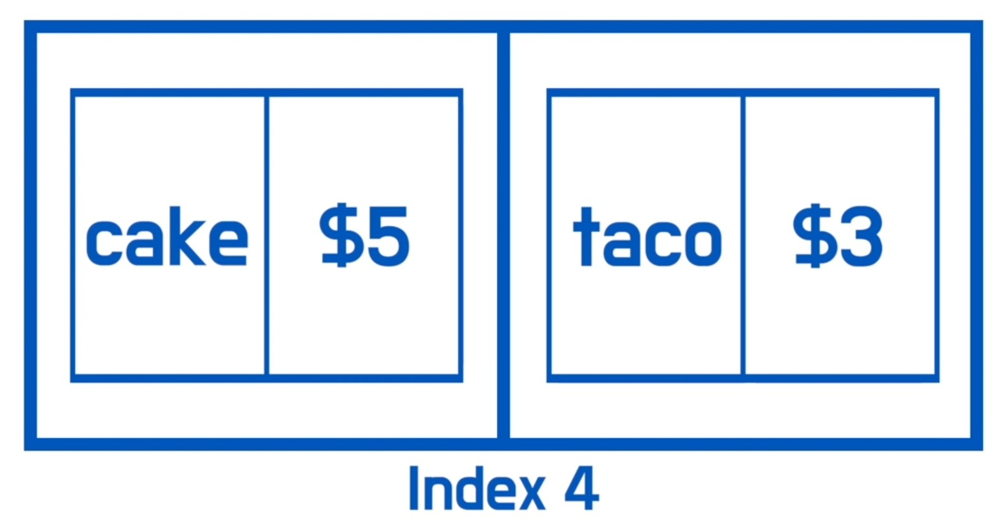

# Hash Table

## 개념
Key와 Value를 1:1로 연관지어 저장하는 자료구조이다. 
전화번호부나 사전과 같이 특정 key를 넣었을 때 해당하는 Value가 도출된다.

## Hash Table vs Array

### Array

레스토랑의 메뉴가 배열로 만들어져 있다고 했을 때 pizza의 가격을 알고 싶으면 다음과 같은 선형검색이 필요하다.

이 경우 시간 복잡도는 O(n)이다.

 
 
 

### Hash Table

반면 Hash Table을 이용하면 pizza의 가격을 검색할 때 key깂에 바로 pizza를 넣으면 그 가격인 10을 value값으로 바로 도출할 수 있다.

이 경우 시간 복잡도는 O(1)이다.

## 구조
Key, Hash Function, Hash, Value, 저장소(Bucket, Slot)으로 구성된다.

- Key
    - 고유한 값
    - 저장 공간의 효율성을 위해 Hash Function에 입력하여 Hash로 변경 후 저장
- Hash Function
    - Key를 Hash로 바꿔주는 역할
    - 해시 충돌이 발생할 확률을 최대한 줄이는 함수를 만드는 것이 중요
- Hash
    - Hash Function의 결과
    - 저장소에서 Value와 매칭되어 저장
- Value
    - 저장소에 최종적으로 저장되는 값
    - 키와 매칭되어 저장, 삭제, 검색, 접근 가능

## 동작 과정
1. Key를 Hash Function에 넣어 Hash값을 얻음
2. Hash를 배열의 Index로 사용
3. 해당 Index에 Value 저장

 

아까의 레스토랑 메뉴 예시를 이어가자면 Hash Function이 글자 수라고 했을 때, pizza를 Hash Function에 넣으면 5라는 Hash를 얻을 수 있다. 따라서 pizza의 가격인 10달러는 Index 5의 Value로 저장된다.

## Hash 충돌
하지만 이 경우 cake와 taco같이 같은 글자 수의 메뉴가 존재하면 충돌이 일어나는데 이것을 Hash Collision(해시 충돌)이라고 한다.

 
 

## 해결 방법
이렇게 해시 충돌이 일어날 경우 해결 방법은 크게 두 가지가 있다.

### 1. Separating Chaining
아까 예시에서처럼 cake와 taco의 인덱스가 같을 경우 다음과 같이 해당 인덱스 내부에 Linked List를 만드는 방법이다. 이때 인덱스 4를 검색하면 인덱스 내부의 리스트를 선형검색한다. 따라서 시간 복잡도는 O(n)이 된다.

이러한 Chaining 방식은 해시 테이블의 확장이 필요 없고 간단하게 구현이 가능하며 손쉽게 삭제할 수 있다는 장점이 있다. 하지만 데이터 수가 많아지면 동일한 버킷에 chaining되는 데이터가 많아지며, 이에 따라 캐시의 효율성이 감소한다는 단점이 있다.

### 2. Open Addressing
Open Addressing은 추가적인 메모리를 사용하는 Chaining 방식과 다르게 비어있는  해시 테이블의 공간을 활용하는 방법이다. 이를 구현하기 위한 방법으로는 크게 3가지가 있다.

1. 선형 탐사(Linear Probing)
    - 충돌이 발생한 hash를 기준으로 고정폭만큼 건너뛰면서 비어있는 hash를 찾는다.
    - 특정 hash값의 주변 bucket이 전부 채워져있는, 데이터가 밀집되는 현상인 clustering이 발생한다.
2. 제곱 탐사(Quadratic Probing)
    - 충돌이 발생한 hash를 기준으로 n^2의 폭만큼 건너뛰면서 비어있는 hash를 찾는다.
    - 선형 탐사보다 넓은 기준으로 탐사하기 때문에 탐색이나 삭제가 효율적일 수 있다.
    - 초기 hash값이 같다면 제곱 탐사 역시 clustering 문제가 발생한다.
3. 이중 해싱(Double Hashing)
    - 충돌이 발생하면 또 다른 Hash Function으로 처리하여 hash를 찾는다.
    - 기존 Hash Function은 최초 hash를 얻을 때 사용하고, 다른 하나는 충돌 발생 시 탐사의 폭을 얻기 위해 사용한다.
    - 최초 hash값이 같더라도 다른 Hash Function을 거치면서 각기 다른 탐사 폭이 나올 확률이 높기 때문에 여러 공간에 골고루 저장될 확률이 높다.
    - clustering 문제를 해결하기 위해 도입되었다.
 

 
이러한 방법을 사용하면 Chaining 방식에 비해 메모리를 적게 사용하며 해시 테이블의 특징인 1대1 매칭 구조가 유지된다는 장점이 있다. 하지만 데이터가 늘어나는 만큼 bucket의 공간을 확보해야 하고, 충돌이 많아질수록 clustering으로 인해 시간 복잡도가 증가한다.

### 3. Resizing
데이터는 무한한데 반해 Hash Table의 공간은 유한하기 때문에 어느 순간 저장소가 꽉 찰 수 있다. Open Addressing의 경우 어느 순간 table이 꽉 차서 저장을 못하고, Chaining의 경우 충돌이 발생할수록 Linked List의 길이가 길어져 Hash Table의 의미가 없어진다. 따라서 데이터가 어느 정도 차면 테이블의 크기를 늘려줘야 한다. 

일반적으로는 기존 테이블의 2배 크기의 새로운 테이블을 할당해서 기존 자료를 이동시키는 방식을 사용한다.

## Hash Table vs Hash Map
- Hash Table
    - 병렬 처리를 할 때(동기화를 고려해야 하는 상황) Thread-safe함
        - Thread-safe란? 
        어떤 함수나 변수, 혹은 객체가 여러 스레드로부터 동시에 접근이 이루어져도 프로그램 실행에 문제가 없는 것을 말함
    - Null 값을 허용하지 않음
- Hash Map
    - 병렬 처리를 하지 않을 때(동기화를 고려하지 않는 상황) Thread-safe하지 않음
    - Null 값을 허용함

## 시간 복잡도
-|평균|최악|
|:---:|:---:|:---:|
|탐색|O(1)|O(n)|
|삽입|O(1)|O(n)|
|삭제|O(1)|O(n)|

다음과 같이 탐색, 삽입, 삭제 모두 동일하게 평균적으로 O(1)의 시간복잡도를 보여주며 최악의 경우 O(n)이 된다.

### 출처
https://youtu.be/HraOg7W3VAM?si=UwDW-0GUp7rL3MKf
 
https://think0wise.tistory.com/66
 
https://mangkyu.tistory.com/102