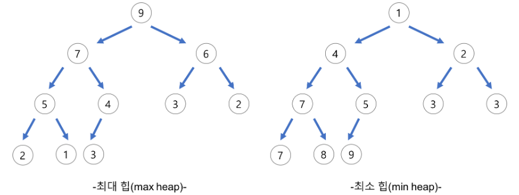
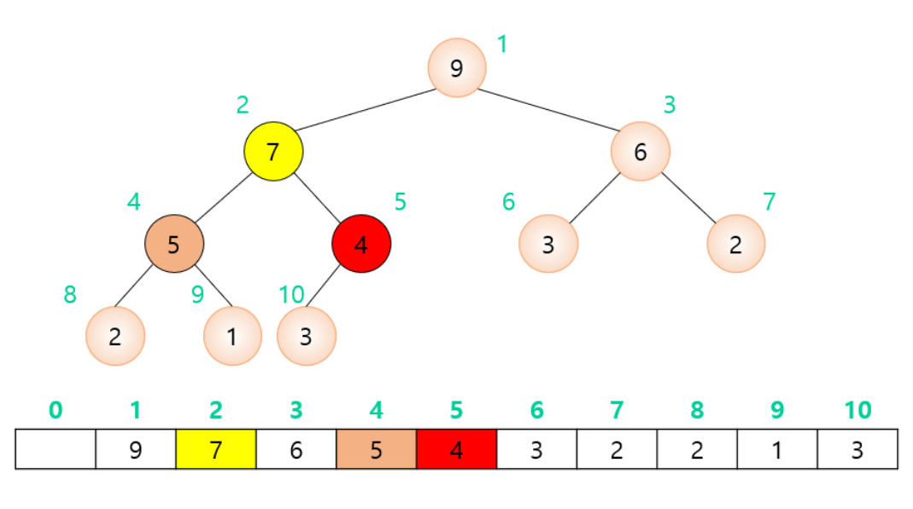
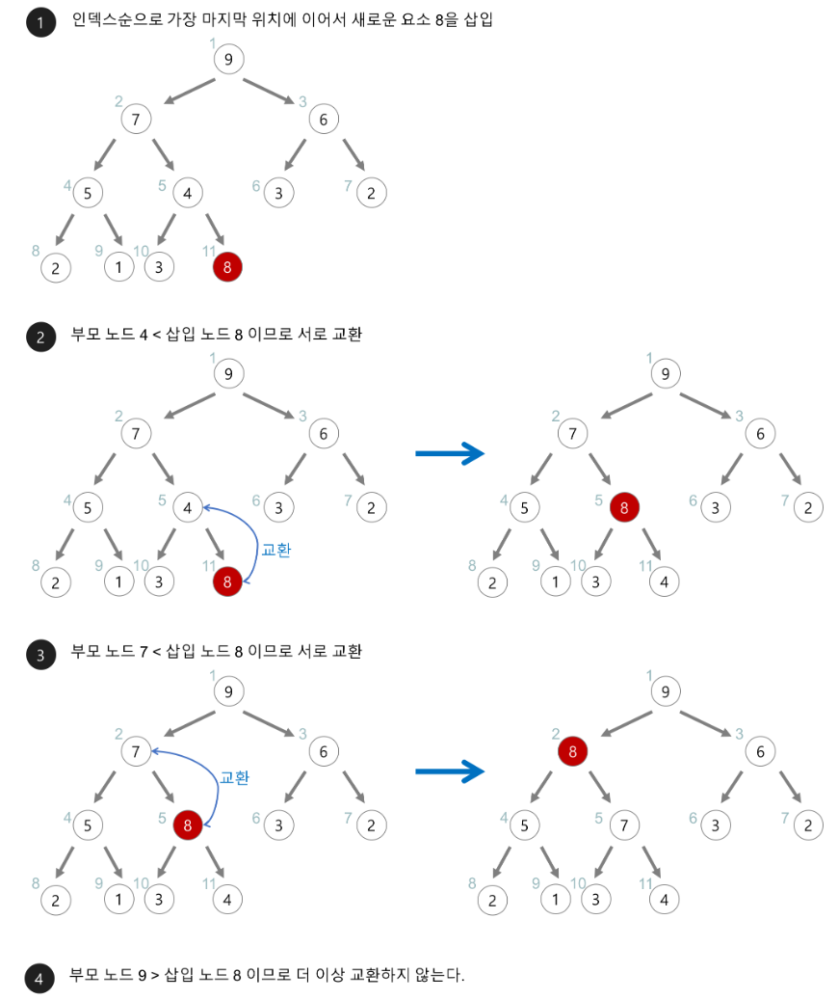
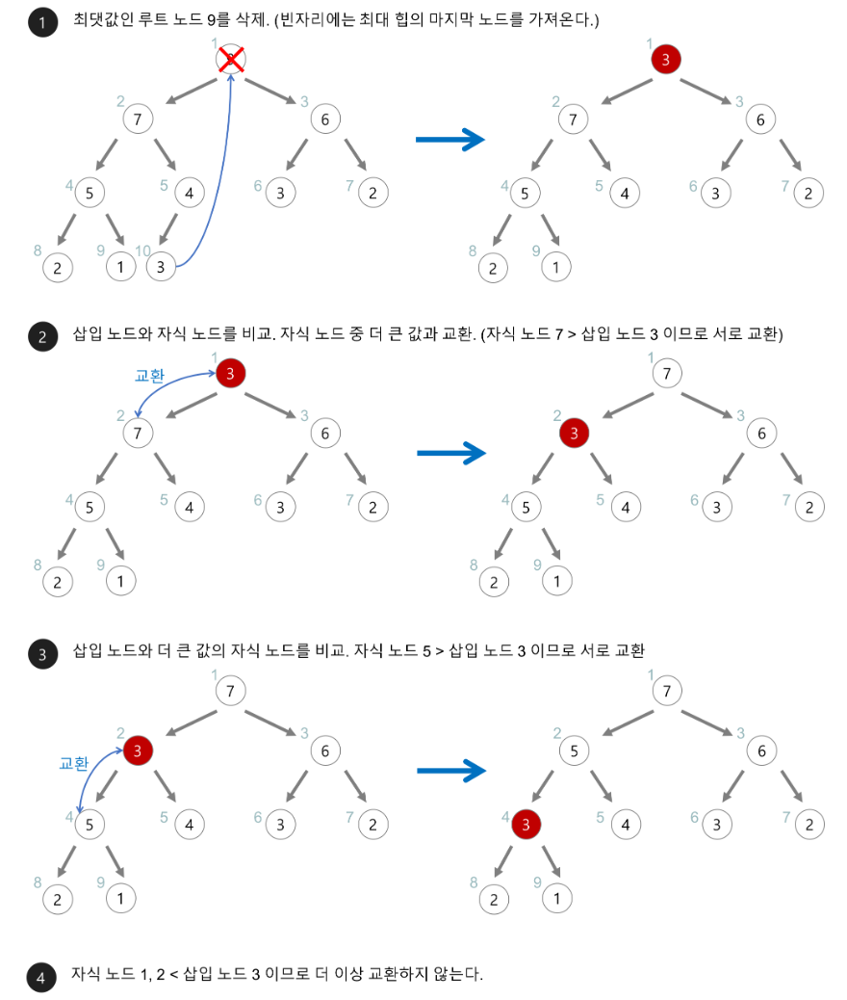

# Heap
### Heap이란?
- **Max, Min Value**를 빠르게 찾기 위해 개발된 **Data Structure**
- **Complete Binary Tree 형태**의 Data Structure
- Heap 관련 용어
    > **Parent Node, child Node**  
    Parent Node : 특정 노드의 상위에 위치한 노드  
    child Node : 특정 노드의 하위에 위치한 노드

    >**Root Node, Leaf Node**  
    Root Node : 트리 구조에서 가장 상위에 위치한 노드  
    Leaf Node : 트리 구조에서 가장 하위에 위치하며 child Node가 없는 노드

    > **Level, Height**  
    Level : Root Node부터 시작하여 트리의 몇번째 층에 위치하는지를 나타내는 지표(Root Node Level = 0)  
    Height : Leaf Node부터 몇번째 높이에 있는지를 나타내는 지표

### Heap의 종류
- **Max Heap**
    > 특성 : Parent Node 값 >= child Node 값
- **Min Heap**
    > 특성 : Parent Node 값 <= child Node 값

    

### Heap의 특징
- **Heapify**, 주어진 노드를 힙의 속성에 맞게 정렬하는 과정
    > Up-Heapify(상향식 힙 구성)   
Down-Heapify(하향식 힙 구성)
- **Array**, Heap을 저장하는 표준 Data Structure
    > Why? Complete Binary Tree 형태이기 때문  
    -> Array를 통해 메모리를 효율적으로 사용하고, 인덱싱을 간편하게 표현
- **Time Complexity**
    > 단일 작업 : O(logN)  
    Build Heap : O(NlogN)

### Heap 구현
- **Heap 구현**
    > Heap을 배열로 구현  
    Parent : floor(child index / 2)  
    왼쪽 / 오른쪽 child : Parent idex * 2 / (Parent idex * 2) + 1

    

 

- **Heap Insertion**
    > #1 새로운 요소를 Heap의 마지막 Node에 추가  
    #2 Up-Heapify를 거치며 Heap Sort 진행

    

 

- **Heap Deletion**
    > #1 Root Node 삭제(Max, Min Value)  
    #2 Heap 요소의 가장 마지막 Node가 Root Node로 이동  
    #3 Down-Heapify를 거치며 Heap Sort 진행

    

 

### Bulid Heap
- Heap 구조가 아닌 배열을 Heap 구조로 구성하는 것
    > Heapify는 이미 Heap 구조였던 것에서 요소를 추가, 삭제하는 것
- Time Complexity : O(NlogN)

---
### 📢 질문 예상 List
1. Heap이란 무엇이며, Max Heap과 Min Heap의 차이는 무엇인가요? (Heap의 기본 개념)
2. 힙 자료 구조는 어떤 상황에서 유용하게 사용될 수 있나요? (Heap의 사용 사례)
3. 힙에서 데이터를 삽입하거나 삭제할 때 내부적으로 어떤 과정이 일어나는지 설명해 주세요. (힙의 내부 작동 원리)
4. 힙 정렬(Heap Sort) 알고리즘의 기본 원리와 그 시간 복잡도는 어떻게 되나요? (힙과 관련된 알고리즘)
5. 힙과 이진 검색 트리(Binary Search Tree)는 어떻게 다른가요? (힙과 다른 자료 구조와의 비교)

---
### 📌 Reference
- https://github.com/devSquad-study/2023-CS-Study/blob/main/Algorithm/algorithm_heap.md
- https://gmlwjd9405.github.io/2018/05/10/data-structure-heap.html
- https://yozm.wishket.com/magazine/detail/2312/