# Quick Sort
1. pivot원소
2. 제자리 (분할)
3. 재귀적으로 구현

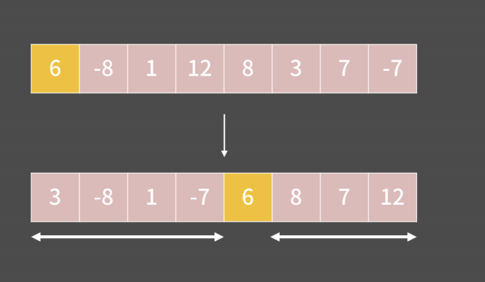

- pivot = 6

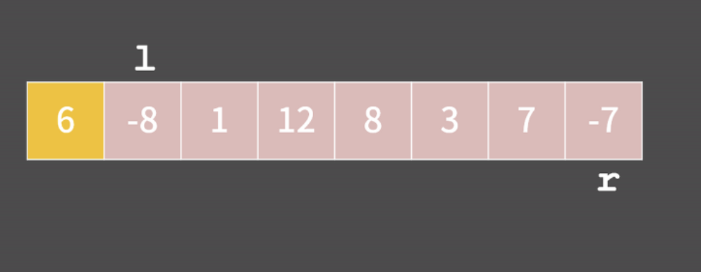
 
 - 왼쪽부터 pivot보다 큰 값을 찾는다.
- 오른쪽부터 pivot보다 작은 값을 찾는다.

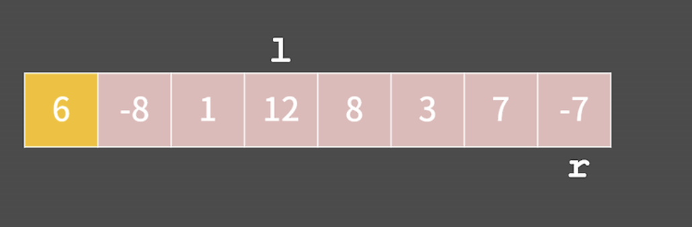

- pivot보다 큰 12가 왼쪽에 있고 pivot보다 작은 -7은 정작 오른쪽에 있는게 말이 안되기 때문에,  둘의 자리를 교환.
- l은 pivot보다 큰 값 찾을 때까지 오른쪽 이동
- r은 pivot보다 작은 값 찾을 때까지 왼쪽 이동

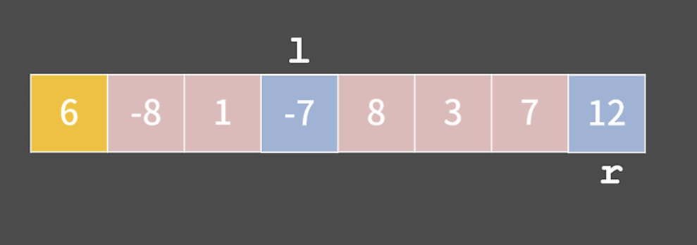

- 8이 3보다 왼쪽에 있으므로 둘 교환.
 
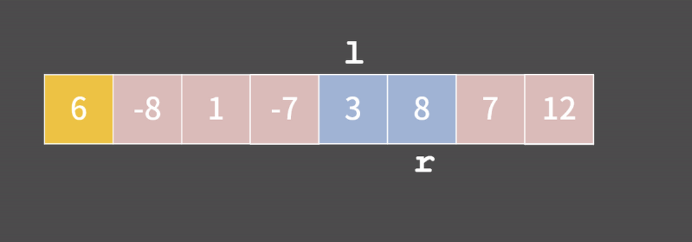

 - r이 l보다 작아진 순간이 오면 pivot과 r을 스왑하면서 알고리즘이 끝.

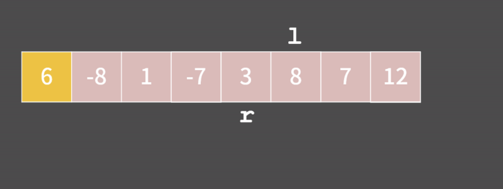
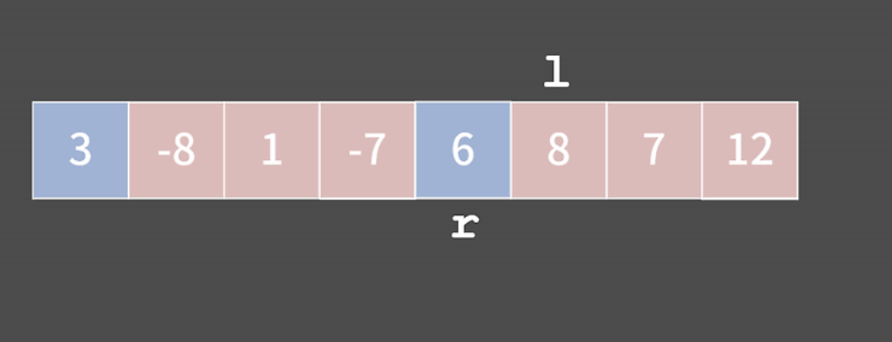
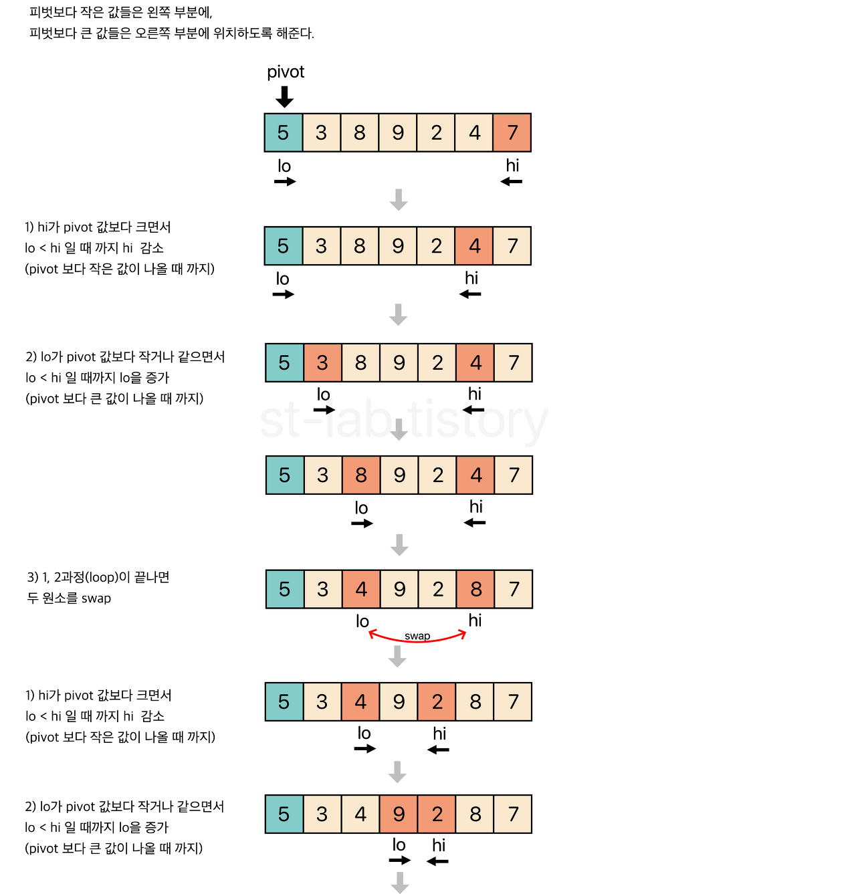
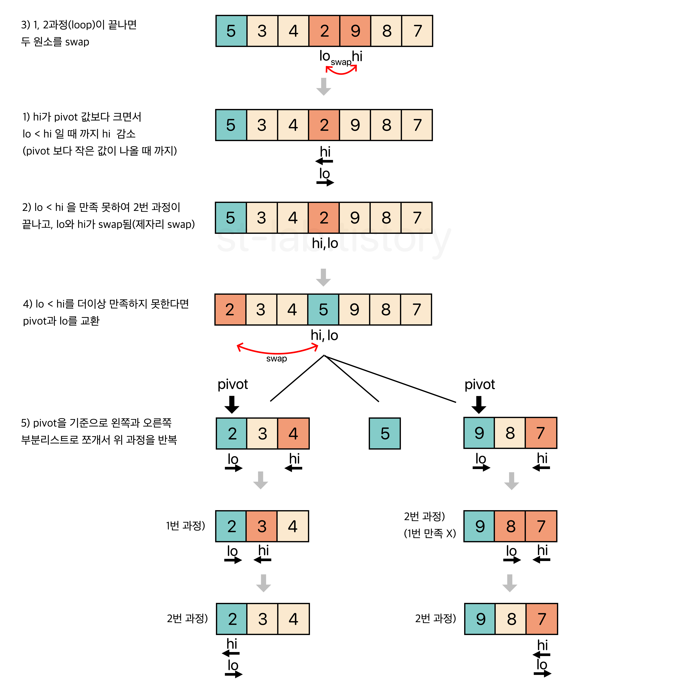
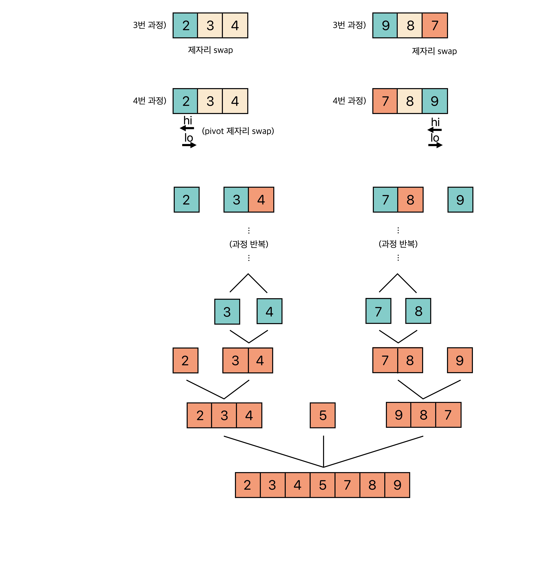

### 왼쪽, 오른쪽, 중앙 , 여러개의 pivot으로 가능
https://st-lab.tistory.com/250

### 코드
```java
import java.util.Arrays;

public class quick_sort {

	public static void main(String[] args) {
		int[] arr =  {1, 9, 8, 5, 4, 2, 3, 7, 6};
		quickSort(arr, 0, arr.length-1);
		System.out.println(Arrays.toString(arr));
	}

	public static void quickSort(int[] arr, int low, int high) {
	    if (low < high) {
	        int pi = partition(arr, low, high);
	        quickSort(arr, low, pi-1);
	        quickSort(arr, pi+1, high);
	    }
	}

	public static int partition(int[] arr, int low, int high) {
	    int pivot = arr[high]; 
	    int i = (low-1);
	    for (int j=low; j<high; j++) {
	        if (arr[j] < pivot) {
	            i++;
	            int temp = arr[i];
	            arr[i] = arr[j];
	            arr[j] = temp;
	        }
	    }
	    int temp = arr[i+1];
	    arr[i+1] = arr[high];
	    arr[high] = temp;
	    return i+1;
	}
}
```

### Time Complexity
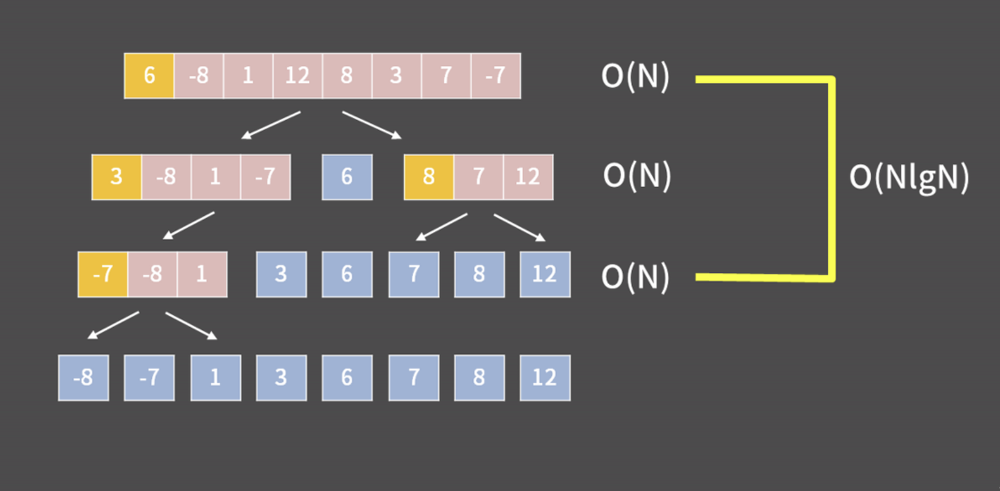

- pivot을 제자리로 보내는 시간복잡도는 그 리스트의 크기에 비례하니 각 단계마다 O(N)이 필요
- 첫 번째 줄 O(N)
- 두 번째 줄을 보면 왼쪽 리스트는 4에 비례하고 오른쪽 리스트는 3에 비례하니 합치면 대략 N에 비례   
- 이런 식으로 그 단계에서 pivot을 제자리로 보내야 하는 리스트들의 길이의 합은 N이어서 각 단계마다 O(N)이 필요
- 그러면 pivot이 매번 완벽하게 중앙에 위치해서 리스트를 균등하게 둘로 쪼갠다면 단계의 개수는log N이 될거고 이 경우에는 퀵 소트의 시간복잡도가 O(NlgN)
- 물론 늘 pivot이 중앙에 위치하는 이상적인 상황이 생기지는 않겠지만 pivot이 매번 어느 정도로만 잘 자리잡는다면 시간복잡도는 여전히 O(NlgN).

## 장단점
### 장점
1. 평균적으로 빠르다: 퀵 정렬은 평균적으로 O(nlogn)
2. 내부 정렬: 추가적인 메모리 없이 정렬이 가능한 내부 정렬 알고리즘. 따라서 추가적인 메모리 요구량이 거의 없다.


### 단점
1. 최악의 경우 시간 복잡도: 만약 입력 데이터가 이미 정렬되어 있거나, 역순으로 정렬되어 있는 경우, 퀵 정렬의 시간 복잡도는 O(n2)
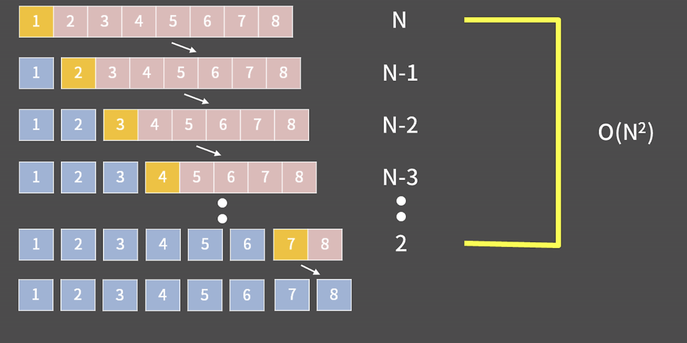

2. 불안정한 정렬

3. 피벗 선택에 민감: 큰 영향을 미쳐 최악의 성능을 피하기 위해서는 피벗 선택 전략이 중요


# Merge Sort

1. 재귀적으로 분할
2. 정렬

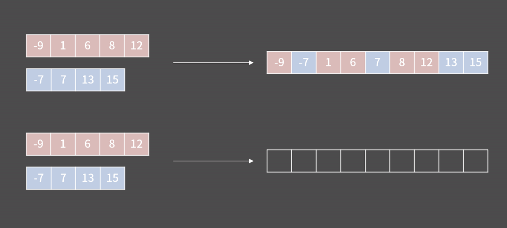

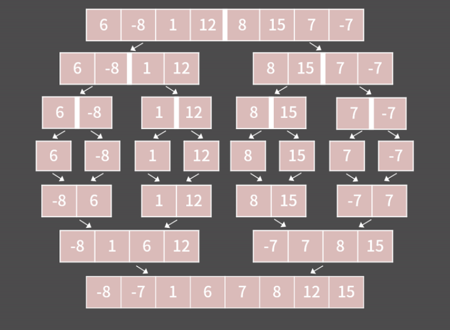

```java
import java.util.Arrays;

public class merge_sort {
	public static void main(String[] args) {
		int[] arr = {1, 9, 8, 5, 4, 2, 3, 7, 6};
       
		mergeSort(arr, 0, arr.length-1);
		System.out.println(Arrays.toString(arr));
		
	}

	public static void mergeSort(int[] arr, int l, int r) {
	    if (l < r) {
	        int m = (l+r)/2;
	        mergeSort(arr, l, m);
	        mergeSort(arr, m+1, r);
	        merge(arr, l, m, r);
	    }
	}

	public static void merge(int[] arr, int l, int m, int r) {
	    int n1 = m - l + 1;
	    int n2 = r - m;
	    int L[] = new int[n1];
	    int R[] = new int[n2];
	    
	    for (int i=0; i<n1; ++i) L[i] = arr[l + i];
	    for (int j=0; j<n2; ++j) R[j] = arr[m + 1+ j];
	    int i = 0, j = 0;
	    int k = l;
	    while (i < n1 && j < n2) {
	        if (L[i] <= R[j]) {
	            arr[k] = L[i];
	            i++;
	        } else {
	            arr[k] = R[j];
	            j++;
	        }
	        k++;
	    }
	    while (i < n1) {
	        arr[k] = L[i];
	        i++;
	        k++;
	    }
	    while (j < n2) {
	        arr[k] = R[j];
	        j++;
	        k++;
	    }
	}

}
```

### ⏳Time complexity
 1. 분할

- 분할하는 부분은 특별한 연산을 하는건 아님.
- 함수 호출을 통해 분할, 함수 호출의 횟수는 각 줄별로 1, 2, 4, …, 2k번. (각 줄에 리스트가 몇 개 있는지)
- 예를 들어 3번째 줄을 보면 리스트가 {6, -8}, {1, 12}, {8, 15} {7, -7} 총 4개 있고 각각에 대해 함수가 호출될테니 그 줄에서 함수는 4번 호출.
- 함수호출은 1+2+4+ … +2k = 2N - 1 = O(N)번 발생. 
- 즉 분할하는 과정의 시간복잡도는 O(N).

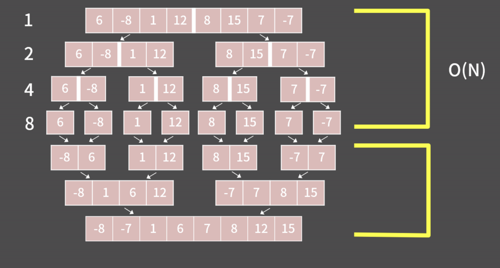

2. 합쳐나가는 과정
-  합쳐나갈 땐 각 줄에서 모두 N번의 연산이 필요
- 분할이 완료됐을 때 리스트의 원소는 1개였다가 2k개가 될 때 까지 매번 2배씩 커지니까 줄은 k개
- O(Nk) = O(NlgN)

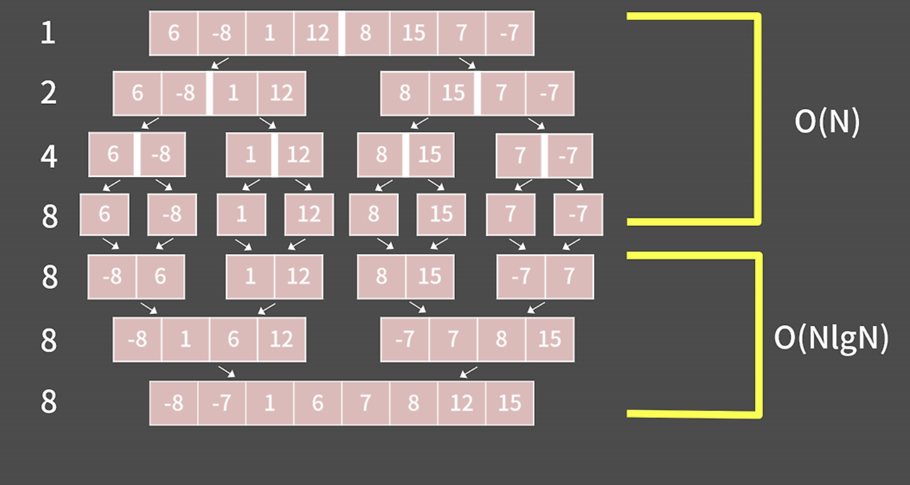

결론</br>
분할하는 과정은 O(N)이고 합쳐나가는 과정은 O(NlgN)인데 O(N)보다 O(NlgN)이 더 크기 때문에 최종적으로 머지 소트는 O(NlgN)의 시간복잡도

## 장단점
### 장점
1. 안정 정렬
2. 외부 정렬: 큰 데이터 집합에 특히 유용한 외부 정렬에서도 효과적으로 사용. 외부 정렬은 디스크와 같은 외부 저장소에 저장된 대량의 데이터를 정렬할 때 사용.
3. 시간 복잡도: 모든 경우에 대해 O(n log n)의 시간 복잡도. 큰 데이터 세트에 대해 매우 효율적입.

### 단점
1. 공간 복잡도: 병합 정렬은 O(n)의 추가 메모리를 요구. 
2. 최선, 평균, 최악의 경우 시간 복잡도가 동일: 병합 정렬은 최선, 평균, 최악의 경우 모두 O(n log n)의 시간 복잡도를 가지기 때문에 다양한 상황에서의 최적화가 제한적.

# Heap Sort
1. 최대 힙으로 구성
2. 루트 노트(최댓값)과 마지막 노드 교환
3. 힙 크기 줄이기
4. 재귀

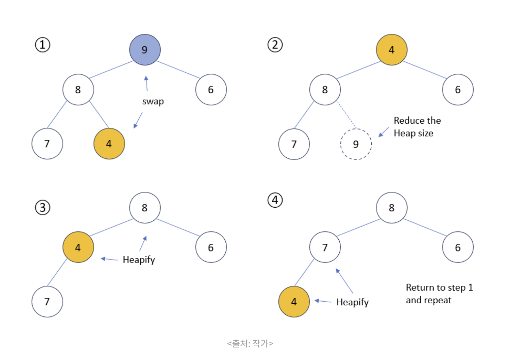 

### 코드
```java
import java.util.Arrays;

public class heap_sort {

	public static void main(String[] args) {

		int[] arr = {1, 9, 8, 5, 4, 2, 3, 7, 6};
		heapSort(arr);
		System.out.println(Arrays.toString(arr));
	}
	private static void buildHeap(int[] arr) {
	    int n = arr.length;
	    
	    // 마지막 요소의 부모 인덱스부터 시작하여 루트 노드까지 거슬러 올라가며 힙 속성 확인
	    for (int i = n / 2 - 1; i >= 0; i--) {
	        heapify(arr, n, i);
	    }
	}
	private static void heapify(int[] arr, int n, int i) {
	    int largest = i;
	    int left = 2 * i + 1;
	    int right = 2 * i + 2;

	    if (left < n && arr[left] > arr[largest]) {
	        largest = left;
	    }

	    if (right < n && arr[right] > arr[largest]) {
	        largest = right;
	    }

	    if (largest != i) {
	        swap(arr, i, largest);
	        heapify(arr, n, largest);
	    }
	}

	private static void swap(int[] arr, int i, int j) {
	    int temp = arr[i];
	    arr[i] = arr[j];
	    arr[j] = temp;
	}
	public static void heapSort(int[] arr) {
	    int n = arr.length;

	    buildHeap(arr);

	    for (int i = n - 1; i >= 0; i--) {
	        swap(arr, 0, i);
	        heapify(arr, i, 0);
	    }
	}
}
```

### Time Complexity
- 최대 힙으로 만드는 과정(heapify)의 시간 복잡도는 O(logn) 
- 이 heapify의 과정이 n개의 원소를 다 정렬할 때까지 반복되므로 최종 힙 정렬의 시간 복잡도는 O(nlogn)

## 장단점
### 장점
1. 시간 복잡도: 힙 정렬의 최악, 평균, 최선의 시간 복잡도는 모두 O(n log n)입니다. 따라서 입력 데이터의 크기에 상관없이 일정한 성능을 보장.
2. 메모리 사용: 힙 정렬은 정렬을 위해 추가적인 메모리(즉, 인플레이스 정렬)를 필요로 하지 않는다. 

### 단점
1. 불안정 정렬 : 따라서 동일한 값의 원소 간의 상대적 순서가 중요한 경우에는 다른 정렬 알고리즘을 고려해야함.


## 정렬의 비교
 


출처</br>
https://needactionblog.com/%ec%95%8c%ea%b3%a0%eb%a6%ac%ec%a6%98-java%eb%a1%9c-%eb%b0%b0%ec%9a%b0%eb%8a%94-%ed%80%b5-%ec%a0%95%eb%a0%acquick-sort%ec%9b%90%eb%a6%ac%eb%b6%80%ed%84%b0-%ec%8b%a4%ec%a0%9c-%ea%b5%ac%ed%98%84/

https://st-lab.tistory.com/250

https://blog.encrypted.gg/955

https://yozm.wishket.com/magazine/detail/2312/