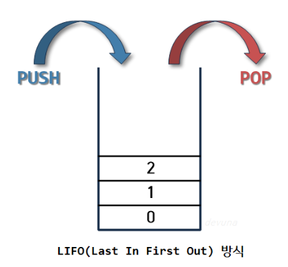
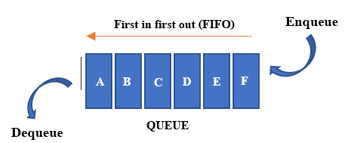

# 📖 Stack & Queue

## 목차

- [1. 🧪 Stack](#-stack)
  - [1.1 ⛓ Stack 주요 메서드](#-stack-주요-메서드)
  - [1.2 📚 Stack 구현 방법](#-stack-구현-방법)
  - [1.3 🍁 Stack 역할](#-stack-역할)
- [2. 🧪 Queue](#-queue)
   - [2.1 ⛓ Queue 주요 메서드](#-queue-주요-메서드)
   - [2.2 🍁 Queue 역할](#-queue-역할)
- [3. 참조](#-참조)

## 🧪 Stack

> 차곡차곡 쌓아 올린 형태의 자료구조, 데이터를 저장하는 자료형

<div align="center">
    
</div>

🔹 **스택(Stack)** 은 선형 자료구조의 일종으로 후입선출 즉, **Last In First Out (LIFO)** - 나중에 들어간 원소가 먼저 나오는 형태로 데이터를 저장한다. 이것은 Stack 의 가장 큰 특징이다.

 스택은 같은 구조와 크기의 자료를 정해진 방향으로만 쌓을 수 있고, top으로 정한 곳을 통해서만 접근이 가능하다. top의 가장 위에 있는 자료는 최근에 들어온 자료를 가리키고 삽입되는 새로운 자료는 그 위로 쌓이게 된다. 이때, Stack에서 top을 통해 삽입하는 연산을 `push`, 삭제하는 연산을 `pop` 이라고 한다.

<br/>

### ⛓ Stack 주요 메서드

---

| 메서드 | 리턴 값 | 분류 | 설명 |
| --- | --- | --- | --- |
| push(E item) | void | 스택 요소 추가 | 스택에 요소를 추가합니다. |
| pop() | E | 스택 요소 제거 | 스택의 맨 위 요소를 제거하고 반환합니다. |
| peek() | E | 스택 요소 조회 | 스택의 맨 위 요소를 반환하며, 제거하지 않습니다. |
| empty() | boolean | 스택 조회 | 스택이 비어 있는지 여부를 반환합니다. |
| search(Object o) | int | 스택 조회 | 주어진 요소를 스택에서 찾아서 1부터 시작하는 인덱스를 반환합니다. 찾지 못한 경우 -1을 반환합니다. |

<br/>

**스택 선언 방법**

🔹 스택의 선언은 `Stack<T> 스택 이름 = new Stack<>();` 형태로 선언할 수 있으며, 데이터 타입은 클래스 또는 래퍼 클래스로 선언할 수 있다.

```java
import java.util.Stack;

class StackEx {
    
    public static void main(String[] args) {
        // Integer형 스택 선언
        Stack<Integer> stackInt = new Stack<>();
        // String형 스택 선언
        Stack<String> stackStr = new Stack<>();
        // Boolean형 스택 선언
        Stack<Boolean> stackBool = new Stack<>();
    }
}
```

<br/>

**스택의 값 추가 및 제거**

🔹 스택은 add() 메서드 또는 push() 메서드를 통해 값을 하나씩 추가할 수 있다. 이때, push()는 stack에서 제공하고 add()는 List에서 제공하는 메서드이며 push()의 리턴값은 <E>이고, add()의 리턴값은 boolean이다. <br/><br/>
🔹 추가된 값을 빼내기 위해서는 pop() 메서드를 사용하여 하나씩 뺄 수 있다. 스택의 모든 내용을 제거하기 위해서는 clear() 메서드를 사용하여 제거할 수 있다. pop() 메서드를 사용하면, 스택의 값이 제거됨과 동시에 해당 값을 반환한다. 하지만 clear() 메서드는 반환 값이 없다.

```java
import java.util.Stack;

class StackEx {
public static void main(String[] args) {
// Integer형 스택 선언
Stack<Integer> stackInt = new Stack<>();

        // 값 추가 push()
        stackInt.push(1);
        stackInt.push(2);
        // 1, 2 순으로 값 추가

        // 값 제거
        stackInt.pop();
        stackInt.pop();
        // 2, 1 순으로 값 제거 + 값 반환 

        // 값 추가 add()
        stackInt.add(1);
        stackInt.add(2);
        stackInt.add(3);
        // 1, 2, 3 순으로 값 추가

        // 값 모두 제거
        stackInt.clear();
    }
}
```

<br/>

**스택의 마지막 요소 반환**

🔹 스택의 peek() 메서드는 마지막 요소를 반환하며, 스택에는 변화를 주지 않는다. 즉, 스택에 가장 먼저 사용될 요소를 반환한다. 만약, 스택이 비어있을 경우 peek() 메서드 호출 시 NoSuchElementException 예외가 발생한다.

```java
import java.util.Stack;

class StackEx {
    public static void main(String[] args) {
        Stack<Integer> stackInt = new Stack<>();

        stackInt.push(1);
        stackInt.push(2);
        stackInt.push(3);

        System.out.println(stackInt.peek());
    }
}
```
```
// 출력값
3
```

<br/>

**스택이 비어있는지의 여부를 반환**

🔹 스택의 isEmpty() 메서드는 비어있을 경우 true, 비어있지 않을 경우 false를 반환한다.

```java
import java.util.Stack;

class StackEx {
    public static void main(String[] args) {
        Stack<Integer> stackInt = new Stack<>();

        System.out.println(stackInt.isEmpty());
        stackInt.push(1);
        System.out.println(stackInt.isEmpty());
	}
}
```
```
// 출력값
true
false
```

<br/>

**스택에서 검색하여 해당 위치를 반환**

🔹 스택의 search() 메서드는 인자를 스택에서 검색하여 해당 위치를 반환한다. 만약 해당 인자가 여러 개일 경우, 마지막 위치를 반환한다. 여기서 위치는 인덱스가 아닌 빠져나오는 순서를 뜻한다. 또한, 찾는 값이 스택에 없을 경우 -1을 반환한다.
```java
class StackEx {
    public static void main(String[] args) {
        Stack<Integer> stackInt = new Stack<>();

        stackInt.push(1);
        stackInt.push(2);
        stackInt.push(3);
        stackInt.push(1);
        // [1, 2, 3, 1]

        System.out.println(stackInt.search(2));
        System.out.println(stackInt.search(1));
        System.out.println(stackInt.search(4));
    }
}
```
```
// 출력값
3
1
-1
```

<br/>

### 📚 Stack 구현 방법

---

🔹 `Array`로 스택 구현하는 경우

```java
import java.util.EmptyStackException;

public class ArrayStack<T> {
   private static final int DEFAULT_CAPACITY = 10;
   private Object[] elements;
   private int size;

   public ArrayStack() {
      elements = new Object[DEFAULT_CAPACITY];
      size = 0;
   }

   public void push(T element) {
      if (size == elements.length) {
         ensureCapacity();
      }
      elements[size++] = element;
   }

   public T pop() {
      if (isEmpty()) {
         throw new EmptyStackException();
      }
      T element = peek();
      elements[--size] = null;
      return element;
   }

   public T peek() {
      if (isEmpty()) {
         throw new EmptyStackException();
      }
      return (T) elements[size - 1];
   }

   public boolean isEmpty() {
      return size == 0;
   }

   public int size() {
      return size;
   }

   private void ensureCapacity() {
      int newSize = elements.length * 2;
      Object[] newArray = new Object[newSize];
      System.arraycopy(elements, 0, newArray, 0, size);
      elements = newArray;
   }
}
```

<br/>

🔹 `ArrayList`로 스택 구현하는 경우

```java
import java.util.ArrayList;
import java.util.EmptyStackException;
import java.util.List;

public class ListStack<T> {
    private List<T> stack;

    public ListStack() {
        stack = new ArrayList<>();
    }

    public void push(T element) {
        stack.add(element);
    }

    public T pop() {
        if (isEmpty()) {
            throw new EmptyStackException();
        }
        return stack.remove(stack.size() - 1);
    }

    public T peek() {
        if (isEmpty()) {
            throw new EmptyStackException();
        }
        return stack.get(stack.size() - 1);
    }

    public boolean isEmpty() {
        return stack.isEmpty();
    }

    public int size() {
        return stack.size();
    }
}
```

<br/>

🔹 리스트와 배열은 각각 장단점이 있으며, 스택을 구현하는 데에는 어떤 자료구조가 더 적합한지는 상황에 따라 다를 수 있다. 만약, 스택의 크기가 자주 변하고 요소의 추가/제거가 빈번하게 발생하는 경우에는 `ArrayList`를 사용하는 것이 좋을 수 있다. 하지만, 스택의 크기가 고정되어 있고 요소의 추가/제거가 적은 경우에는 기본 배열을 사용하는 것이 더 효율적일 수 있다.

<br/>

- **ArrayList (리스트):**

**장점 :** 

1. 동적으로 크기를 조정할 수 있어서 요소를 추가하거나 제거하는 데 편리하다. 
2. 인덱스를 통한 빠른 접근이 가능하다.

**단점 :** 

1. 요소를 추가하거나 제거할 때마다 배열을 복사해야 할 수 있어서 성능이 떨어질 수 있다. 
2. 중간에 요소를 추가하거나 제거하는 경우에는 시간이 오래 걸릴 수 있다.

- **기본 배열 (Array):**

**장점 :**

1. 고정된 크기로 메모리를 할당하므로 요소를 추가하거나 제거할 때마다 배열을 복사할 필요가 없어서 메모리 관리가 효율적이다.
2. 인덱스를 통한 빠른 접근이 가능하다.

**단점 :**

1. 크기를 동적으로 조정할 수 없어서 요소를 추가할 때 배열을 재할당해야 하거나 큰 배열로 복사해야 한다.

<br/>

### 🍁 Stack 역할

---

**Stack의 역할로는**

1. 함수 호출과 복귀 : 함수가 호출될 때 호출 스택에 함수의 정보(로컬 변수, 반환 주소 등)가 저장되며, 함수의 실행이 끝나면 해당 정보가 스택에서 제거되어 반환한다. <br/><br/>

2. 지역 변수 및 임시 데이터 저장 : 스택은 지역 변수(로컬 변수) 및 임시 데이터를 저장하는 데 사용된다. 함수가 호출될 때 해당 함수의 지역 변수가 스택에 할당되고, 함수가 종료되면 해당 지역 변수가 스택에서 제거된다. (즉, 잠시 사용되었다가 사라지는 데이터를 저장하는 영역)

<br/>

---

## 🧪 Queue

> 줄 서서 기다리는 방식을 의미하는 선형 자료구조

<div align="center">
    
</div>

🔹 **큐(Queue)** 는 정해진 한 곳(top)을 통해서 삽입, 삭제가 이루어지는 스택과는 달리 한쪽 끝에서 삽입 작업이, 다른 쪽 끝에서 삭제 작업이 양쪽으로 이루어진다. 이때, 삭제연산만 수행되는 곳을 프론트(front), 삽입연산만 이루어지는 곳을 리어(rear)로 정하여 각각의 연산작업만 수행된다. 큐의 리어에서 이루어지는 삽입연산을 인큐(enQueue) 프론트에서 이루어지는 삭제연산을 디큐(deQueue)라고 부른다. Java Collection 에서 Queue 는 인터페이스이고, 이를 구현하고 있는 Priority queue 등을 사용할 수 있다.

<br/>

### ⛓ Queue 주요 메서드

---

| 메서드 | 리턴 값 | 분류 | 예외 발생 여부 | 설명 |
| --- | --- | --- | --- | --- |
| element() | E | 큐 요소 조회 | O | 큐의 head(맨 앞)에 있는 요소를 반환합니다. 큐가 비어있는 경우 예외를 던집니다. |
| peek() | E | 큐 요소 조회 | X | 큐의 head(맨 앞)에 있는 요소를 반환합니다. 큐가 비어있는 경우 null을 반환합니다. |
| add(E e) | boolean | 큐 요소 추가 | O | 큐에 요소를 추가하고 성공적으로 추가되었는지 여부를 반환합니다. 큐가 제한된 용량을 가지는 경우 예외를 던집니다. |
| offer(E e) | boolean | 큐 요소 추가 | X | 큐에 요소를 추가하고 성공적으로 추가되었는지 여부를 반환합니다. 큐가 제한된 용량을 가지는 경우 false를 반환합니다. |
| remove() | E | 큐 요소 제거 | O | 큐의 head(맨 앞)에 있는 요소를 제거하고 반환합니다. 큐가 비어있는 경우 예외를 던집니다. |
| poll() | E | 큐 요소 제거 | X | 큐의 head(맨 앞)에 있는 요소를 제거하고 반환합니다. 큐가 비어있는 경우 null을 반환합니다. |

```java
public class QueueExample {
    
    public static void main(String[] args) {
        Queue<Integer> queue = new Queue<>();

        // add, offer 메서드로 요소 추가
        queue.add(1);
        queue.add(2);
        queue.offer(3);

        // element 메서드로 큐의 head 요소 조회
        System.out.println("Element: " + queue.element()); // Output: 1

        // remove 메서드로 큐의 head 요소 제거
        System.out.println("Remove: " + queue.remove());   // Output: 1

        // size 메서드로 큐의 크기 조회
        System.out.println("Size: " + queue.size()); // Output: 2

        // peek 메서드로 큐의 head 요소 조회
        System.out.println("Remove: " + queue.peek());   // Output: 2
       
        // poll 메서드로 큐의 head 요소 제거
        System.out.println("Remove: " + queue.poll());   // Output: 2

        // size 메서드로 큐의 크기 조회
        System.out.println("Size: " + queue.size()); // Output: 1

        // isEmpty 메서드로 큐가 비어있는지 확인
        System.out.println("Is queue empty? " + queue.isEmpty()); // Output: false
    }
}
```

<br/>

### 🍁 Queue 역할

---

🔹 자원의 할당과 회수를 하는 스케쥴러 역할을 큐가 할 수 있다. 메모리에 적재된 다수의 프로세스 중 어떤 프로세스에게 자원을 할당할 것인가 그 순서를 결정하는 것이 자원의 효율적인 사용에 있고, 가장 단순한 형태의 스케쥴링 정책이 선입선처리(First Com First Served) 즉, 큐라고 볼 수 있다. 또한,
BFS나 캐시를 구현할 때 사용한다.

<br/>

## 📸 참조

https://adjh54.tistory.com/223 <br/>
https://ittrue.tistory.com/200