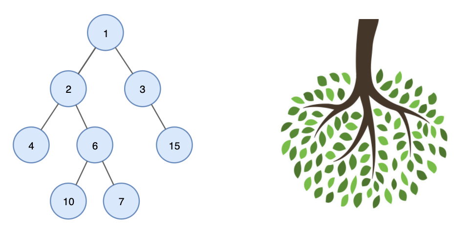
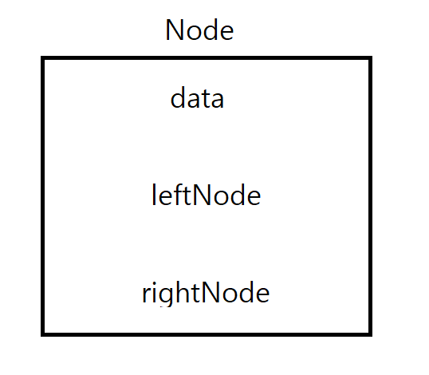
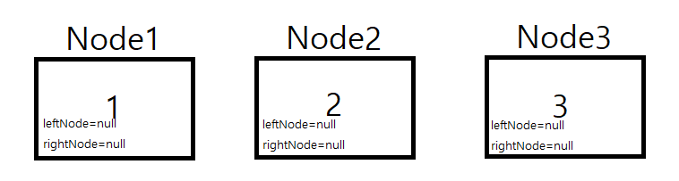
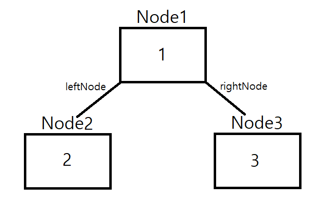
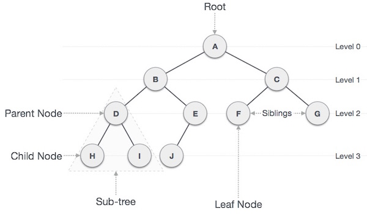
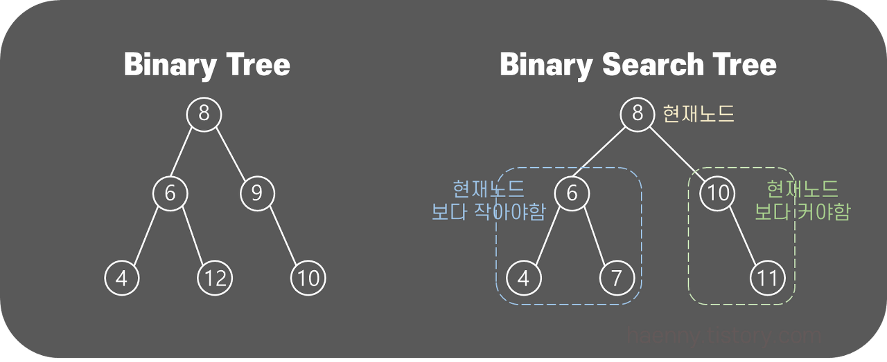
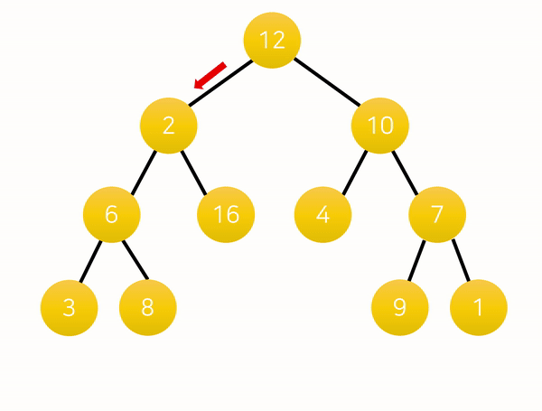
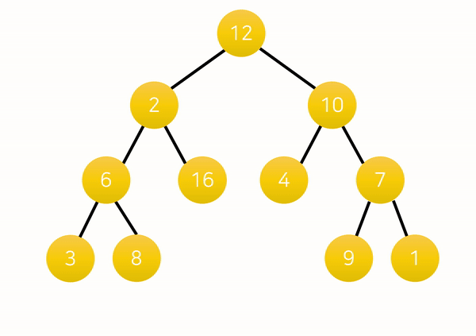
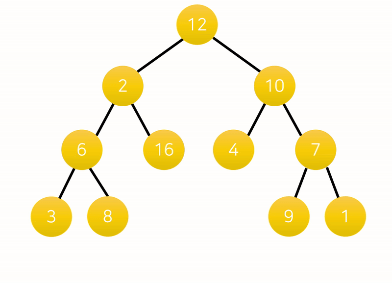

# Tree

## 1. 트리(Tree)란?
트리(Tree)란 노드들이 나무 가지처럼 연결된 비선형 계층적 자료구조이다.
<br>
트리는 다음과 같이 나무를 거꾸로 뒤집어 놓은 모양과 유사하다.



<br>
또한 트리 내에 다른 하위 트리가 있고 그 하위 트리 안에는 또 다른 하위 트리가 있는 재귀적 자료구조이기도 하다.

<br>
컴퓨터의 direcory구조가 트리 구조의 대표적인 예가 될 수 있다.


<br>

## 2. 트리의 구조

### 1. 데이터와 연결 상태를 저장할 클래스 공간(=노드) 생성

   
<br>
코드로 보면, 

```java
public class Node {
	Object data;
	Node left;
	Node right;
}
```

Node라는 클래스를 만들고, 저장할 값 변수, 왼쪽 연결 노드, 오른쪽 연결 노드에 대한 정보를 저장할 변수. 이렇게 총 3개를 필드로 정의한다.
<br>

### 2. 각각의 노드들에 값 저장


3개의 노드를 생성하고, 우선 leftNode와 rightNode에 대한 정보를 null로 초기화한다. 
<br>

### 3. 노드 간 연결 상태 정의


<br>
코드로 나타내면,

```java
Node node1 = tree.addNode(1);
Node node2 = tree.addNode(2);
Node node3 = tree.addNode(3);
node1.addLeft(node2);
node1.addRight(node3);
```

<br>

## 3. 용어



<br>

- Node (노드) : 트리에서 각 구성요소
- Edge (간선) : 노드와 노드 간의 연결을 하는 선 (= 가지)
- Root (루트) : 최상위 노드
    - 그림에서 A노드
    - 트리는 최대 1개의 Root Node를 가질 수 있음
- Terminal Node(Leaf Node) : 자식 노드가 존재하지 않는, 즉 밑으로 또 다른 노드가 연결 되어있지 않는 노드
    - 위 그림에서 H, I, J, F, G와 같은 노드

- `부모 노드(parent node)` : 한 노드를 기준으로 바로 상위에 존재하는 노드
- `자식 노드(child node)` : 한 노드를 기준으로 바로 하위에 존재하는 노드
- 형제 노드(sibling) : 같은 레벨의 노드
     - 같은 부모를 가진 노드를 형제 관계에 있다고 하며 자식 수를 차수로 나타내어 degree라고도 함
     - Node D는 H, I 노드의 부모(Parent) 노드이며 degree 2의 차수를 가짐
     - 모든 노드의 차수가 n 이하인 트리를 n진 트리라고 함
- Path: 특정 노드에서 노드까지의 경로 (순서)
    - 한 번 지나쳤던 경로를 다시 지나는 것은 불가능
- Sub-Tree : 전체 큰 트리 구조 안의 작은 트리 구조
    - 트리의 재귀적인 특성을 보여줌
- Depth : 루트 노드로부터 얼마나 떨어져 있는지를 뜻하는 단위
    - 루트 노드의 바로 아래 노드는 depth 1
    - 루트 노드가 기준이기 때문에 루트 노드는 depth 0
- Level : 트리 구조에서 같은 위치, 즉 같은 depth를 가지는 노드들을 한 레벨로 함
    - Root Node가 기준이고 이 위치를 level 0으로 잡음
    - 루트 노드에서 어떤 노드까지의 간선 수
- Height : 트리에서 가장 최고 레벨, 가장 깊은 층
- Order: 부모 노드가 가질 수 있는 최대 자식의 수
    - 예를 들어 order 4라고 하면 부모 노드는 최대 3명의 자식 노드를 가질 수 있음

<br>

## 이진트리
트리는 다양한 모양으로 존재할 수 있다. 그 중 일반적으로 학습의 편의를 위해 자식 노드가 0~2개인 이진트리를 기준으로 학습한다.
<br>

그 중 특히 이진 검색 트리는 이진 트리의 데이터가 왼쪽 노드와 그 이하 자식노드는 현재 노드보다 작아야하고, 오른쪽 노드와 그 이하 자식노드는 현재 노드보다 커야한다.
<br>

즉, 현재 노드보다 큰 값을 찾고 싶으면 오른쪽, 작은 값을 찾고 싶으면 왼쪽 노드를 가야한다는 것을 의미한다.



<br>

## 트리 검색 방법

### 깊이 우선 검색(DFS)
최대한 깊이 이동한 다음, 더 이상 깊이 갈 수 없을 때 옆으로 이동하는 방법이다.


위와 같이 루트 노드(혹은 다른 임의의 노드)에서 시작해서 다음 분기로 넘어가기 전에 해당 분기를 완벽하게 탐색하는 방식을 말한다.

모든 노드를 방문하고자 하는 경우에 이 방법을 선택하며 너비 우선 탐색(BFS)보다 좀 더 간단하다. 하지만 검색 속도 자체는 너비 우선 탐색(BFS)에 비해서 느리다는 특징이 있다.

---

### 너비 우선 검색(BFS)
최대한 넒게 이동한 다음, 더 이상 갈 수 없을 때 아래로 이동하는 방법이다. 


루트 노드(혹은 다른 임의의 노드)에서 시작해서 인접한 노드를 먼저 탐색하는 방법으로,
시작 정점으로부터 가까운 정점을 먼저 방문하고 멀리 떨어져 있는 정점을 나중에 방문하는 순회 방법이다.

주로 두 노드 사이의 최단 경로를 찾고 싶을 때 이 방법을 선택한다.

대표적인 예로 지구 상에 존재하는 모든 친구 관계를 그래프로 표현한 후 Sam과 Eddie 사이에 존재하는 경로를 찾는 경우가 있다. 깊이 우선 탐색이라면 모든 친구 관계를 다 살펴봐야 할지도 모르지만 너비 우선 탐색의 경우 Sam과 가까운 관계부터 탐색할 것이다.

<br>

## 순회 방법
트리 순회란 각 노드를 한 번씩 방문하는 과정을 말한다. 노드 방문의 순서에 따라 전위 탐색, 중위 탐색, 후위 탐색으로 나뉜다.

### Preorder (전위)



먼저 전위 탐색은 루트 노드 - 왼쪽 서브 트리 - 오른쪽 서브 트리 순으로 탐색한다.

### Inorder (중위)



중위 탐색은 왼쪽 서브 트리 - 루트 노드 - 오른쪽 서브 트리 순으로 탐색을 진행한다.

### Postorder (후위)



후위 탐색은 왼쪽 서브 트리 - 오른쪽 서브 트리 - 루트 노드 순으로 탐색한다.


<br>

출처:
https://haenny.tistory.com/345#google_vignette
https://cdragon.tistory.com/19
https://readerr.tistory.com/35
https://devuna.tistory.com/32