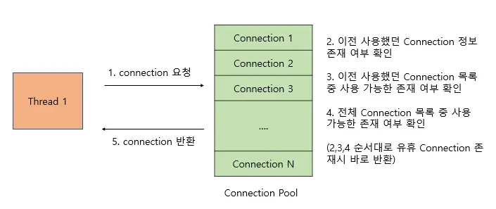
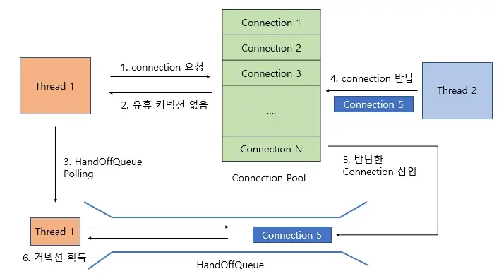

# Connection pool
## 1. connection pool이란
- 클라이언트의 요청에 따라 각 어플리케이션의 스레드에서 데이터베이스에 접근하기 위해서는 Connection이 필요하다.
- Connection pool은 이런 Connection을 여러 개 생성해 두어 저장해 놓은 공간(캐시), 또는 이 공간의 Connection을 필요할 때 꺼내 쓰고 반환하는 기법을 말한다.


## 2. 사전학습
### 1. DB connection이란
- DB와 애플리케이션 간 통신을 할 수 있는 수단
- Java의 DB Connection은 JDBC를 주로 이용하는데, URL 타입을 사용함


### 2. DB Connection 구조
- 2Tier - 클라이언트로서의 자바 프로그램(JSP)이 직접 데이터베이스 서버로 접근하여 데이터를 액세스하는 구조</br>
⇒ WS + DB
- 3Tier - 자바 프로그램과 데이터베이스 서버 중간에 미들웨어 층을 두어, 그 미들웨어 층에게 비즈니스 로직 구현부터 트랜잭션 처리, 리소스 관리 등을 전부 맡기는 구조이다.</br>
⇒ WS + WAS + DB

> Web Server :
GUI, 인터페이스, 웹화면 등 제공하는 서버<br>
동적인 컨텐츠 제공을 위해 WAS에 요청을 보내서 WAS에서 처리한 결과를 클라이언트에게 전달 기능도 수행

> Web Application Server (WAS 서버) : 
DB 조회 및 다양한 로직 처리 요구시 동적인 컨텐츠를 제공하기 위해 만들어진 애플리케이션 서버<br>
HTTP를 통해 컴퓨터나 장치에 애플리케이션을 수행해주는 미들웨어(소프트웨어 엔진)<br>
동적인 컨텐츠 제공을 위해 WAS에 요청을 보내서 WAS에서 처리한 결과를 클라이언트에게 전달 기능도 수행

### 3. JDBC

- JDBC(Java Database Connectivity)는 Java 기반 애플리케이션의 데이터를 데이터베이스에 저장 및 업데이트하거나, 데이터베이스에 저장된 데이터를 Java에서 사용할 수 있도록 하는 자바 API이다.


- 원래 각 DB마다 연결 방식과 통신 규격이 따로 있기 때문에 프로그램을 DB와 연결한다면, 해당 DB와 관련된 기술적 내용을 배우고 DB가 변경될 시 많은 변경 사항이 존재한다.
- 하지만 각 DBMS에 맞는 JDBC를 받아주게 되면 쉽게 DBMS를 변경할 수 있게 된다.
즉, DBMS 종류(MySQL, MsSQL, Oracle 등)에 상관 없이 하나의 JDBC API를 사용해서 데이터베이스 작업을 처리할 수 있게 된다. 

- JDBC는 3가지 기능을 표준 인터페이스로 정의하여 제공한다.
   - java.sql.Connection - 연결
   - java.sql.Statement - SQL을 담은 내용
   - java.sql.ResultSet - SQL 요청 응답


### 4. JDBC Driver
 - 자바 프로그램의 요청을 DBMS가 이해할 수 있는 프로토콜로 변환해 주는 클라이언트 사이드 어댑터이다.

- 각각의 DBMS는 자신에게 알맞은 JDBC 드라이버를 제공하고 있다.


코드로 구현한 예시
```java
Connection conn = null;
PreparedStatement  pstmt = null;
ResultSet rs = null;

try {
    sql = "SELECT * FROM T_BOARD"

    // 1. 드라이버 연결 DB 커넥션 객체를 얻음
    connection = DriverManager.getConnection(DBURL, DBUSER, DBPASSWORD);

    // 2. 쿼리 수행을 위한 PreparedStatement 객체 생성
    pstmt = conn.createStatement();

    // 3. executeQuery: 쿼리 실행 후
    // ResultSet: DB 레코드 ResultSet에 객체에 담김
    rs = pstmt.executeQuery(sql);
    } catch (Exception e) {
    } finally {
        conn.close();
        pstmt.close();
        rs.close();
    }
}
```
>  위와 같이 자바에서 DB에 직접 연결해서 처리하는 경우 JDBC Driver를 로드하고 커넥션 객체를 받아와야 한다. 그러면 매번 사용자가 요청을 할 때마다 드라이버를 로드하고 커넥션 객체를 생성하여 연결하고 종료하기 때문에 매우 비효율적이다. 이런 문제를 해결하기 위해서 커넥션 풀을 사용한다.

---

## 3. connection pool의 동작원리

- Container 구동 시 일정 수의 Connection 객체를 생성하게 되며 클라이언트의 요청에 의해 애플리케이션이 DBMS 작업을 수행해야 하면, Connection Pool에서 Connection 객체를 받아와 작업을 진행한다. 이후 작업이 끝나면 Connetion Pool에 Connection 객체를 반납한다.

### HikarCP의 동작원리
- HikariCP는 가벼운 용량과 빠른 속도를 가지는JDBC의 커넥션 풀 프레임워크이다.
- SpringBoot는 커넥션 풀 관리를 위해 HikariCP를 사용한다. (스프링부트2.0부터)

>  Thread가 커넥션을 요청했을 때 유휴 커넥션이 존재한다면 해당 커넥션을 반환해준다.

>  1. 유휴 커넥션이 존재하지 않는다면, HandOffQueue를 Polling 하면서 다른 Thread가 커넥션을 반납하기를 기다린다. <br>2. (지정한 TimeOut 시간까지 대기하다가 시간이 만료되면 예외를 던진다.) <br> 3. 다른 Thread가 커넥션 풀에 커넥션을 반납하면 Connection Pool이 Connection 사용 내역을 기록하고, HandOffQueue에 반납된 Connection을 삽입 <br>4. HandOffQueue를 Polling 하던 Thread는 커넥션을 획득
## 4. Connection pool 의 장점

-  DB 접속 설정 객체를 미리 만들어 연결하여 메모리 상에 등록해 놓기 때문에 불필요한 작업(커넥션 생성, 삭제)이 사라지므로 클라이언트가 빠르게 DB에 접속이 가능하다.

 

- DB Connection 수를 제한할 수 있어서 과도한 접속으로 인한 서버 자원 고갈 방지가 가능하다.

 

- DB 접속 모듈을 공통화하여 DB 서버의 환경이 바뀔 경우 쉬운 유지 보수가 가능하다.

 

- 연결이 끝난 Connection을 재사용함으로써 새로 객체를 만드는 비용을 줄일 수 있다.

## 5. Connection pool 의 유의사항

### 1.  동시 접속자가 많을 경우

커넥션은 한정되어 쓸 수 있는 커넥션이 반납될 때까지 대기해야한다.<br>
그렇다고? 너무 많은 커넥션을 생성하면

⇒ 커넥션은 객체이므로 많은 메모리를 차지하게 되고, 프로그램의 성능을 떨어뜨리는 원인

따라서 사용량에 따라 적정량의 커넥션 객체를 생성

### 2. Connection Pool이 커지면 성능은 무조건 좋아질까? X

⇒Connection의 주체는 Thread이므로 Thread와 함께 고려해야 한다.

- Thread Pool 크기 < Connection Pool 크기 

⇒ Thread Pool에서 트랜잭션을 처리하는 Thread가 사용하는 Connection 외에 남는Connection은 실질적으로 메모리 공간만 차지하게 된다.

- Thread Pool 크기와 Connection Pool 모두 크기 증가

⇒Thread 증가로 인해 더 많은 Context Switching이 발생한다.

Context Switching이란 : 하나의 프로세스가 CPU를 사용 중인 상태에서 다른 프로세스가 CPU를 사용하도록 하기 위해, 이전의 프로세스의 상태(문맥)를 보관하고 새로운 프로세스의 상태를 적재하는 작업


## 6. 요약
- JDBC는 자바 애플리케이션이 데이터베이스에 접근할 수 있도록 만든 JAVA에서 제공하는 API이다.
- 하나의 JDBC로 어떤 DBMS든 각 벤더마다 제공되는 JDBC 드라이버를 통해 연결 할 수 있다.
- 커넥션 풀이란 JDBC 실행 과정 중에서 생성되어야 할 Connection 객체를 미리 만들어서 pool 이란 곳에서 저장을 해두는 기법이다.
- 장점은 불필요한 과정(Connection객체를 생성,삭제)을 줄여서 성능을 높일 수 있다.
- WAS에서 커넥션 풀을 크게 설정하면 메모리 소모가 큰 대신 많은 사용자가 대기 시간이 줄어들고, 반대로 커넥션 풀을 적게 설정하면 그 만큼 대기 시간이 길어진다. 따라서 사용량에 따라 적정량의 커넥션(Connection)객체를 생성해두어야 한다.

---

출처 : <br>
https://github.com/WeareSoft/tech-interview/blob/master/contents/db.md<br>
https://ittrue.tistory.com/250<br>
https://tussle.tistory.com/1039<br>
https://steady-coding.tistory.com/564<br>
https://steady-coding.tistory.com/m/564
