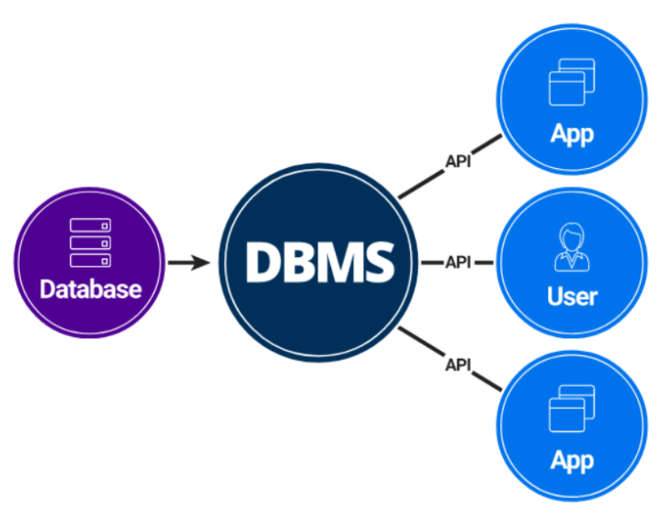
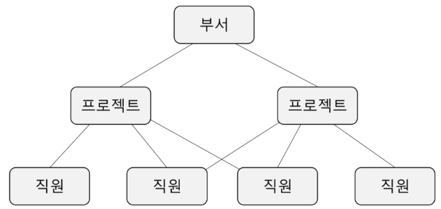
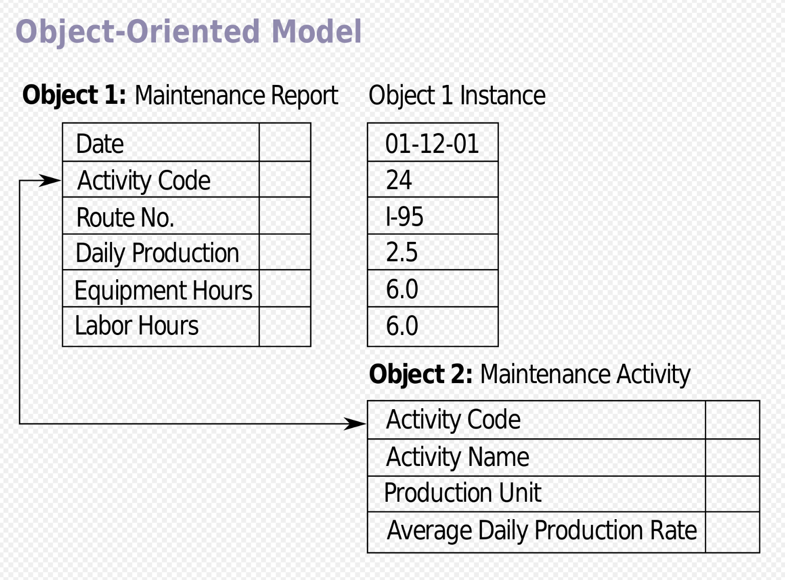
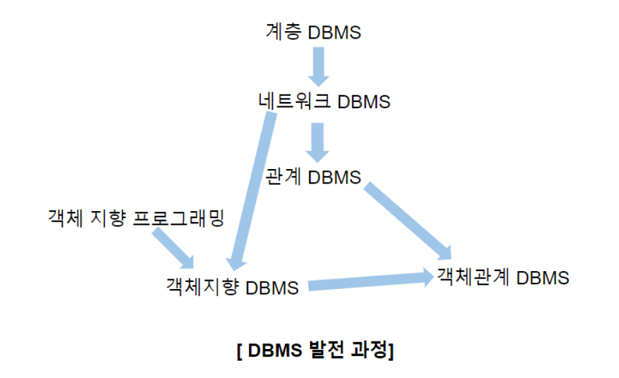
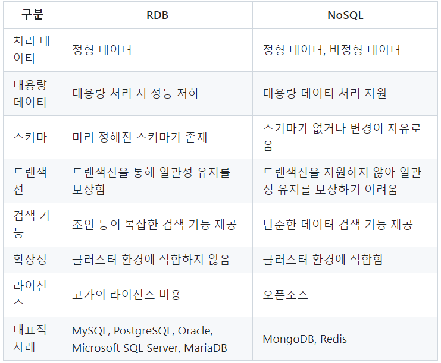

# DBMS
### DBMS란?
- **Database Management System**
    > 데이터를 관리하기 위한 시스템  
    데이터 정의, 구축, 조작, 공유, 제어, 보호 등

    

### DBMS 장점
- **데이터 독립**
    > 데이터와 응용 프로그램을 분리시킴으로써 상호 영향 최소화
- **데이터 무결성**
    > 데이터 중복을 최소화하여 데이터 무결성 보존 노력
- **데이터 보안 향상**
    > DBMS를 통해 응용 프로그램의 접근 제어
- **관리 편의성 향상**
    > 데이터를 구축, 조작하는 기능 지원

### Database의 종류
- **HDBMS**
    > 계층형 데이터베이스 관리 시스템  
    계층적인 구조로 조직화하여 관리하며, 부모-자식 관계를 통해 서로 연결(Tree 구조와 유사)

    

 

- **NDBMS**
    > 네트워크 데이터베이스 관리 시스템  
    복잡한 네트워크 구조처럼 다양한 관계를 표현할 수 있어 더 유연한 관계를 지원

    

 

- **RDBMS**
    > 관계형 데이터베이스 관리 시스템  
    Table 형태로 데이터를 저장하며, 키를 통해 데이터 간의 관계를 정의(SQL로 관리)

    

 

- **ODBMS**
    > 객체 지향 데이터베이스 관리 시스템  
    데이터를 객체로 저장하고, 객체 지향 언어를 사용하여 데이터를 직접 조작(상속성, 다형성, 캡슐화 등 지원)

    

 

- **참고자료**

    

 
 
 

# No SQL
### No SQL이란?
- **Not only SQL**
    > SQL : Structured Query Language  
    No SQL은 SQL외에도 다른 형태의 데이터 관리 방식을 지원한다는 뜻

### No SQL 특징
- **No SQL 배경**
    > 최근 텍스트, 이미지 등 파일 형태가 다양해지며 비정형 데이터가 빠른 속도로 대량 생산되고 있는 상황  
    -> 대량의 비정형 데이터의 저장과 처리를 위해 No SQL 등장

- **데이터 구조 사전 정의 필요X**
    > SQL의 경우 데이터 구조를 먼저 설계하여야 데이터를 쌓을 수 있었지만, No SQL은 그렇지 않음

- **데이터베이스 서버 확장(참고)**
    > 수직적 확장 : Scale Up, 단일 서버의 리소스(ex. CPU, RAM)를 증가시키는 확장  
    -> 일반적으로 SQL에 적용

    > 수평적 확장 : Scale Out, 여러 서버에 데이터베이스를 분산시켜 처리 능력을 증가시키는 확장  
    -> 일반적으로 No SQL에 적용

### No SQL Database 유형
- Key-Value Stores
    > 가장 단순한 형태의 No SQL 형태, 유일한 키를 통해 데이터를 검색할 수 있으며 빠른 조회와 유연한 스케일링 가능
- Document-Oriented Databases
    > 데이터를 JSON, XML과 같은 문서 형식으로 저장하며, 복잡한 데이터 구조를 효율적으로 표현 가능
- Wide Column Stores
    > Table을 사용하지만, 각 행마다 동적으로 Column을 가질 수 있으며 대규모의 데이터 세트를 효율적으로 저장, 관리 가능
- Graph Databases
    > 데이터를 노드, 엣지(관계), 프로퍼티로 모델링하여 복잡한 관계를 그래프 형태로 표현 가능

### SQL과 No SQL 비교
- SQL
    - 장점
        > 명확하게 정의된 스키마, 데이터 무결성 보장   
        관계는 각 데이터를 중복없이 한번만 저장
    - 단점
        > 데이터 스키마를 사전에 계획하고 구축해야 함  
        관계를 맺고 있어 Join을 통한 복잡한 쿼리문이 될 수 있음

- No SQL
    - 장점
        > 스키마가 없어 유연하게 데이터 관리  
        어플리케이션이 필요로 하는 형식으로 데이터를 저장하여 Reading 속도가 빠름
    - 단점
        > 데이터 중복을 계속 Control 해줘야 함  
        데이터가 여러 Collection에 중복되어 있고, 해당 데이터를 수정 시 모든 Collection에서 수정 작업 진행 필요
    
    - 비교표

        

---
### 📢 질문 예상 List
1. DBMS의 발전 과정은 어떻게 되나요?
2. 대규모 분산 시스템을 설계할 때 No SQL 데이터베이스를 선택하는 이유가 무엇인가요?

---
### 📌 Reference
- https://ko.wikipedia.org/wiki/%EA%B0%9D%EC%B2%B4_%EA%B4%80%EA%B3%84_%EB%8D%B0%EC%9D%B4%ED%84%B0%EB%B2%A0%EC%9D%B4%EC%8A%A4
- https://velog.io/@xilver0203/DataBase-DBMS%EC%9D%98-%EC%A2%85%EB%A5%98%EC%99%80-%EB%B9%84%EA%B5%90
- https://velog.io/@jungjuyoung/%EB%8D%B0%EC%9D%B4%ED%84%B0%EB%B2%A0%EC%9D%B4%EC%8A%A4-%EA%B0%9C%EC%9A%94-DBMS-%EC%A2%85%EB%A5%98%EC%99%80-%ED%8A%B9%EC%A7%95-%EB%B0%8F-%EC%9C%A0%ED%98%95
- https://velog.io/@9yur1/DBMS
- https://github.com/gyoogle/tech-interview-for-developer/blob/master/Computer%20Science/Database/SQL%EA%B3%BC%20NOSQL%EC%9D%98%20%EC%B0%A8%EC%9D%B4.md