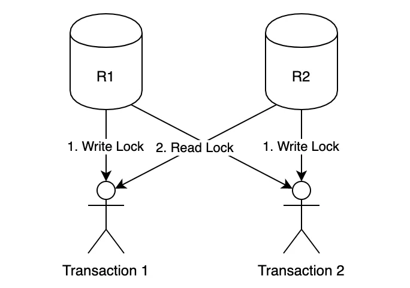
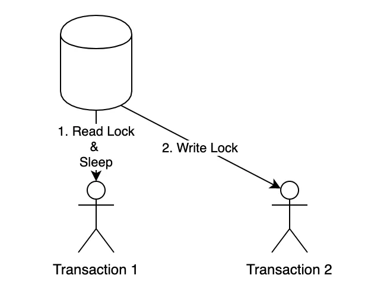

# :lock: DB Locking

## DB Lock이란
Lock이란 트랜잭션 처리의 일관성을 보장하기 위한 방법이다. 지난 시간에 함께 공부했던 이상현상과 격리 수준과 같이 이번 시간에 공부할 내용은 Lock을 통한 일관성 보장이다.

## Lock의 종류
Lock의 종류로는 공유(Shared) Lock과 배타(Exclusive) Lock이 있다. 공유락은 다른 말로 Read Lock이라고 불리며 배타락은 Write Lock이라고도 불린다.

### Shared Lock
공유 Lock은 데이터를 읽을 때 사용되는 Lock이다. 공유 Lock이 걸려있을 때 같은 공유 Lock 끼리는 동시에 접근 가능하다. 즉, 하나의 데이터를 읽는 것은 여러 사용자가 동시에 할 수 있다는 것이다. 하지만 공유 Lock이 설정된 데이터에 배타 Lock을 사용할 수는 없다.

### Exclusive Lock
배타 Lock은 데이터를 변경하고자 할 때 사용되며, 트랜잭션이 완료될 때까지 유지된다. 배타 Lock은 해제되기 전까지 해당 리소스로 다른 트랜잭션(읽기 포함)의 접근을 막는다. 또한 배타 Lock은 다른 트랜잭션이 수행 중인 데이터를 포함하여 함께 Lock을 설정할 수 없다.

## Lock의 범위
- 데이터베이스

  데이터베이스 범위의 lock은 전체 데이터베이스를 기준으로 lock하는 것이다. 즉, 1개의 세션만이 DB의 데이터에 접근이 가능하다. 해당 기능은 일반적으로는 사용하지 않고, DB의 소프트웨어 버전을 올리는 등 주요한 DB의 업데이트에 사용한다.

- 파일

  데이터베이스 파일을 기준으로 lock을 설정한다. 파일이란 테이블, row 등과 같은 실제 데이터가 쓰여지는 물리적인 저장소이다. 해당 범위의 Lock은 잘 사용되지는 않는다.

- 테이블

  테이블 수준의 Lock은 테이블을 기준으로 Lock을 설정한다. 이는 테이블의 모든 행을 업데이트 하는 등의 전체 테이블에 영향을 주는 변경을 수행할 때 유용하다. 즉, DDL(create, alter, drop 등) 구문과 함께 사용되며 DDL Lock이라고도 한다.

- 페이지와 블럭

  파일의 일부인 페이지와 블록을 기준으로 Lock을 설정한다. 잘 사용되지는 않는다.

- 컬럼

  컬럼 기준의 Lock은 컬럼을 기준으로 Lock을 설정할 수 있는다. 하지만 이 방식은 Lock 설정 및 해제의 리소스가 많이 들기 때문에 일반적으로 사용되지는 않는다. (지원하는 DBMS도 많지 않다)

- 행(Row)

  행 수준의 Lock은 1개의 행(Row)를 기준으로 Lock 설정을 한다. DML에 대한 Lock으로 가장 일반적으로 사용하는 Lock이다.

## Blocking
Blocking은 Lock들의 경합(Race condition)이 발생하여 특정 세션이 작업을 진행하지 못하고 멈춰 선 상태를 의미한다. 공유 Lock과 배타 Lock, 또는 배타 Lock과 배타 Lock끼리 블로킹이 발생할 수 있다. 경합이 발생할 때, 먼저 Lock을 설정한 트랜잭션을 기다려야 하기 때문에, 이런 현상이 반복되면 빠른 서비스를 제공할 수 없다. 이를 해결하는 방법은 Transaction commit 또는 rollback 뿐이다.

이러한 상황을 방지하기 위해서는 
1. SQL 문장을 빠르게 실행되도록 리펙토링한다.
2. 트랜젝션을 가능한 짧게 정의하면 경합을 줄일 수 있다.
3. 동일한 데이터를 동시에 변경하는 작업을 하지 않도록 설계한다.
4. 대용량 작업이 불가피할 경우, 작업단위를 쪼개거나 lock_timeout을 설정하여 해당 Lock의 최대시간을 설정할 수 있다.

## Dead Lock
Deadlock은 트랜잭션간의 교착상태를 의미한다. 두 개의 트랜잭션 간에 각각의 트랜젝션이 가지고 있는 리소스의 Lock을 획득하려고 할 때 발생한다.
 

 

1. 가장 흔히 떠올릴 수 있는 deadlock 상황이다. 1번 트랜젝션에서 2번 리소스의 잠금을 획득, 2번 트랜젝션에서는 1번 리소스의 잠금을 획득한 상태이다. 이때, 동시에 상대방의 데이터를 엑세스하려고 할 때 기존의 Lock이 해제될 때까지 기다리게 되는 상황이다.

 

 

2. 두번째 예는 1번 트랜젝션이 공유 Lock을 설정하고 Sleep에 빠진 상황이다. 이때 2번 트랜젝션은 배타 Lock을 설정하려고 할 때, 기한없이 기다리게 된다.

 

이를 해결하기 위해서는
1. Dead Lock이 감지되면 둘 중 하나의 트랜잭션을 강제 종료한다.
2. Dead Lock 방지를 위해 접근 순서를 동일하게 한다.

### 출처

https://sabarada.tistory.com/121 
https://chrisjune-13837.medium.com/db-lock-락이란-무엇인가-d908296d0279 
https://hstory0208.tistory.com/entry/%EB%9D%BDLock%EC%9D%B4%EB%9E%80-Lock%EC%9D%98-%EC%A2%85%EB%A5%98%EC%99%80-%EA%B5%90%EC%B0%A9%EC%83%81%ED%83%9CDeadLock