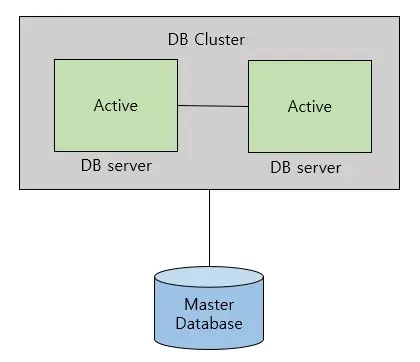
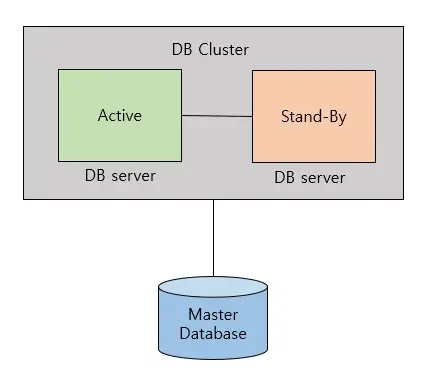
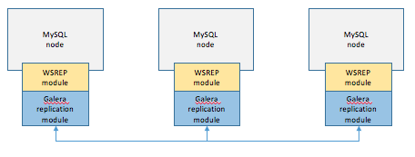
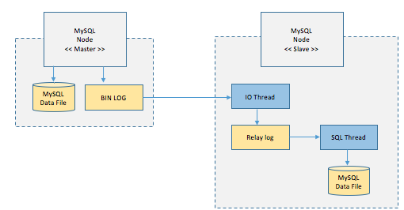
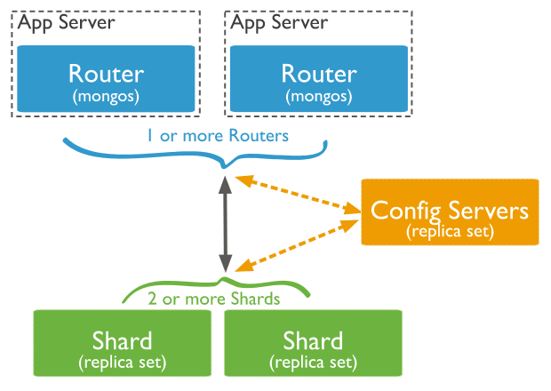
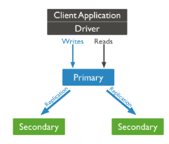

# 📖 RDB와 NoSQL에서의 클러스터링/리플리케이션 방식

## 목차

- [1. 🧪 DB 구성 방식](#-db-구성-방식)
- [2. 🧪 Clustering](#-clustering)
  - [2.1 🍁 Active & Active 방식](#-active--active-방식)
  - [2.2 🍁 Active & Stand-By 방식](#-active--stand-by-방식)
- [3. 🧪 Replication](#-replication)
- [4. 🧪 MySQL (RDB)](#-mysql-rdb)
  - [4.1 ⛓ Clustering (Galera Clustering)](#-clustering-galera-clustering)
  - [4.2 ⛓ Replication](#-replication)
- [5. 🧪 MongoDB (NoSQL)](#-mongodb-nosql)
  - [5.1 ⛓ Clustering (Shard Cluster)](#-clustering-shard-cluster)
  - [5.2 ⛓ Replication (replica-set)](#-replication-replica-set)
- [6. 참조](#-참조)

## 🧪 DB 구성 방식

<div align="center">
    
</div>

🔹 데이터베이스는 기본적으로 데이터베이스 서버와 데이터베이스가 저장되는 스토리지가 1:1로 구성된다. 하지만, DB 서버에서 트랜잭션을 수용하지 못하거나 (다수의 클라이언트가 동시에 DB에 접근하거나 대량의 데이터를 처리할 때), DB 스토리지에 저장된 데이터가 손상될 경우가 있다. 클러스터링과 리플리케이션은 이러한 문제점을 해결하기 위한 방식이다.

<br/>

## 🧪 Clustering

> 하나의 DB 서버가 중단되더라도 다른 DB 서버를 활용하여 전체 서비스가 중단되지 않도록 하는 방식.

- 여러 개의 DB를 수평적인 구조로 구축하는 방식
- 동기 방식으로 데이터를 동기화
- 주로 부하의 분산을 목적으로 사용
- 분산 환경을 구성하여 Single point of failure와 같은 문제를 해결할 수 있는 Fail Over 시스템을 구축하기 위해서 사용 <br/><br/>

```
🖋 single point of failure (단일 장애점,SPOF)

> 시스템 구성 요소 중 동작하지 않으면 전체 시스템이 중단되는 요소
> 이중화가 되어 있지 않은 요소라면 SPOF일 가능성 높음

🖋 Fail over

> 실 운용환경(컴퓨터 서버, 시스템, 네트워크) 등에서 이상이 생겼을 때, 대체 작동 또는 장애 극복(조치)을 위해 예비 운용환경으로 자동전환되는 기능
```

### 🍁 Active & Active 방식

---

<div align="center">
    
</div>

> Active - Active는 두개의 DB 서버를 Active(작동) 상태로 두는 것을 말한다.

<br/>

**Active - Active 방식의 장점**

- 하나의 DB 서버가 중단되더라도 다른 DB 서버가 작동할 수 있다. -> 다른 서버가 동작하는 동안 복구를 하여 서비스의 중단 없음
- 서버가 두개이기 때문에 DB 서버의 CPU, 메모리 등이 두 배가 되어 가용성 측면에서도 두 배 이상의 성능을 발휘할 수 있다. 

<br/>

**Active - Active 방식의 단점**

- 스토리지 하나를 공유하기 때문에 병목이 생길 수 있다.
- 두 서버를 동시에 운영하기 때문에 비용 부담이 생길 수 있다.

<br/>

### 🍁 Active & Stand-By 방식

---

<div align="center">
    
</div>

> Active - Stand by는 하나의 DB 서버는 Active(작동) 상태로, 나머지 DB 서버는 Stand by(대기) 상태로 두는 것을 말한다.

<br/>

**Active & Stand-By 방식의 장점**

- 운영 비용 절감 -> Stand by 서버는 평소에 작동하지 않기 때문에 Active 상태의 DB 서버 비용만 지출하면 된다.
- 병목현상이 해결된다.

<br/>

**Active & Stand-By 방식의 단점**

- Stand by 서버는 평소에 작동하지 않기 때문에 Fail over가 발생하는 시간 동안에는 서비스가 중단될 수 밖에 없다. -> Active 서버로 전환하기까지 시간이 수십 초에서 수십 분까지 소요된다.
- 결론적으로 한 대로 운영하기 때문에 효율은 Active & Active의 1/2 정도가 된다.

<br/>

## 🧪 Replication

> Clustering이 DB 서버의 개수를 늘리는 방식이라면 Replication DB 서버와 스토리지를 복제하는 방법이다.

<div align="center">
    
</div>

- 다양한 이슈로 데이터 유실이 생길 경우를 대비해서 스토리지까지 복제함으로써 데이터의 유실을 최소화한다.
- 데이터베이스 서버를 확장한 Clustering과 달리 서버와 스토리지 모두 확장
- 여러 개의 DB를 권한에 따라 **수직적인 구조**(Master-Slave)로 구축하는 방식
    - Master : INSERT, UPDATE, DELETE
    - Slave : SELECT
    - Slave는 결국 Master 서버에서 복제된 데이터이기 때문에 데이터의 조작이 발생할 수 있는 INSERT, UPDATE, DELETE 작업은 Master로 전달이 되고 조회만을 하는 SELECT 작업은 Slave 서버를 통하여 진행하게 된다. 
- Slave 서버 여러개를 통해 분산하여 처리할 수 있어 성능 향상에 도움이 된다.
- 읽기 중심의 응용 프로그램에서 사용
- 버전 관리 필요, 적어도 Slave가 상위버전
- **비동기**방식으로 데이터 동기화하기 때문에 일관성있는 데이터 얻지 못 할 수 있음
    - 동기 방식으로 Replication할 수 있지만, 속도가 느려짐
- Master 서버가 다운되면 복구 및 대처 까다로움

> 현재는 master-slave 단어를 안쓰는 추세인 만큼 source-replica 구조로 불리기도 한다.

<br/>

**[ 구축 목적 ]**

- **스케일 아웃**
    - 갑자기 늘어나는 트래픽에 대해 부하를 줄이기 위해 서버를 늘려 성능을 개선하는 것.
- **데이터 백업**
    - 백업 과정은 실제 실행중인 쿼리에 영향을 줄 수 있다. -> 레플리카 서버에서 데이터 백업을 진행
- **데이터 분석**
    - 데이터 분석의 경우, 대량의 데이터 조회, 복잡한 쿼리가 많을 수 있다. -> 데이터 분석 전담 서버를 두는 것이 좋다.
    - source 서버에서 데이터 분석을 할 경우, 실제 서비스에 문제가 생길 수 있다. -> replica 서버에서 데이터 분석을 수행할 수 있다.
- **데이터의 지리적 분산**
    - 데이터베이스 서버가 멀리 떨어져 있다면 빠른 응답을 받기 어렵다. -> 다양한 지역에 레플리카 서버를 두어 응답 속도를 높일 수 있다.

<br/>

## 🧪 MySQL (RDB)

### ⛓ Clustering (Galera Clustering)

---

<div align="center">
    
</div>

**처리 순서**

1. 1개의 노드에 쓰기 트랜잭션이 수행되고, COMMIT을 실행한다.
2. 실제 디스크에 내용을 쓰기 전에 다른 노드로 데이터의 복제를 요청한다.
3. 다른 노드에서 복제 요청을 수락했다는 신호(OK)를 보내고, 디스크에 쓰기를 시작한다.
4. 다른 노드로부터 신호(OK)를 받으면 실제 디스크에 데이터를 저장한다.

-> 클러스터링은 DB들 간의 데이터 무결성 검사(데이터가 일치하는지)를 하는 동기방식으로 데이터를 동기화한다. 이러한 구조에 의해 클러스터링 방식은 다음과 같은 장점과 단점을 갖고 있다.

[ 클러스터링(Clustering) 장점과 단점 ]

**장점**

- 노드들 간의 데이터를 동기화하여 항상 일관성있는 데이터를 얻을 수 있다. 
- 1개의 노드가 죽어도 다른 노드가 살아 있어 시스템을 계속 장애없이 운영할 수 있다.

**단점**

- 여러 노드들 간의 데이터를 동기화하는 시간이 필요하므로 Replication에 비해 쓰기 성능이 떨어진다.
- 장애가 전파된 경우 처리가 까다로우며, 데이터 동기화에 의해 스케일링에 한계가 있다.

---

<br/>

### ⛓ Replication

---

<div align="center">
    
</div>

**처리 순서**

1. Master 노드에 쓰기 트랜잭션이 수행된다.
2. Master 노드는 데이터를 저장하고 트랜잭션에 대한 로그를 파일에 기록한다.(BIN LOG)
3. Slave 노드의 IO Thread는 Master 노드의 로그 파일(BIN LOG)를 파일(Replay Log)에 복사한다.
4. Slave 노드의 SQL Thread는 파일(Replay Log)를 한 줄씩 읽으며 데이터를 저장한다.

-> 리플리케이션은 Master와 Slave간의 데이터 무결성 검사(데이터가 일치하는지)를 하지 않는 비동기방식으로 데이터를 동기화한다. 이러한 구조에 의해 리플리케이션 방식은 다음과 같은 장점과 단점을 갖고 있다.

[ 리플리케이션(Replication) 장점과 단점 ]

**장점**

- DB 요청의 60~80% 정도가 읽기 작업이기 때문에 Replication만으로도 충분히 성능을 높일 수 있다.
- 비동기 방식으로 운영되어 지연 시간이 거의 없다.

**단점**

- 노드들 간의 데이터 동기화가 보장되지 않아 일관성있는 데이터를 얻지 못할 수 있다.
- Master 노드가 다운되면 복구 및 대처가 까다롭다.

---

<br/>

## 🧪 MongoDB (NoSQL)

### ⛓ Clustering (Shard Cluster)

---

<div align="center">
    
</div>

**처리 순서**

1. 쿼리가 참조하는 컬렉션의 Chunk metadata를 Config Server로부터 가져와 router의 메모리에 캐시한다.
2. 쿼리의 조건에서 Sharding Key 조건을 찾는다.
    1) Sharding Key 존재할 경우 : 해당 Sharding Key가 포함된 Chunk 정보를 router의 캐시에 검색하여 Shard서버로만 사용자 쿼리를 요청
    2) Sharding Key 없을 경우 : 모든 Shard 서버로 쿼리를 요청한다.
3. 쿼리를 전송한 대상 Shard 서버로부터 쿼리 결과가 도착하면 결과를 병합하여 사용자에게 결과를 반환한다.

-> 클러스터링은 DB들 간의 데이터 무결성 검사(데이터가 일치하는지)를 하는 동기방식으로 데이터를 동기화한다. 이러한 구조에 의해 클러스터링 방식은 다음과 같은 장점과 단점을 갖고 있다.

- Mongodb는 직접 특정 Shard에 접근할 수 없음
- Query Router에 명령을 하고, Query Router가 Shard에 접근하는 방식(Config Server정보기반으로 data chunk 위치를 찾아가는 것도 이때 수행됨)
    - query router : 쿼리를 받아 각 샤드로 보내주는 역할, 데이터 저장되어 있진않고 router 역할만 수행
    - shard : 실제 데이터가 저장되는 저장소
    - config : 어떤 shard가 어떤 데이터(data chunk)를 가지고 있는지, data chunk들을 어떻게 분산해서 저장하며 관리하라 지 알 수 있음
- 성능 문제를 위해 shard 여러개를 두고 분산처리
    - scaling을 통해 늘리고 즐일 수 있음
    - 보통 3개의 shard 구성(SPOF막기위해)
- Query Router는 Shard정보를 찾는 부분의 성능을 위해 Config Server의 metadata를 cache로 저장해둔다.
    - metadata : 데이터가 저장되어 있는 shard 정보 및 sharding key 정보

---

<br/>

### ⛓ Replication (replica-set)

---

<div align="center">
    <br>
    <br>
    
</div>

📌 구성

☛ Replica Set은 동일한 데이터를 가진 여러 node(여기서는 서버)로 이루어져있으며, 선택적으로 하나의 Aribiter node를 포함시킬 수 있다. 데이터를 가진 node들 중에서는 반드시 하나의 primary node를 지정해줘야하며, 나머지 node들은 secondary node라고 칭한다.

node들의 구성에 따른 대표적인 구성 방식 -> Replica Set을 구성하는 node의 개수는 최소 3개 이상이다. 그 중에 대표적인 3개로 이루어진 경우는 다음과 같다.

(1) P-S-S (Primary + Secondary + Secondary)
- Primary node에 문제가 생기더라도 Secondary node 2개나 그 자리를 대신할 수 있다. 높은 안정성( high availability )을 보장할 수 있다.

(2) P-S-A (Primary + Secondary + Arbiter)
- Arbiter node는 Primary나 Secondary와는 다르게 서버의 리소스는 많이 필요하지 않지만 데이터를 실제로 담고있지는 않기 때문에 상대적으로는 구성의 안정성이 낮다. (그렇다고 안정성이 좋지 않은 것은 아니다). 

<br/>

1. Primary node, Secondary node

🔹 모든 write 작업을 수행한다. 기본적으로 읽기 작업도 Primary 몫, primary node에 해당 작업이 수행되면 oplog라는 것에 모든 작업 로그를 저장하는데, secondary node에서는 이 oplog를 보고 동일한 작업을 수행한다. 쉽게 말해서 primary node에서 변화된 데이터를 복사하는 것이다.

2. Heartbeat

🔹 Replica set 내의 모든 노드들은 정해진 초(second)마다 서로에게 heartbeat(일종의 ping)를 보낸다. 이러한 Heartbeat가 특정 초 동안 수신되지 않으면 다른 node들이 Election을 준비한다.

3. Election

🔹 primary node가 이용 불가능한 상태에 빠졌을 때, secondary node들 중에서 primary node를 하나 정하는 과정을 의미한다.

4. Arbiter node

🔹 primary나 secondary node처럼 데이터를 가지진 않고 secondary node들 중에서 primary node를 선정하는 election 과정에 참여한다. arbiter node가 primary node가 될 수는 없다. (투표엔 참여하는데 primary node가 될 순 없고 데이터도 없다.) <br/>
🔹 Replica set 을 3대 서버로 구축하는 것도 사용에 따라서 서버 낭비라고 생각되는 경우 Arbiter 모드의 MongoDB 를 사용할 수 있으며 이 Arbiter 모드의 MongoDB는 Primary 노드가 불능일 때 Primary 노드의 선출을 위한 투표에만 참여하게 됩니다(Vote Only) <br/>
🔹 여러 개의 Arbiter 가 존재할 수 있지만 실제 정상적인 상황에서는 하나 이상의 Arbiter 는 필요하지 않습니다. 

---

<br/>

## 📸 참조

https://www.whatap.io/ko/blog/173/ <br/>
https://sightstudio.tistory.com/59 <br/>
https://hoing.io/archives/8381 <br/>
https://hoing.io/archives/4282 <br/>
https://medium.com/@zzanzu/mongodb-replica-set-%EA%B5%AC%EC%B6%95%ED%95%98%EA%B8%B0-be7df973801d

