# SQL_Join

## Join의 정의

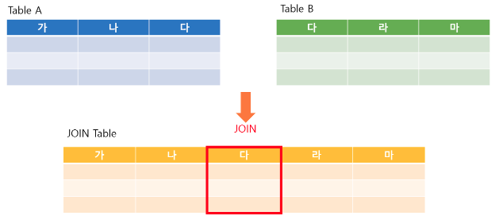

Join이란 한 데이터베이스 내의 여러 테이블의 레코드를 조합하여 하나의 결과로 표현한 것이다. 이렇게 얻게 된 결과는 테이블로서 저장되거나, 그 자체로 이용할 수 있는 결과셋을 만들어 낸다. 보통 Primary key 또는 Foreign key로 두 테이블을 연결한다. 이렇게 연결하려면 적어도 하나의 칼럼을 서로 공유하고 있어야 한다.

## Join의 필요성

관계형 데이터베이스에서는 중복 데이터를 피하기 위해서 데이터를 쪼개 여러 테이블로 나눠서 저장한다. 이렇게 분리되어 저장된 데이터에서 원하는 결과를 다시 도출하기 위해서는 여러 테이블을 조합할 필요가 있다. 이럴 경우 Join 연산자를 사용해 관련 있는 컬럼 기준으로 행을 합쳐주는 연산을 활용한다.

## Join의 종류

Join의 종류는 크게 내부 조인, 외부 조인, 교차 조인, 셀프 조인 네 가지가 있다. 아래의 두 테이블은 각각의 조인 방식을 설명할 때 사용할 예시 테이블들이다.


## Inner Join

<p align="center"> </p>

Inner Join, 즉 내부 조인은 가장 흔한 결합 방식이다. 위와 같이 벤 다이어그램으로 봤을 때 교집합에 해당하는 값들을 보여주는 조인 방식이라고 할 수 있다.

앞서 제시된 테이블을 기준으로 조인의 표현 방식과 그 결과를 설명하고자 한다. 내부 조인은 명시적 조인 표현과 암시적 조인 표현의 두 가지 방법이 가능하다.

- 명시적 조인 표현
<br>
테이블에 조인을 하라는 것을 지정하기 위해 JOIN 키워드를 사용하며, 그리고 나서 다음의 예제와 같이 ON 키워드를 조인에 대한 구문을 지정하는데 사용한다.
    ```
    SELECT *
    FROM employee INNER JOIN department
    ON employee.DepartmentID = department.DepartmentID;
    ```
- 암시적 조인 표현
<br>
SELECT 구문의 FROM 절에서 그것들을 분리하는 컴마를 사용해서 단순히 조인을 위한 여러 테이블을 나열하기만 한다.
    ```
    SELECT *
    FROM employee, department
    WHERE employee.DepartmentID = department.DepartmentID;
    ```

위와 같이 employee 테이블과 department 테이블에서 DepartmentID가 같은 경우로 내부 조인을 실행하면 아래와 같이 해당하는 튜플들만 검색할 수 있다.

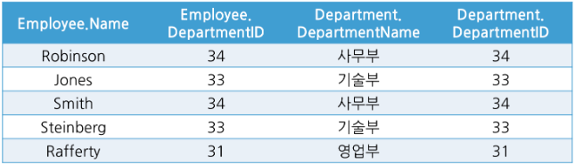

<br>

## Outer Join

<p align="center"> 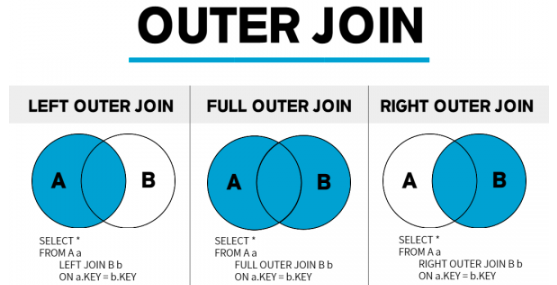</p>

조인 대상 테이블에서 특정 테이블의 데이터가 모두 필요한 상황에서 외부 조인을 활용하여 효과적으로 결과 집합을 생성할 수 있다.

### 1. Left Outer Join

<p align="center"> 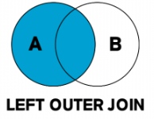</p>

좌측 테이블의 모든 데이터를 포함하는 결과 집합을 생성한다.

    ```
    SELECT *
    FROM employee LEFT OUTER JOIN department
    ON employee.DepartmentID = department.DepartmentID;
    ```

예시의 경우를 보면 Employee 테이블의 값들 중 Department 테이블과 교차되지 않더라도 그 값들을 누락하지 않고 전부 포함시켜 아래와 같은 결과 셋을 만든다.

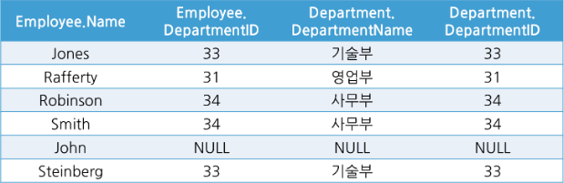

### 2. Right Outer Join

<p align="center"> </p>

우측 테이블의 모든 데이터를 포함하는 결과 집합을 생성한다.

    ```
    SELECT *
    FROM employee RIGHT OUTER JOIN department
    ON employee.DepartmentID = department.DepartmentID;
    ```

좌측 외부 조인과 반대로 Department 테이블의 값들 중 Employee 테이블과 교차되지 않더라도 그 값들을 누락하지 않고 전부 포함시켜 아래와 같은 결과 셋을 만든다.

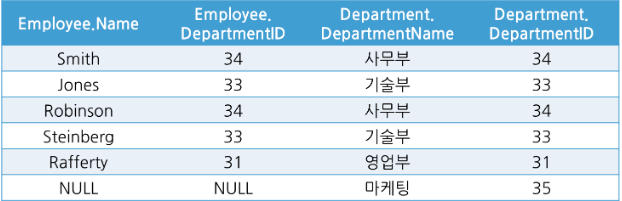

### 3. Full Outer Join

<p align="center"> </p>

Full Outer Join, 즉 완전 외부 조인은 양쪽 테이블 모두 OUTER JOIN이 필요할 때 사용한다.

    ```
    SELECT *
    FROM employee FULL OUTER JOIN department
    ON employee.DepartmentID = department.DepartmentID;
    ```

Employee와 Department의 값을 하나도 누락하지 않고 모두 결과값에 포함시키고자 할 때 사용하며 그 결과는 아래와 같다.

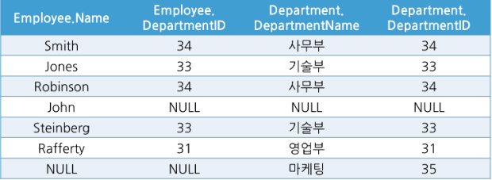

<br>

## Cross Join

<p align="center"> 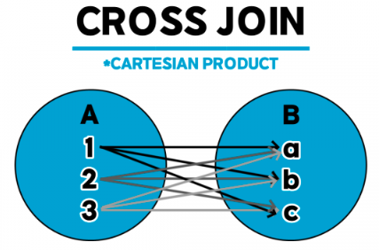</p>

Cross join, 즉 교차 조인은 내부 조인의 특수한 형태로 자주 쓰이는 조인 방법은 아니지만 대량의 데이터를 만들어내고자 할 때 사용하는 조인 방법이다.

교차 조인의 방법은 조인되는 두 테이블에서 곱집합을 반환하는 것이다. 예를 들어 m행을 가진 테이블과 n행을 가진 테이블이 교차 조인되면 m*n 개의 행을 생성한다.

```
SELECT * FROM employee CROSS JOIN department;
```

```
SELECT * FROM employee, department;
```

위와 같이 두 가지 방식으로 교차 조인을 실행할 수 있으며, 예시 테이블로 시행하면 6*4, 즉 24개의 행으로 이루어진 결과를 얻을 수 있다.

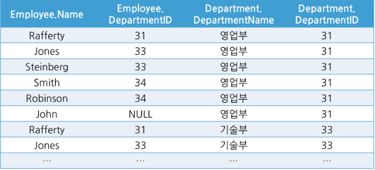

<br>

## Self Join

<p align="center"> </p>

자체 조인은 자기 자신과 조인하므로 1개의 테이블을 사용한다. 자체 조인 역시 내부 조인의 특수한 형태로 자주 쓰이는 형태는 아니다.

쓰이는 예를 찾아보자면 아래와 같이 회사의 조직도가 있을 때, 경리부장이라는 데이터를 통해 경리부장의 직속 상관의 사내 연락처를 알아내고자 할 때처럼 특수한 경우에만 사용된다.

<p align="center">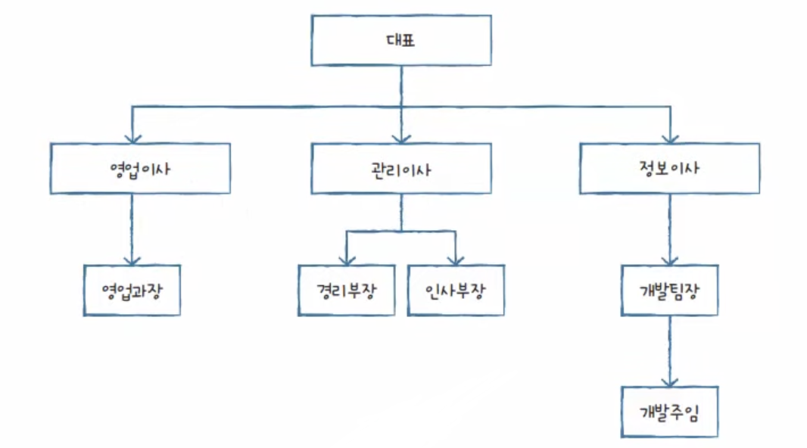</p>

<p align="center">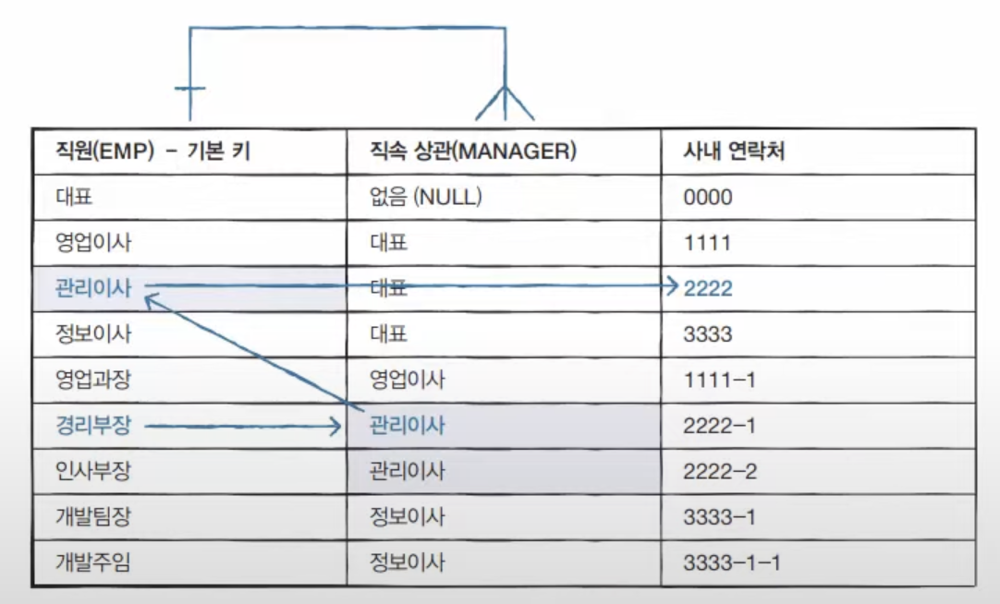</p>

사용 문법은 아래와 같이 같은 테이블이지만 별칭을 다르게 하여 사용할 수 있다.

```
SELECT <열 목록>
FROM <테이블> 별칭A
    INNER JOIN <테이블> 별칭B
[WHERE 검색 조건]
```

### 출처
https://velog.io/@kyeun95/%EB%8D%B0%EC%9D%B4%ED%84%B0%EB%B2%A0%EC%9D%B4%EC%8A%A4JOIN%EC%9D%B4%EB%9E%80
<br>
https://doooyeon.github.io/2018/11/11/database-join.html