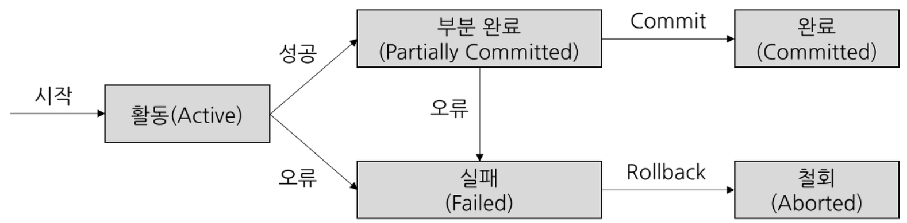

# Transaction
### Transaction이란?
- 작업을 수행하기 위한 단위
    > 하나 이상의 연산들이 포함되어 작업을 수행
- 작업 완벽성을 추구하는 연산
    > 작업이 완벽하게 처리되지 않을 경우, 원 상태로 복구(RollBack)
- Transaction 관련 용어
    > **Commit, RollBack**  
    Commit : 수행한 내용을 DB에 영구적으로 저장하는 작업  
    RollBack : 수행된 작업을 모두 취소하고, Transaction 이전 상태로 되돌리는 작업  
    -> Commit, RollBack 작업 이후 Transaction 종료

    

### Transaction 특징(ACID)
- **Atomicity(원자성)**
    > 정의 : 모든 작업을 완전히 수행하거나(100%) or 아무것도 수행하지 않는(not) 속성  
    기능 : 작업 성공 -> Commit / 작업 중에 하나라도 실패 -> RollBack  
    특성 : 데이터 일관성 보장
- **Consistency(일관성)**
    > 정의 : Transaction 후에도 규칙, 조건 등에 대한 것이 일관되게 유지하는 속성  
    기능 : 규칙, 조건 부합 여부 확인 -> 하나라도 미충족 되면 RollBack  
    특성 : 데이터 무결성 유지
- **Isolation(독립성)**
    > 정의 : Transaction의 독립적 실행을 보장하는 속성  
    기능 : Transaction을 서로 간섭없이 독립적으로 실행 -> 동일 DB에 여러 사용자 접근 가능  
    특성 : 작업 동시성 향상, Error 격리 가능
- **Durability(지속성)**
    > 정의 : Transaction 완료 후 그 결과를 영구적으로 저장하는 속성  
    기능 : Logging(로그기록), CheckPoint, Recovery 기능 등 지원 -> Recovery : 마지막 Commit 시점   
    특성 : 데이터 안정성 보장

---
### 📢 질문 예상 List
1. Transaction의 ACID 속성에 대해서 설명하세요.
2. Transaction 실행 중에 오류가 발생했을 때 RollBack이 이루어지는 과정과 시스템 장애 후 DB 복구 Mechanism에 대해서 설명하세요.

---
### 📌 Reference
- https://github.com/devSquad-study/2023-CS-Study/blob/main/Algorithm/algorithm_heap.md
- http://wiki.hash.kr/index.php/%ED%8A%B8%EB%9E%9C%EC%9E%AD%EC%85%98