# 📖 Transaction 

## 목차

- [1. 🧪 Transaction](#-transaction)
- [2. 🧪 동시 실행 (Concurrent Executions)](#-동시-실행-concurrent-executions)
- [3. 🧪 Concurrency control schemes](#-concurrency-control-schemes)
  - [3.1 🍁 1. Serializability](#-1-serializability)
  - [3.2 ⛓ Schedule](#-schedule)
  - [3.3 ⛓ Serial schedule](#-serial-schedule)
  - [3.4 ⛓ non-serial schedule](#-non-serial-schedule)
  - [3.5 🍁 Confilct](#-confilct)
  - [3.6 🍁 Conflict equivalent](#-conflict-equivalent)
  - [3.7 📚 conflict serializable](#-conflict-serializable)
  - [3.8 🍁 2. Recoverable](#-2-recoverable)
  - [3.9 ⛓ unrecoverable schedule](#-unrecoverable-schedule)
  - [3.10 ⛓ recoverable schedule (cascading rollback)](#-recoverable-schedule-cascading-rollback)
  - [3.11 ⛓ cascadeless schedule (avoid cascading rollback)](#-cascadeless-schedule-avoid-cascading-rollback)
  - [3.12 ⛓ strict schedule](#-strict-schedule)
- [4. 🧪 Concurrency control의 목적](#-concurrency-control의-목적)
- [5. 참조](#-참조)

## 🧪 Transaction 

🔹 데이터베이스의 상태를 변화시키기 위해서 수행하는 작업의 단위를 뜻한다. 여기서 상태를 변화시키기 위한 연산이란? -> SQL문에 흔히 쓰는 CRUD(SELECT, INSERT, DELETE, UPDATE) 기능을 하는 질의어(Query) 문장들을 일컫는다. 

그렇다면 `Concurrency control`은 뭘까? 저번 시간에 트랜잭션의 ACID 특징에 대한 내용에서 Isolation 성질이 있었다. 다시 말해보자면 `여러 트랜잭션이 동시에 수행되더라도 각각의 트랜잭션은 다른 트랜잭션의 수행에 영향을 받지 않고 독립적으로 수행되어야 한다.` 라는 내용이 Isolation이고, 이러한 성질을 보장할 수 있는 가장 쉬운 방법은 모든 트랜잭션을 순차적으로 수행하는 것(sequential)이다. 하지만 병렬적 수행의 장점을 얻기 위해서 DBMS는 병렬적으로 수행하면서도 일렬(serial) 수행과 같은 결과를 보장할 수 있는 방식을 제공하고 있다.

이때, 여러 transaction 동시에 발생할 경우 DB의 consistency를 파괴할 수 있기에, 이를 방지하고 Isolation을 얻기 위해 스케쥴을 짜는 것이 `Concurrency control schemes` 이다.

 

## 🧪 동시 실행 (Concurrent Executions)

🔹 앞의 내용에서 여러 Transaction이 순차적으로 가지 않고 병렬적으로 처리 될 시에, 성능적으로 많은 이점이 존재한다 라는 내용이 있었는데 이 부분에 대한 설명이다. 

**여러 transaction이 동시에 system에서 동작할 시 장점**

- 병렬 처리를 통해 시스템의 CPU, 디스크, 메모리 등의 자원이 효율적으로 활용된다. 즉, 여러 트랜잭션이 동시에 처리되므로 시스템의 자원이 더 많은 작업을 처리할 수 있게 된다.
- Transaction에 대한 응답 대기 시간이 줄어든다 : Short Transaction이 Long Transaction을 기다릴 필요가 없다.
  - 짧은 실행 시간을 가진 트랜잭션이 긴 실행 시간을 가진 트랜잭션을 기다릴 필요가 없기 때문에 트랜잭션의 응답 시간을 단축시킨다.
- 시스템 병목 현상 감소 
  - ex) 트랜잭션을 순차적으로 처리하는 경우 하나의 Disk I/O에서 순차적으로 작업이 발생하지만, 병렬적으로 처리하는 경우 각 트랜잭션이 서로 다른 Disk I/O 요청을 생성하기 때문에 Disk I/O 의 병목현상이 줄어든다.   

`요약 : 트랜잭션 처리량이 증가, 트랜잭션 응답 대기 시간 감소 및 시스템 병목 현상 감소`

 

## 🧪 Concurrency control schemes

### 🍁 1. Serializability

---

🔹 Serializability는 트랜잭션들의 병행 실행 결과가 일련의 직렬 실행(serial execution) 결과와 동등하도록 보장하는 것을 의미한다.

 

### ⛓ Schedule

---

- 여러 트랜잭션들이 동시에 실행될 때, 각 트랜잭션이 속한 operation들의 실행 순서
- 각 트랜잭션 내 operation들의 순서는 바뀌지 않는다.

    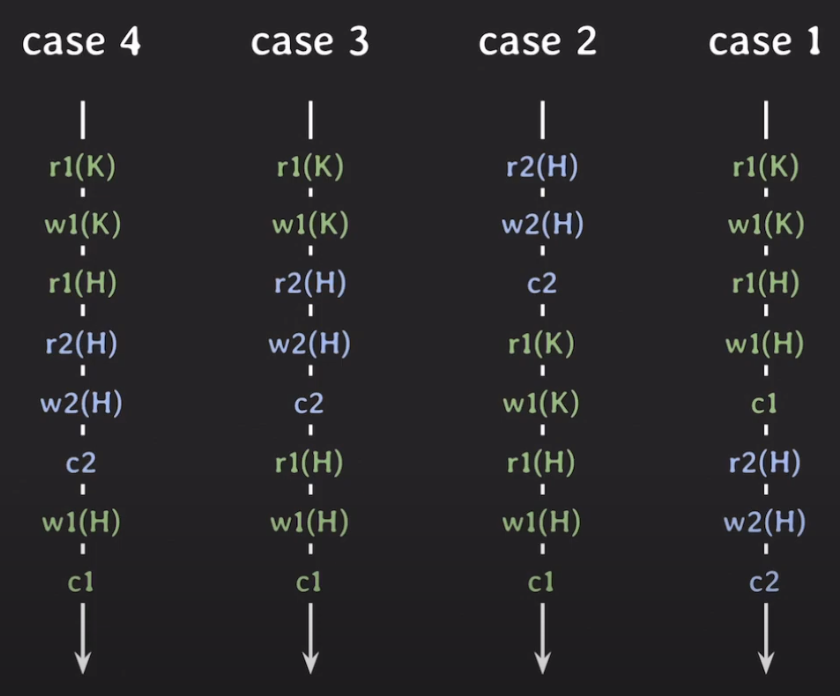

 

### ⛓ Serial schedule

---

🔹 각 트랜잭션을 순차적으로 실행하는 스케줄. 

**[ 장점 ]** 

- 하나씩 차례대로 수행되므로 이상한 결과가 나오지 않는다.
 
**[ 단점: 성능 ]**  

- 한 번에 하나의 트랜잭션만 실행되어 성능이 좋지 않고, 현실적으로 사용할 수 없다.

    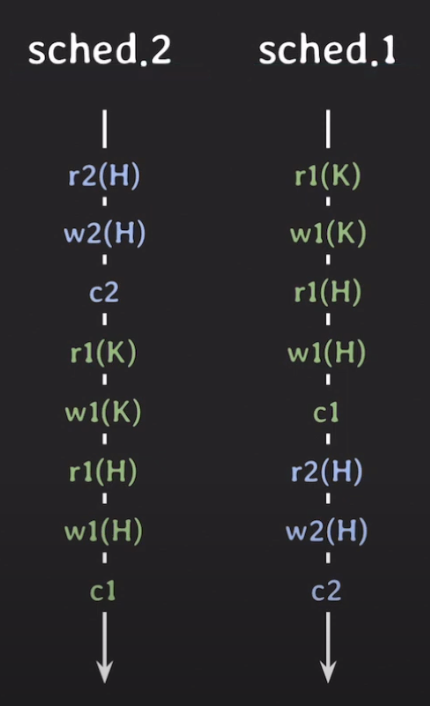

 

---

### ⛓ non-serial schedule

---

🔹 트랜잭션들이 겹쳐서 실행되는 스케줄

**[ 장점 ]** 

- 동시성이 높아져서 같은 시간 동안 더 많은 트랜잭션들을 처리할 수 있다.
- 오래 걸리는 작업이 있더라도 동시에 다음 작업을 수행할 수 있다.
 
**[ 단점 ]**  

- 트랜잭션들이 어떻게 순서가 얽혀 있느냐에 따라서 이상한 결과가 나올 수도 있다.

    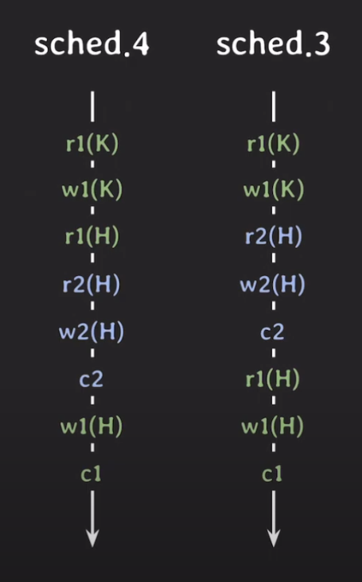

serial schedule은 정확한 결과를 만드는 스케줄 이고 격리성이 가장 높지만 성능 때문에 nonserial schedule을 실행하면서도, 이상한 결과가 나오는 것을 막기 위해서는 어떻게 할까? 그러기 위해서는 순서에 따라서 결과가 달라지게 하는 것이 무엇인지 알아야 하는데 그것이, conflict다.

 

### 🍁 Confilct

---

🔹 서로 다른 트랜잭션 소속이 같은 데이터에 접근하면서 최소한 하나는 write operation인 경우 => Confilct라고 한다.

    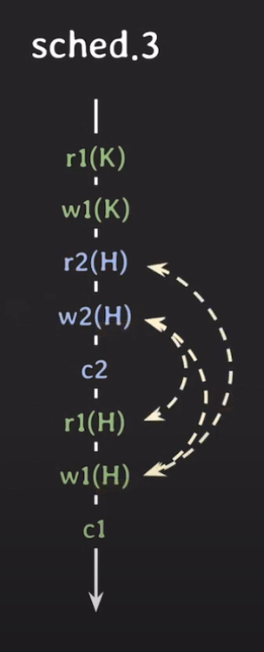

위에서 conflicting operation은 총 3쌍이다.

conflict operation은 순서가 바뀌면 결과가 바뀐다.

 

### 🍁 Conflict equivalent

---

🔹 두 스케줄이 같은 트랜잭션을 가지면서 모든 confliting operation의 순서가 동일하면 => 두 스케줄은 conflict equivalent하다.

    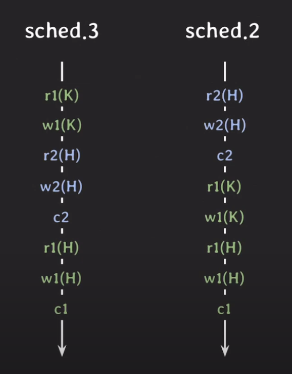

위 스케줄에는 3가지 conflict가 있다.

스케줄 3, 스케줄 2에서 conflict 순서가 모두 같다.

r2(H) ⇒ w1(H)  
w2(H) ⇒ r1(H)  
w2(H) ⇒ w1(H)
 
그중 스케줄 2는 serial schedule이므로 이상한 결과가 나오지는 않는다.

그런데 결과를 이상하게 할 수 있는 conflict 3가지에 대해서 스케줄 3도 모두 serial schedule인 스케줄 2와 순서가 동일하다.

스케줄 2와 스케줄 3의 결과는 같다.

즉, serial schedule과 충돌의 순서가 동일하다면 conflict equivalent라고 한다.

 

### 📚 conflict serializable

---

🔹 serial schedule과 conflict equivalent한 nonserial schedule은 conflict serializable하다..!  

성능 때문에 nonserial schedule을 실행하면서도, 이상한 결과가 나오지 않기 위해서는 ⇒ RDBMS가 이상 현상 없이 데이터의 무결성을 위해 conflict serializable한 non-serial schedule를 허용할 것이다.

 

### 🍁 2. Recoverable

---

**Recoverability란?**

🔹 트랜잭션이 실패했을 때 회복가능성을 의미한다. 트랜잭션은 atomicity가 보장되어야하므로, 트랜잭션이 실패하면, 트랜잭션 이전 상태로 복원될 수 있는 Recoverability를 가지고 있어야한다.

스케줄은 recoverablility에 따라 아래 3가지로 분류할 수 있다.

    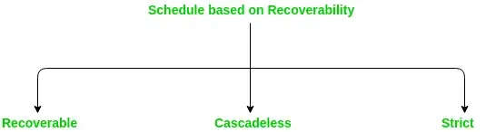
    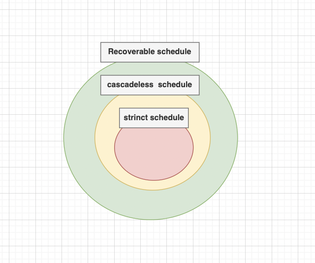

 

### ⛓ unrecoverable schedule

---

- Tx1이 write했던 데이터를 Tx2에서 읽고 Tx2가 commit되었는데, 이후에 Tx1이 rollback되는 경우
- 스케줄 내에서 commit된 트랜잭션이 rollback된 트랜잭션에서 write했던 데이터를 읽은 경우

    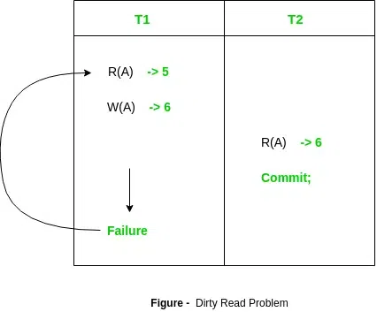

위 그림에서 T2는 커밋되지 않은 T1의 write 데이터를 읽어버린다. 그 뒤 먼저 커밋해 버린다. 이후에 T1이 롤백된다. 이렇게 되면, T1의 작업은 더이상 유효하지 않으므로, T1이 write한 R(A) ⇒ 6을 읽은 T2도 롤백되어야 한다.

하지만, T2는 이미 커밋된 상황이므로, ACID 중 Durability 속성에 따라서 롤백할 수가 없다. unrecoverable schedule에서는 롤백을 하더라도 이전 상태로 회복 불가능할 수 있어서, 이런 스케줄은 DBMS 차원에서 금지해야 한다.

 

### ⛓ recoverable schedule (cascading rollback)

---

- 확정되지 않은 데이터(=commit/rollback이 결정되지 않은 데이터)를 읽었다면, 그 데이터가 확정나기 전까지는 현재 트랜잭션을 커밋하지 않는 경우
- 스케줄 내에서 그 어떤 트랜잭션도 자신이 읽은 데이터를 write한 트랜잭션이 먼저 commit/rollback하기 전까지는 commit하지 않는 경우

    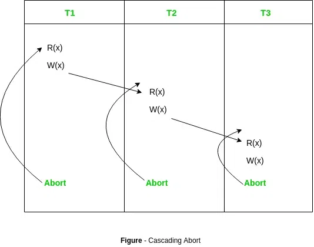

이렇게 하면 내가 읽은 데이터가 미확정 상태에서 rollback되더라도, 현재 트랜잭션까지 rollback 시킨다면 이전 상태로 돌아갈 수 있어서, recoverable schedule이 된다.

위의 그림에서처럼, 하나의 트랜잭션(T1)이 롤백한다면, 의존성 있는 다른 트랜잭션들(T2, T3)도 함께 롤백해야 한다. 여러 트랜잭션의 롤백이 연쇄적으로 일어나면 처리 비용이 많이 드는데, 이런 경우를 cascading rollback이라고 한다.

처리 비용이 많이 든다는 단점을 보완하기 위해서 cascadeless schedule이 등장했다.

 

### ⛓ cascadeless schedule (avoid cascading rollback)

---

🔹 확정된 데이터(=commit/rollback)만을 읽는다. 즉, commit되지 않은 트랜잭션들이 write한 데이터는 읽지 않고 데이터를 write한 트랜잭션이 commit/rollback을 한 뒤에 데이터를 읽는 스케줄만을 허용한다.

    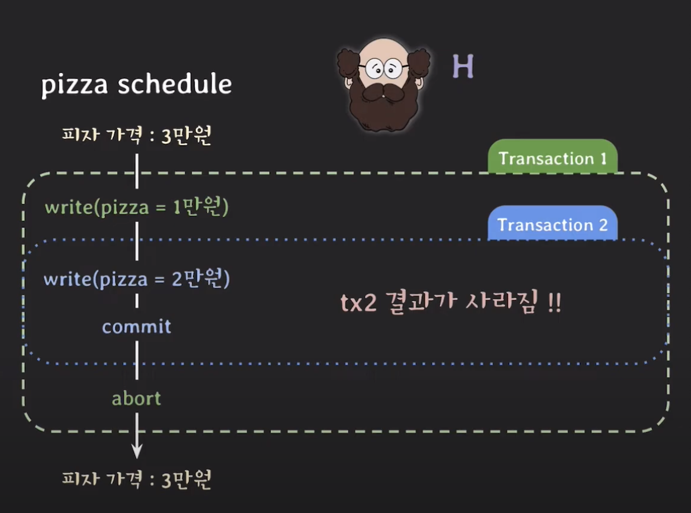

이 경우에도 문제가 생긴다. 분명 commit 되지 않은 트랜잭션이 write한 부분을 읽지 않는다 라고 했지만 쓰지 않는다 라고는 하지 않았기 때문에 T2(x)를 쓰고 commit까지 하게 되었고 이때, T1을 롤백 시킨다면 T2(x)가 사라지게 된다.

이러한 이유로 strict scedule이 생긴다.

 

### ⛓ strict schedule

---

- 확정된 데이터(=commit/rollback)만을 읽고 쓰는 경우
- 스케줄 내에서 어떤 트랜잭션도 commit되지 않은 트랜잭션들이 write한 데이터는 쓰지도 읽지도 않는 경우

    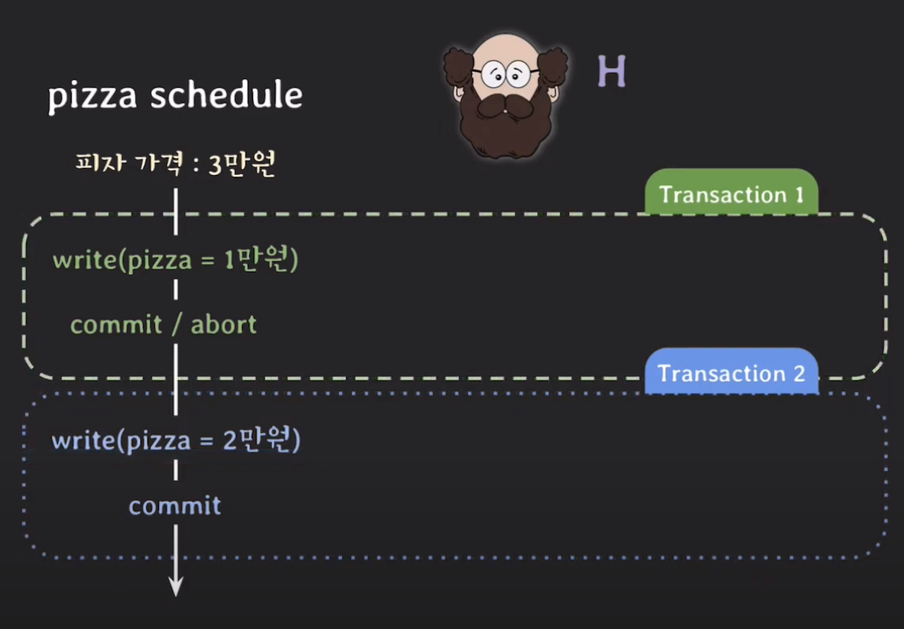

 

## 🧪 Concurrency control의 목적

🔹 concurrent한 execution의 Consistency와 Isolation을 보장하는 protocol을 만드는 것. 스케쥴은 conflict serializable 를 만족하며 recoverable해야 한다.

---

 

## 📸 참조

https://codenme.tistory.com/26#Concurrent%20Executions-1  
https://engineerinsight.tistory.com/350#%F0%9F%92%8B%C2%A0serial%20schedule%20VS%20nonserial%20schedule-1