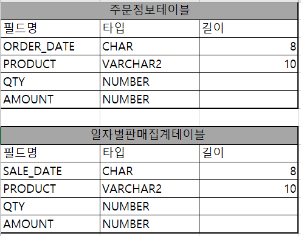
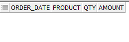
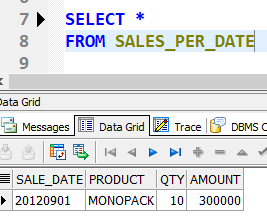
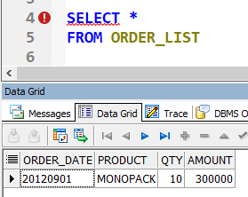
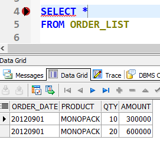
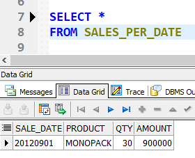
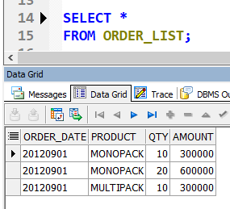
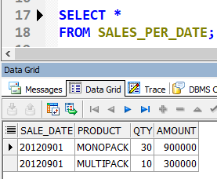

# 💡 **1. 개요**
## 🔑 **1.1 정의**
영어로 방아쇠라는 뜻, 방아쇠를 당기면 총기 내부에서 알아서 일련의 작업을 실행하고 총알이 날아간다.
이처럼 DB에서도 INSERT, DELETE, UPDATE 등 DML이 수행되었을 때, DB 내부에서 자동으로 동작하도록 작성된 프로그램.

**즉, 사용자가 직접 호출하는 것이 아니고, 데이터베이스에서 자동적으로 호출하는 것**

# 💡 **2. 예시**

## 🔑 **2.1 문제 상황 정의**
어떤 쇼핑몰에 하루에 수만 건의 주문이 들어온다. 주문 데이터는 주문 일자, 주문 상품, 수량, 가격 등이 있으며 수천 명의 임직원이 일자별, 상품별 총 판매 수량과 총 판매 가격으로 구성된 주문 실적을 실시간으로 온라인 상에 조회를 했을 때, 한 사람의 임직원이 조회할 때마다 수만 건의 데이터를 읽고 계산해야 한다. 만약 임직원이 수만 명이고, 데이터가 수백만 건이라면, 또 거의 동시다발적으로 실시간 조회가 요청된다면 시스템 퍼포먼스가 저하될 수 밖에

> 트리거를 사용해 주문한 건이 입력될 때마다, 일자별/상품별로 판매 수량과 판매 금액을 집계하여 집계 자료를 보관하도록 만들어보자.

## 🔑 **2.2 테이블 생성 계획**


- 주문정보테이블에 실시간으로 데이터가 입력될 때마다 트리거가 발동되어 자동으로 일자별판매집계테이블에 일자별, 상품별 판매수량과 판매금액을 계산해 업데이트
- 사용자들은 미리 계산된 일자별판매집계테이블을 조회하게 하여 실시간 조회할 수 있도록 지원


## 🔑 **2.3 DDL을 통한 테이블 생성**

```SQL
CREATE TABLE ORDER_LIST(

    ORDER_DATE  CHAR(8) NOT NULL,

    PRODUCT     VARCHAR2(10) NOT NULL,

    QTY         NUMBER NOT NULL,

    AMOUNT      NUMBER NOT NULL
);

```

```SQL
CREATE TABLE SALES_PER_DATE(

    SALE_DATE   CHAR(8) NOT NULL,

    PRODUCT     VARCHAR2(10) NOT NULL,

    QTY         NUMBER NOT NULL,

    AMOUNT      NUMBER NOT NULL
);
```

```SQL
SELECT *
FROM ORDER_LIST
```


```SQL
SELECT *
FROM SALES_PER_DATE
```

|  |  |
| ------------------------------------------ | ------------------------------------------ |
- 아직 2개 테이블 모두 데이터 없음

## 🔑 **2.4 트리거 생성**
절차형 SQL, PL/SQL 개념 사용

```SQL
create or replace trigger summary_sales
    after insert
    on order_list
    for each row
    declare
        o_date order_list.order_date%type;
        o_prod order_list.product&type;
    begin
        o_date := :new.order_date;
        o_prod := :new.product;
        update sales_per_date
            set qty = qty + :new.qty, 
                amount = amount + :new.amount
            where sale_date = o_date and product = o_prod;
        if sql%notfound then
            insert into sales_per_date
            values(o_date, o_prod, :new.qty, :new.amount);
        end if;
    end;
    /

```
- trigger 선언: order_list 테이블에 insert가 발생하면 그 이후 각 행(each row)에 해당 trigger를 적용한다. 
- declare 선언문 - 변수를 선언. order_list 테이블에 있는 order_date, product Type에 맞게 o_date, o_prod 변수를 선언
- new 는 트리거에서 사용하는 구조체. new는 새로 입력된 레코드 값을 담고 있다. o_date에 새로 들어온 order_date 값을, o_prod에는 새로 들어온 product값을 저장하겠다.
- sales_per_date 테이블에 update 구문을 실행. 기존에 있는 qty, amount를 누적합해서 다시 set. 이 때, where문을 통해 현재 새로 들어온 날짜와 상품이 일치하는 데이터만 해당 update문을 실행
- 해당 조건에 모두 충족되지 않는다면, if sql%notfound 구문이 실행된다. 기존에 있던 레코드 값이 아니고 완전히 새로운 레코드이기 때문에 insert구문을 통해 새로 들어온 데이터를 새로 삽입
- / : trigger 를 실행하는 명령어

이제 order_list 테이블에 레코드를 insert 해서 sales_per_date 테이블에 트리거(Trigger)가 자동으로 동작하여, 데이터 값을 자동으로 계산하고 반영

## 🔑 **2.5 트리거 활용**

- ORDER_LIST 테이블에 값 삽입

```SQL
INSERT INTO ORDER_LIST VALUES('20120901','MONOPACK',10,300000)
```
- 삽입 후 ORDER_LIST, SALES_PER_DATE 테이블 조회

|  |  |
| ------------------------------------------ | ------------------------------------------ |


```SQL
INSERT INTO ORDER_LIST VALUES('20120901','MONOPACK',20,600000);
```
|  |  |
| ------------------------------------------ | ------------------------------------------ |

- ORDER_LIST 를 조회하면 지금까지 삽입한 값들이 리스트로 있는 것을 확인
- SALES_PER_DATE 테이블은 트리거에 의해서 주문날짜별 상품별 물량과 가격이 합산되어 업데이트 되어있음

기타 예시
```SQL
CREATE TRIGGER example_trigger
AFTER INSERT ON table_name
FOR EACH ROW
BEGIN
  -- 트리거가 실행될 로직
  INSERT INTO another_table (column1, column2)
  VALUES (NEW.column1, NEW.column2);
END;

>>table_name에 새로운 데이터가 삽입(AFTER INSERT)될 때마다, 삽입된 데이터를 다른 테이블 another_table에도 추가하도록 하는 트리거
```
# 💡 **3. Trigger와 Transaction의 상관관계**

## 3.1 개념

**트리거는 데이터베이스에 의해 자동 호출되지만 결국 INSERT, UPDATE, DELETE 구문과 하나의 트랜잭션 안에서 일어나는 일련의 작업들이라 할 수 있음.**

(추가로 트리거는 Begin ~ End 절에서 COMMIT , ROLLBACK 을 사용할 수 X)

## 3.2 구현

### 다른 상품으로 주문 데이터를 입력한 후, 두 테이블의 결과를 조회해보고 트랜잭션을 ROLLBACK해보자.
판매 데이터의 입력 취소가 일어나면, ORDER_LIST 와 SALES_PER_DATE에 동시에 입력 취소가 일어나는지 확인해보자.

```SQL
 INSERT INTO ORDER_LIST VALUES('20120901','MULTIPACK',10,300000);
 ```

|  |  |
| ------------------------------------------ | ------------------------------------------ |

```SQL
ROLLBACK;
```
|  |  |
| ------------------------------------------ | ------------------------------------------ |

트리거로 입력된 데이터 정보까지 하나의 트랜잭션으로 인식해 입력 취소가 됨


# 💡 **4. 면접 기출**

## 🔑 4.1 트리거의 주요 용도

데이터 무결성 보장: 데이터베이스에 부적절한 데이터가 입력되는 것을 방지합니다.
자동화된 작업 수행: 데이터에 변경이 일어났을 때 관련된 작업을 자동으로 수행합니다.
복잡한 비즈니스 로직 구현: 단순한 데이터 입력이나 수정 뿐 아니라 복잡한 조건에 따르는 작업들을 자동으로 처리합니다.

## 🔑 4.2 트리거의 종류

- **DML 트리거(Data Manipulation Language Trigger)**: INSERT, UPDATE, DELETE 같은 데이터 조작 언어에 의해 실행됩니다.
- **DDL 트리거(Data Definition Language Trigger)**: CREATE, ALTER, DROP 같은 데이터 정의 언어에 의해 실행됩니다.
- **데이터베이스 트리거(Database Trigger)**: 데이터베이스와 관련된 이벤트(EX: LOGON, LOGOFF)에 의해 실행됩니다.


## 🔑 4.3 장점/단점
### 4.3.1 장점
- 데이터의 무결성과 일관성을 유지에 도움을 줍니다.
- 별도의 어플리케이션 로직을 구현하지 않고도 복잡한 연산이나 유효성 검사를 처리할 수 있습니다.
- 중복 코드가 줄어들어 데이터베이스 관리가 용이해집니다.
### 4.3.2 단점
- 트리거가 많아질수록 데이터베이스의 복잡성과 유지 관리의 어려움이 증가.
- 트리거로 인한 자동화 처리가 예기치 않은 결과를 초래할 수 있다.


[출처]

https://limkydev.tistory.com/154

https://gr-st-dev.tistory.com/2817

https://dev-coco.tistory.com/158 