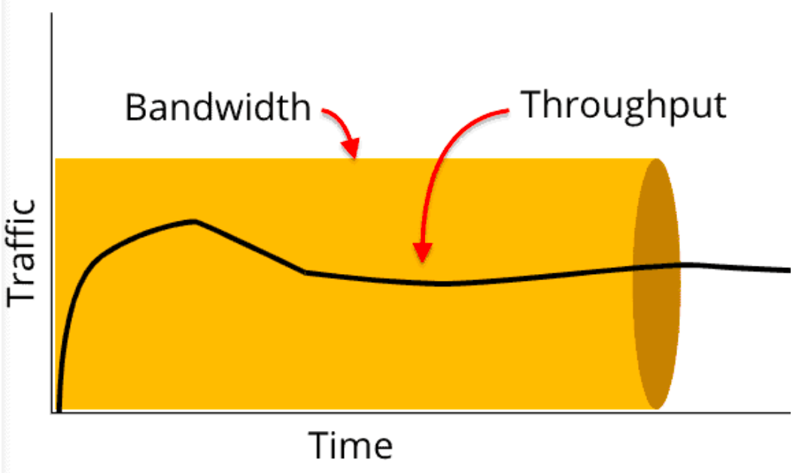

# 📖 대역폭

## 목차

- [1. 🖋 대역폭](#-대역폭)
  - [1.1 ⚙️ BPS와 bps](#-bps와-bps)
  - [1.2 🚧 트래픽과 처리량의 이해](#-트래픽과-처리량의-이해)
- [2. 참조](#-참조)

## 🖋 대역폭

> 일정한 시간 내에 데이터 연결을 통과할 수 있는 정보량의 척도
>
> 주어진 시간 동안 네트워크 연결을 통해 흐를 수 있는 최대 비트의 수를 말한다.

    

 

 

🔹 위의 내용에 따라 대역폭을 정리하자면 단위시간당 전송 용량이라는 용어로 정리가 가능하다. 하지만 이런 용어에 의해 네트워크 속도와 대역폭을 연관하여 생각하곤 하지만, 사실은 속도보다는 용량에 더 밀접한 관계를 갖고있다. 네트워크 속도가 대역폭값에 근접할 경우 대역폭을 늘리면 속도가 빨라질 가능성이 있으나 무조건적인 조건은 아니다. 데이터 처리량과 네트워크 성능, 속도에 영향을 미치지만 실제로 대역폭은 용량Capacity과 더 밀접한 관계를 가지고 있다.

🔹 100Mbps라는 대역폭을 가진 서버가 있고 한 사용자당 100kbps로 동영상 파일을 요청한다고 했을 때, 최대 동접자수 : 100Mbps / 100kbps = 약 1000명

 

### ⚙️ BPS와 bps

---

> Mbps = Megabit per second
> 
> MB/s = Megabyte per second

🔹 **b/s(BPS)**
- b/s는 byte per second로 초당 바이트의 수를 말한다. 보통은 BPS로 표현하고 이것은 전송 속도의 단위로 흔히 사용하고 있다.

🔹 **bps**
- bps는 bits per second로 초당 비트 수를 말한다. 이것은 보통 통신 속도의 단위로 bps를 사용한다.
    - 즉, 1초 간에 송수신할 수 있는 비트 수를 말한다. (해당 회선 / 포트 내에서 보내거나 받을 수 있는 총 비트의 수)   

**인터넷 속도가 안나오는 이유**

보통, 인터넷 공급 업체 광고에서 기가 인터넷이라는 소개를 한다. 때문에, 사용자들은 인터넷 속도가 초당 1GB(1000MB)가 나올 것으로 생각하지만, 실제로는 나오지 않는다.

이러한 이유는 위에서 설명한 bps 때문이다. 광고에서 말하는 기가는 1Gbps를 말한다. 즉, 초당 1GB의 속도가 아닌, 1Gbps = 초당 125MB의 속도로 업로드와 다운로드 하는 것을 말한다. 물론, 이것도 최대 속도이므로, 해당 속도가 나오지 않을 수 있다.

우리가 착각했던 이유는 실제로 컴퓨터의 디스크 용량에서 가장 흔하게 사용하고 있는 단위가 바이트이고 통신 단위가 아니고서는 비트를 실제로 거의 사용하지 않기 때문이다. 1Mbps 라면 사진 한장 보내는데 10MB 짜리 사진이라면 최소 80초가 걸린다는 말이기 때문에 생각했던 속도 만큼이 나오지 않는 것이다.

 

### 🚧 트래픽과 처리량의 이해

---

🔹 트래픽 : 네트워크를 통해 전송되는 데이터의 양을 나타낸다.  
🔹 처리량 : 시스템이나 네트워크가 단위 시간당 처리할 수 있는 작업의 양을 나타낸다.

- 트래픽이 많아졌다 = 흐르는 데이터가 많아졌다.
- 처리량이 많아졌다 = 처리되는 트래픽이 많아졌다.
    - 단위시간당 실제로 처리되는 데이터의 양을 나타내고 대역폭 용량을 초과할 수 없다.  

이미지나 동영상을 요청했을 때 서버에는 다음과 같은 트래픽이 발생한다.

1. 100KB 이미지를 1,000명이 다운로드 시 누적 트래픽 : 100KB x 1,000 = 100,000KB(100MB)
2. 10MB 동영상을 10명이 다운로드 시 누적 트래픽 : 10MB x 10 = 100MB

만약 트래픽이 100만큼 들어와도 처리량이 50이라면, 시스템은 50의 트래픽만을 처리할 수 있고 나머지 50의 트래픽은 처리되지 않고 버려지거나 대기 상태에 있게 된다.

 

## 📸 참조

https://blog.naver.com/koj1986/222654948219  
https://jhlee-developer.tistory.com/entry/CS-%EB%84%A4%ED%8A%B8%EC%9B%8C%ED%81%AC%EC%9D%98-%EA%B8%B0%EC%B4%88-1-%EB%84%A4%ED%8A%B8%EC%9B%8C%ED%81%AC-%EC%B2%98%EB%A6%AC%EB%9F%89-%ED%8A%B8%EB%9E%98%ED%94%BD-%EB%8C%80%EC%97%AD%ED%8F%AD-RTT

