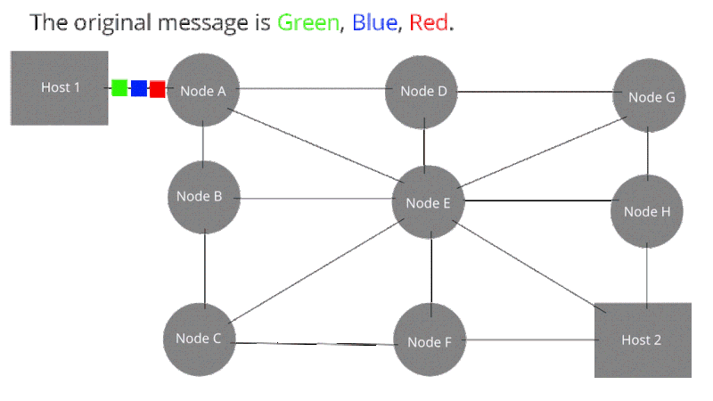
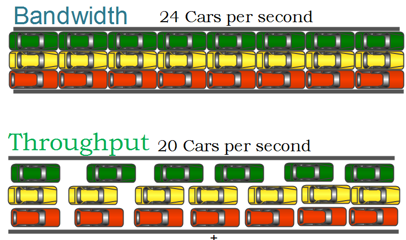
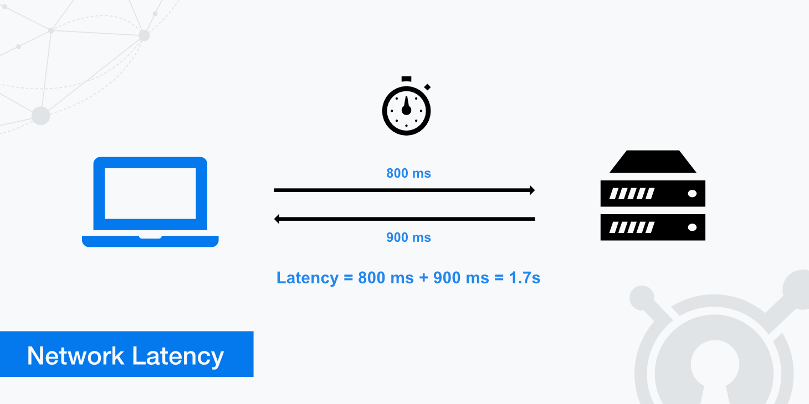
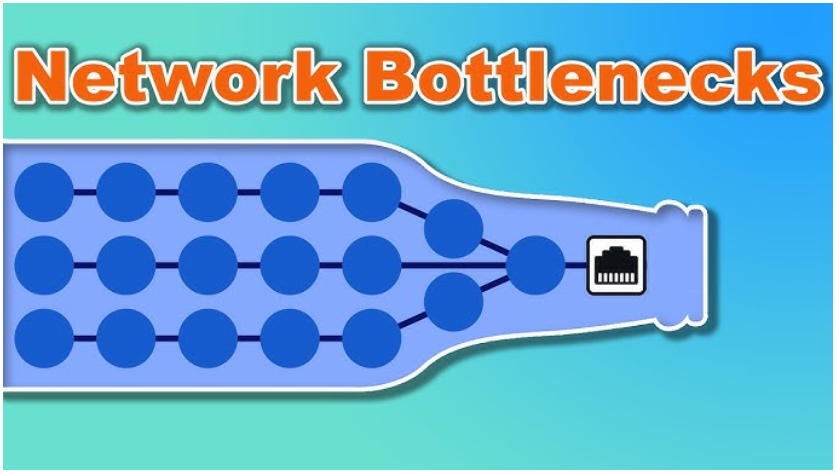

# Network
### Network란?
- 정보를 전송하고, 공유하기 위해 2개 이상의 컴퓨팅 장치를 연결하는 시스템
    > Node들이 Link를 통해 연결되어 있어 서로 데이터를 주고받을 수 있는 상태

    

- **용어 정리**
    - Node
        > 서버, 라우트, 스위치 등 Data가 거쳐가는 네트워크 장치  
        -> Data를 전달 받아, Link를 통해 다음 Node로 Data 전송
    
    - Link
        > 유선 또는 무선과 같이 Node와 Node를 연결하는 통로  

- **Network의 유형**
    - LAN(Local Area Networks) : 작은 영역 내
    - MAN(Metropolitan Area Network) : 도심간
    - WAN(Wide Area Network) : 세계간

        > 전송속도 : LAN > MAN > WAN  
        혼잡도 : LAN < MAN < WAN

---
### Network 처리량
- Throughput(처리량) : Link를 통해 전달되는 단위 시간당 Data 양
- 단위 : BPS(Bits Per Second)
- 관련 : Traffic(트래픽), Bandwidth(대역폭) 등
- 용어 정리
    > Tarffic : 특정 시점에 Link 내에 흐르는 Data 양  
    Bandwidth : 단위 시간 내 전달할 수 있는 Data 양

    
---

### Latency(지연시간)
> Network에서 하나의 데이터 패킷이 한 지점에서 다른 지점으로 보내지는 데 소요되는 시간

---

### Network Topology
- Network 내 Node와 Link의 연결 형태
- Topology? 체계적인 분류, 위상 배치
- Network Topology 종류

    - **Tree Topology**
        > **Tree 형태로 Network를 배치한 형태**  
        -> 장점 : Node 추가, 삭제가 쉬움  
        -> 단점 : Traffic이 집중될 때 하위 Node에도 영향을 끼침

        

    - **Bus Topology**
        > **중앙 통신 회선 하나에 연결되어 있는 형태**  
        -> 장점 : Node 추가, 삭제가 쉬움, 설치 비용 저렴  
        -> 단점 : Spoofing 위험 존재

        > Spoofing? 공격자의 악의적인 시도에 의한 잘못된 정보, 혹은 연결을 신뢰하게끔 만드는 일련의 기법들

        

    - **Star Topology**
        > **중앙 Node에 연결되어 있는 형태**  
        -> 장점 : Node 추가, 삭제가 쉬움, 패킷 충돌 발생 가능성 적음  
        -> 단점 : 중앙 Node에 의존적 -> 중앙 Node 장애 시 전체 Node 사용 불가

        

    - **Ring Topology**
        > **Node가 양 옆의 Node와 연결되어 하나의 연속된 Link를 통해 통신하는 형태**  
        -> 장점 : Node 수에 따른 네트워크 손실 적음, 충돌 발생 가능성이 적음, Node 장애 쉽게 발견 가능  
        -> 단점 : Network 구성 변경 어려움, Link 장애 시 전체 네트워크에 영향

        

    - **Mesh Topology**
        > **Network 내 모든 Node가 연결된 형태**  
        -> 장점 : 특정 Node에서 장애가 발생해도 Network 사용 가능(안정성), Traffic 분산 처리 가능  
        -> 단점 : Node 추가, 삭제 어려움, 구축 비용 높음

        

---

### BottleNeck
- BottleNeck(병목현상) : 특정 구성요소로 인해 Traffic이 제한되는 현상
- 해결방법 : Network Topology 점검

    

---
### Protocol
- Protocol(프로토콜) : Network상에서 Data를 교환하기 위한 규칙, 약속, 표준
- Protocol 종류 : TCP/IP, HTTP, FTP, DNS 등

### TCP/IP
- **TCP**
    - Transmission Control Protocol
    - 데이터의 전송 과정에서 신뢰성과 순서 보장
    - Data를 Segment로 분할하고, 이를 목적지에서 재조립하여 올바른 순서대로 데이터를 수신하게 함

- **IP**
    - Internet Protocol
    - 데이터 패킷을 송신자로부터 수신자까지 전달하는 역할
    - IP 주소를 사용하여 Data Packet이 올바른 목적지로 라우팅 함

### PING
- Packet Internet Groper
- Network 상의 장치 간 연결을 테스트하고 측정하기 위한 유틸리티
- ICMP(Internet Control Message Protocol)을 사용하여 메시지를 목적지에 보내고, 수신하며 통신 성공 여부 확인
- 또한 해당 장치까지의 왕복시간(RTT - Round Trip Time)을 측정

---
### 📌 Reference
- https://ensil.tistory.com/5
- https://github.com/devSquad-study/2023-CS-Study