# 💡 **0. 용어 설명**

## 📌 **I/O**

**데이터의 입출력**

[종류]

- network(socket) :네트워크 통신은 socket을 통해 데이터가 입출력 된다.
  
- file
- pipe
- device

## 📌 **backend server 의 통신**

네트워크 상의 여러 클라이언트와 백엔드 서버가 각각의 소켓을 열고 통신한다.
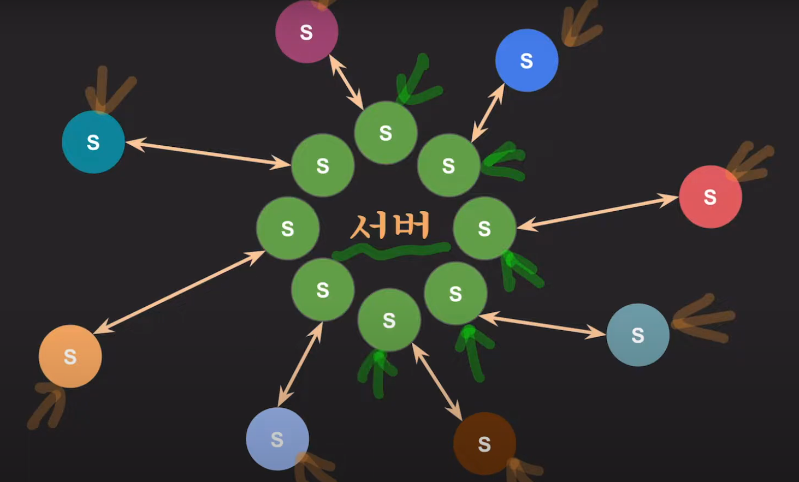

## 📌 **Kernal**

- 프로세스/메모리/저장장치/입출력 시스템 등을 관리하는 운영체제의 핵심적인 기능을 모아놓은 프로그램

- 컴퓨터가 부팅하는 순간, 커널 코드가 메모리에 올라가고, 다른 프로그램과 다르게 항상 메모리에 상주(Memory Resident)한다.

## 📌 **운영 체제**

운영 체제는 크게 둘로 나뉜다. 커널과 인터페이스! 운영체제는 커널과 인터페이스를 분리해서 같은 커널에 다른 인터페이스를 장착한 형태로 제작할 수 있다. ex. 유닉스 계열 커널용 하지만 macOS와 유닉스는 사용자인 우리에게는 엄연히 다르다!

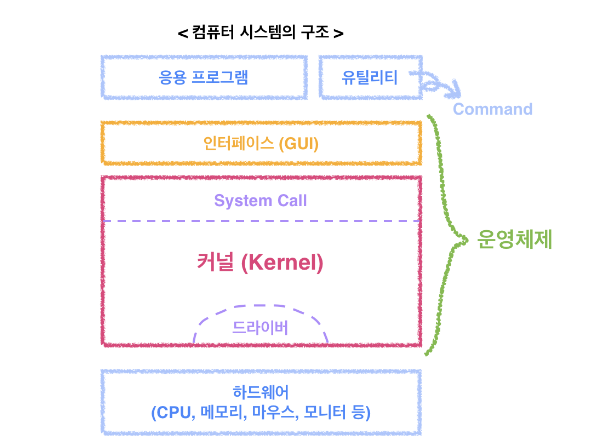

- **인터페이스**: 커널에 사용자의 명령을 전달하고 실행 결과를 사용자에게 알려주는 역할
- **system call** : 커널은 사용자나 응용 프로그램으로부터 컴퓨터 자원을 보호하기 위해 지원에 직접 접근하는 것을 차단. 따라서 사용자나 응용 프로그램이 자원을 이용하기 위해서는 System Call 이라는 인터페이스를 이용해 접근해야 한다. **System call**은 커널이 제공하는 시스템 관련 서비스를 모아 넣은 것으로, 함수 형태로 제공된다.

## 📌 **context switching**

**context** : CPU가 해당 프로세스를 실행하기 위한 해당 프로세스에 대한 정보들.

이 context는 프로세스의 PCB (process control block)에 저장됨.

context switching 때 PCB 의 정보를 읽어(적재) CPU가 전에 하던 프로세스가 하던 일에 이어서 수행이 가능한 것!

**context switching** : 멀티프로세싱을 위해 CPU를 나눠서 사용하기 위해 context를 교체하는 것! 참고로 context switching 때 해당 CPU는 아무런 일을 하지 못한다. 따라서 이게 너무 잦아지면 오히려 오버헤드가 발생해 효율 저하될 수도.

---

> ### **blocking vs non-blocking**
>
> 호출되는 I/O 함수가 바로 리턴하느냐 아니면 제어권을 가져가서 block 하느냐의 차이

# 💡 **1. Blocking**

## 📌 **1.1 Blocking I/O \_ OS 관점**

I/O 작업을 요청한 프로세스/스레드는 요청이 완료될 때까지 블락됨

I/O 작업이 진행되는 동안 유저 프로세스가 자신의 작업을 중단한 채, I/O가 끝날 때까지 대기하는 방식

I/O가 호출되면 (I/O 함수가) 제어권을 가져가서 어플리케이션이 멈추게 됨

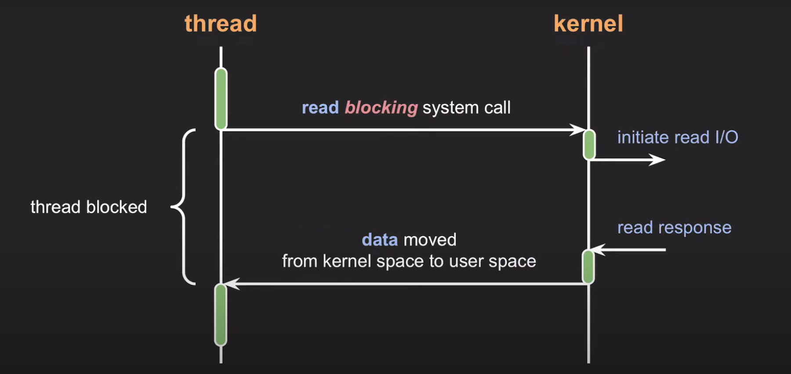

- 어플리케이션(thread)에서 Read()를 호출해 커널에 read I/O를 요청하면, read가 끝날 때까지 application은 block이 되어 다른 작업을 하지 못한다.

- 커널의 I/O 작업이 완료될 때까지 제어권을 커널에서 가지고 있기 때문에, 유저 프로세스는 read I/O가 수행될 때까지는 어플리케이션이 다른 작업을 수행하지 못한다는 것을 의미

## 📌 **1.2 Blocking I/O \_ Network 관점**

일단 각 소켓마다 두 가지 버퍼(send, receive)가 있다는 걸 깔고 시작.

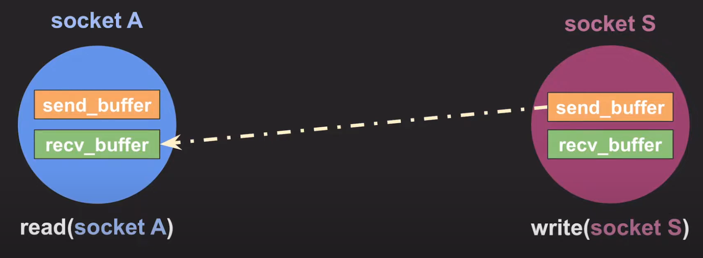

- socekt S에서 socket A로 데이터를 보내려는 상황

- socket A는 일단 기다려야함 (= read systemcall 을 소켓에 요청하면 rec_buffer에 데이터가 들어올 때까지 read systemcall을 호출한 thread는 block 됨)

- socket S의 입장에서 살펴보자. A에게 보내고자하는 데이터를 socket S의 send buffer에 writer 하게 된다. 하지만, 만약 이 send_buffer가 꽉 차 있다면 write가 block 될수도! 그럼 write system call은 send_buffer가 비어서 공간이 생길 때까지 block 되는겨

**결론 : 각각의 버퍼 상태에 따라 block 될 수 있다.**

# 💡 **2. Non-Blocking**

## 📌 **2.1 Non-blocking I/O \_OS 관점**

**프로세스/스레드를 block시키지 않고, 요청에 대한 현재 상태를 즉시 리턴**

A함수가 I/O 작업을 호출했을 때 I/O 작업이 완료될 대까지 A 함수의 작업을 중단하지 않고 I/O 호출에 대해 즉시 리턴하고, A 함수가 이어서 다른 일을 수행할 수 있도록 하는 방식

제어권을 어플리케이션이 가지고, 어플리케이션은 계속 동작함. 필요한 경우 polling과 같은 상태 확인은 가능

이는 커널이 시스템 콜을 받자마자 CPU 제어권을 다시 어플리케이션에게 넘겨주고, 따라서 어플리케이션은 I/O 작업이 완료되기 전에 다른 작업을 수행할 수 있다.

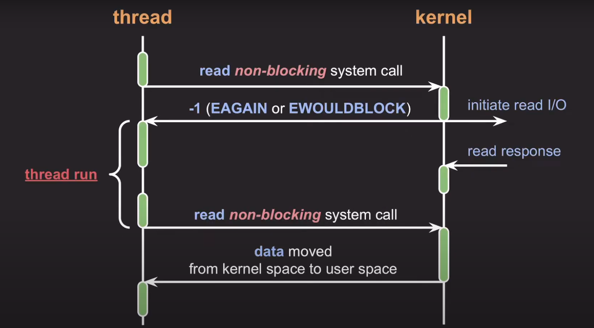

- read I/O를 하기 위해 systemcall을 호출하면, kernel 모드로 context-switching된다. 이 때 kernel 모드에서는 read I/O 작업을 실행시킨다. 이후 커널의 I/O 작업 완료 여부와는 무관하게 즉시 응답한다. 아직 리턴할 데이터가 준비되지 않았기 때문에 리눅스 기준으로는 -1 리턴. ( EAGAIN or EWOULDBLOCK 이라는 에러 코드와 함께!)

- 이때 thread는 block I/O와는 다르게 이어서 바로 다른 코드 실행! 원래 내 하던일이나 마저 해야겠다~

- 그렇게 다른 코드를 실행하던 중 kernel 로부터 read 응답이 준비되었다는 신호가 올거야. 그래도 일단 내 하던 일부터 마저 다 끝낸 후에 read non-blocking system call 다시 호출.

- 그럼 다시 kernal 로 context-switching이 되고, 이때는 데이터가 준비된 상태이기 때문에 커널이 다시 user space 쪽으로 데이터를 전송

## 📌 **2.2 Non-blocking I/O \_Network 관점**

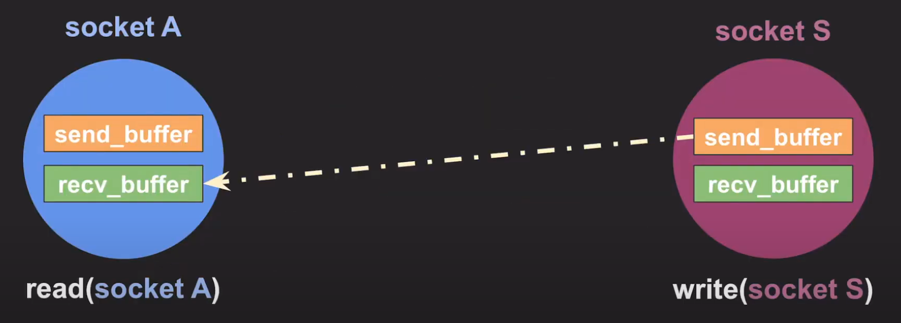

- socket A에서 rec_buffer를 확인. block I/O의 경우 이때 recv_buffer가 비어있다면 read systemcall 을 호출한 thread가 block 이 되지만 지금은 다르다! 그냥 recv_buffer가 비어있다고 알려주고 해당 read system call은 바로 종료가 됨
- 마찬가지로 socket S에서 write를 할 때도 send_buffer에 데이터가 다 차있으면 더이상 write를 할 수 없기 때문에 아까 block 같은 경우는 write system call 을 호출한 스레드가 block 되지만, 지금은 그냥 적절한 에러 코드와 함께 즉시 반환

non-block I/O 에서 생기는 이슈 : I/O 작업 완료를 어떻게 확인할 것인가?

# 💡 **3. non-block I/O 결과 처리 방식**

## 📌 **3.1 완료됐는지 반복적으로 확인**

내가 읽으려는 데이터가 준비됐는지 반복적으로 확인

- 완료된 시간과 완료를 확인한 시간 사이의 갭으로 인해 처리 속도가 저하될 수 있음
- 완료됐는지 반복적으로 확인하는 것은 CPU 낭비가 발생

→ 아니 손이 없어 발이 없어 완료됐으면 됐다고 좀 알려줘!

## 📌 **3.2 I/O multiplexing**

관심 있는 I/O 작업들을 동시에 모니터링하고, 그 중에 완료된 I/O 작업들을 한 번에 알려줌

여러 이벤트들을, 여러 소켓으로부터 해당 이벤트가 발생하면 알려달라는 요청을 한 번에 처리하는 방식

I/O multiplexing system call이 blocking인지, non-blocking인지에 대해서는 의견이 분분하다!

종류: select, poll, epoll(linux), kqueue(mac OS), IOCP(window, solaris 계열)

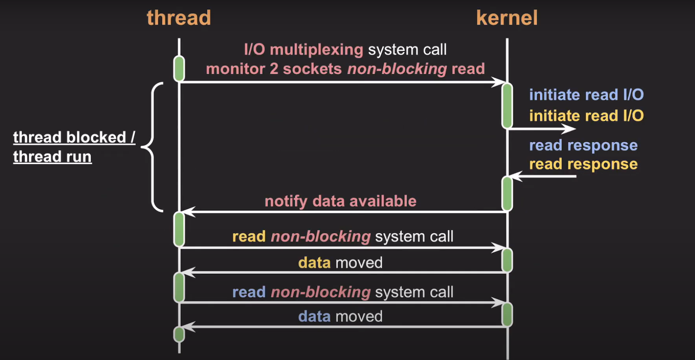

- 2개의 소켓에 대해 데이터를 읽으려고 하니까 준비되면 알려주세요
- 그럼 커널은 해당 요청을 네트워크 디바이스 쪽에 요청 ( 이때 block으로 가정)

ex. 2개의 소켓에 대해 non-blocking 모드로 읽어달라고 요청을 하면 커널에서는 두 개의 소켓에 대해서 read I/O 요청을 네트워크 디바이스에 보내게 되는데, 이때 스레드는 block이 될 수도 있고, 어떻게 호출하느냐에 따라서 또 다른 코드를 실행하게끔 만들 수도 있음. 위 분류에선 blocking으로 표현하지만, non-blocking도 될 수 있다는 뜻.

무튼 read I/O 작업이 완료되면 kernel은 thread에 요청이 완료됐음을 알리고, thread가 이 호출을 통해 깨어나면서 각각 socket에 대해 non-blocking systemcall을 통해 두 번 요청을 보내 데이터를 읽어온다.

## 📌 **3.3 callback / signal 사용**

널리 사용되지는 X

callback or signal 형태로 처리될 때는 여러 종류 (ex. POSIX 라는 데이터 표준의 AIO, LINUX 커널 자체의 AIO 등)에 따라 조금씩 다르다!

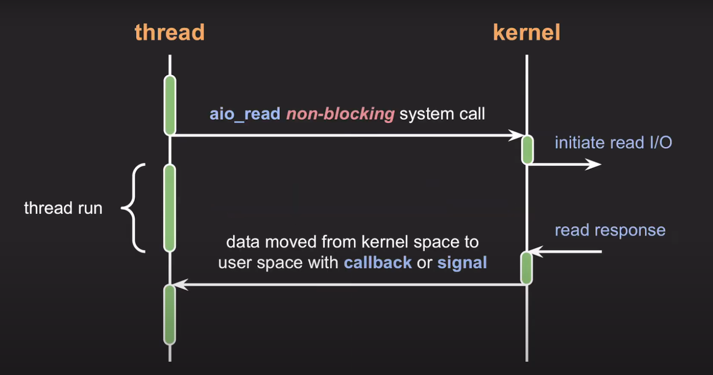

---

# 💡 4. Blocking, non-blocking, sync, async 의 차이

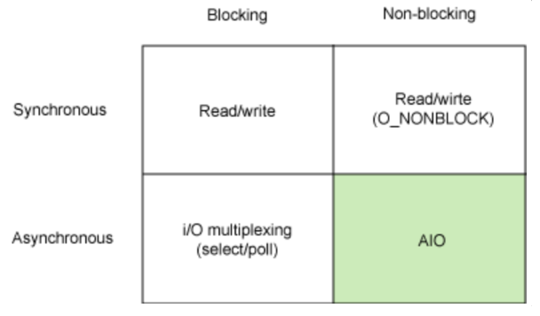
출처 : IBM Article. 하지만 I/O multiplexing이 blocking 방식인지, non-blocking 방식인지에 대한 의견이 분분

sync/ async : 호출되는 함수의 작업 완료 여부에 다라 이어지는 작업을 누가 처리하느냐의 차이

## 📌 4.1 synchronous vs asynchronous

### 🌈 4.1.1 synchronous

동기

모든 요청, 응답이 일련의 순서를 따른다.

I/O 관점에서 설명하자면, 호출된 I/O 함수가 종료된 후 I/O 함수의 결과 처리를 호출한 함수가 하는 경우를 의미

I/O 완료 여부를 커널에 계속 물어봐야한다. (콜백 함수를 안 넘김)

다르게 표현하면 요청한 순서대로 작업을 완료시켜야 하기 때문에 여러 개의 파일을 동시에 처리하기 위해서는 multi-thread로 동작해야함

### 🌈 4.1.2 asynchronous

비동기

요청을 보냈을 때 응답 상태와 상관 없이 다음 동작을 수행. 따라서 작업의 순서가 보장되지 않는다.

I/O 관점에서 보자면, 호출된 I/O 함수가 종료된 후 I/O 함수의 결과 처리를 콜백 함수를 통해 처리해서 작업 완료 여부를 신경스지 않는 경우를 의미 (I/O 완료 시 커널이 유저 프로세스에게 알려준다. (콜백 함수를 넘김)

## 📌 4.2 적용 예시

### 🌈 4.2.1 sync + blocking


I/O가 실행되는 동안 어플리케이션이 다른 일을 하지 못하고 Read()만 수행하고 있다가, I/O가 끝나고 나서야 작업을 처리하는 경우

- blokcing :
- sync: 작업이 완료되면 해당 작업 결과를 가지고 어플리케이션에서 직접 처리

system call 마다 thread를 생성하기 때문에 I/O 요청이 많은 서비스에서는 작업 당 한 번의 context switching 이 발생하기 때문에 점점 성능이 떨어진다. 또한 block 될 동안 kernel 응답만 기다리기 때문에 CPU 를 사용하지 못한다는 점에서 resource 사용 관점에서 비효율적

```javascript
file.read();
file.write();
```

```javascript
const fs = require("fs");
const data = fs.readFileSync("/file.md"); // blocks here until file is read
console.log(data); // will run after filie is read
moreWork(); // will run after console.log
```

### 🌈 4.2.2 async + blocking

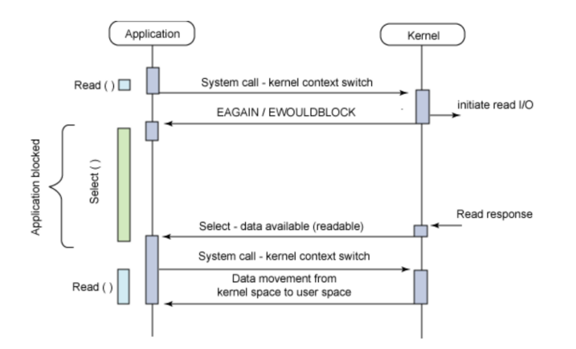

- blocking : I/O 호출 발생 시 커널의 I/O 작업이 완료될 때까지 제어권을 커널에서 가지고 있기 때문에, 유저 프로세스는 I/O가 완료되기 전에 다른 작업 결과를 처리
- async: 작업이 완료되면 해당 작업 결과를 가지고 어플리케이션에서 호출한 함수가 직접 처리하는 게 아니라, 콜백을 넘기면서 콜백 함수 호출을 통해 작업 결과를 처리

I/O 작업을 호출할 때 callback을 같이 넘겨주면서, I/O작업이 종료됐을 때 어플리케이션에 해당 콜백함수가 호출되는 방식이지만, 실질적으로 I/O 로직이 처리될 때까지는 어플리케이션이 block 되는 경우를 의미

즉, I/O 작업 자체에 의해 block 되는 것이 아니라, select / poll 과같은 multiplexing 관련 system call에 대한 kernal 의 응답이 block된다고 할 수 있다. 첫 read() 요청에 대해서는 즉각 미완료 상태를 반환하는 non-blocking의 동작

사실 의도적으로 이 모델을 쓰지는 X, 주로 언제 등장하냐면 non-blocking async 방식을 쓰는데, 그 과정 중 하나가 blocking 방식으로 동작하는 경우 blocking-async로 동작할 수 있다. (ex. node JS에서 async와 non-blocking 로직을 고수하다가, 필요에 의해 blocking 방식인 mysql 드라이버를 호출하는 경우)

### 🌈 4.2.3 sync + non-blocking I/O


- non-blocking: I/O 호출이 발생했을 때 커널의 I/O 작업 완료 여부와는 무관하게 즉시 응답. 커널이 시스템 콜을 받자마자 제어권을 다시 어플리케이션에 넘겨주기 때문에, 유저 프로세스는 I/O가 완료되기 전에 다른 작업을 할 수 있다.
- sync: 하지만 sync이기 때문에, 다른 작업을 수행하다가 중간 중간 시스템 콜을 보내서 I/O 작업이 완료됐는지 커널에게 지속적으로 물어본다. 그리고 I/O 작업이 처리됐을 때의 결과를 호출한 함수에서 처리한다. 직접 결과를 처리해야 하기 때문에 지속적으로 I/O 종료를 물어보는 것도 이때문이다.

```python
device = IO.open()
ready = False
while not ready:
	print("There is no data to read!")

	# 다른 작업을 처리할 수 있음
	# while문 내부의 다른 작업을 다 처리하면 데이터가 도착했는지 확인
	ready = IO.poll(device, IO.INPUT, 5)
data = device.read()
print(data)
```

커널로부터 제어권을 받기 때문에 blocking I/O 보다 효율적인 것처럼 느껴질 수 있지만, 커널로부터 결과를 반환받기까지 계속 상태를 체크하는 busy-wait 상태가 된다. 즉, 작업 order를 맞추기 위해, I/O 작업의 완료를 기다리기 때문에 어떻게 보면 context switching만 빈번하게 일어나는 구조가 될 수 잇다. 또한 loop내 polling 주기도 적절히 설정하지 않으면 커널에게 의미없는 요청이 빈번하게 갈 수 있기 때문에 오히려 I/O 작업의 지연을 초래할 수있다.

### 🌈 4.2.4 async +non-blocking I/O (AIO)

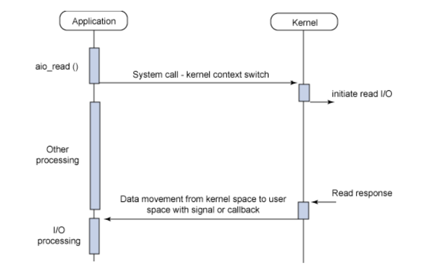

어플리케이션은 system call 이후 I/O 처리에 신경쓰지 않고 있다가 작업이 완료되면 kernel로부터 signal, thread 기반 callback등으로 결과를 마치 event처럼 전달받는다. 따라서 응답이 오기 전까지 user process는 I/O와 독립적인 다른 processing이 가능한 구조다.

- non-blcoking : I/O 호출이 발생했을 때 시스템 콜이 들어오면 커널의 I/O 작업 완료 여부와는 무관하게 즉시 응답한다. 따라서 유저 프로세스는 I/O가 완료되기 전에 다른 작업을 할 수 O
- async : I/O 처리는 백그라운드에서 실행되다가 완료되면 커널이 유저 프로세스에게 작업 완료 시그널을 보내거나 콜백을 보낸다. 즉, sync에서는 어플리케이션 I/O 작업 완료 여부를 커널에게 계속 물어봤지만 async이기 때문에 I/O가 완료되면 그때 커널이 유저 프로세스에게 알려주는 방식

---

# 💡 5. 출처

https://www.youtube.com/watch?v=mb-QHxVfmcs

https://etloveguitar.tistory.com/140

https://beenii.tistory.com/100

https://jeong-pro.tistory.com/93
