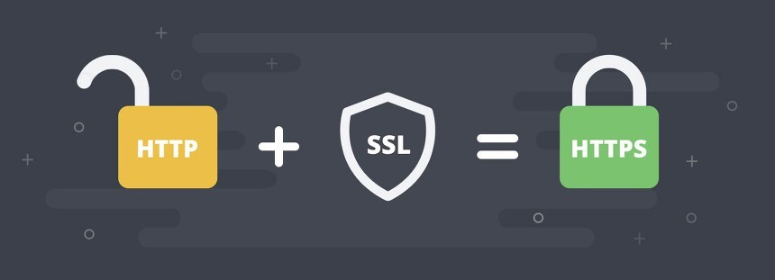
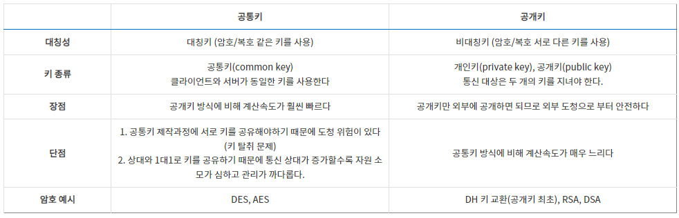
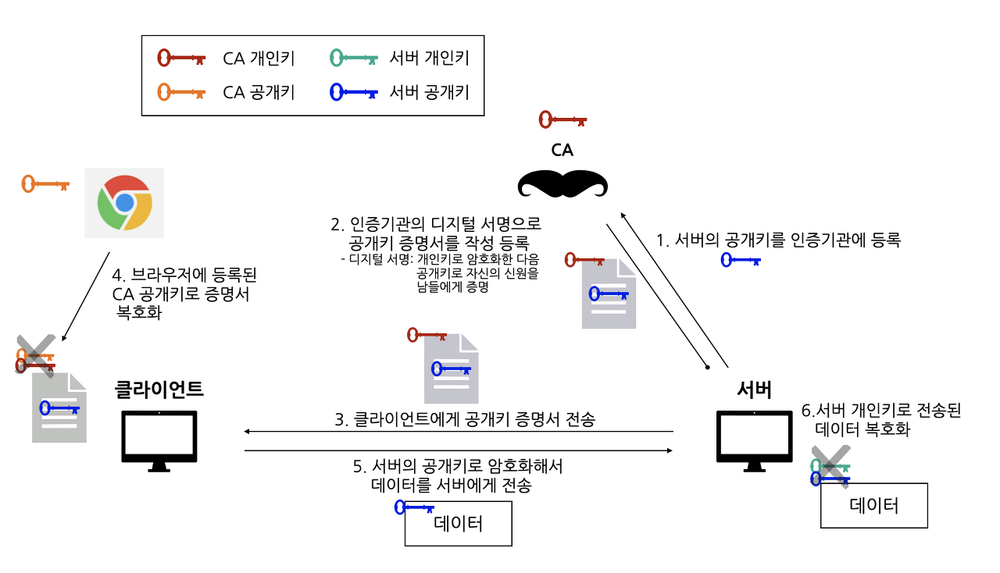
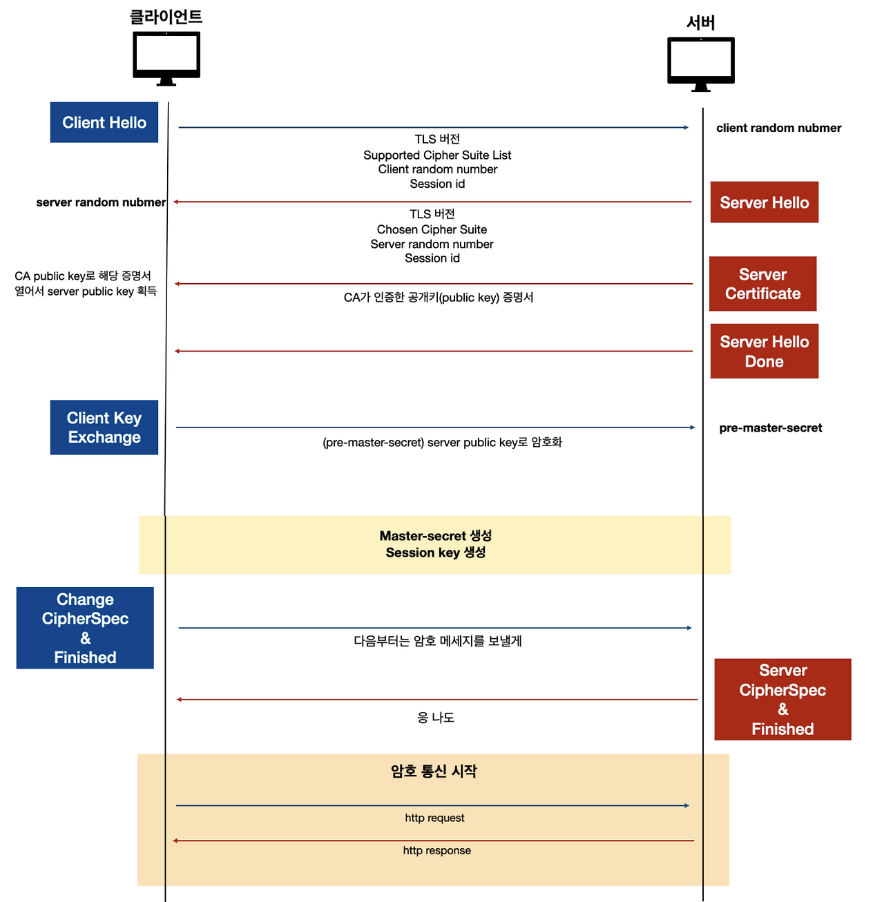

# 📖 HTTPS

## 목차

- [1. 🔒 HTTPS](#-https)
  - [1.1 ⚙️ SSL / TLS 프로토콜](#-ssl--tls-프로토콜)
    - [1.1.1 👻 SSL / TLS 프로토콜 암호화 방식 (하이브리드 암호화 시스템)](#-ssl--tls-프로토콜-암호화-방식-하이브리드-암호화-시스템)
    - [1.1.2 🚧 문제점 1: 공통키 암호 한계, 도청 위험](#-문제점-1-공통키-암호-한계-도청-위험)
    - [1.1.3 🌟 해결책 1: 공개키 암호화 방식으로 도청 방지](#-해결책-1-공개키-암호화-방식으로-도청-방지)
    - [1.1.4 🚧 문제점 2: 통신 상대 검증이 안됨, 위장 위험](#-문제점-2-통신-상대-검증이-안됨-위장-위험)
    - [1.1.5 🌟 해결책 2: 공개키 신원을 증명해주는 CA기관](#-해결책-2-공개키-신원을-증명해주는-ca기관)
  - [1.2 ⛓ CA 공개키 증명서 인증 방식](#-ca-공개키-증명서-인증-방식)
  - [1.3 📌 HTTPS HandShake 통신 과정](#-https-handshake-통신-과정)
- [2. 참조](#-참조)

# 🔒 HTTPS

> 인터넷 상에서 정보를 암호화하는 TLS 프로토콜을 사용해 클라이언트와 서버가 자원을 주고 받을 때 쓰는 통신 규약

<div align="center">
    
</div> 

<br/>

🔹 먼저, HTTP란 HyperText Transfer Protocol의 약자로써, 인터넷에서 HTML과 같은 문서를 웹 브라우저가 웹 서버에 요청할 때의 통신 규약(Protocol)이다.

HTTP는 Application 계층에 속하고 정보를 텍스트로 주고 받기 때문에 네트워크에서 전송 신호를 인터셉트 하는 경우 원하지 않는 데이터 유출이 발생하는 등 다양한 문제가 발생한다. <br/><br/>

**1) 평문(암호화 x) 통신이기 때문에 도청 가능**

> 같은 세그먼트 도청은 어렵지 않다. 패킷을 해석하는 패킷 캡처나 스니퍼라는 툴을 이용해 네트워크 상에 흐르고 있는 패킷을 수집하면 된다.

대안

🔹 TLS같은 프로톨콜을 사용하여 통신을 암호화 시키는 방법 <br/><br/>
 
**2) 통신 상대를 확인하지 않기 때문에 위장 가능**

> HTTP를 사용한 요청이나 응답에서는 상대를 확인하지 않는다. 요청을 보낸 서버가 정말 URI로 지정된 호스트인지 알 방도가 없다.

대안

🔹 상대를 확인하는 증명서 : TLS에서 증명서를 제공하기 때문에 상대를 확인할 수 있다. 증명서는 제 3자 기관(CA)에 의해 발행되는 것이기 때문에 서버나 클라이언트가 실재하는 사실을 증명한다. <br/><br/>

**3) 완전성을 증명할 수 없기 때문에 변조 가능**

> 완전성이란 정보의 정확성을 가리킨다. 완전성을 증명할 수 없다는 것은 정보가 정확한지 아닌지를 확인할 수 없다는 뜻이다. 예로 공격자가 중간에 끼어들어 수신한 내용을 변조할 수 있다. (Man-in-the-Middle 공격)

대안

🔹 HTTPS 사용 - TLS에는 인증이나 암호화, 다이제스트 기능을 제공한다. <br/><br/>
 
그럼 HTTPS는 뭘까? 이러한 보안 취약점을 해결하기 위한 프로토콜이 HTTP에 S(Secure Socket)가 추가된 것이 HTTPS이다. 기본적으로 HTTPS는 포트 443을 사용하는데 이는 포트 80을 사용하는 HTTP와 HTTPS를 구분하기 위함 이다.

그렇다면 Secure Socket은 어떤 방식으로 HTTP의 보안 취약점을 해결할까? 

<br/>

## ⚙️ SSL / TLS 프로토콜

<div align="center">
    
</div> 

<br/>

🔹 HTTPS는 그림에서 볼 수 있듯이 암호화 프로토콜을 사용하여 통신을 암호화한다. 즉, SSL / TLS 프로토콜은 암호화 방식을 통해 세션 데이터를 암호화한다는 것을 알 수 있다. 이 프로토콜은 이전에는 보안 소켓 계층(SSL)으로 알려졌지만, 현재는 전송 계층 보안(TLS)이라고 불린다.

```
[참고] TLS

Transport Layer Security의 줄임말. 과거 SSL에서 발전하며 이름이 변경 된 것이다. 하지만 아직도 SSL이란 명칭이 많이 사용되고 있다.
```

<br/>

### 👻 SSL / TLS 프로토콜 암호화 방식 (하이브리드 암호화 시스템)

SSL / TLS 프로토콜은 대칭과 비대칭 키 암호화 방식을 혼합한 하이브리드 암호화 방식을 사용한다.

<div align="center">
    
</div> 

### 🚧 문제점 1: 공통키 암호 한계, 도청 위험

🖋 대칭키의 경우 비대칭 키 암호화 방식에 비해 계산과정이 단순하여 속도가 빠르지만 암호화와 복호화에 하나의 키(공통키)를 같이 사용하는 방식이기 때문에 상대방에게 키를 넘겨줄 때가 취약하다. 그래서 도청할 수 없도록 네트워크 통신 자체를 암호화해서 안전하게 배송하기 해줘야 한다. <br/>

🖋 안전하게 배송하기 위해 필요한 방식이 바로 두 개의 키(비대칭키)를 사용하는 공개키 방식이다.

### 🌟 해결책 1: 공개키 암호화 방식으로 도청 방지

🖋 TLS는 도청을 할 수 없도록 공개키 암호 방식을 사용한다.

- 공통키(대칭키) 한계: 서로 공유하다가 해커한테 걸리면 보안이 뚫릴 수도 있다.
 
🖋 공개키 암호방식은 두 개의 키(비밀키, 공개키)가 있다. 공개키는 누구에게나 공유해도 되지만 개인키는 누구에게도 알려지면 안된다. A가 Naver에게 메세지를 보낸다고 할때 공개키 암호방식을 사용하면 다음과 같다.

```
A(Client) → Naver(Server)

A가 Naver의 공개키를 사용하여 메세지를 암호화하여 전송한다.
Naver는 해당 암호화된 정보를 받아들여 자신의 비밀키로 복호화하여 메세지를 읽는다.
Naver는 암호화는 공개키를 사용했고, 복호화는 비밀키를 사용했다. 따라서 Naver의 자신의 비밀키를 도난당하지 않는 이상 도청에 대한 위험은 없다
```

🖋 그런데 이러한 공개키 암호 방식은 속도가 매우 느리다. 메세지를 암호화하고 복호화하는데 많은 자원을 필요로 한다. 그래서 HTTPS는 공통키와 공개키를 섞어서 사용하기로 한 것이다.

🖋 공통키 암호로 사용되는 해쉬값(pre-master-secret)을 공개키 암호화해서 안전하게 서버에게 전송한다. 그렇게 안전하게 서로의 공통키를 생성하고나면 이제는 도청에 대한 위험없이 공통키 암호방식으로 안전하고 빠르게 통신을 이룰 수 있게 된다. 즉, 데이터 자체는 공통키를 이용해서 전달하지만 그 공통키를 전달받는 과정은 공개키 방식을 활용한다.

### 🚧 문제점 2: 통신 상대 검증이 안됨, 위장 위험

그런데 공통키를 전달해야할 공개키 방식에도 문제가 있다. 데이터 암호에는 메시지를 받을 사람(Naver)의 공개키로 암호화를 수행하여 보냈다. 하지만 만약에 해커가 Naver의 공개키를 가로채고 본인의 공개키로 보냈다고 생각해보자. A는 그러면 해커의 공개키로 암호화하여 보낼 것이고, 해커는 자신의 개인키로 복호화하여 그 내용을 볼 수 있다.

### 🌟 해결책 2: 공개키 신원을 증명해주는 CA기관

공개키 암호에도 약점이 있는데 바로 공개키가 진짜인지 아닌지 모른다는 것이다. 그래서 C와 같은 위장꾼을 걸러내기 위해 CA(Certificate Authority) 인증기관이 존재한다. 이 과정에서는 공개키 방식이 사용된다.

<br/>

## ⛓ CA 공개키 증명서 인증 방식

<div align="center">
    
</div> 

<br/>

- 서버 운영자(Naver)는 CA 인증 기관에 공개키를 제출한다. 
- CA는 인증기관의 비밀키로 서버의 공개키에 디지털 서명으로 공개키 증명서를 작성한다. 
- 클라이언트 요청이 오면 서버는 클라이언트에게 공개키 증명서를 전송한다.
- 클라이언트는 서버와 통신할 때 공개키 증명서를 CA 공개키로 증명하고 공개키가 정말인지 확인한다. 
    - CA 인증 공개키는 브라우저(크롬, 파이어폭스, 엣지 등)에 내장되어 있다. 
    - CA 인증서는 크롬 설정 > 보안 및 개인정보 보호 > 보안 > 인증서 관리에서 확인이 가능하다. 
- 클라이언트는 해당 서버 공개키로 데이터를 암호화하여 서버에게 전송한다. 
- 서버는 자신의 개인키로 클라이언트가 보낸 메시지를 복호화하여 확인한다. <br/>
 
클라이언트가 서버와 암호 통신을 하기 위해 어떤 과정이 이뤄지는지 살펴봤다. 서버는 CA기관에게 인증을 받아 HTTPS 통신이 가능함을 입증했고 클라이언트가 서버는 이젠 공개키 암호 방식을 이용해 서로의 공통키를 생성한다. 클라이언트와 서버가 공통키를 갖게 되면 이젠 비용 부담이 적은 공통키 방식으로 암호 통신을 이룬다.
 
이와 같은 방식으로 전환을 하게 된다. 도청의 위험을 공개키로 커버하고 안전하게 공통키를 생성했으면 훨씬 속도가 빠른 공통키 암호방식으로 전환하는 것이다. handashake 통신 과정을 보며 더 자세히 살펴보자.

<br/>

## 📌 HTTPS HandShake 통신 과정

<div align="center">
    
</div> 

<br/>

**1. 클라이언트가 “Client Hello” 메시지를 송신하면서 TLS 통신을 시작한다.**
 
- 암호 스위트(Supported Cipher Suite)로 불리는 리스트(사용하는 암호화 알고리즘이나 키 사이즈 등) <br/>
- client random number(32byte 난스) - 공통키(master-secret) 재료 <br/>
- Session ID (if any) <br/>

**2. 서버가 TLS 통신이 가능한 경우 “Server Hello” 메시지로 응답한다.**

- 암호 스위트(Chosen Cipher Suite): 클라이언트가 제시한 내용에서 선택한 목록 <br/>
    - ex. TLS_RSA_WITH_AES_128_GCM_SHA256 : 키 교환 RSA, 대칭키 AES_128 GCM, Hash 알고리즘은 SHA256 <br/>
- server random number(32byte 난스): 공통키(master-secret) 재료 <br/>
- Session ID(reuse or new) <br/>

**3. 서버는 클라이언트에게 “Certficate” 메세지를 송신한다.**

- 해당 메세지에는 자신의 공개키 증명서가 포함되어 있다.

**4. 서버가 “ServerHelloDone” 메세지를 송신하여 최초의 TLS 네고시에이션이 끝났음을 통지한다.**

**5. 클라이언트는 pre-master-secret을 생성하여 이를 서버 공개키로 암호화하여 “Client KeyExchage” 메세지를 보낸다.**

- 클라이언트는 브라우저에 내장된 키를 통해 공개키 증명서를 뜯어서 서버의 공개키를 얻는다. 그래서 해당 공개키를 사용해 보낸 것이다.

**6. 그렇게 서버와 클라이언트 서로 같은 master-seceret이라는 공통키를 제작한다.**

> master-seceret = client random number + server random number + pre-master-secret

- 만약 도청하는 사람이 있다면 노출된 값은client random number, server random number이다. pre-master-secret은 이미 합의된 암호 알고리즘(ex. RSA)을 사용했기 때문에 노출되지 않는다.
- 세 개의 값을 얻은 서버와 클라이언트는 각각 해쉬 암호(ex. SHA256)를 이용하여 master-secret 키를 생성한다.
- RSA 암호를 이용한 공통키 생성 방식 참고
 
**7. 클라이언트는 “Change Cipher Spec” 메세지를 송신한다. 그리고 클라이언트는 “Finished” 메세지를 송신한다.**

- "Change Cipher Spec" 메시지는 이 메시지 이후의 통신은 암호키를 사용해서 진행한다는 것을 나타낸다.
- "Finished"를 보내면서 통신이 끝났음을 알린다.
 
**8. 서버도 마찬가지로 “Change Cipher Spec” 메세지를 송신하고 “Finished” 메세지를 송신한다.**

**9. 둘다 “Finished” 교환이 완료되면 이제는 TLS에 의해 접속이 확립된다.**

- 따라서 이제부터는 공개키 방식 대비 속도가 빠른 공통키 암호 방식으로 통신하므로 클라이언트와 서버는 안심하고 통신이 이루어진다.

<br/>

## 📸 참조

https://loosie.tistory.com/718 <br/>
https://rachel-kwak.github.io/2021/03/08/HTTPS.html <br/>
https://velog.io/@averycode/HTTPS-%EA%B7%B8%EB%A6%AC%EA%B3%A0-%EB%B3%B4%EC%95%88


