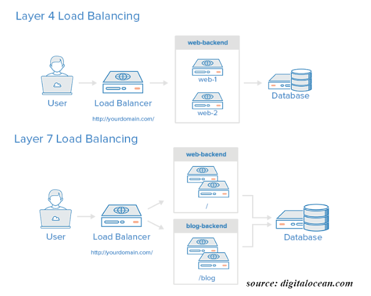

# L4, L7 스위치 & 로드밸런싱

## ✅ 스위치란?

- 네트워크를 연결하는 일을 하는 목적을 가진 기기.
- 자신과 연결된 모든 기기에서 들어오는 패킷을 수신하고, 패킷을 적당한 기기로 보내는 일을 한다.
- OSI 7 계층에서 어느 계층까지 다루는지를 기준으로 스위치의 카테고리를 나눈다.
- L4, L7 스위치는 로드밸런싱을 수행한다.

## ✅ 로드밸런서란?

### 📌로드밸런싱이 왜 필요할까❓

> 
> 
> 
> 서버가 단 하나만 존재할 때 수천만명의 사람들이 서버에 동시 접속하면 하나의 서버는 부하를 감당하지 못할 수도 있을 것이다. 이를 해결하는 방식에는 장비를 업그레이드하는 **Scale-up**방식과 장비를 여러개 두는 **Scale-out**방식이 있다.
> 
> Scale-out 방식으로 여러 서버를 둔다면 해당 서비스에 접근하기 위해서는 서버마다 다른 IP가 필요하다. 서버마다 다른 공인 IP를 부여한다면 사용자들마다 각각 다른 IP로 접속할 것이고, 운영자가 원하는대로 딱! 떨어지게 부하를 분산하기 어렵다. 1000명의 사용자가 있을때 서버 2대에 500명 : 500명 접속하지 않고, 999명은 A서버에, 1명은 B서버에 접속한다면, 고가의 비용을 들여 새로운 서버를 증설한 것이 헛수고이다.
> 
> 이런 상황을 방지하기 위해 서버에 가해지는 트래픽의 부하를 분산하는 작업이 필요하다. 이렇게 두개이상의 컴퓨터자원에 작업을 나누는것을 로드밸런싱이라고 하고, 이런 작업을 하는 장비를 로드밸런서라고 한다.
> 

### 📌로드밸런서의 종류

|||
| --- | --- |
| L2 | Data link 계층을 사용, Mac주소 기반 부하 분산 |
| L3 | Network 계층을 사용, IP주소 기반 부하 분산 |
| L4 | Transport 계층을 사용, Port 기반 부하 분산 |
| L7 | Application 계층을 사용, 요청(URL) 기반 부하 분산 |
|||

- 로드밸런서의 종류를 나누는 기준은 OSI 7계층을 기준으로 어떻게 부하를 분산하는지에 따라 종류가 나뉜다.
- 2계층을 기준으로 부하를 분산한다면 L2 로드밸런서, L2, L3 계층을 기준으로 부하를 분산한다면 L3장비.
- 상위 계층으로 갈수록 섬세한 부하 분산이 가능하지만 가격이 비싸진다.

### 📌**로드밸런서의 주요 기능**

1. ***Network Address Translation(NAT)***
    
    사설 IP를 공인 IP로 바꾼다.
    
2. ***Tunneling***
    
    데이터를 캡슐화하여 연결되어진 노드만 그 데이터의 캡슐을 풀어서 볼수있게 해준다.
    
3. ***Dynamic Source Routing protocol(DSR)***
    
    요청에 대한 응답을 할 때 로드밸런서가 아닌 클라이언트의 IP로 응답한다.
    

### 📌요약 및 + α

- **로드밸런서**는 트래픽을 받아서 **여러 대의 서버에 분산**시키는 하드웨어 또는 소프트웨어.
- 부하 분산에는 L4 Load Balancer와 L7 Load Balancer가 많이 사용된다. (L4부터 Port를 다룰 수 있기 때문)
- 한 대의 서버의 각각의 포트에 여러개의 서비스들을 운영하기 위해서 L4 Layer 위에서 작동하는 Load Balancer가 필요해진 것.
- 이전에는 L4 하드웨어 장비를 주로 사용했지만, 현재는 MSA의 등장 등으로 L7 로드밸런싱도 많이 사용하고, AWS ELB, NginX, HaProxy등 다양한 소프트웨어를 사용하고 있다.

### 📌 로드밸런싱 의 종류
1. **L4 로드 밸런서**:
    - **로드 밸런싱 알고리즘**: 주로 IP 주소 및 포트 번호를 기반으로 하는 알고리즘을 사용한다.
    - **예시 알고리즘**:
        - **라운드 로빈(Round Robin)**: 요청을 순서대로 서버에 전달하여 부하를 균등하게 분산.
        - **가중치 기반 가중치 라운드 로빈(Weighted Round Robin)**: 각 서버에 가중치를 부여하여 서버마다 부하를 조절.
        - **최소 연결(Minimum Connections)**: 현재 연결 수가 가장 적은 서버에 요청을 전달하여 부하를 분산.
2. **L7 로드 밸런서**:
    - **로드 밸런싱 알고리즘**: 주로 HTTP 요청의 내용을 분석하여 트래픽을 분산하는 알고리즘을 사용한다.
    - **예시 알고리즘**:
        - **URL 기반 라우팅(URL-based Routing)**: 요청된 URL 경로에 따라 특정 서버로 요청을 전달.
        - **HTTP 헤더 기반 라우팅(HTTP Header-based Routing)**: 특정 HTTP 헤더(예: 사용자 에이전트)에 따라 요청을 다른 서버로 전달.
        - **세션 어피니티(Session Affinity)** 또는 **스티키 세션(Sticky Session)**: 클라이언트의 세션 ID에 따라 항상 동일한 서버로 요청을 전달.

이처럼 L4 및 L7 로드 밸런서는 각각 다른 계층의 특성을 고려하여 다양한 로드 밸런싱 알고리즘을 사용할 수 있다.

## ✅ L4 Load Balancer

- 4계층 - 네트워크 계층 (IP, IPX)이나 3계층 - 전송계층(TCP, UDP)의 정보를 바탕으로 로드를 분산한다.
- 즉, IP 주소, 포트번호, MAC주소, 전송 프로토콜 등에 따라 트래픽을 분산하는 것이 가능.
- 클라이언트에서 로드밸런서(DNS)로 요청을 보냈을 때 최적의 서버로 요청을 전송하고 결과를 클라이언트에게 준다. 즉, 요청하는 서비스의 종류와 상관 없이 공장을 여러 개 돌리는 것.

**장점**

- 패킷의 내용을 확인하지 않고 로드를 분산하므로 **속도가 빠르고 효율이 높음.**
- 데이터의 내용을 **복호화할 필요가 없기에** 안전.
- L7 로드밸런서보다 **가격이 저렴.**

**단점**

- 패킷의 내용을 살펴볼 수 없으므로, **섬세한 라우팅 불가.**
- **사용자의 IP가 수시로 바뀌는 경우**라면, 연속적인 서비스를 제공하기 어려움.

## ✅ L7 Load Balancer

- **L7 Load Balancer**는 L7 위에서 동작하기 때문에 IP, Port 이외에도 ***URI, Payload, Http Header, Cookie*** 등의 내용을 기준으로 부하를 분산한다. 그래서 콘텐츠 기반 스위칭이라고도 함.
- L4 Load Balancer는 단지 부하를 분산시키는 것이라면, L7 Load Balancer는 요청의 세부적인 사항을 두고 결제만 담당하는 서버, 회원가입만을 담당하는 서버 등으로 분리해서 가볍고 작은 단위로 여러 개의 서비스를 운영하고 요청을 각각의 서버에 분산할 수 있는 것이다.
- L7 Load Balancer는 L4 Load Balancer와 다르게 데이터를 분석해서 처리가 가능하기 때문에 악의적이거나 비 정상적인 콘텐츠를 감지해 보안 지점을 구축할 수도 있는 장점이 있고, 그 만큼 자원 소모가 크다는 단점이 있다.

**장점**

- 상위 계층에서 로드를 분산하기 때문에 **훨씬 더 섬세한 라우팅** 가능. 
- **캐싱(Caching) 기능** 을 제공. 
- 비정상적인 트래픽을 사전에 필터링할 수 있어 **서비스** 안정성 높음.

**단점**

- L4 로드밸런서에 비해 **비쌈.**
- **패킷의 내용을 복호화하여야** 하므로 더 높은 비용을 지불해야 함. 
- 클라이언트가 로드밸런서와 인증서를 공유해야 하기 때문에, 공격자가 로드밸런서를 통해 클라이언트의 데이터에 접근할 수 있는 **보안상의 위험성** 존재.

## ✅ L4 vs L7

### 공통점

- 들어온 packet을 적절한 목적지로 전달(스위치) 역할 수행.
- 적절한 알고리즘을 통해 로드밸런서로서의 역할을 수행.
- 스위치 및 서버별 Health Check를 통해, 이중화 구성후 장애시 Standby 상태의 기기는 장애스위치의 패킷을 넘겨와 active로 동작해 서버에 넘겨줌.

### 차이점

- L4는 로드밸런서에서 알고리즘을 통해 server1 또는 server2로 데이터를 전송할지 결정을 하고 Client와 3way handshake를 실시하여 하나의 TCP세션을 갖게 된다. (L/B는 중계역할을 함) 그 후 application 층에서 클라이언트의 요청정보(HTTP, FTP 등)를 전달받는다.
- L7는 L/B에서 콘텐츠 기반 스위칭을 위해 3way handshake를 보류한다. L/B와 client 간 3way handshake를 실시하여 따로 TCP 세션을 형성, L7과 server서버는 또 다른 TCP 세션을 형성하고 데이터를 중계한다.
- L7 패킷 분석을 통한 바이러스 감염 패킷 필터링이 가능하다.
- L7은 L4의 서비스 단위 로드밸런싱을 극복하기 위한 포트 + 페이로드 패턴을 이용하여 패킷스위칭을 한다.
- L4는 TCP/UDP 패킷 정보를 분석하고 해당 패킷이 사용하는 서비스 종류별(HTTP, FTP 등)로 처리하기 때문에 프록시 문제가 발생 될 수 있다.

## ✅ 출처
[L4 / L7 로드밸런서 차이 (Load balancer)](https://jaehoney.tistory.com/73)

[로드밸런서란?(L4, L7)](https://vaert.tistory.com/m/189)

[L4 로드밸런서 vs L7 로드밸런서](https://skstp35.tistory.com/m/324)

## ✅ 기타 추가 내용
- 왜 L4 로드 밸런싱에서 패킷 내용을 확인할 수 없나요?

    L4 (전송 계층) 로드 밸런싱에서 패킷 내용을 확인할 수 없는 이유는 로드 밸런서가 주로 전송 계층에서 동작하기 때문입니다. 전송 계층에서는 패킷의 헤더 정보만을 확인하고 분석합니다. 이 헤더에는 출발지 및 목적지 주소, 포트 번호, 제어 정보 등이 포함되어 있지만, 페이로드(실제 데이터)는 보통 확인되지 않습니다.

    전송 계층 로드 밸런서는 주로 송신자와 수신자 간의 연결을 식별하고, 각 연결에 따라 트래픽을 분산하는 역할을 수행합니다. 페이로드를 확인하는 것은 전송 계층에서의 주요 기능이 아니기 때문에 일반적으로 이러한 기능은 제공되지 않습니다.

- 작동 예시
1. **L4 로드 밸런서 예시**:
    - **목적**: 동일한 포트 번호로 들어오는 트래픽을 여러 서버로 분산시킵니다.
    - **예시 시나리오**: 웹 서버를 운영하고 있고, HTTP 트래픽을 80번 포트로 받고 있습니다. 세 개의 서버(서버1, 서버2, 서버3)가 이 트래픽을 처리합니다.
    - **구현 방법**: L4 로드 밸런서는 클라이언트의 HTTP 요청을 받아들이고, 이를 세 개의 서버로 분산시킵니다. 각 서버는 80번 포트를 통해 클라이언트 요청을 처리합니다.
2. **L7 로드 밸런서 예시**:
    - **목적**: HTTP 요청의 내용을 기반으로 트래픽을 분산합니다.
    - **예시 시나리오**: 웹 애플리케이션을 운영하고 있고, 특정 URL 경로에 따라 다른 서버로 요청을 전달해야 합니다.
    - **구현 방법**: L7 로드 밸런서는 클라이언트의 HTTP 요청을 받아들이고, 요청된 URL 경로에 따라 서버를 선택하여 요청을 전달합니다. 예를 들어, "/api" 경로의 요청은 서버1로, "/static" 경로의 요청은 서버2로 전달될 수 있습니다.