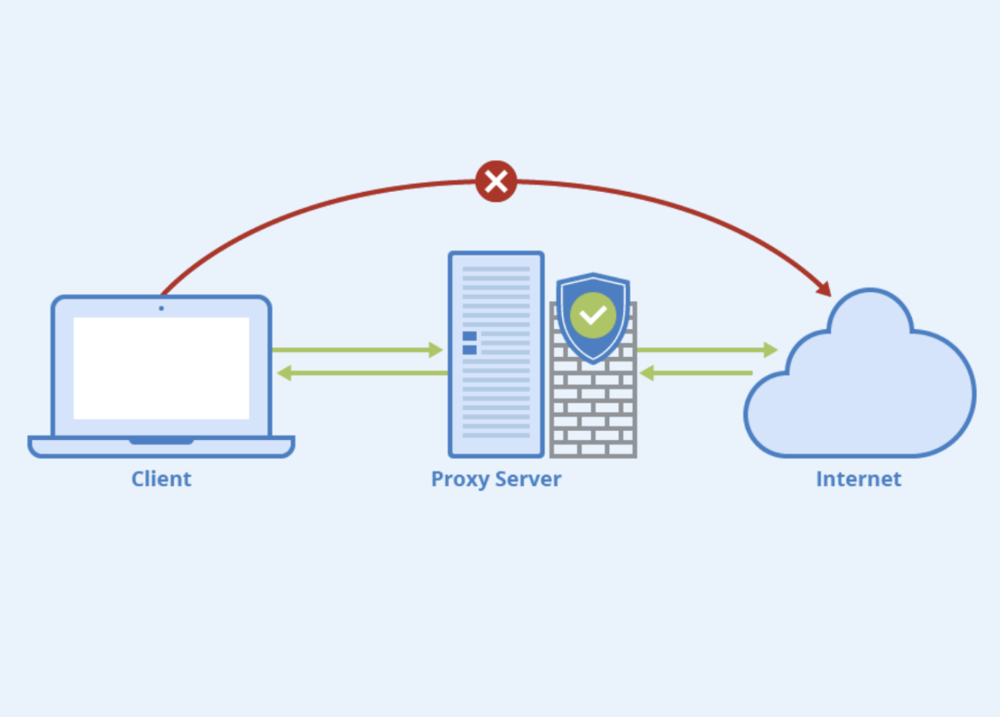
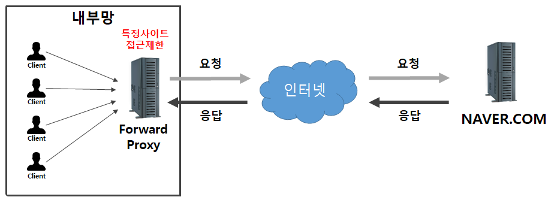
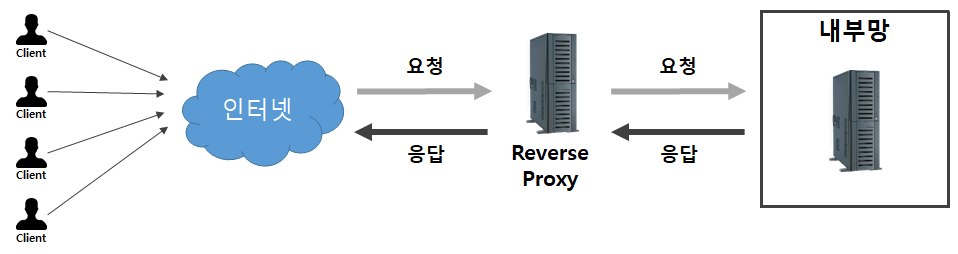

# Proxy Server

## 프록시 서버란?
프록시 서버는 클라이언트와 다른 네트워크 서비스 간의 중계 역할을 하는 중간 서버이다. 이 서버는 클라이언트의 요청을 받아서 대신 원격 서버로 전달하고, 원격 서버로부터 받은 응답을 클라이언트에게 다시 전달한다. 이를 통해 클라이언트는 직접적으로 원격 서버와 통신하지 않고, 프록시 서버를 통해 통신할 수 있다.

<p align="center"></p>

## 동작 원리

1. 요청 : 사용자가 웹 브라우저에서 도메인을 입력한다.
2. 전달 : 요청에 대하여 캐시 역할을 하는 프록시 서버로 전달한다.
3. 확인 : 프록시 서버 내에 도메인 홈페이지의 페이지를 가지고 있는지 체크한다.
    1) 가지고 있는 경우 : <br>
    홈페이지가 있는 서버에 자신이 가진 페이지가 최신 버전인지 체크
    필요한 경우 갱신할 부분만 가져온다.
    2) 가지고 있지 않을 경우 : <br>
    홈페이지가 있는 서버와 연결하여 페이지를 가져온다.

## 필요성 및 용도

### 1. 캐싱
데이터를 릴레이하는 과정에서 자주 사용되는 데이터는 저장한다. 재요청이 있을 때 원본 서버까지 가지 않고 캐시된 데이터를 전송한다. 이를 통해 클라이언트는 반복적인 요청에 대해 더 빠른 응답을 받을 수 있다.

```
Q. 프록시 서버 사용시 페이지 내용과 데이터의 값이 계속 바뀌면?

A. 실제 서버에서 응답할 때 캐시 만료 기한을 설정한다. 프록시 서버로 사용자가 요청했을 때 요청한 시각이 프록시에서 다운받은 시간에서 만료한 기간 이내면 프록시에서 다운로드 할 것이고, 그렇지 않으면 다시 실제 서버로 요청하게 된다.
```

### 2. 보안 및 접근 제어
특정 프록시 서버를 통해서만 네트워크 접근이 이루어지도록 하면 악성 사이트로의 접근을 차단하거나, 네트워크 트래픽을 검사하여 보안 위협을 탐지할 수 있다. 또한 기업 네트워크에서는 프록시 서버를 사용하여 특정 웹사이트나 콘텐츠에 대한 접근을 제어할 수 있으며, 이를 통해 사용자들의 웹 사용을 모니터링하고 관리할 수 있다.

### 3. 익명성
프록시 서버를 통해 인터넷을 사용하면 클라이언트의 IP 주소를 숨길 수 있다. 이를 통해 사용자는 자신의 실제 IP 주소를 숨기고 익명으로 웹을 탐색할 수 있게 된다.

### 4. 로드밸런싱 (리버스 프록시)
리버스 프록시 서버를 여러개의 본 서버들 앞에 두면 특정 서버가 과부화 되지 않게 로드밸런싱이 가능하다. 이는 클라이언트의 요청에 기반하여 트래픽을 분산하는 방식으로, 다양한 서버로 요청을 전달하는 것을 의미한다.

## 종류

### 1. Forward Proxy
프록시 서버는 아래 그림처럼 클라이언트 바로 뒤에 놓여 있다. 같은 내부망에 존재하는 클라이언트의 요청을 받아 인터넷을 통해 외부 서버에서 데이터를 가져와 클라이언트에게 응답해준다.​ 즉, 클라이언트가 서버에 접근하고자 할때, 클라이언트는 타겟 서버의 주소를 포워드 프록시에 전달하여, 포워드 프록시가 인터넷으로 요청된 내용을 가져오는 방식이다.

예를 들어 우리가 naver.com 을 요청하면 포워드 프록시 서버가 naver.com 리소스를 대신 받아와 클라이언트에게 내밀어준다(forward)고 생각하면 된다.
우리가 흔히 말하는 ‘프록시 서버’란 바로 포워드 포록시 서버를 의미하는 것이다.

<p align="center"></p>

### 2. Reverse Proxy
리버스 프록시는 아래 그림 처럼 웹서버/WAS 앞에 놓여 있는 것을 말한다. 클라이언트는 웹서비스에 접근할때 웹서버에 요청하는 것이 아닌, 프록시로 요청하게 되고, 프록시가 배후(reverse)의 서버로부터 데이터를 가져오는 방식이다. 클라이언트쪽으로 데이터(response)를 밀어주는게 포워드라면, 그 반대편인 서버 쪽으로 데이터(request)를 밀어주는 것이 리버스 프록시 라고 보면 된다.

<p align="center"></p>

### 3. Forward Proxy vs Reverse Proxy
|내용|Forward Proxy|Reverse Proxy|
|:---:|:---:|:---:|
|프록시 서버 위치|클라이언트 앞|웹서버/WAS 앞|
|프록시 서버 통신 대상|클라이언트와 Proxy 서버가 통신|Proxy 서버와 내부망 서버|
|감춰지는 대상|서버에게 클라이언트가 누구인지 감출 수 있음|본서버의 IP 정보를 숨길 수 있음|

### 출처
https://inpa.tistory.com/entry/NETWORK-%F0%9F%93%A1-Reverse-Proxy-Forward-Proxy-%EC%A0%95%EC%9D%98-%EC%B0%A8%EC%9D%B4-%EC%A0%95%EB%A6%AC
<br>
https://liveyourit.tistory.com/251
<br>
https://velog.io/@jangwonyoon/Proxy-Server%ED%94%84%EB%A1%9D%EC%8B%9C-%EC%84%9C%EB%B2%84%EB%9E%80