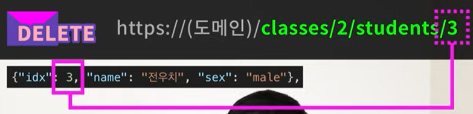
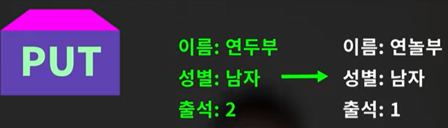
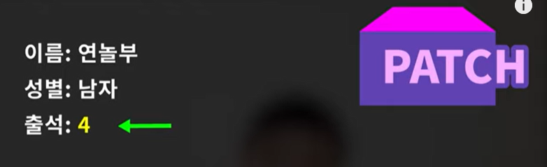
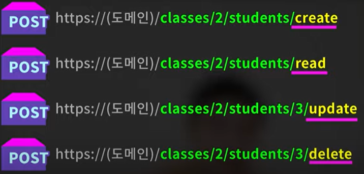
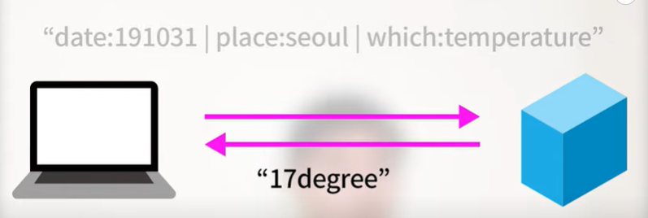

# REST API & RESTful

## 📣 REST란?

### 📍 REST의 정의

- `"REpresentational State Transfer"` 의 약자로, 자원을 이름(자원의 표현)으로 구분해 해당 자원의 상태(정보)를 주고 받는 모든 것을 의미한다.
- REST 통신은 프론트엔드와 백엔드 모두가 사용하는 방식이다. 웹 개발자하려면 반드시 익혀야 할 필요가 있다.
- 즉, `자원(resource)의 표현(representation)에 의한 상태 전달`
    - 자원?
        
        해당 소프트웨어가 관리하는 모든 것 ( 문서, 그림, 데이터, 해당 소프트웨어 자체 등 )
        
    - 표현?
        
        그 자원을 표현하기 위한 이름 ( DB의 학생 정보가 자원이면, 'students'를 자원의 표현으로 정함 )
        
    - 상태 전달?
        
        데이터가 요청되는 시점에 자원의 상태를 전달. ( JSON 혹은 XML을 통해 데이터를 주고 받는 것이 일반적 )
        
- 월드 와이드 웹(www)과 같은 분산 하이퍼미디어 시스템을 위한 소프트웨어 개발 아키텍처의 한 형식
    - REST는 기본적으로 웹의 기존 기술과 `HTTP 프로토콜`을 그대로 활용하기 때문에 웹의 장점을 최대한 활용할 수 있는 아키텍처 스타일이다.
        - = HTTP 프로토콜을 기반으로 자원을 표현하고, HTTP 메소드를 이용하여 해당 자원을 조작하는 아키텍처 스타일
    - REST는 네트워크 상에서 Client와 Server 사이의 통신을 위한 구조를 설계하는 방법 중 하나
    
    > 분산 하이퍼미디어 시스템?
    > 
    > 
    >  다수의 사용자가 서로 연결되어 있고, 다양한 형태의 데이터(텍스트, 이미지, 비디오 등)가 공유되고 사용되는 시스템
    > 소프트웨어 아키텍쳐?
    > Architecture는 영단어로는 ‘건축학’ 이라는 뜻인데, 내용을 풀어서 살펴보면 아래와 같다.
    > 
    > - 시스템 구성 및 동작 원리를 나타내는 것
    > - 구성 요소 간의 관계 및 시스템 외부 환경과의 관계를 묘사하는 것
    > - 시스템 구성 요소에 대한 설계 및 구현을 지원하는 수준을 기술하는 것
    > - 요구 사양 및 시스템 수명 주기를 고려하는 것
    > - 시스템의 전체적인 최적화를 목표로 하는 것
    > 
    > 위 내용을 정리하면 “하나의, 서비스가 어떻게 구성되며 어떻게 동작이 된다”를 표현하는 것이라고 볼 수 있다. 즉, 아키텍처란 서비스의 동작 원리를 나타내는 것
    > 

### 📍 REST 개념

- HTTP URI(Uniform Resource Identifier)를 통해 자원(Resource)을 명시하고, HTTP Method(POST, GET, PUT, DELETE)를 통해 해당 자원에 대한 CRUD Operation을 적용하는 것을 의미한다.

### 📍 REST의 구성 요소

1. 자원(Resource) - URI
- 모든 자원에는 고유한 ID가 존재하고, 이 자원은 Server에 존재한다.
- 자원을 구별하는 ID는 '/exgroups/:exgroup_id'와 같은 HTTP URI 이다.
- Client는 URI를 이용해 자원을 지정하고 해당 자원의 상태(정보)에 대한 조작을 Server에 요청한다.

2. 행위(Verb) - Method
    - HTTP 프로토콜의 Method를 사용.
    - HTTP 프로토콜은 GET, POST, PUT, PATCH, DELETE의 Method를 제공한다.
        - GET/DELETE보다 나머지가 바디를 가지고있어서 정보를 비교적 많이, 안전하게 감춰서 보낼 수 있다. 물론 이것들의 기능이 특정 용도에 제한되어있지는 않지만.
        - 누구든 각 요청의 의도를 쉽게 파악할 수 있도록 RESTful하게 API를 만들기 위해서는 목적에 따라 구분해서 사용해야 함.
        - GET = Read 조회하는 데 사용
        
        
        
        - DELETE =  삭제. uri는 그 학생의 인덱스도 포함해야 함
        
        
        
        - POST = create. 새로운 정보 추가. 바디에 새 학생의 정보를 실어 보낸다. 학생 인덱스 필요 없음
        
        
        
        - PUT = 변경. 정보를 통째로 갈아 끼울 때
        
        
        
        
        - PATCH = 변경. 정보중 일부를 변경할 때
        
        
        
    
    하나로도 가능하지만
    
    
    
    깔끔하지 않음
    
3. 표현 ( Representation of Resource )
    - Client와 Server가 데이터를 주고받는 형태로 JSON, XML, TEXT, RSS 등이 있다.
    - **JSON**, XML을 통해 데이터를 주고 받는 것이 일반적이다.

### 📍 특징

1. `Server-Client` (서버-클라이언트 구조)
    - 자원이 있는 쪽이 Server, 자원을 요청하는 쪽이 Client
   
2. `Stateless` (무상태)
    - HTTP 프로토콜은 Stateless Protocol이므로 REST 역시 무상태성
    - Client의 context를 Server에 저장하지 않는다.
        - 즉, 세션과 쿠키와 같은 context 정보를 신경쓰지 않아도 되므로 구현이 단순해짐.
    - Server는 각각의 요청을 완전히 별개의 것으로 인식하고 처리
        - 각 API 서버는 Client의 요청만을 단순 처리
        - 즉, 이전 요청이 다음 요청의 처리에 연관되어서는 안됨. ( DB에 의해 바뀌는 것은 허용 ) 이전 상황 없이도 통신 가능
        - Server의 처리 방식에 일관성을 부여하기 때문에 서비스의 자유도가 높아짐
3. `Cacheable` (캐시 처리 기능)
    - 웹 표준 HTTP 프로토콜을 그대로 사용하므로 웹에서 사용하는 기존의 인프라를 그대로 활용할 수 있음.
        - 즉, HTTP가 가진 가장 강력한 특징 중 하나인 캐싱 기능을 적용할 수 있다.
        =서버의 응답 메시지는 캐싱(저장 후 재사용)될 수 있다는 말.
4. `Layered System` (계층 구조)
    - 계층별로 기능이 분리된다.
    - 그러므로 중간 계층의 기능(로드밸런싱, 서버 증설, 인증 시스템 도입 등)이 변경되어도 통신에 영향을 주지 않는다.
5. `Uniform Interface` (일관된 인터페이스)
    - URI사용, HTTP 메서드 사용, RPC 미호출 등의 지정된 인터페이스를 준수한다.
6. `Self-Descriptiveness` (자체 표현)
    -  요청 메시지만 보고도 쉽게 이해할 수 있는 자체 표현 구조로 되어있다.

## 📣 REST API

### 📍 정의

- **`API`**(Application Programming Interface)란?
데이터와 기능의 집합을 제공하여 컴퓨터 프로그램간 상호작용을 촉진하며, 서로 정보를 교환가능 하도록 하는 것
    - 소프트웨어의 API
        - 예를 들어 기상청 서버에 날씨 정보를 요청할 때
        
        
        
        공개된 메뉴얼이 있으면 누구나 활용할 수 있다.
        
        - 소프트웨어가 다른 소프트웨어로부터 지정된 형식으로 요청, 명령을 받을 수 있는 수단을 API.
- REST의 특징을 기반으로 서비스 API를 구현한 것
- 정보들이 주고받아지는 데 있어서 개발자들 사이에 널리 쓰이는 일종의 `형식`
- 과거의 `SOAP`이란 복잡한 형식을 대신함
- 프론트엔드 웹에서 서버에 데이터를 요청하거나 배달앱에서 서버에 주문을 넣거나 등 이런 서비스들에서 오늘날 널리 사용하는 것이 REST형식의 API이다.
- 앱이나 웹 사이트 등 뭐를 만들던지 거기에 소프트웨어 간 HTTP로 정보를 주고받는 부분이 있다면 이 형식과 규칙들을 준수해서 RESTful한 서비스를 만들 수 있다.

### 📍 특징

- REST API의 가장 큰 특징은 각 **요청이 어떤 동작이나 정보를 위한 것인지를 그 요청의 모습 자체로 추론이 가능한 것 이다**. ⭐⭐⭐⭐⭐
    - 이런 형식을 통해서 협업을 용이하게 할 수 있다. 요청을 보내는 주소만으로도 어떤 요청인지 유추가 가능하다.
- URI는 정보의 자원만 표현해야 하며, 자원의 행위는 HTTP Method에 명시한다.

### 📍 디자인 가이드

- URI는 정보의 자원을 표현해야 된다=> 예시 : /user, /review 등
- 자원에 대한 행위는 HTTP Method(GET, POST 등)로 표현한다=> 행위는 URL에 포함하지 않는다

### 📍 설계 규칙

1. URI는 명사를 사용할 것
    - 동사를 사용하지 말라는 얘기=> 예시 : `/getUsers, /createNewUser`
2. 슬래시( / )로 계층 관계를 표현할 것
    - 예시 : `/review/comment`
3. URI 마지막 문자로 슬래시( / )를 포함하지 말 것
4. 밑줄( _ )을 사용하지 말고 하이픈( - )을 사용할 것
5. URI는 소문자로만 구성할 것
6. HTTP 응답 상태 코드 사용할 것
    - 클라이언트는 해당 요청에 대한 실패 처리완료, 잘못된 요청 등에 대한 피드백 필요
    - 2xx은 성공 / 4xx은 클라이언트 실패 / 5xx은 서버 실패
7. 파일확장자는 URI에 포함하지 않는다.
    - 예시 : `http://test.com/review/img.jpg`

올바른 예시)

## 📣 RESTful API?

- RESTful API는 REST의 설계 규칙을 잘 지켜서 설계된 API
- RESTful은 일반적으로 REST라는 아키텍처를 구현하는 웹 서비스를 나타내기 위해 사용되는 용어이다.
    - `REST API`를 제공하는 웹 서비스를 ‘RESTful’하다고 할 수 있다.
- URI는 리소스를 표현해야 하며 명사를 사용하고,
슬래시로 계층 관계를 표현할 것, 소문자로만 구성할 것 등이 있고
자원에 대한 행위는 HTTP Method로 표현해야하며 HTTP 응답 코드로
클라이언트에게 피드백을 해줘야 한다는 것
- RESTful 하지 못한 경우
    - Ex1) CRUD 기능을 모두 POST로만 처리하는 API
    - Ex2) route에 resource, id 외의 정보가 들어가는 경우(/students/updateName)

## 📣 출처

[REST란? REST API 와 RESTful API의 차이점](https://dev-coco.tistory.com/97)

[[Network] REST란? REST API란? RESTful이란? - Heee's Development Blog](https://gmlwjd9405.github.io/2018/09/21/rest-and-restful.html)

[REST API가 뭔가요?](https://www.youtube.com/watch?v=iOueE9AXDQQ)