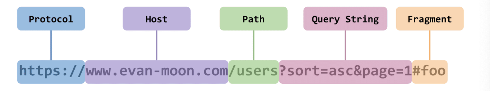
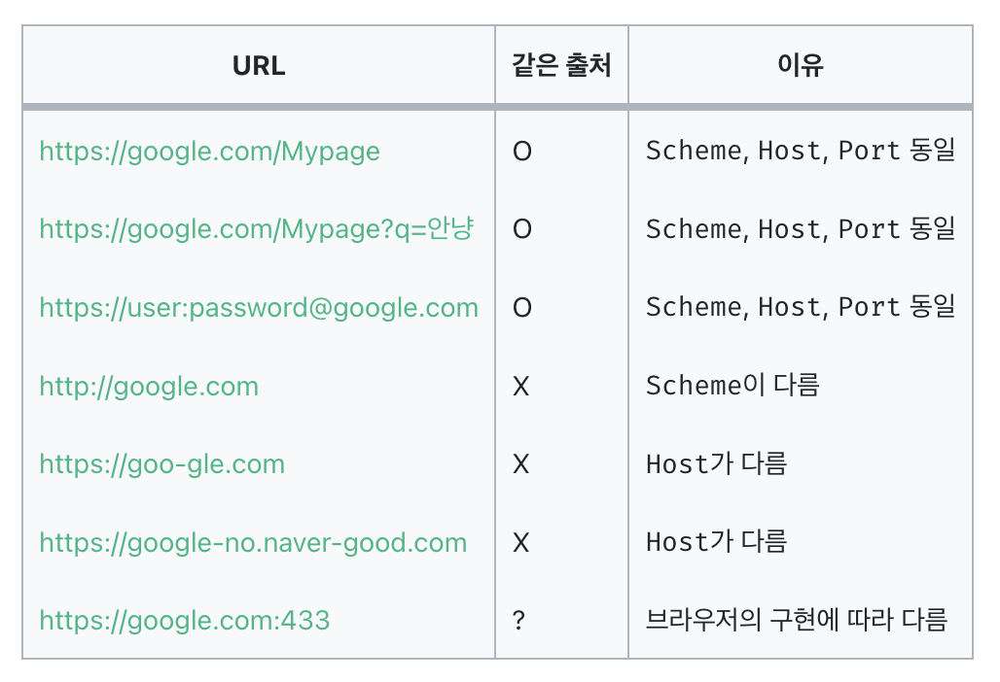
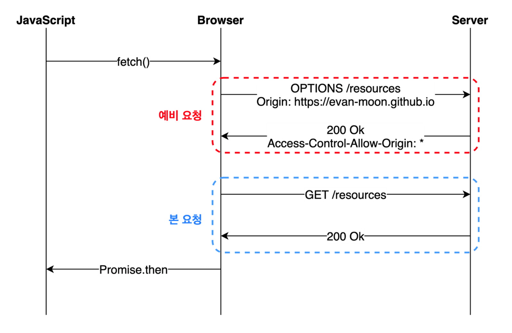
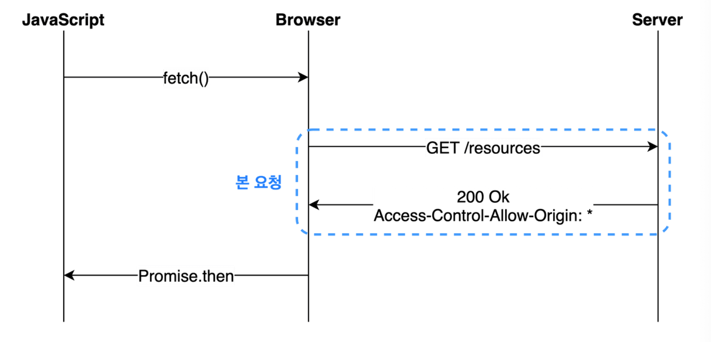

# 📌 SOP & CORS
> SOP(Same-Origin Policy): 같은 출처에서만 리소스를 공유할 수 있음 <br>

> CORS(Cross-Origin Resource Sharing): 추가 HTTP 헤더를 사용해, 한 출처에서 실행 중인 웹 어플리케이션이 다른 출처의 선택한 자원에 접근할 수 있는 권한을 부여하도록 브라우저에 알려주는 체제<br>
> 다른 출처로 리소스를 요청할 때 지켜야 하는 SOP가 허용하는 예외 조항 <br>

위의 ```SOP```와 ```CORS```를 보면 대충 같은 출처라면 SOP, 다른 출처는 CORS일 것 같은 느낌은 든다. 근데 같은 출처, 다른 출처는 뭘까?

### 📍 같은 출처, 다른 출처?

**같은 출처**라고 하면 기본적으로 Scheme, Host, Port가 동일해야 같은 출처이지만 브라우저에 따라 Scheme, Host만 비교하는 브라우저도 있다.(역사속으로 사라진 Internet Explorer... 출처 비교시 포트 번호를 완전히 무시한다.) <br>

예를 들어, 'http://www.example.com'과 'https://www.example.com'은 Scheme이 다르기 때문에 다른 출처로 간주된다.




<p></p>

# 📌 SOP
SOP는 동일 출처 정책이라고도 하며 자바스크립트 엔진 표준 스펙의 보안 규칙이다. 하나의 출처(Origin)에서 로드된 자원(문서나 스크립트)이 Host나 프로토콜, 포트번호가 일치하지 않는 자원과 상호작용 하지 못하도록 요청 발생을 제한하고, 동일 출처(Same Origin)에서만 접근이 가능한 정책이다.

> 프로토콜: 네트워크를 통해 데이터를 교환하는 데 사용되는 규칙이나 표준의 집합(ex. HTTP, HTTPS...)

> Scheme: URI(Uniform Resource Identifier)의 일부로 특정 자원에 접근하기 위한 프로토콜

> 포트: 네트워크를 통해 컴퓨터가 서로 통신할 때 사용되는 가상의 접속 지점

Scheme은 특정 프로토콜을 사용하여 자원에 접근하기 위한 방법을 알려주는 역할을 한다.

SOP의 주요 목적은 보안을 강화하는 것이다. 


다시 정리하자면 SOP는 기본적인 웹 보안을 제공하는 반면, CORS는 개발자가 보다 유연하게 리소스 공유를 관리할 수 있게 해준다.

# 📌 CORS
CORS는 교차 출처 리소스 공유로 SOP의 제한을 안전하게 완화하는 메커니즘이다. 여기서 교차 출처란 다른 출처를 의미한다. 다른 출처로 리소스를 요청한다면 SOP 정책을 위반한 것이 되고 거기에 SOP의 예외조항인 CORS 정책까지 지키지 않는다면 아예 다른 출처의 리소스를 사용할 수 없게 되는 것이다. 즉, CORS 정책은 SOP의 예외조항이라고 볼 수 있다. 그렇기에 웹 어플리케이션이 다른 출처의 리소스에 접근할 수 있도록 허용하되, 안전한 방식으로 이를 수행할 수 있도록 한다. CORS는 HTTP 헤더를 사용하여 웹 서버가 다른 출처의 페이지에서 자신의 리소스에 대한 접근을 허용할 수 있도록 설정할 수 있게 해준다.

작동방식으로는 웹 어플리케이션이 다른 출처의 리소스를 요청하면, 브라우저는 해당 요청에 'Origin'이라는 HTTP 헤더를 자동으로 추가한다. 이 헤더는 요청을 발생시킨 페이지의 출처를 나타낸다. 서버는 이 요청을 받고 응답을 할 때 응답 헤더의 'Access-Control-Allow-Origin'을 비교해본 후 접근을 허용하는 경우 'Access-Control-Allow-Origin' 헤더를 응답에 포함시켜 반환한다. 이 헤더는 특정 출처, 또는 모든 출처로부터의 요청을 허용할 수 있다.

CORS의 목적은 유연한 보안 정책이다. 이는 개발자가 보다 세밀한 제어를 통해 다른 출처와의 안전한 리소스 공유를 가능하게 한다. 또한 API 활묭 및 데이터 통합 촉진이다. 다양한 출처에서 제공되는 API와 리소스를 웹 어플리케이션에서 활용할 수 있게 하여 사용자 경험을 향상시킨다. 또한 출처에 대한 비교는 브라우저에서 이루어지기 때문에 다른 출처에 리소스를 공유하게 되면 보안상 취약해질 수 있다는 문제점으로 인해 생긴 정책이다.

---

### 📍 preflight Request
프리 플라이트 방식은 일반적으로 우리가 웹 어플리케이션을 개발할 때 가장 많이 마주치는 시나리오이다. 이는 브라우저는 요청을 한 번에 보내지 않고 예비 요청과 본 요청으로 나누어서 서버로 전송한다. 이 때 브라우저가 본 요청을 보내기 전에 보내는 예비요청을 preflight라고 한다. 이 예비 요청에는 HTTP 메서드 중 OPTION 메서드가 사용된다. 예비 요청의 역할은 본 요청을 보내기 전에 브라우저가 스스로 이 요청을 보내는 것이 안전한지 확인하는 것이다. 이는 브라우저가 CORS를 지원하지 않은 서버에 도달하면 요청에 대한 응답을 보내지 않아 실제 요청이 수행되지 않도록 보호하기 위해 만들어졌다.

사용자가 자바스크립트의 fetch API를 사용해서 브라우저에게 리소스를 받아오라는 명령을 내리면 브라우저는 서버에게 예비요청을 먼저 보내고 서버는 이 예비요청에 대한 응답으로 현재 자신이 어떤 것들을 허용하고 어떤 것들을 금지하고 있는지에 대한 정보를 응답헤더에 담아 브라우저에게 다시 보내주게 된다.



### 📍 Simple Request
Simple Request는 예비 요청을 보내지 않고 바로 서버에게 본 요청부터 보낸 후 서버가 이에 대한 응답의 헤더에 'Access-Control-Allow-Origin'과 같은 값을 보내주면 그 때 브라우저가 CORS 정책 위반 여부를 검사하는 방식이다. Free Flight와 Simple Request은 전반적인 로직 자체는 같지만 예비 요청의 존재 유무만 다르다. 하지만 아무 때나 사용할 수 있는게 아니라 특정 조건을 만족하는 경우에만 요청을 생략할 수 있다. 또한 조건도 까다롭기 때문에 일반적인 방법으로 웹 어플리케이션 아키텍쳐를 설계하게 되면 거의 충족시키기 어려운 조건들이 대부분이다.

#### Simple Request 조건
1. 요청의 메서드는 GET, HEAD, POST 중 하나여야 한다.
2. Accept, Accept-Language, Content-Language, DPR, Downlink, Save-Data, Viewport-Width, Width를 제외한 헤더를 사용하면 안된다.
3. 만약 Content-Type을 사용하는 경우에는 application/x-www-form-urlencoded, multipart/form-data, text/plain만 허용된다.



### 📍 Credentialed Request
Credentialed Request는 인증된 요청을 사용하는 방법이다. 이 시나리오는 다른 출처 간 통신에서 좀 더 보안을 강화하고 싶을 때 사용하는 방법이다. 기본적으로 브라우저가 제공하는 비동기 리소스 요청 API인 XMLHttpRequest 객체나 fetch API는 별도의 옵션 없이 브라우저의 쿠키 정보나 인증과 관련된 헤더를 함부로 요청에 담지 않는다. 이 때 요청에 인증과 관련된 정보를 담을 수 있게 해주는 옵션이 바로 credentials 옵션이다. 이 옵션에는 총 3가지의 값을 사용할 수 있으며 same-origin, include, omit이 해당된다. same-origin은 같은 출처 간 요청에만 인증 정보를 담을 수 있으며 include는 모든 요청에 인증 정보를 담을 수 있고 omit은 모든 요청에 인증 정보를 담지 않는다.

### 📍 CORS를 해결할 수 있는 방법
- Access-Control-Allow-Origin 세팅하기
- Webpack Dev Server로 리버스 프록싱하기

# 📌 출처
- https://developer-ping9.tistory.com/229
- https://developer.mozilla.org/ko/docs/Web/HTTP/CORS
- https://velog.io/@ahsy92/%EA%B8%B0%EC%88%A0%EB%A9%B4%EC%A0%91-CORS