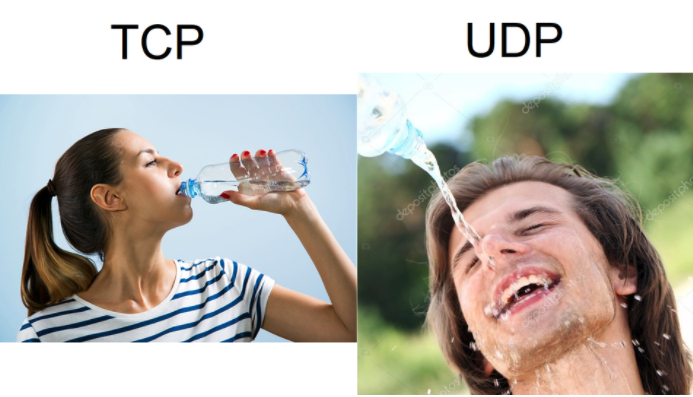
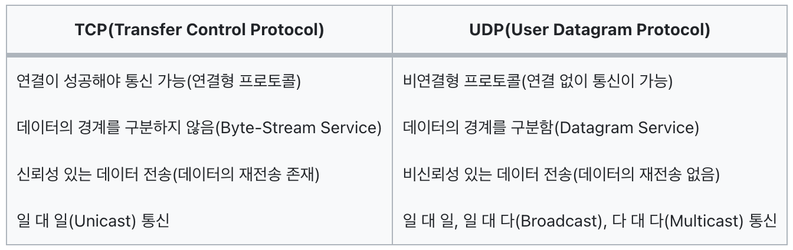
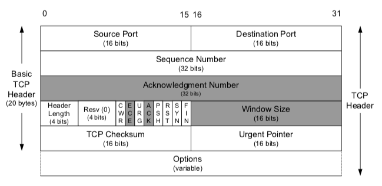
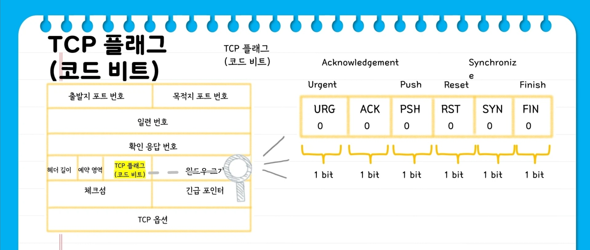
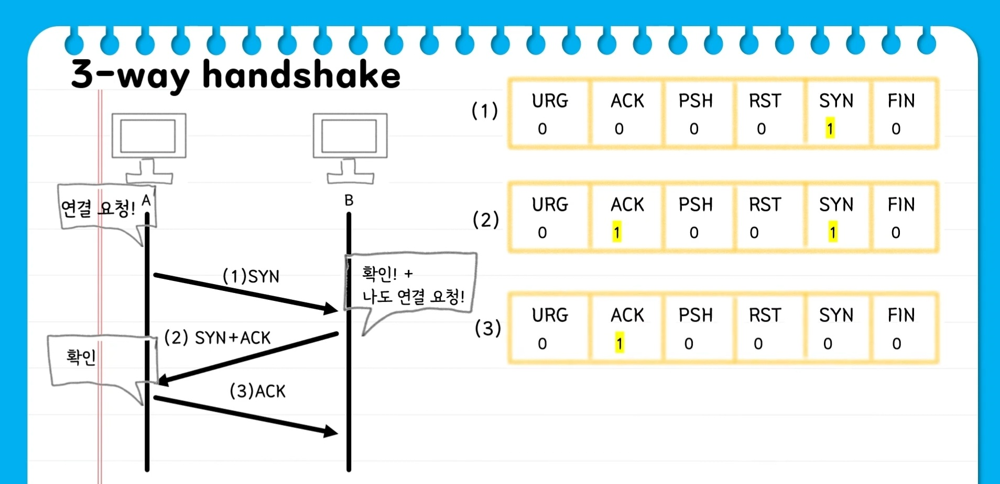
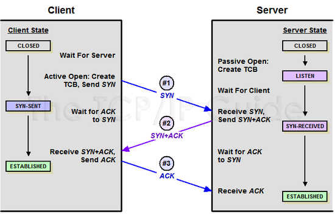
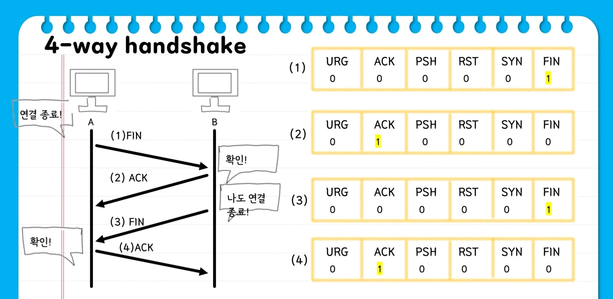
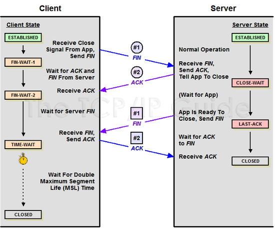

# TCP와 UDP

OSI 7계층 중 4계층인 전송계층에서 사용하는 프로토콜이다.

## 1. TCP

### TCP란?

TCP는 인터넷에서 데이터를 안정적으로 전송하기 위해 설계된 프로토콜이다. TCP는 연결 기반 프로토콜로 작동하며, 특정한 통신 세션을 열고 데이터를 주고 받는다.

1. 신뢰성: TCP는 데이터의 신뢰성을 보장한다. 데이터가 전송되면 수신자가 확인응답(ACK)을 보내어 송신자에게 전송이 제대로 되었음을 알려준다. 만약 ACK를 받지 못하면 송신자는 데이터를 다시 전송하여 신뢰성을 보장한다.

2. 연결 지향성: TCP는 연결 기반 프로토콜로 작동한다. 데이터를 전송하기 전에 먼저 연결을 설정해야 한다. 연결이 설정되면 데이터를 안정적으로 전송하고 연결을 해제한다.

이 두 가지가 TCP의 가장 큰 특징이며 이 외에도 수신자의 처리 속도보다 빠른 속도로 데이터를 전송하지 않도록 하여 네트워크 혼잡을 방지하는 흐름 제어/혼잡 제어 등의 특징을 가진다. 

이렇게 TCP는 데이터의 신뢰성과 안정성을 보장하면서도 효율적인 데이터 전송을 가능하게 한다.

TCP 활용 사례로는 이메일이나 파일 전송 등이 있다.

## 2. UDP

### UDP란?

UDP는 TCP와는 달리 비연결형 프로토콜로, 연결을 설정하거나 해제하지 않고 데이터를 전송한다. UDP는 경량화되어 있고, 데이터 전송에 대한 추가적인 기능을 제공하지 않는다.

1. 신뢰성 부족: TCP와는 달리 UDP는 데이터의 신뢰성을 보장하지 않는다. 데이터가 손실되거나 순서가 바뀔 수 있다. 따라서 응용 프로그램에서 데이터의 검사 및 재전송을 담당해야 한다.

2. 비연결성: UDP는 연결을 설정하지 않고 데이터를 전송한다. 따라서 데이터를 전송하기 전에 연결 설정 과정이 필요하지 않다.

UDP는 TCP보다 속도가 빠르고 네트워크 부하가 적지만, 데이터의 신뢰성이나 안정성이 보장되지 않는다는 점을 염두에 두어야 한다.

대표적인 UDP 활용 사례로는 스트리밍 서비스, 온라인 게임 등이 있다.

## TCP vs UDP

    데이터의 경계가 있다/없다?
    : TCP는 바이트 스트림이기 때문에 받는 쪽에서 바이트를 잘 모아 패킷으로 만드는 과정이 필요하다. 반면 UDP는 데이터 그램이기 때문에 보내는 쪽에서 보낸 만큼 받게 된다.
    
     예를 들어 보내는 쪽에서 10바이트를 연속 3번 보내는 상황에서 TCP는 한번에 30바이트를 받을 수도 있지만, UDP는 무조건 10바이트씩 3번 받아야 한다.

# TCP의 연결 및 해제 과정

## 0. TCP Header

TCP 헤더에는 송신지 및 수신지 포트 번호, 순서 번호, ACK 번호, 윈도우 크기 등의 정보가 포함되어 있다.

이 중 우리가 집중할 부분은 TCP 플래그 부분이다. 아래 그림과 같이 이루어져 있으며 이어서 설명할 TCP의 연결 및 해제 과정에서 중요한 역할을 한다.

## 1. TCP의 연결 : 3-way handshake

간단하게 원리를 이해할 수 있는 단순화된 그림을 먼저 보고 자세한 내용을 알아보도록 하자.

Step1. [Client -> SYN -> Server]
Client가 Server에게 접속을 요청하는 SYN 플래그를 보낸다.
 

Step2. [Server -> SYN + ACK -> Client ]
Server는 Listen 상태에서 SYN이 들어온 것을 확인하고 SYN_RECV 상태로 바뀌어 SYN + ACK 플래그를 Client에게 전송한다. 그 후 Server는 다시 ACK 플래그를 받기 위해 대기 상태로 변경된다.
 

Step3. [Client -> ACK -> Server]
SYN + ACK 상태를 확인한 Client는 서버에게 ACK를 보내고 연결 성립(Established)이 된다. 

## 2. TCP의 해제 : 4-way handshake

마찬가지로 단순화된 그림을 먼저 보고 자세한 내용을 알아보자.

Step1. [Client -> FIN -> Server]     
Client가 연결을 종료하겠다는 FIN 플래그를 전송한다. 보낸 후에 FIN-WAIT-1 상태로 변한다.
 

Step2. [Server-> ACK -> Client]
FIN 플래그를 받은 Server는 확인 메세지인 ACK를 Client에게 보내준다. 그 후 CLOSE-WAIT 상태로 변한다. Client도 마찬가지로 Server에서 종료될 준비가 됐다는 FIN을 받기 위해  FIN-WAIT-2 상태가 된다.
 

Step3. [Server -> FIN -> Client]
Close 준비가 다 된 후 Server는 Client에게 FIN 플래그를 전송한다.
 

Step4. [Client -> ACK-> Server]
Client는 해지 준비가 되었다는 정상 응답인 ACK를 Server에게 보내준다. 이 때, Client는 TIME-WAIT 상태로 변경된다.

    여기서 TIME-WAIT 상태는 의도치 않은 에러로 인해 연결이 데드락으로 빠지는 것을 방지하기 위한 것이다. 예를 들어 Server에서 FIN 플래그를 전송하기 전에 전송했던 패킷이 Routing 지연이나 패킷 유실로 인한 재전송 등으로 인해 FIN 패킷보다 늦게 도착하는 상황을 대비해 FIN 플래그를 수신하더라도 일정 시간(Default : 240초)동안 잉여 패킷을 기다리는 과정을 말한다. 만약 에러로 인해 종료가 지연되다가 시간이 초과되면 CLOSED 상태로 변경된다.

### 출처

https://velog.io/@averycode/%EB%84%A4%ED%8A%B8%EC%9B%8C%ED%81%AC-TCPUDP%EC%99%80-3-Way-Handshake4-Way-Handshake
 

https://wormwlrm.github.io/2021/09/23/Overview-of-TCP-and-UDP.html
 

https://jeongkyun-it.tistory.com/180