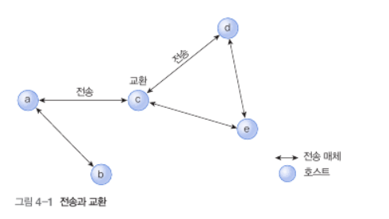
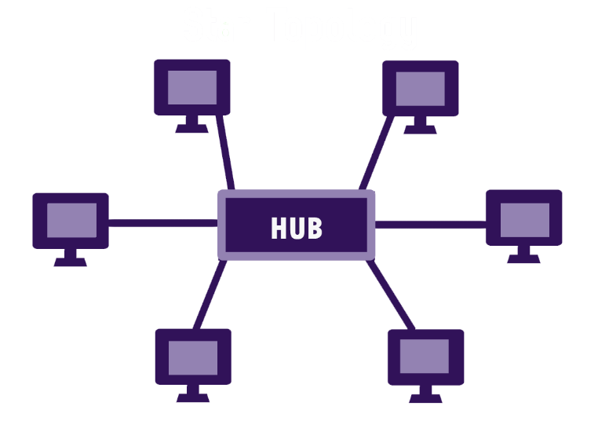
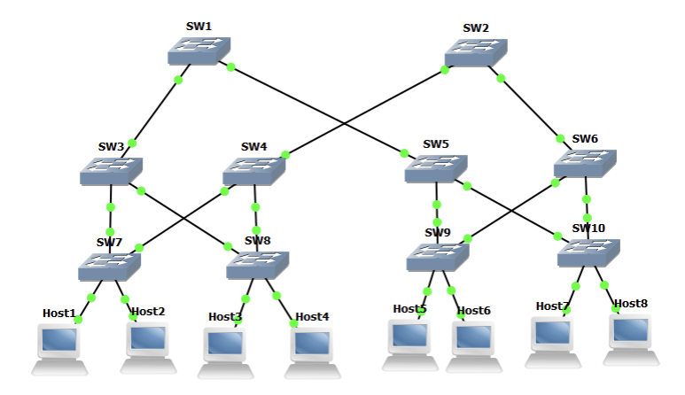
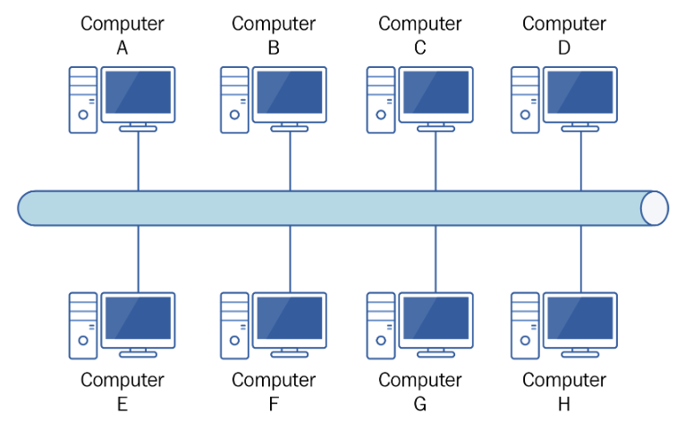
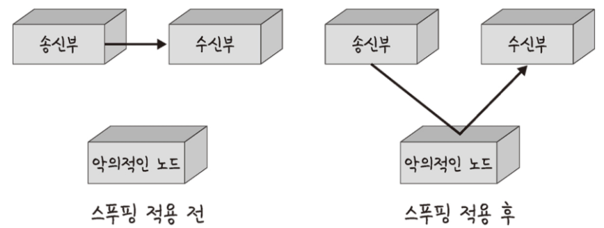
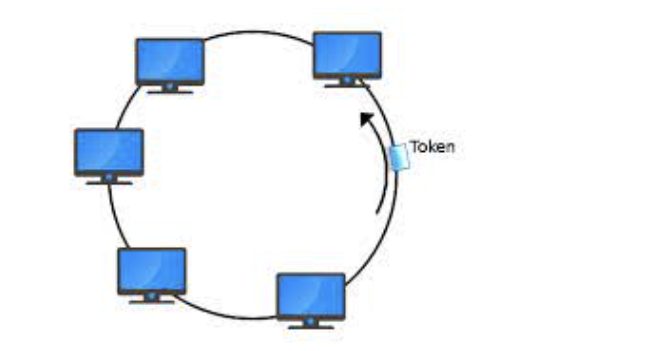

# 💡 **0. 개요**

## 📌 **0.1 데이터 전송과 교환**

교환: 전달 경로가 둘 이상일 때 라우터에서 데이터를 어느 방향으로 전달할지를 선택하는 기능

전송: 특정한 물리 매체에 의해 1:1 로 직접 연결된 두 시스템 간의 신뢰성 있는 데이터 전송을 보장하기 위한 것 (!= 라우팅)

교환과 전송은 완전히 분리되어야 한다. 호스트 a에서 호스트 d로 데이터로 전달하려면 어떤 순차적인 과정을 거쳐야할까?

## 📌**0.2 데이터 전송 방식**

[네트워크에 연결된 호스트의 지리적 분포에 따라 구분하는 방식]
ex. LAN(Local Area Network), MAN(Metropolitan Area Network), WAN(Wide Area Network) 등

[데이터 전송/교환 기술로 분류하는 방식]
ex. Point to Point(각 호스트를 일대일로 직접 연결해 목적지호스트에만 데이터를 전송), Broadcasting(네트워크에 연결된 모든 호스트에 데이터를 전송)

### 🌈 **0.2.1 점대점 방식**

호스트 간의 데이터 전달 과정에서 송신 호스트가 중개 호스트와 일대일로 연결되므로 다른 호스트에는 데이터가 전달되지 않는다.

데이터를 최종 목적지 호스트까지 올바르게 전달하려고 인접 호스트에 전송하는 과정을 단계적으로 반복

WAN 환경에서 주로 사용

### 🌈 **0.2.2 브로드캐스팅 방식**

공유 전송 매체 하나에 여러 호스트를 연결해 네트워크에 연결된 모든 호스트에 데이터가 전송됨

데이터 전달 과정에는 별도의 교환 기능이 필요하지 않은 대신, 자신을 목적지로 하지 않은 데이터를 받은 호스트는 받은 데이터를 버려 결국 하나의 목적지 호스트만 데이터를 수신하도록 설계해야 함.

LAN처럼 지리적으로 가까운 호스트 사이의 통신에서 주로 사용

# 💡 **1. 네트워크 토폴로지 정의**

네트워크 상의 다양한 노드, 장치, 그리고 접속부가 어떻게 물리적으로 또는 논리적으로 배치되어 서로 연결되는지

네트워크를 하나의 도시라고 생각하면, 토폴로지는 도로를 표시한 지도!

좁은 도로와 넓은 대로를 효율적으로 배치하는 것처럼, 네트워크를 배치하는 방식도 여러 가지가 있다. 각각의 방식에는 장단점이 있고, 기업의 필요에 따라 특정 배치 방식을 선택하면 훨씬 더 큰 정도의 연결성과 보안을 획득할 수 있다.

## 📌 **1.1 물리적 토폴로지**

노드와 전선, 케이블 등등 네트워크가 실제 연결되어 배치된 것.
네트워크 설정, 관리, 권한 설정 작업 등

## 📌 **1.2 논리적 토폴로지**

네트워크 배치의 방식과 이유, 그리고 데이터게 네트워크를 통해 어떻게 흐르는지에 대한 전략
어떤 노드가 어떤 방식으로 다른 노드들과 서로 연결되어 있는지

# 💡 **2. 종류 part#1. 점대점 방식**

교환 호스트가 송수신 호스트의 중간에 위치
호스트는 전송 매체를 이용해 일대일로 직접 연결되므로, 모든 호스트가 점대점 연결을 통해 네트워크를 확장

- 전체 연결 개수가 많아지면 성능 면에서 유리하지만, 전송 매체의 길이가 증가해 비용이 많이 든다.

- 반대로 연결 개수가 적어지면 전송 매체를 더 많이 공유해 네트워크 혼잡도가 증가. 

___________________

## 📌**2.1 스타 토폴로지**

### 🌈 2.1.1 정의

네트워크 안의 모든 노드가 동축 케이블이나 연선 또는 광케이블을 통해 직접 하나의 중앙 허브에 연결된다.
중앙 노드는 서버로서 작동해 데이터의 흐름을 관리

즉, **네트워크 안의 각각의 노드에서 보낸 정보가 목적지에 닿기 위해서는 반드시 중앙 호스트를 지나야 한다.**
중앙 노드는 신호를 수신해 재전송시키는 리피터처럼 기능하여 데이터 손실을 막아준다.

### **🌈 2.1.2 장점**

### 1) 논리적 측면

- 가장 흔하게 쓰이기도 하는 스타 토폴로지! 한 장소에서 전체 네트워크를 편리하게 관리
- 각각의 노드는 중앙 허브와 독립적으로 연결되어 있어서 노드 하나에 장애가 발생하더라도 나멎 네트워크는 영향을 받지 않고 기능한다.
- 스타 토폴로지가 안정적이고 안전한 네트워크 배치임을 의미
- 전체 네트워크를 오프라인으로 하지 않고서 장치를 추가, 제거 또는 수정 가능

### 2) 물리적 측면

- 네트워크 전부를 연결하는 데 상대적으로 적은 케이블을 사용하기 때문에 시간이 지남에 따라 네트워크를 확장하거나 줄여나갈 때 설정과 관리가 모두 간단.
- 네트워크 디자인이 단순하기 때문에 장애가 발생하거나 성능에 이상이 생긴 경우 쉽게 찾아낼 수 있어 관리자 역시 힘들이지 않고 관리

### **🌈 2.1.3 단점**

### 1) 논리적 측면

- 중앙 허브에 장애가 생기면, 나머지 네트워크가 모두 멈춘다.
- 따라서 중앙허브를 적절히 관리하여 안정성을 유지하는 것이 중요

### 2) 물리적 측면

네트워크의 전체적 대역폭과 성능이 중앙 노드의 설정과 기술적 사양에 의해 제한되는것 또한 스타 토폴로지의 설정비와 운영비를 높이는 요인

_____________________

## 📌 **2.2 트리 토폴로지**
3.1를 다단계로 확장한 형태

### 🌈 **2.2.1 정의**

노드들은 부모-자식 계층 구조로 연결

중앙 허브에 연결된 노드는 다른 노드와 선으로 연결되어 있어, 연결된 두 개의 노드는 하나의 연결만을 상호 공유

극히 유연하고 네트워크 확장이 매우 쉽기 때문에, 광역 통신망에 사용되어 넓게 퍼진 장치들을 지원

### 🌈 **2.2.2 장점**

- 스타 토폴로지와 버스 토폴로지의 요소가 결합한 구조이므로 노드 추가와 네트워크 확장이 쉽다.

- 성능에 이상이 생긴 경우 각각의 가지에 개별적으로 접근할 수 있기 때문에 네트워크 장애를 해결하는 과정 역시 복잡하지 X

### 🌈 **2.2.3 단점**

### 1) 논리적 측면

- 스타 토폴로지와 마찬가지로, 전체 네트워크의 안정성이 트리 토폴로지 구조의 뿌리인 중앙 노드에 달려있다. 중앙 허브에 문제가 발생하면, 가지 시스템 내에서는 연결되어 있더라도 가지들 사이의 연결은 끊어진다.

### 2) 물리적 측면

- 계층 구조의 복잡성과 네트워크 배치의 선형 구조 때문에, 트리 토폴로지에 노드를 추가할수록 적절한 관리를 하기가 점점 더 어려워 진다.

- 계층적 배치안에서 각각의 장치들을 다음 장치와 연결하는데 드는 케이블의 양만으로도 비용 부담 발생

______________

## 📌 **2.3 메시 토폴로지**

### 🌈 **2.3.1 정의**

노드들을 점 대 점으로 상호 연결한 구조

- 완전 메시 형 (완전형) : 모든 노드가 상호연결

- 부분 메시 형 (불규칙형): 대부분이 상호연결된 가운데, 몇몇 노드들은 두세 개 장치들과만 연결. 
ex. 특정한 두 호스트 사이에 통신 트래픽이 많으면 이들을 직접 연결, 적으면 다른 호스트의 중개 과정을 거쳐서 데이터를 주고 받도록 설계

데이터 전송 방식

- 라우팅: 노드는 출발지부터 목적지까지의 최단 거리를 논리적으로 결정하여 데이터를 전송

- 플러딩: 정보는 네트워크 안의 모든 노드로 보내져 논리적으로 최단 거리를 결정할 필요X

- 교환 기능 필요X : 호스트끼리 서로 공유하지 않는 전용 전송 매체로 직접 연결하기 때문

### **🌈 2.3.2 장점**

- 안정성과 보안성이 뛰어나고, 노드 간에 상호 연결된 정도가 높고 복합적이어서 장애에 강하다.

- ex. 어떤 단일 장치가 고장 난다고 해도 네트워크가 오프라인이 되는 경우는 X

### 🌈 **2.3.3 단점**

- 전송 매체 개수 증가에 따라 비용 측면에서 극단적으로 비효율적 : 전체 호스트 개수가 N개라고 가정하면 연결에 필요한 전송 매체 수는 N*(N-1)/2 개

- 네트워크를 배치할 때 노드 사이 각각을 연결할 때마다 케이블이 필요하고 설정을 해줘야 하므로 설치하는 시간도 오래걸린다.

- 케이블에 드는 비용은 특히 더! 가파르게 증가

# 💡 **3. 종류 part#2. 브로드캐스팅 방식**

**특정 호스트가 전송한 데이터가 네트워크에 연결된 모든 호스트에 전달된다.
데이터를 수신하도록 지정된 호스트만 해당 데이터를 수신하고 보관. 다른 호스트들은 수신 데이터를 버린다.**

WAN같은 원거리 통신망에서는 특정 호스트 사이를 직접 연결한 전송 매체가 있느닞, 아니면 어떤 우회 경로로 몇 단계를 거쳐서 연결할 수 있는지에 대한 판단이 중요.

그러나, LAN에서는 연결의 존재 여부보다는 데이터를 목적지 호스트까지 얼마나 효율적으로 전달할 수 있는지가 더 중요한 잣대가 된다. 

네트워크의 모든 호스트를 하나의 전송 매체로 연결하므로, 중개 기능을 수행하는 교환 호스트가 필요 없다. 

__________________________

## 📌 **3.1 버스 토폴로지**

### **🌈 3.1.1 정의**

네트워크 상의 모든 장치가 하나의 케이블로 연결된 형태

네트워크의 한쪽 끝에서 다른 쪽 끝으로 한 방향으로 연결되어 있기에 “선형 토폴로지" 또는 “백본 토폴로지"라고도 부른다.

네트워크 상의 데이터 흐름역시 케이블의 경로를 따라 한 방향으로 흐른다.

### **🌈 3.1.2 장점**

- 비용 효율적, 소규모 네트워크에 적합
- 네트워크 배치가 단순해 모든 장치가 하나의 동축 케이블 or RJ45 케이블로 연결되기 때문
- 필요하다면 추가로 케이블을 연결해 네트워크에 노드를 쉽게 더한다.

### **🌈 3.1.3 단점**

### 1) 논리적 측면

- 데이터가 “반 이중" 방식으로 전달되어 데이터를 동시에 양방향으로 보낼 수 없기 때문에 막대한 트래픽을 전송해야 하는 네트워크라면 이 배치 방식은 최적의 선택이 될 수 X

- 데이터 스푸핑 가능 (다른 구조에서도 가능하지만, 버스 토폴로지에서 특히!)
    - 스푸핑은 LAN 상에서 송신부의 패킷을 송신과 관련없는 다른 호스트에 가지 않도록 하는 스위칭 기능을 마비시키거나 속여서 특정 노드에 해당 패킷이 오도록 처리하는 것
    - 스푸핑을 적용하면 올바르게 수신부로 가야할 패킷이 악의적인 노드에 전달됨

### 2) 물리적 측면

- 데이터를 전송하는 데 하나의 케이블만을 쓰기 때문에 다소 취약한 부분이 있다. 케이블에 장애가 발생하면 전체 네트워크가 멈추게 되며, 복구하는 데 시간과 비용이 발생 (소규모 네트워크에서는 갠춘)

- 버스 토폴로지는 높은 대역폭을 지니지만, 노드를 추가할 때마다 대역폭이 낭비되어 데이터 전송 속도를 늦추기 때문에 소규모 네트워크에 가장 적합

# 💡 **4. 종류 part#3. [점대점 + 브로드캐스팅] 방식**

## 📌 **4.1 링 토폴로지**

### 🌈 **4.1.1 정의**

호스트의 연결이 순환 고리 구조

데이터가 원 모양의 네트워크를 따라 한 방향 또는 양방향으로 흐르며 각각의 장치 양옆에는 두 개의 이웃 노드가 꼭 존재.

- 이론 상 송수신 호스트 사이의 중개거리르 판단해 데이터를 시계/반시계 방향으로 전달하는 것이 효율적이지만, 실제 환경에서는 데이터를 한 방향으로만 전달하도록 설계 (데이터 전달 방향을 고정하면 복잡한 처리 과정이 단순해져 중개되는 호스트의 개수를 줄이는 것보다 유리하기 때문)

- 각각의 장치는 양쪽 이웃한 장치에만 연결되어 있어, 데이터가 전송될 때 데이터 블록인 패킷 역시 원을 따라 흐르면서 목적지에 도달할 때까지 중간에 있는 노드들 각각을 지나가게 된다.

- 송신 호스트와 수신 호스트의 거리가 멀수록 데이터 전달 과정에 개입하는 중개 호스트의 개수도 자연히 증가

> ### **리피터**
    
    대규모 네트워크를 링 토폴로지로 배치한다면, 패킷이 목적지에 데이터 손실 없이 정확히 도달할 수 있도록 데이터 증폭 장치인 리피터를 사용

    Repeater 중계기 라는 뜻으로 통신 시스템의 중간에서 약해진 신호를 받아 증폭하고 재송신하거나, 찌그러진 신호의 파형을 정형하고 타이밍을 조정 또는 재구성해 송신하는 장치를 말한다. Repeater(리피터)는 Transmitter(송신기)와 Responder(응답기)의 합성어로서 위성 하나에 24개 정도의 중계기가 들어 있다.    
      -  [네이버 지식백과] 중계기 [Repeater]

> ### **토큰 (=데이터 전송 권한)**

    - 연결된 여러 호스트가 데이터를 동시에 전송하면 데이터 충돌이 발생할 수 있다. 따라서 호스트 사이의 데이터 송신 시점을 제어하는 기능을 토큰이라는 제어 프레임이 수행한다.  
    - 평소에는 링 네크워크에 하나의 토큰이 순환. 데이터를 전송하려는 호스트는 토큰이 도착하면 이를 내부에 보관한 후 데이터 전송을 시작, 데이터가 네트워크를 한 바퀴 순환하여 되돌아오면 데이터 전송이 완료된 것이므로 토큰을 다시 링 네크워크에 돌려주어야 한다. 
    - 이러한 과정이 반복적으로 이루어지면서 링에 연결된 모든 호스트가 토큰을 확보하고, 데이터 전송 기회가 동등하게 부여됨

### 🌈 **4.1.2 장점**

### 1) 논리적 측면

- 링 토폴로지에서는 한 번에 하나의 노드에서만 데이터를 전송할 수 있기 때문에 패킷이 충돌할 위험이 거의 없어 데이터를 오류 없이 효율적으로 전송

### 2) 물리적 측면

- 전체적으로 링 토폴로지는 비용 효율적이며, 설치 비용이 저렴하고, 노드들이 점 대 점으로 얽혀 있어 네트워크에 잘못된 설정이 있거나 장애가 발생한 경우 상대적으로 문제를 쉽게 찾는다.

### 🌈 **4.1.3 단점**

### 1) 논리적 측면

- 네트워크를 적절히 관리하지 않으면 여전히 장애가 발생할 위험 존재

- 데이터가 개별 링을 따라 한 방향으로 흐르기 때문에, 노드 하나에 문제가 발생하면, 전체 네트워크가 중단

- 반드시 각각의 노드를 주시하면서 항상 안정되게 관리해야 하지만, 항상 노드의 성능을 감시하면서 주의를 기울였다 해도, 전송 선로의 장애로 네트워크가 멈출 수 O

### 2) 물리적 측면

- 확장성의 문제. 링 토폴로지에서는 네트워크 안의 모든 장치가 대역폭을 공유하므로, 장치를 추가하면 전반적으로 통신 지연을 일으킬 수 O. 네트워크 관리자는 토폴로지에 장치를 추가할 때 네트워크의 자원과 용량에 과중한 부담을 주지 않도록 주의해야 함.

- 노드를 재설정하거나 추가 또는 제거하기 위해서는 전체 네트워크를 중단해야 한다는 문제. 네트워크 서비스 중단 시간을 예정해야 하는 상황은 비용 발생

________________________

# 💡 5. 멀티포인트 통신

## 📌 5.1 유니캐스팅: 두 호스트 사이의 데이터 전송
송신 호스트가 한 번의 전송으로 수신 호스트 하나에만 데이터를 전송
ex. 인터넷에서 제공되는 텔넷, FTP, 웹 검색과 같은 대부분의 서비스

## 📌 5.2 멀티캐스팅
송신 호스트가 한 번의 전송으로 다수의 수신 호스트에 데이터를 전송
ex. 통신 주체 하나가 다수의 상대방과 통신하는 일대다 형식, 다수와 다수가 통신하는 다대다 형식

___________________

[출처]

https://www.edrawsoft.com/kr/for-beginners/what-is-network-topology.html

쉽게 배우는 데이터 통신과 컴퓨터 네트워크