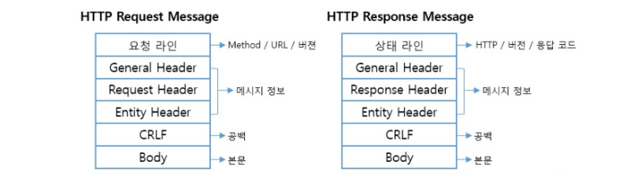
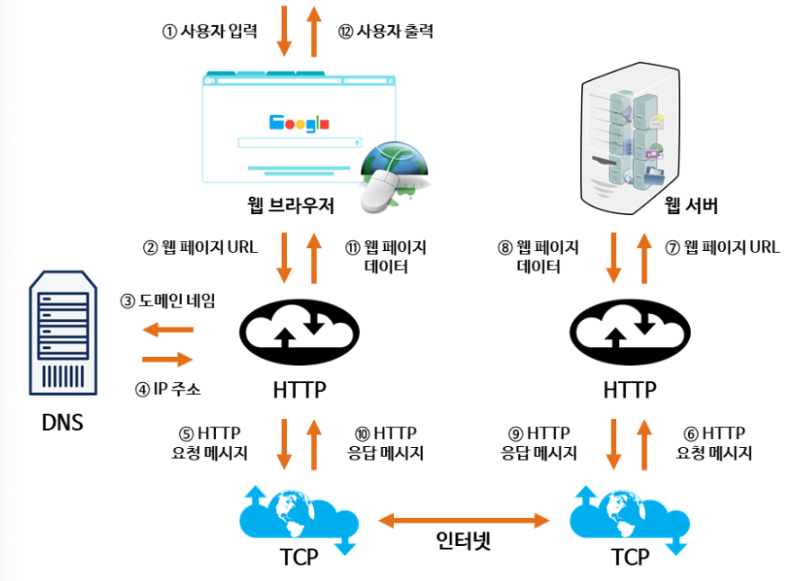

# 📌 Web통신과 DNS
기본적으로 웹 통신은 HTTP 프로토콜을 사용하여 통신한다. 웹에 연결된 컴퓨터는 클라이언트와 서버로 구분하고 클라이언트와 서버가 Request와 Response를 주고 받으며 통신이 일어난다.

## 📍 HTTP 작동 방식
- HTTP는 서버 / 클라이언트 모델을 따른다.
- HTTP는 서버와 클라이언트가 인터넷 상에서 데이터를 주고 받기 위한 프로토콜이다.
#### 장점
- 불특정 다수를 대상으로 하는 서비스에는 적합하다.
- 클라이언트와 서버가 계속 연결된 형태가 아니기 때문에 클라이언트와 서버 간의 최대 연결 수보다 훨씬 많은 요청과 응답을 처리할 수 있다.
#### 단점
- 연결을 끊어버리기 때문에 클라이언트의 이전 상황을 알 수가 없다.
- 이러한 특징 때문에 정보를 유지하기 위해서 Cookie와 같은 기술이 등장하게 되었다.

## 📍 Socket 통신
#### Server와 Client가 특정 Port를 통해 실시간으로 양방향 통신을 하는 방식
Socket 통신은 HTTP 통신과 달리 Server와 Client가 특정 Port를 통해 연결을 성립하고 있어 실시간으로 양방향 통신을 하는 방식이다. Client만 필요한 경우에 요청을 보내는 HTTP 통신과 달리 Socket 통신은 Server 역시 Client로 요청을 보낼 수 있으며, 계속 연결을 유지하는 연결지향형 통신이기 때문에 실시간 통신이 필요한 경우에 자주 사용된다.

### 특징
- Server와 Client가 계속 연결을 유지하는 양방향 통신이다.
- Server와 Client가 실시간으로 데이터를 주고 받는 상황이 필요한 경우에 사용된다.
- 실시간 동영상 Streaming이나 온라인 게임 등과 같은 경우에 자주 사용된다.

### 📍 HTTP Request 구조
➡️ GET: GET 요청 방식은 URI(URL)가 가진 정보를 검색하기 위해 서버 측에 요청하는 형태 

➡️ POST: POST 요청 방식은 요청 URI(URL)에 폼 입력을 처리하기 위해 구성한 서버 측 스크립트 혹은 CGI 프로그램으로 구성되고 Form Action과 함께 전송되는데, 이 때 헤더 정보에 포함되지 않고 데이터 부분에 요청 정보가 들어가게 된다. 

➡️ PUT: POST와 유사한 전송 구조를 가지기 때문에 헤더 이외에 메시지(데이터)가 함께 전송된다. 

➡️ DELETE: 원격지 웹 서버에 파일을 삭제하기 위해 사용되며 PUT과는 반대 개념의 메소드 

## 📌 웹 통신의 과정
#### IP 주소 
컴퓨터들의 고유 식별번호로 생각하면 되고 주소는 129.0.0.1과 같은 형태의 숫자로 나타난다. 
도메인 이름: 사람이 쉽게 외울 수 있도록 IP 주소를 문자로 표현한 것이다. 예를 들면 google.com이 도메인 이름에 해당한다. 
터미널을 키고 nslookup google.com을 입력해보면 google.com 도메인이 갖는 IP 주소를 알 수 있고 주소창에 해당 IP주소를 입력하면 도메인을 입력했을 때와 같은 결과를 얻는다. 
즉, 브라우저에 입력된 도메인 이름을 통해 해당 도메인의 IP주소를 얻은 뒤 통신을 시작할 수 있다는 것이다. 도메인 이름 -> IP 과정에서 필요한 도우미 역할을 하는 것이 DNS이다.

1. 사용자가 웹 브라우저를 통해 URL을 입력한다.
2. 입력된 URL 중 도메인 네임을 DNS 서버에서 검색한다.
3. DNS 서버에서 해당 도메인 네임에 해당하는 IP 주소를 찾아 사용자가 입력한 URL 정보와 함께 전달한다.
4. 웹 페이지 URL 정보와 전달받은 IP 주소를 이용해 HTTP 요청(=HTTP Request) 메시지를 생성한다.
5. 요청은 TCP를 통해 서버로 전송된다.
6. 서버는 클라이언트의 요청을 받고 응답(=HTTP Response)을 전송한다.

## 📌 DNS
DNS(Domain Name System)은 사용자가 숫자로 된 인터넷 프로토콜 주소 대신 인터넷 도메인 이름과 검색 가능한 URL을 사용하여 웹사이트에 접속하는 것을 가능하게 한다. 사용자는 IP 주소를 기억하는 대신 www.example.com을 검색할 수 있다. 
좀 더 쉽게 설명하자면 DNS는 인터넷의 전화번호부이다. 사용자가 naver.com, google.com과 같은 도메인 이름을 웹 브라우저에 입력하는 경우 DNS는 해당 사이트의 올바른 IP 주소를 찾는 역할을 한다. 
DNS는 전세계적으로 약속된 규칙을 공유하는데 상위 기관에서 인증된 기관에게 도메인을 생성하거나 IP 주소로 변경할 수 있는 권한을 부여한다. DNS는 이처럼 상위 기관과 하위 기관과 같은 계층 구조를 가지는 분산 데이터베이스 구조를 가진다.

### 📍 DNS 구성요소
➡️ Domain Name Space: DNS가 저장 관리하는 계층적 구조.  

➡️ Name Server: 권한 있는 DNS 서버  

➡️ Resolver: 권한 없는 DNS 서버  

### 📍 DNS 작동 방식
#### 퍼블릭 DNS
일반적으로 인터넷 서비스 제공업체가 기업에 IP 레코드를 제공한다. 이러한 레코드는 일반 대중에게 제공되며, 사용 중인 디바이스 또는 디바이스에 연결된 네트워크에 상관없이 누구나 액세스 할 수 있다.

#### 프라이빗 DNS
프라이빗 DNS는 회사의 방화벽 뒤에 존재하며 내부 사이트의 레코드만을 보관한다는 점에서 퍼블릭 DNS와 다르다. 이 경우 프라이빗 DNS의 범위는 내부 사이트 및 사용되는 서비스의 IP 주소를 기억하는 것으로 제한되며, 프라이빗 네트워크 외부에서 액세스 할 수 없다.

### 📍 도메인 주소가 IP로 변환되는 과정
1. 디바이스는 hosts 파일을 열어 본다. hosts 파일에는 로컬에서 직접 설정한 호스트 이름과 IP 주소를 매핑하고 있다.
2. DNS는 캐시를 확인한다.
- 기존에 접속했던 사이트의 경우 캐시에 남아 있을 수 있다.
- DNS는 브라우저 캐시, 로컬 캐시(OS 캐시), 라우터 캐시, ISP(Internet Service Provide) 캐시 순으로 확인한다.
3. DNS는 Root DNS에 요청을 보낸다.
- 모든 DNS에는 Root DNS의 주소가 포함되어 있다.

# 📌 로드밸런싱
로드 밸런싱은 서버로 들어오는 네트워크 트래픽을 여러 서버로 분산시켜 처리하는 기술을 말한다. 이는 웹사이트나 애플리케이션의 가용성과 성능을 향상시키는 데 중요한 역할을 한다. 로드 밸런서는 다수의 서버로 구성된 서버 그룹 앞에 위치하며, 들어오는 요청을 서버들 사이에 분배하며 이렇게 하면 어떤 서버도 과부하되지 않고, 모든 사용자 요청을 빠르고 효율적으로 처리할 수 있다.

1. 라운드 로빈(Round Robin): 들어오는 요청을 순서대로 각 서버에 분배한다. CPU 스케줄리의 라운드 로빈 방식 활용. 클라이언트의 요청을 순서대로 분배하기 때문에 여러 대의 서버가 동일한 스펙을 가지고 있고 서버와의 연결이 오래 지속되지 않는 경우에 활용하기 적합하다.
2. 가중 라운드 로빈(Weighted Round Robin): 서버마다 다른 가중치를 설정하고, 가중치가 높은 서버에 더 많은 요청을 할당한다. 주로 서버의 트래픽 처리 능력이 상이한 경우 사용하는 방식이다.
3. 최소 연결(Least Connections): 가장 적은 수의 활성 연결을 가진 서버에 새 요청을 할당한다. 자주 세션이 길어지거나 서버에 분배된 트래픽들이 일정하지 않은 경우에 적합한 방식이다.
4. IP 해시(IP Hash): 클라이언트의 IP 주소를 기반으로 서버를 선택하여, 특정 사용자의 모든 요청이 동일한 서버로 가도록 한다.

### 로드 밸런싱의 작동 방식

#### ➡️ Layer 4 로드 밸런싱

#### ➡️ Layer 7 로드 밸런싱

## 📌 면접 질문
#### - DNS iterative query와 DNS recursive query 차이점 설명해주세요. 
DNS iterative query는 계층에 맞는 도메인 서버에게 서버 주소를 질의하며 IP 주소를 반환받는 과정이다. 
DNS recursive query는 DNS 서버에게 질의를 던지는데 질문에 대한 응답을 찾을 때까지 계속해서 전달한다. 
그렇기 때문에 처리 시간이 길어지는 단점이 있다. 

#### - 도메인을 캐시에 저장하는데, 자주 찾는 도메인과 자주 찾지 않는 도메인을 각각 어디에 저장하는지 설명해주세요. 
자주 찾는 도메인은 메모리 캐시에 저장하고, 자주 찾지 않는 도메인은 디스크 캐시에 저장한다. 일정 시간 동안 캐시에 저장되어 유지되다가 TTL(Time To Live) 값이 만료되면 캐시에서 지워진다. 

#### - 자주 찾는 도메인은 메모리 캐시에 넣는데 왜 디스크 캐시에 넣지 않는지 설명해주세요. 
메모리 캐시는 디스크 캐시에 비해 빠른 속도로 데이터에 접근할 수 있기 때문이다. 메모리 용량은 한정적이기 때문에 자주 찾는 도메인만 메모리 캐시에 저장하고, 자주 찾지 않는 도메인을 디스크 캐시에 저장함으로써 메모리 용량을 효율적으로 관리할 수 있다.

# 📍 출처
https://woo0doo.tistory.com/11

https://junojunho.tistory.com/3

https://www.ibm.com/kr-ko/topics/dns
