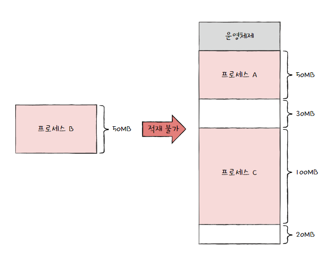
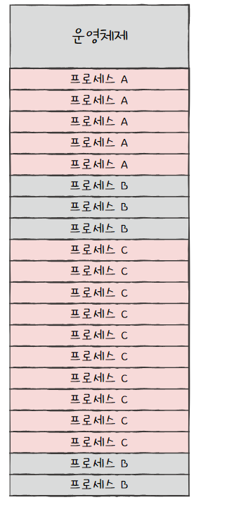
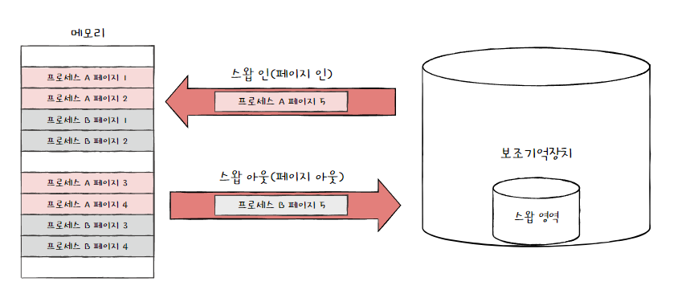

1. 페이징을 통한 가상 메모리 관리
    1. 페이징이란
    
   
  
     각기 다른 크기의 프로세스가 메모리에 연속적으로 할당 되었기 때문에 -> 외부 단편화의 문제 
     
      
     메모리와 프로세스를 일정한 단위로 자르고, 메모리에 불연속적으로 할당할 수 있다면 외부 단편화가 생기지 않는다. 

     페이징은 `프로세스의 논리 주소 공간`을 `페이지`라는 일정한 단위로 자르고, `메모리 물리 주소 공간`을 `프레임`이라는 페이지와 동일한 크기의 일정한 단위로 자른 뒤 페이지를 프레임에 할당하는 가상메모리 관리 기법.
     
    
     페이징 시스템에서의 swap-out은 page out , swap-in은 page in이라고 부르기도 한다. 

     
     이는 프로세스를 실행하기 위해 프로세스 전체가 메모리에 적재될 필요가 없다는 뜻.

    
    2. 페이지 테이블

        프로세스가 메모리에 불연속적으로 배치되어 있다면, CPU는 이를 순차적으로 실행할 수가 없다.  
        이를 해결하기 위해 페이징 시스템은 프로세스가 (실제 메모리 내의 주소인) 물리주소에 불연속적으로 배치되더라도 (CPU가 바라보는 주소인) 논리 주소에는 연속적으로 배치되도록 `Page Table`을 이용. 
        프로세스 마다 각자의 프로세스 테이블이 있다. 