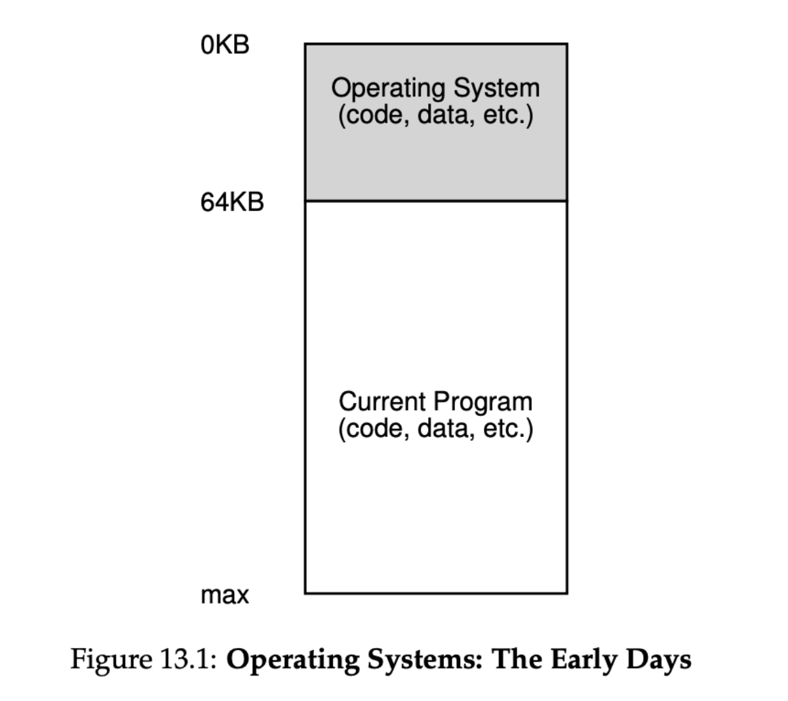
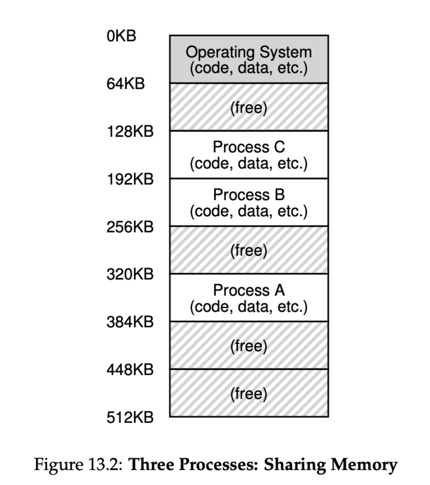
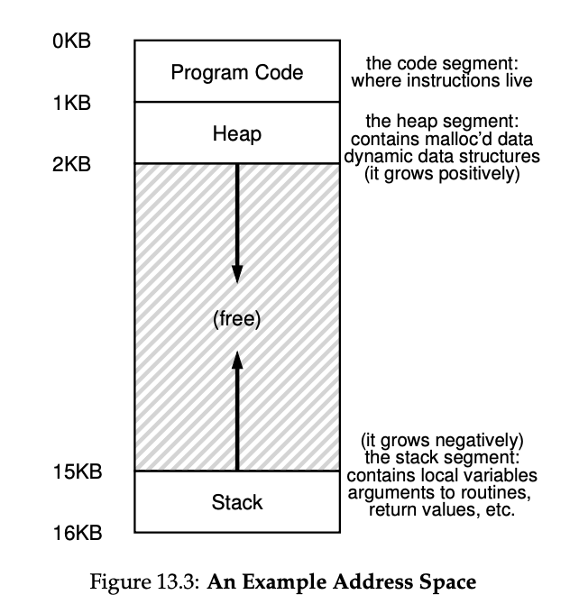
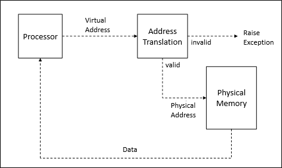
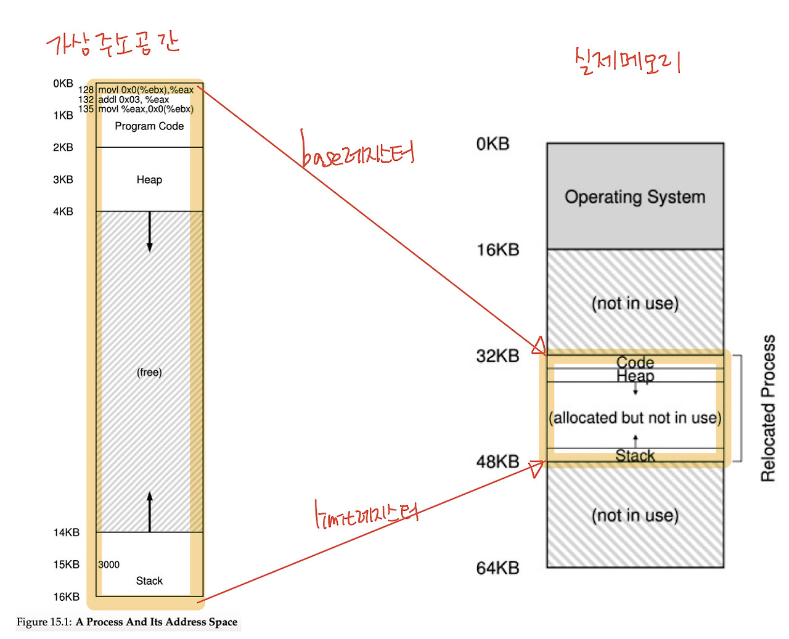

# 주소 공간(Address Space)
### ✏️ 초기 메모리 구성
> 운영체제와 현재 실행되는 프로그램이 메모리 독차지 -> 비효율적



### ✏️ 초기 메모리 V2.
> Memory Sharing을 통해 활용성(utilization)과 효율성(efficiency) 증대

> But, 다른 프로세스가 한 메모리에 존재하여 서로 데이터를 침범할 수 있는 가능성 존재 -> 보안 위협



### ✏️ 가상 메모리(Virtual Memory)
> OS가 실제 메모리(Physical Memory)를 추상화(Abstraction) 하여 Virtual Memory 생성 후 프로세스에게 부여


### ✏️ Adress Space 등장
> OS가 Physical Memory를 추상화해서 만든 Virtual Address(혹은 Logical Address) 공간 자체를 Address Space라고 함

> Address Space에는 Process의 전체 과정이 포함되어 있음



- 코드는 정적 -> 프로그램이 실행되면서 추가 메모리를 필요로 하지 않음 -> 최상단에 배치
- Heap, Stack 영역은 확장 가능성이 있기 때문에 서로 다른 방향에 배치(보통은 Heap이 상단에 배치하지만 변경 가능)

### ✏️ 가상화(Virtualization) 목표
- 투명성(Transparency)
    - 운영체제가 제공한 환상이 응용 프로그램에게 가상화된다고 생각하게 하면 안된다는 것
- 효율성(Efficiency)
    - OS는 가상화를 시간과 공간 측면에서 효율적이도록 진행
- 보호(Protection)
    - 프로세스를 다른 프로세스로부터 보호해야 함
    - 이에 프로세스를 격리(isolation)해야 함
- 물리적 메모리 한계를 뛰어넘기 위해
    - Virtual Memory는 물리 메모리와 보조 저장장치(HDD 등)을 함께 사용하여 프로세스가 사용할 수 있는 메모리 공간을 확장(Paging or Swapping)

<br>

# 주소 변환(Address Translation)
### ✏️ Address Translation?
> Virtual Memory를 Physical Memory로 변환하는 과정

> OS가 CPU 내 MMU(Memory Management Unit)의 도움을 받아 수행



### ✏️ 동적 재배치(Dynamic Relocation)(Pre - Address Translation)
> 주소 변환이 가능할 수 있도록 메모리에서 비어있는 위치로 가상주소를 매핑하는 과정

> Base Register & Bound(Limit) Register



<br>

- MMU 내에 있는 Base, Bound Register를 이용하여 배치
- 프로그램이 컴퓨터 메모리에 처음 load될 때 물리적 메모리 위치를 결정한다.

```
# Dynamic Reloaction(Easy Version)
컴퓨터 시스템에서 프로그램이 메모리에 적재될 때, 그 프로그램이 정확히 어떤 위치에 적재될지 미리 알 수 없습니다. 이는 여러 프로그램이 동시에 실행되고, 메모리 사용량이 계속 변화하기 때문입니다. 즉, 프로그램이 시작될 때마다 사용 가능한 메모리 위치가 달라질 수 있습니다.

여기서 동적 재배치의 역할이 중요해집니다. 동적 재배치는 프로그램이 메모리의 어느 위치에 적재되든 그 프로그램이 제대로 실행될 수 있도록 해줍니다. 이 과정에서 프로그램 내부에서 사용하는 모든 주소를 실제 메모리에서 프로그램이 적재된 위치에 맞게 조정합니다.

예를 들어보겠습니다:

프로그램 A가 메모리의 1000번지부터 시작해야 한다고 가정해 봅시다. 그런데, 프로그램이 실제로 메모리에 적재될 때는 5000번지부터 시작하는 공간이 비어있다고 합시다. 이때, 동적 재배치를 통해 프로그램 A가 참조하는 모든 주소를 4000만큼 증가시켜, 실제 메모리 위치에 맞게 조정해줍니다. 그 결과, 프로그램은 마치 1000번지부터 시작하는 것처럼 동작할 수 있게 됩니다.
이러한 과정을 통해, 시스템은 메모리를 훨씬 더 유연하게 관리할 수 있게 되며, 여러 프로그램이 동시에 실행되는 환경에서도 각 프로그램이 올바르게 작동할 수 있도록 보장할 수 있습니다. 동적 재배치는 이처럼 프로그램이 메모리 어디에 적재되어도 그 주소를 적절히 조정해, 프로그램이 제대로 실행될 수 있도록 하는 중요한 역할을 합니다.
```

### ✏️ OS Role
1. Process가 생성될 때 Address Space를 위해 Physical Memory에 여유 공간을 찾음
2. Process가 종료될 때 종료가 된 것을 Physical Memory에 적용
3. Context Switching 발생 시 Base, Bound Register 정보를 저장하고 복원
4. 예외 발생 시 Exception Handeler or Function 제공

> Context Switching  
: CPU가 현재 실행 중인 프로세스(또는 스레드)에서 다른 프로세스(또는 스레드)로 전환할 때 발생하는 과정

```
# Context Switching(Easy Version)
컨텍스트 스위칭이란, 운영체제가 여러 프로그램을 동시에 처리하기 위해 한 프로그램에서 다른 프로그램으로 CPU 사용 권한을 전환하는 과정을 말해요. 컴퓨터에서 여러 작업을 동시에 처리하는 것처럼 보이게 하는 중요한 기능이죠.

컨텍스트 스위칭을 쉽게 이해하기 위해, 여러분이 숙제를 하면서 동시에 요리를 해야 한다고 가정해 볼게요. 먼저 숙제를 하다가 요리가 필요한 시점에 숙제를 잠시 멈추고, 어디까지 했는지 (숙제의 '컨텍스트' 또는 상태), 필요한 책이나 자료는 어디에 놓아뒀는지 기록해둡니다. 그다음 요리를 시작하기 전에, 요리에 필요한 정보(요리의 '컨텍스트')를 확인합니다. 요리가 끝나면 다시 숙제로 돌아와서 멈췄던 부분부터 다시 시작하죠.

이 과정에서 숙제와 요리 사이를 오가며 각각의 상태를 저장하고 복원하는 것이 바로 컨텍스트 스위칭에 해당돼요. 컴퓨터도 마찬가지로 한 프로그램에서 다른 프로그램으로 전환할 때 현재 프로그램의 상태(컨텍스트)를 저장했다가, 나중에 다시 그 프로그램으로 돌아왔을 때 이전에 멈췄던 곳에서부터 작업을 재개할 수 있도록 해줍니다. 이렇게 해서 컴퓨터는 여러 프로그램을 동시에 실행하는 것처럼 작업할 수 있어요.
```

---
### 📢 질문 예상 List
1. 메모리 가상화의 목적은 무엇인가요?
2. 주소 변환은 무엇인가요?
3. 동적 재배치는 무엇인가요?


---
### 📌 Reference
- https://github.com/devSquad-study/2023-CS-Study/blob/main/OS/os_address_space.md
- https://github.com/devSquad-study/2023-CS-Study/blob/main/OS/os_address_traslation.md
- https://velog.io/@kshired/OSTEP-%EC%A3%BC%EC%86%8C-%EA%B3%B5%EA%B0%84%EC%9D%98-%EA%B0%9C%EB%85%90
- https://rntlqvnf.github.io/lecture%20notes/os-at-1/
- https://icksw.tistory.com/143