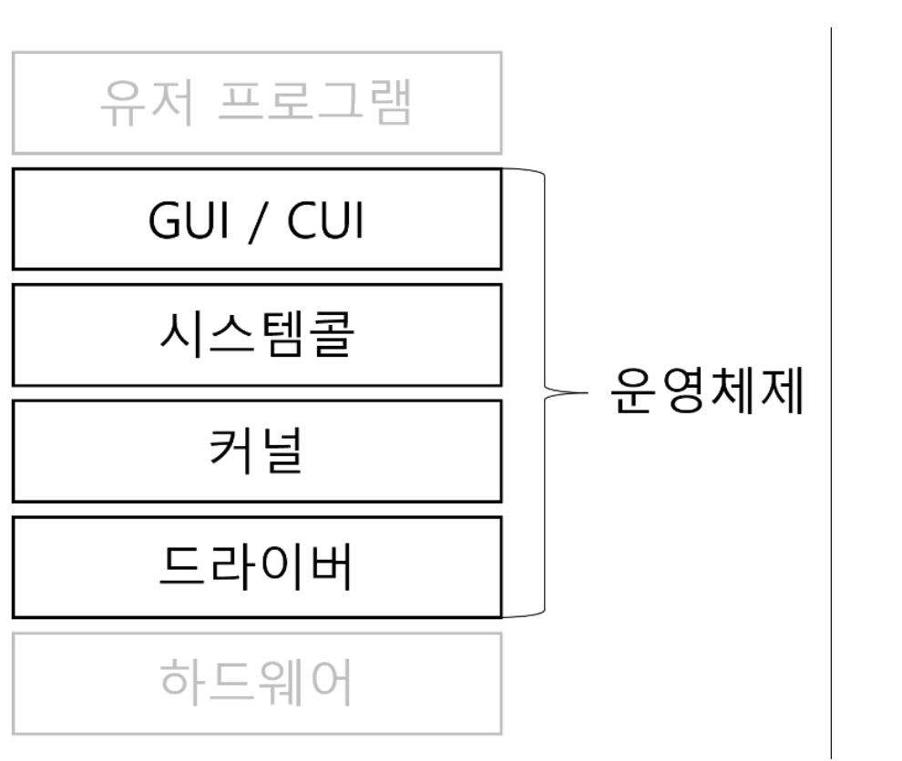

# Computer & OS
### ✏️ Computer
- Computer의 기본 구조
    > Computer : Hardware + Software
- Hardware : 물리적 장치
    - CPU, Memory(RAM, DISK) 등
- Software : Hardware가 특정 작업을 수행하도록 지시하는 명령어의 집합
    - 시스템 소프트웨어(OS포함), 응용 소프트웨어(워드 프로세서, 웹 브라우저 등)

### ✏️ Computer 구성
1. **CPU(Central Processing Unit)**
    > 모든 명령어를 처리하고 계산을 수행
    - ALU(Arithmetic Logic Unit, 산술논리연산장치)
        - CPU의 계산 중심 장치로 모든 산술 연산(덧셈, 뺄셈 등)과 논리 연산(AND, OR 등)을 수행
    - CU(Control Unit, 제어장치)
        - CPU 내 구성 요소들의 데이터 흐름 제어
        - CPU가 어떤 작업을 언제, 어떻게 수행할지 결정하는 역할
    - Register
        - CPU 내부에 위치하는 기억 장치로, 현재 수행중인 작업에 필요한 데이터와 명령어를 일시적을로 저장
2. **Memory**
    - RAM(Random Access Memory)
        - 현재 작업 중인 데이터와 프로그램을 일시적으로 저장하는 공간
        - 휘발성 메모리로 종료 시 내용이 사라짐
    - ROM(Read Only Memory)
        - 컴퓨터 부팅 시 필요한 입출력 시스템(BIOS)이나 펌웨어를 저장
        - 휘발성 메모리, 데이터를 읽을 수만 있으며 일반적으로 사용자에 의해 변경되지 않음
3. **저장장치**
    - HDD & SSD
        - 장기적은 데이터 저장을 위한 장치

### ✏️ OS(Operation System, 운영체제)
- 운영체제
    > 시스템 자원을 관리하여 효율적인 컴퓨터 작동을 보장하고, GUI를 제공하여 컴퓨터와 상호작용 할 수 있는 방법을 제공
    - Hardware와 Software 리소스 관리
    - 프로세스 관리
    - 메모리 관리
    - I/O 시스템 관리

- 운영체제 종류
    - Windows
    - macOS
    - Linux
    - Android & ios 등등

- 운영체제 구조

    

    > 리눅스의 경우, CUI만 있고 GUI는 없음

- System Call
    - 사용자 프로그램이 운영 체제의 커널 서비스를 요청할 수 있도록 하는 인터페이스
    - System Call을 통해 프로그램은 파일 시스템 관리, 프로세스 관리, 통신 등과 같은 운영 체제의 보호된 자원과 기능에 접근 가능

- Kernel
    - 컴퓨터 자원들을 관리하는 역할
    - 컴퓨터 자원만을 바라보고 있어 사용자와의 상호작용이 어려움

---
### 📢 질문 예상 List
1. 운영체제는 무엇일까요?

---
### 📌 Reference
- https://github.com/devSquad-study/2023-CS-Study
- https://velog.io/@ank0425/%EC%9A%B4%EC%98%81%EC%B2%B4%EC%A0%9C
- https://medium.com/@su_bak/os-%EC%BB%A4%EB%84%90-kernel-%EC%9D%B4%EB%9E%80-b6b8aae8d0b4