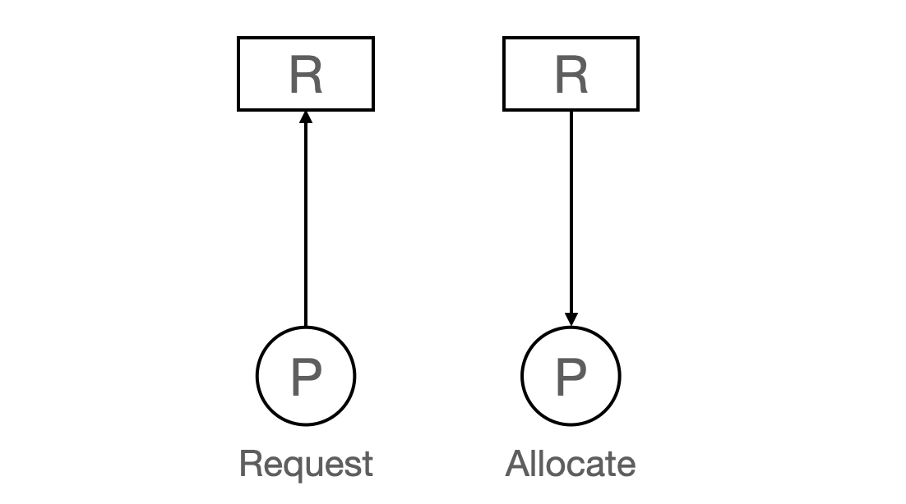
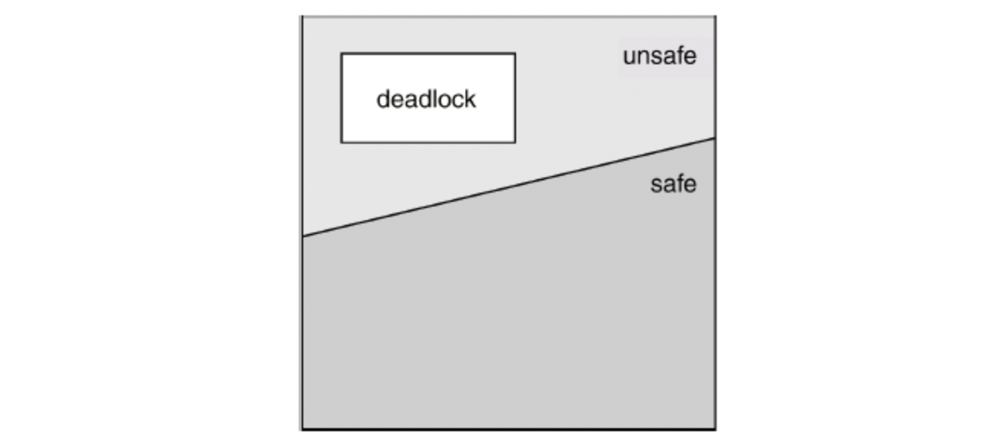

# DeadLock
### ✏️ DeadLock이란?
> Process들이 서로가 가진 자원(Resource)을 기다리며 Block 된 상태




### ✏️ Resource란?
- 하드웨어, 소프트웨어 등을 포함하는 개념
    > ex) I/O device, CPU Cycle 등
- 프로세스가 자원을 사용하는 절차
    > Request, Allocate, Use, Release

### ✏️ DeadLock 발생 조건
- 상호 배제(Mutual Exclusion)
    > 하나의 Process만이 자원을 사용할 수 있다.
- 비선점(No Preemption)
    > 이미 할당된 자원을 강제로 뺏을 수 없다.
- 점유 대기(Hold and Wait)
    > 다른 자원을 기다릴 때 보유한 자원을 계속 가지고 있는다.
- 순환 대기(Circular Wait)
    > 자원을 기다리는 프로세스 간 사이클이 형성 되어 있어야 한다.

**-> 위 조건 4개를 모두 만족해야, DeadLock 발생 가능성이 있음**

### ✏️ DeadLock 처리 방법
- 예방(Prevention)
    > 자원 할당 시 DeadLock의 4가지 필요 조건 중 어느 하나를 막겠다.
- 회피(Avoidance)
    > DeadLock의 가능성이 없는 경우에만 자원을 할당한다.
- 검출 및 복구(Detection & Recovery)
    > DeadLock 발생은 허용하되, 그에 대한 Detection 루틴을 두어 DeadLock 발견 시 Recover
- 무시(Ignorance)
    > DeadLock을 시스템이 책임지지 않는다.

### ✏️ 방법 - Prevention
> DeadLock 발생 조건 4가지를 각각 부정
- Mutual Exclusion 부정
    - Process가 자원을 공유할 수 있게 한다.
    - 단, 동기화 관련 문제 발생 가능성 존재
- No Preempttion 부정
    - 우선순위가 높은 Process가 자원 선점
    - 모든 필요한 자원을 얻을 수 있을 때 프로세스 시작
    - State를 쉽게 Save하고, Restore 할 수 있는 자원에서 주료 사용(CPU, Memory)

- Hold and Wait 부정
    - Process 실행에 필요한 모든 자원을 한번에 요구

- Circuit Wait 부정
    - 자원을 순환 형태로 대기하지 않도록 한다.

**-> 단, Utilization 저하, Throughout 감소, Starvation 문제가 존재**

### ✏️ 방법 - Avoidance
> 시스템 상태를 지속적으로 검사하여 DeadLock 가능성이 있는 자원 할당 요청을 거부하는 방법
- Safe State
    > Process에 대한 Safe Sequence가 존재하는 상태
    ```
    Safe Sequence란?
    프로세스들이 자원을 요청할 때, 그 요청이 현재 사용 가능한 자원과 이미 끝난 프로세스들이 사용하던 자원을 합친 것으로 충족될 수 있으면, 이 순서대로 프로세스를 진행시킬 수 있습니다.
    ```

    

- Avoidance 알고리즘(계산 복잡성 때문에 나눔)
    - Single instance per resource types
        - Resouce Allocation Graph Algorithm
            - 이 알고리즘은 시스템의 자원 할당과 프로세스 요구를 그래프로 표현하여 관리합니다.
            - 프로세스와 자원을 노드로, 할당과 요청을 에지로 나타내는 방식으로 동작합니다.
            - 그래프에 순환 구조가 발생하지 않도록 관리함으로써 데드락을 회피합니다. 순환 구조가 없다면 자원 할당이 가능하고, 있다면 자원 요청을 대기시키거나 거절함으로써 안전 상태를 유지합니다.     

    - Multiple instances per resource types
        - Banker's Algorithm
            - 은행원 알고리즘은 다중 자원 유형에 대해 보다 복잡한 시나리오를 처리할 수 있습니다.
            - 각 프로세스가 최대로 요구할 수 있는 자원의 양을 명시하여, 시스템의 현재 사용 가능한 자원과 비교하여 안전한 자원 할당 결정을 내립니다.
            - 프로세스의 요청이 시스템을 안전 상태로 유지할 수 있는지를 동적으로 평가하여 자원을 할당하거나 요청을 지연시킵니다.

    - 비교표
        | 알고리즘 유형                | 장점                                         | 단점                                       |
        |--------------------------|--------------------------------------------|------------------------------------------|
        | **자원 할당 그래프 알고리즘** | - 간단하고 직관적                             | - 다중 자원 유형 제한                         |
        |                          | - 구현 용이성                                 | - 확장성 문제                               |
        |                          | - 효율적인 처리                                | - 동적 변화에 대한 대응 어려움                    |
        | **은행원 알고리즘**          | - 다중 자원 관리                               | - 계산 복잡성                                |
        |                          | - 안전 상태 보장                               | - 시스템 성능 저하 가능성                       |
        |                          | - 유연성                                      | - 정보 요구 (모든 프로세스의 최대 자원 요구량 필요) |

### ✏️ 방법 - Detection and Recovery
> DeadLock 발생 여부 보다는 시스템 장애 시 DeadLock Detection -> 발견 시 Recovery
- DeadLock Detection
    > Avoidance 알고리즘과 비슷한 알고리즘으로 탐지

- DeadLock Recovery
    - Process Termination
        - Abort all deadlocked processes(모든 프로세스를 죽인다.)
        - Abort one process at a time until the deadloc cycle is eliminated(DeadLock 사이클이 없어질 때까지 하나씩 죽인다.)

    - Resource Preemption
        - 비용을 최소화 할 Victim 선정
        - Safe State로 RollBack하여 Process Restart
        - 단, Starvation 문제 발생 가능성 존재
            - 동일한 Process가 victim으로 선정되는 경우
            - RollBack 횟수도 같이 고려하여 Starvation 문제 해결 노력


### ✏️ 방법 - Ignorance
> DeadLock이 일어나지 않는다고 생각하고 아무런 조치도 취하지 않음

- DeadLock이 매우 드물게 발생하므로, 해당 장애를 조치하는 것 자체가 더 큰 Overhead일 수 있다.
- 만약 발생 시, 사람이 직접 죽이는 방법으로 대처
- Unix, Windows 등 대부분의 범용 OS가 채택

---
### 📢 질문 예상 List
1. DeadLock이 무엇인가요?
2. DeadLock의 발생 조건은?
3. 은행원 알고리즘의 장점과 단점은?

---
### 📌 Reference
- https://www.geeksforgeeks.org/introduction-of-deadlock-in-operating-system/
- https://velog.io/@ayoung0073/OS-Deadlock
- https://peonyf.tistory.com/entry/OS-DeadLock%EB%8D%B0%EB%93%9C%EB%9D%BD