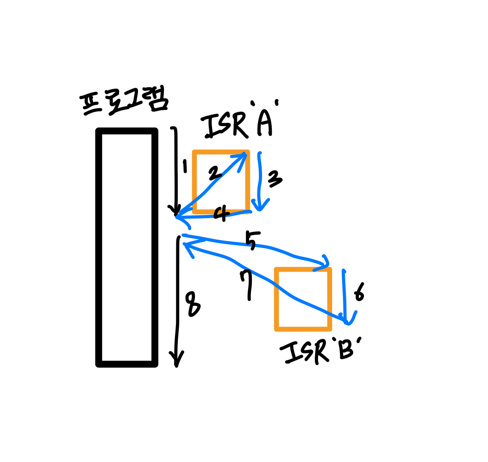
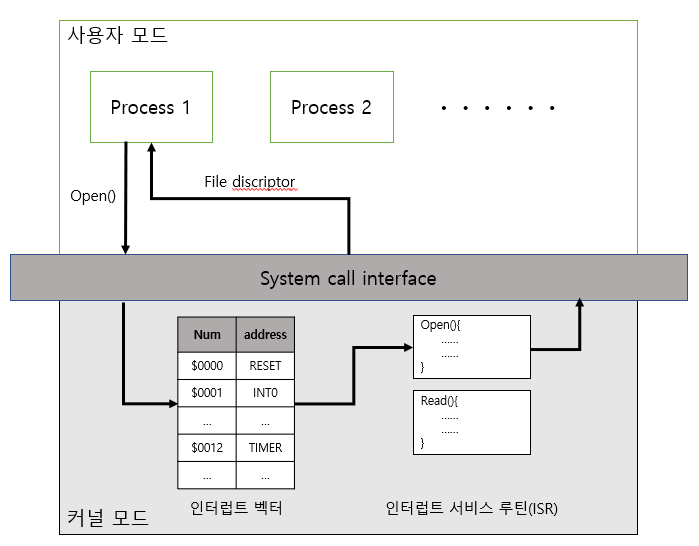

# 인터럽트
## 📍 인터럽트란?
인터럽트는 컴퓨터에서 실행 중인 프로그램의 흐름을 일시적으로 중지시키고, 특정 작업(ISR)을 수행한 뒤 원래의 작업으로 돌아가게 하는 메커니즘이다. 인터럽트는 발생시기를 예측하기 힘든 경우에 컨트롤러가 가장 빠르게 대응할 수 있는 방법이다.

### 🏷️ 인터럽트 서비스 루틴(ISR)
ISR은 특정 인터럽트에 응답하여 실행되는 함수나 프로그램이다. ISR의 주된 역할은 인터럽트가 발생한 원인을 처리하고, 필요한 경우 시스템이 원래의 작업으로 안전하게 돌아갈 수 있도록 하는 것이다.
1. 주 프로그램 작업 수행 중 인터럽트 발생
2. 주 프로그램 상태 레지스터와 PC 등을 스택에 잠시 저장(나중에 주 프로그램으로 복귀할 때 복원하기 위함)
3. ISR로 인터럽트 처리
4. 다시 주 프로그램 작업 복귀

인터럽트는 하드웨어 인터럽트와 소프트웨어 인터럽트로 나뉜다.

### 📍 하드웨어 인터럽트(외부 인터럽트)
*하드웨어 인터럽트*는 외부 장치(키보드, 마우스, 디스크 등)에서 발생하며 주로 입출력 작업의 시작이나 완료를 알리는 데 사용된다. CPU의 하드웨어 신호에 의해 발생한다. 예를 들어 키보드 키가 눌렸을 때 CPU에 알리기 위해 하드웨어 인터럽트가 발생한다. 입출력 장치, 타이밍 장치, 전원 등 외부적인 요인으로 발생한다.

### 📍 소프트웨어 인터럽트(내부 인터럽트)
*소프트웨어 인터럽트*는 프로그램의 실행 도중에 소프트웨어에 의해 의도적으로 발생한다. 예를 들어, 운영 체제는 프로그램이 시스템 호출을 할 때 소프트웨어 인터럽트를 사용하여 해당 호출을 처리한다. Trap이라고 부르며 잘못된 명령이나 데이터를 사용할 때 발생한다. 예를 들어 0으로 나누거나 오버플로우, 명령어를 잘못 사용한 경우 내부 인터럽트가 발생한다.

### 🏷️ 폴링과 인터럽트 차이
인터럽트와 폴링 방식은 외부 장치로부터 데이터를 받거나 장치의 상태를 확인하는 두 가지 주요 기법이다.

    인터럽트 방식 :

    1. 하드웨어 장치가 특정 사건이 발생했을 때 CPU에 알린다.
    2. CPU는 현재 수행 중인 작업을 일시 중단하고 해당 사건을 처리하기 위해 ISR을 실항한다.
    3. 처리가 완료된 후, CPU는 원래의 작업으로 돌아간다.

    -> 인터럽트는 CPU가 다른 작업을 수행하는 동안에도 외부 사건에 즉각적으로 반응할 수 있게 해준다.

    폴링 방식 : 

    CPU가 정기적으로 하드웨어 장치의 상태를 체크(폴링)하여 특정 조건이 충족되었는지를 확인한다. 이는 CPU가 지속적으로 장치의 상태를 확인해야 하므로 CPU 자원을 비효율적으로 사용할 수 있다. 이 방식은 버스, 멀티포인트 형태와 같이 여러 개의 장치가 동일 회선을 사용하는 상황에서 주로 사용된다.

### 📍 이중 동작 모드
사용자와 OS는 시스템 자원을 공유한다. 이 때 사용자에게 제한을 두지 않는다면 사용자가 메모리 내 주요 리소스를 손상시킬 가능성이 존재한다. 그렇기 때문에 사용자의 시스템 자원을 막는 보호 장치가 필요하다. 이를 위한 것이 이중 동작 모드이다.

이중 동작 모드는 OS가 사용자 모드와 커널 모드, 두 가지 모드로 작동하는 방식이다. 커널 모드와 사용자 모드를 구분하기 위해서 mode bit이 사용된다. 0이 커널 모드, 1이 사용자 모드이다. OS는 일부 명령들을 특권 명령으로 지정하고 커널 모드에서만 실행되게 하며 사용자 모드에서 실행하려고 하면 Trap을 건다.

이중 동작 모드의 프로세스를 살펴보자.

1. 프로세스는 기본적으로 사용자 모드에서 실행된다. 이는 제한된 권한 하에서 실행되는 것이며 직접적으로 하드웨어 자원에 접근할 수 없다.
2. 시스템 콜이 발생하게 되면 프로그램이 프로그램이 파일 접근, 네트워크 통신 등과 같은 시스템 자원이 필요한 작업을 요청할 때, 시스템 콜을 통해 커널에게 작업 실행을 요청한다. 이 때 프로세스는 사용자 모드에서 커널 모드로 전환된다.
3. 프로세스가 커널 모드로 전환되면, 커널은 요청된 시스템 콜에 따른 작업을 수행한다. 이 때 커널은 모든 하드웨어 자원에 접근할 수 있는 권한을 가지고 있으므로 필요한 시스템 자원을 제어하거나 데이털르 처리할 수 있다.
4. 커널이 요청된 작업을 완료하면 프로세스는 다시 사용자 모드로 전환된다.

🏷️ 시스템 콜이란?

시스템 콜은 사용자 모드에서 실행되는 프로그램이 운영 체제의 커널 기능을 사용하기 위해 커널에게 요청을 보내는 메커니즘이다. 예를 들어, 파일 읽기, 쓰기, 네트워크 통신, 프로세스 생성 및 종료와 같은 작업을 수행하려 할 때 시스템 콜이 사용된다. 운영체제 서비스를 접근하기 위한 유일한 수단이며 프로그램을 실행하거나 프로그램이 컴퓨터 자원을 사용하기 위해서는 시스템 콜을 통해 커널에 자원 사용을 요청을 해야 한다.

🏷️ 인터럽트 벡터란?

인터럽트 벡터는 인터럽트가 발생했을 때, 그 인터럽트를 처리할 수 있는 서비스 루틴들의 주소를 가지고 있는 공간이다. 인터럽트는 특정 작업을 수행하기 위해 ISR의 실행을 요구한다. 인터럽트 벡터는 이러한 ISR의 시작 주소를 가리키는 역할을 하고 인터럽트가 발생하면 시스템은 인터럽트 벡터를 참조해서 해당 인터럽트에 대응하는 코드를 실행한다.

- 커널 모드

커널 모드에서는 OS의 핵심 부분인 커널이 실행된다. 커널은 시스템의 모든 하드웨어와 직접적으로 상호 작용할 수 있는 권한을 가지고 있으며 사용자가 접근할 수 없다. 커널 모드는 supervisor mode, system mode, privileged mode라고도 부른다.

- 사용자 모드

사용자가 접근할 수 있는 모드이다. 

# 출처
- [https://velog.io/@adam2/인터럽트](https://velog.io/@adam2/%EC%9D%B8%ED%84%B0%EB%9F%BD%ED%8A%B8)

- https://latter2005.tistory.com/43

- [https://github.com/gyoogle/tech-interview-for-developer/blob/master/Computer Science/Operating System/Interrupt.md](https://github.com/gyoogle/tech-interview-for-developer/blob/master/Computer%20Science/Operating%20System/Interrupt.md)