> # 📌 1. 페이지 테이블의 메모리 낭비

### 💡 **32비트 CPU에서 프로세스 당 page table 크기**

💬 **프로세스의 주소 공간**

프로세스의 논리적 주소 공간 4GB, 각 페이지 크기는 4KB씩 할당되어진다.

따라서 각 프로세스마다 4GB / 4KB = 2^32 / 2^12 = 2^20 = 약 100만 개의 page 구성

💬 **각 프로세스 당 page table의 크기**

한 항목마다 하나의 프레임 정보를 저장하기 위해서

한 항목이 4바이트이면 2^20 개 \* 4byte = 4MB

여기서 문제는, 한 프로세스 마다 페이지 테이블이 4MB씩 할당되어진다는 점.

이 때 한 프로세스가 정작 10MB 메모리를 사용하게 된다면?

---

### 💡 **10MB 메모리를 사용하는 프로세스 가정 시**

💬 **실제 활용되는 page table 항목 수**

10MB / 4KB (=페이지 단위) = 10 _ 2^20 / 2^12 = 10 _ 2^8 = 2560 개

즉, 전체 100만개의 페이지 테이블 항목 중에서 그저 2560 개의 페이지만 사용하게 되어지면, 그 사용 비율은 아래와 같다…

💬 **실제 활용되는 page table 비율**

10\*2^8 / 2^20 = 10/2^12 = 약 0.0024 로 매우 낮다!

> # 📌 2. 페이지 테이블 낭비 문제의 해결책

## ☑️2.1 역 페이지 테이블 (Inverted Page Table, IPT)

### 💡 페이지 테이블을 물리적인 메모리 주소 공간에 대응시킨 값으로 구성

기존의 페이지 테이블은 각 프로세스마다 **논리 주소 공간에 대응되어지는 물리 주소 공간**을 표현

역 페이지 테이블은 그 기준이 논리적인 주소가 아닌 **물리 주소 공간**이라는 점에서 차이

---

### 💡 각 항목은 메모리의 각 frame에 대응

페이지 테이블의 각 항목은 그저 메모리의 각 프레임에 대응되어져서 하나의 시스템에서는 하나의 페이지 테이블만 존재하게 된다

**역 페이지 테이블 항목의 수 = 현재 시스템의 프레임 수**

기존의 테이블은 프로세스마다 테이블이 존재했지만, 실질적으로 현재 물리적인 메모리의 어떤 프레임을 사용하는지만 확인해보면 되는 것이기 때문에 그저 **물리적인 메모리의 각 프레임에 대한 정보를 가지고서 이 프레임이 어떤 프로세스의 몇 번째 페이지를 나타낸다** 라는 정보를 저장해두겠다! 라는 뜻

---

### 💡 구성

역 페이지 테이블의 index = frame 번호

역 페이지 테이블 항목 = **[pid, p]**

논리 주소 형식 = **[pid, p, offset]**

---

### 💡 예시

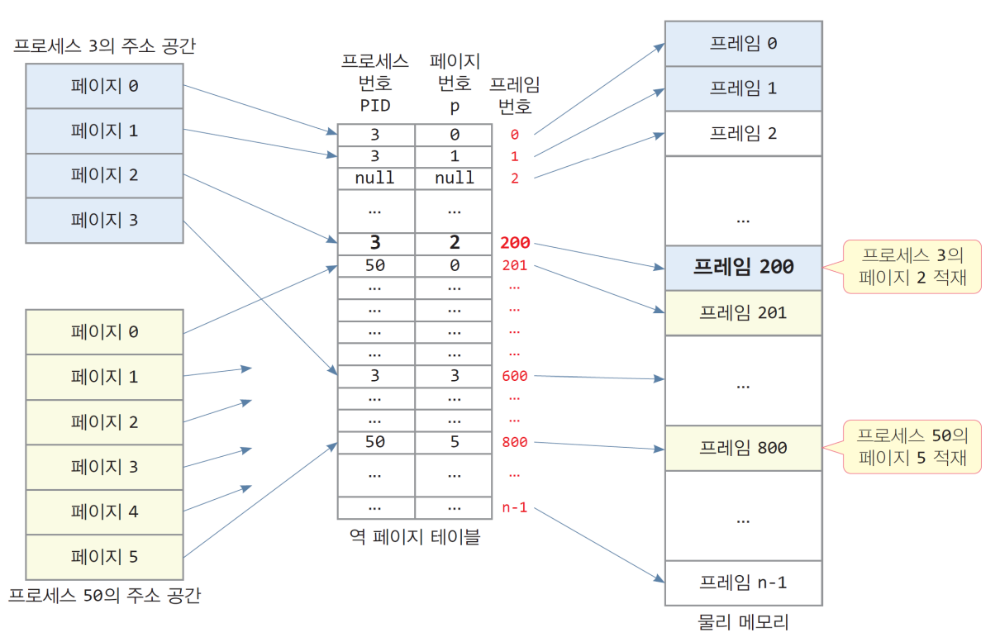

물리적인 메모리를 N개의 프레임으로 나누었다 라고 한다면, 역 페이지 테이블의 경우 N개의 항목을 갖고있는 페이지 테이블을 구성하게 될 것이다. <u>**역 페이지 테이블의 인덱스는 그저 프레임 번호를 할당해서 제일 앞을 0번 프레임, 가장 마지막을 N번 프레임에 대한 항목을 갖고있다고 표현.**</u>

페이지 테이블의 각 항목에는 어떤 프로세스의 몇번 페이지가 저장되어있다고 저장.

예를 들어 첫 번째 프레임에는 3번 프로세스의 0번 페이지가 저장되어있다는 정보를 기록

다시말해서 <u>**N개의 프레임**</u>을 갖고있기 때문에 <u>**N개 프레임**</u>들이 <u>**어디에 할당**</u>되어져 있는지를 저장해주는 방식

**💬 주소 변환 과정 #1 : 정보 탐색**

하나의 논리주소에 해당하는 정보를 역페이지 테이블에서 검색해 일치하는 부분을 발견하게 되어지면 (ex. 3번 프로세스의 1번 페이지에 속한 어떤 논리주소가 사용되어진다면 “3번 프로세스에 할당되어진 1번 페이지가 현재 1번 프레임에 할당되어있다"라는) 정보를 찾아낼 수 있다.

역페이지 테이블의 모든 항목들을 다 조사하는 일이 필요해서 오버헤드가 발생할 수도

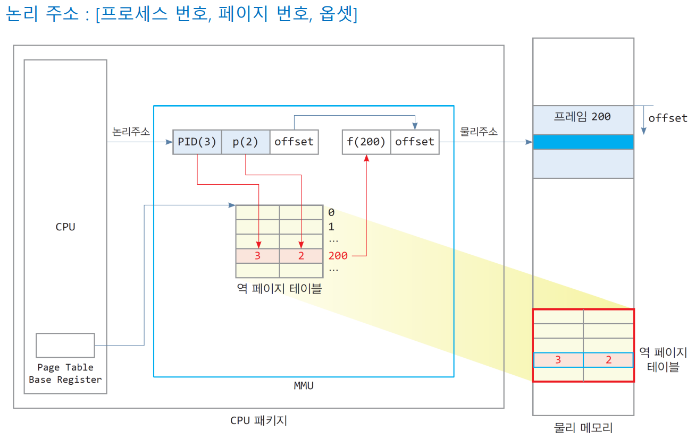

**💬 주소 변환 과정 #2 : 물리적인 주소 생성**

현재 3번 프로세스가 사용되어지는 2번 페이지가 접근되어질 필요가 있다고 했을 때, 역페이지 테이블의 모든 항목들을 순차적으로 접근해보는 과정을 통해 3번 프로세스에 대한 2번 페이지가 몇번 프레임에 저장되어져있는지를 살펴보게 된다. 현재 구성에서는 200번째 테이블 항목에 일치하는 요소를 발견. 따라서 200번 프레임에 할당되었다는 정보를 얻을 수 있다. 프레임 번호를 기반으로 해서 하나의 물리적인 주소를 만들어낼 수 있게 되어진다.

전통적인 페이징과 마찬가지로 역 페이지 테이블 역시 물리적인 메모리 어딘가에 저장되어져 있을 수 있고, 반복적인 사용들을 효율적으로 사용하기 위해 TLB를 이용해 구성해볼 수 있을 것이다.

다만, 전통적인 페이징과는 다르게 현재 특정 프로세스에 대한 페이지 번호를 역페이지 테이블에서 찾기 위해서는 페이지 테이블에 있는 모든 내용들을 다 일일이 순차적으로 검색해봐야하는 오버헤드가 발생할 수 있다.

---

### 💡 역 페이지 테이블의 크기

**💬 역 페이지 테이블의 항목 크기**

**프로세스 번호(pid)와 page 번호(p)로 구성**

- pid과 p가 각각 4바이트라면 한 항목 크기는 8바이트
- 역페이지 테이블의 항목 수 = 물리 메모리 크기 / 프레임 크기
- 가능한 물리 메모리 최대 크기가 4GB, 한 프레임 크기가 4KB이면 역 페이지 테이블의 항목 수는 4GB / 4KB = 2^20개 = 약 100만개
- 역 페이지 테이블의 크기 = 2^20개의 항목 \* 8byte = 총 8MB 필요
- 실제 역 페이지 테이블의 크기는 컴퓨터에 설치된 물리 메모리 크기에 따라 달라진다. 물리 메모리는 컴퓨터마다 서로 다르게 설치될 수 있다.

**💬 10개의 프로세스가 실행 중일 때**

기존의 page table의 크기 = 프로세스 10개 \* 4MB짜리 페이지 테이블 = 40MB (프로세스마다 페이지 테이블 따로따로 존재)

역 페이지 테이블의 크기= 8MB (전통적인 페이징과는 달리 시스템에서 단 하나만 존재하면 된다.)

프로세스가 100개가 된다면 어떨지 생각해보자.

---

### 💡 **특징**

page table 크기를 획기적으로 줄일 수 있다.

특정 page frame을 탐색하기 위해 더 많은 시간 소요 (page table 전체를 검색해야 하기 때문)

탐색 시간을 줄이기 위해 hash table 사용할 수도

- 3번의 메모리 조작 발생 (hash table → inverted page table → 주기억장치)
- 그래서 TLB와 같은 고가의 연관 메모리 (Associate memory) 사용. 고가의 비용 발생하나 효율성을 보완해낼 수 있다.

## ☑️ **2.2 멀티 레벨 페이지 테이블 (multi-level page table)**

### 💡 **정의**

**💬 논리 주소 공간을 여러 단계의 page table로 나눔**

- 한 프로세스에 대한 논리 주소 공간을 페이징해서 몇 개의 페이지로 나누어놓고 그렇게 구성되어진 페이지 테이블을 또다시 페이징 해주는 … → 페이지 테이블을 수십~ 수백 개의 작은 페이지 테이블로 나누고 이들을 여러 레벨로 구성
- 즉, 대용량의 page table을 주기억 장치처럼 취급해 다시 페이징 함.
- page table 자체를 위한 paging 기법
- 사용 중인 page들에 대해서만 page table 구성 (기존 page table의 낭비를 줄임)

---

### **💡 예시 : Two-level paging scheme**

**💬 page table을 다시 페이징**

전통적인 페이징에서 offset을 제외한 나머지 부분을 page number로 나타내기로 했었다. offset에 비해 상대적으로 많은 비트 수를 차지.

논리 주소의 page 번호 부분을 2개의 레벨로 나눔

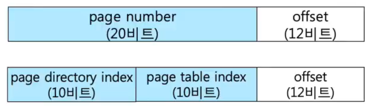

**💬 논리 주소 구성**

- [page directory index, page table index, offset]
- page 크기 4KB 일 때
  - 논리 주소의 하위 12bit : page 내 offset 주소
  - 논리 주소의 상위 20bit : page 디렉터리 index와 page 테이블 index
- 페이지 디렉토리와 페이지 테이블의 트리 구조
- <u>**사용 중인 페이지들에 대해서만 페이지 테이블 할당**</u>

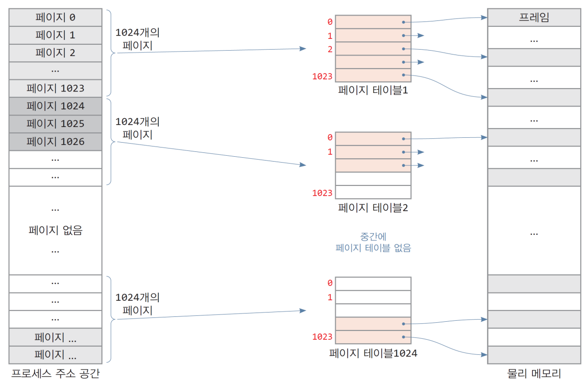

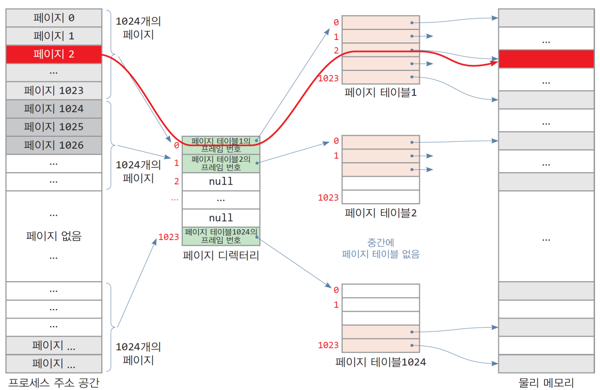

**💬 테이블 구성에 대해 더 자세히 살펴보자면 . . .!**

개념과 같이 하나의 논리적인 주소에서 offset 부분을 제외한 나머지 부분이 페이지 번호가 되어진다. 이를 두 파트로 나누어서 page directory index에 10bit를 할당했다고 가정해보자.

총 10bit를 가지고 만들 수 있는 서로 다른 주소의 가짓수는 2^10 개. <u>**페이지 디렉터리 라는 테이블을 통해 1024개 중 어느 한 부분을 가리킬 수 있게 된다.**</u>

이 부분은 실제적으로 <u>**각각의 frame 번호를 탑재하고 있는 1024개의 서로 다른 페이지 테이블들을 각각 식별**</u>할 수 있는데 사용되어져서 <u>**현재 내가 선택되어진 페이지 테이블 중에서 페이지 테이블 인덱스를 가리키는 번째의 요소가 현재 내가 접근하고자하는 frame 번호를 담고 있는 페이지 테이블 요소**</u>가 되어진다.

그 <u>**frame 번호**를 가지고 **하나의 물리적인 주소**</u>를 만들어서 접근할 수 있게 된다.

즉, <u>**하나의 페이지 테이블을 두는 것 대신에 이렇게 여러 개의 페이지 테이블로 나누어서 구성**</u>한다. 녹색 부분으로 표현한 세 부분에 대한 정보들은 페이지 테이블을 할당받아서 유지하도록 한다. 흰색 부분들은 사용하고 있지 않은 테이블들이니까 굳이 테이블을 할당하지 않아도 된다.

page directory 를 위해서 4KB가 할당되어지고, 녹색 부분과 연관되어진 3개의 테이블을 위해서 4KB가 할당되어져서 총 16KB의 공간만 사용하묜 된다. 기존 방식에 비해서 불필요한 메모리 사용을 줄일 수 있는 방식

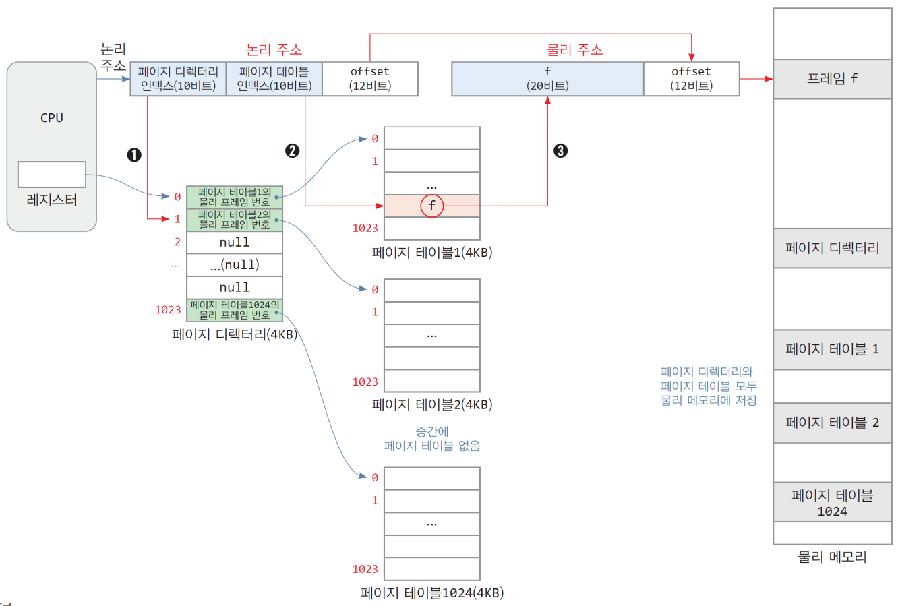

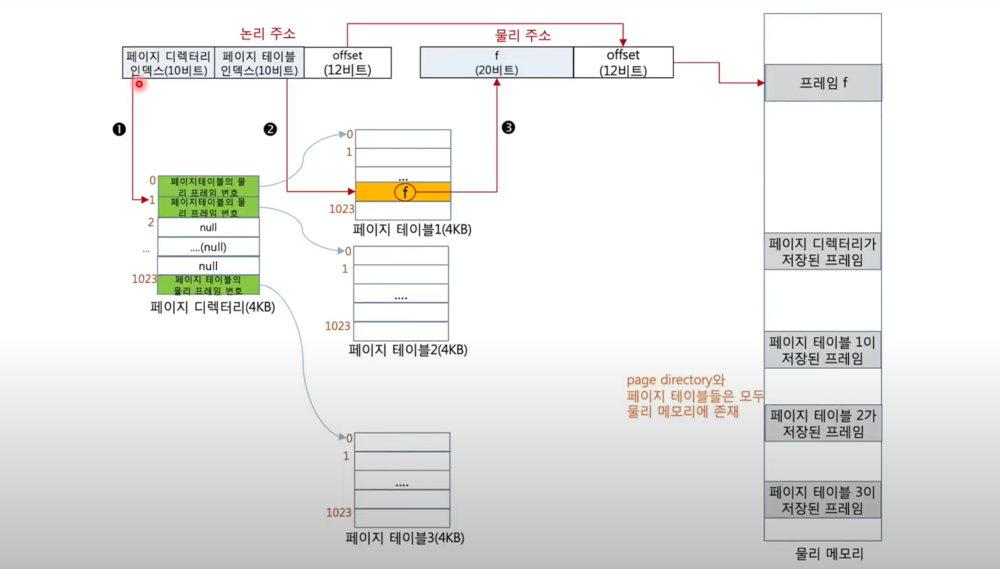

---

### 💡 테이블 크기

**💬 2-레벨 페이지 테이블의 최대 메모리 소모량**

- 페이지 디렉터리 1개 + 최대 1024개의 페이지 테이블
- = 4KB + 1024\* 4KB = 4KB + 4MB
- 하지만, 일반적으로 프로세스는 1024개의 페이지 테이블을 모두 사용하지 않음

**💬 [사례1] 프로세스가 1000개의 페이지로 구성**

- 1000개의 페이지는 1개의 페이지 테이블에 의해 매핑 가능
- 메모리 소모량1개의 페이지 디렉터리와 1개와 1개의 페이지 테이블= 4KB + 4KB = 8KB

**💬 [사례2] 프로세스가 400MB 크기인 경우**

- 프로세스의 페이지 개수 = 400MB/4KB = 100x1024개100개의 페이지 테이블 필요
- 메모리 소모량1개의 페이지 디렉터리와 100개의 페이지 테이블= 4KB = 100 x 4KB = 404KB

**💬** **[결론]**

- 기존 페이지 테이블의 경우 프로세스 크기에 관계없이 프로세스 당 4MB가 소모
- 2-레벨 페이지 테이블의 경우 페이지 테이블로 인한 메모리 소모를 확연히 줄일 수 있다.

---

### **💡 2-level page table 형성 과정**

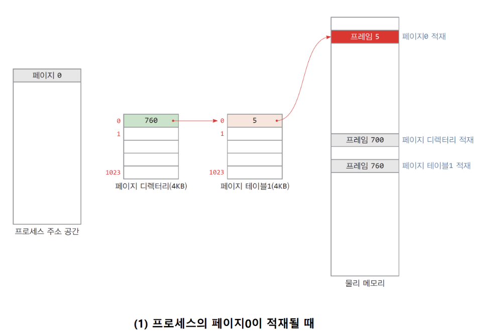

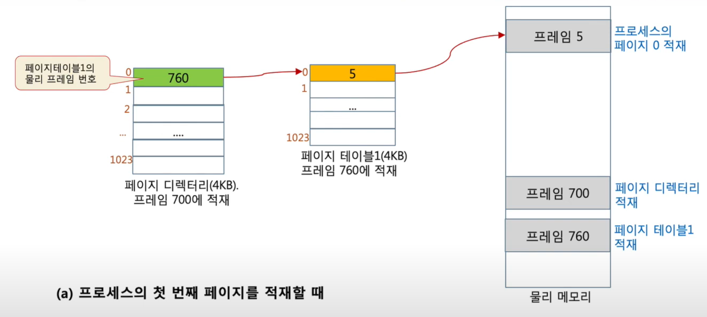

**💬 프로세스의 page#0 (첫번째) 적재**

프로세스가 실행되어질 때 운영체제는 위 그림과 같이 **페이지 디렉터리 1개와 페이지 테이블 1개를 생성**. 이들은 기본적으로 모두 물리적 메모리에 적재된다. 현재 페이지 디렉토리는 700번째 프레임에 적재되어있다고 가정하고, 1번째 페이지 테이블은 760번 프레임에 적재되었다고 가정. 실제 내가 접근하고자 하는 빈 프레임 중 하나, 예를 들어 5번 프레임을 찾아서 현재 페이지 테이블에 기술을 해주면 현재 프로세스에서 접근하고자 하는 메모리를 할당해줄 수 있게 되어진다.

---

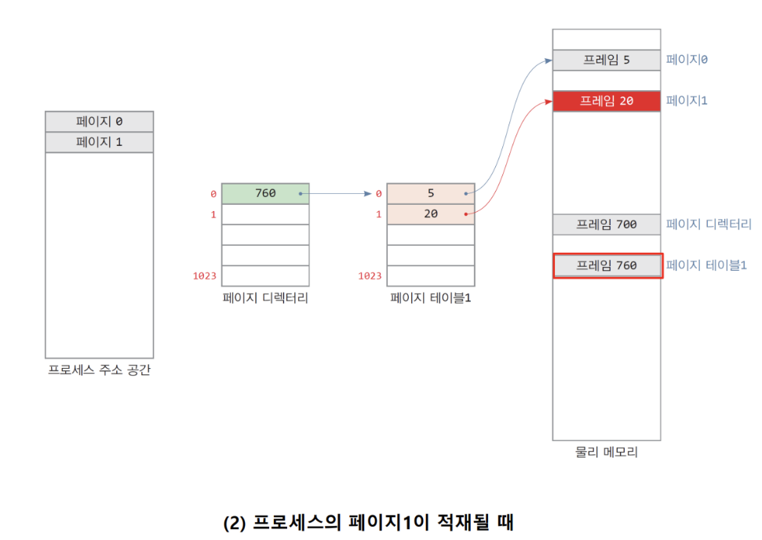

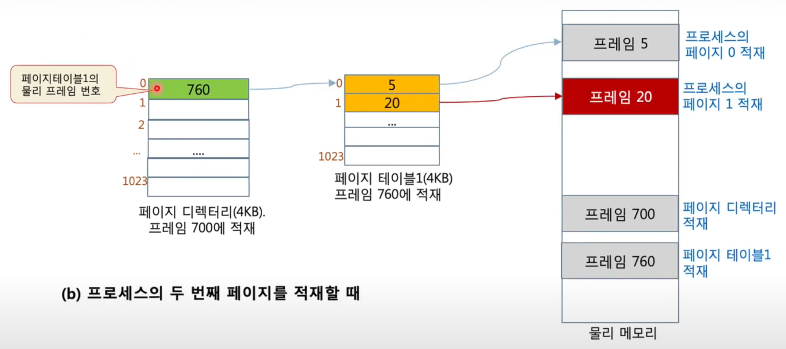

**💬 프로세스 page#1 (두번째) 적재**

이후 프로세스가 2번째 페이지를 적재하고자 한다면, 추가적인 빈 프레임, 예를 들어 20번째 프레임이라면 첫번째 디렉토리의 1번항목에 20번 프레임이라는 정보를 기록해놓을 수 있다. 이후 과정들이 순차적으로 진행되고 나면

---

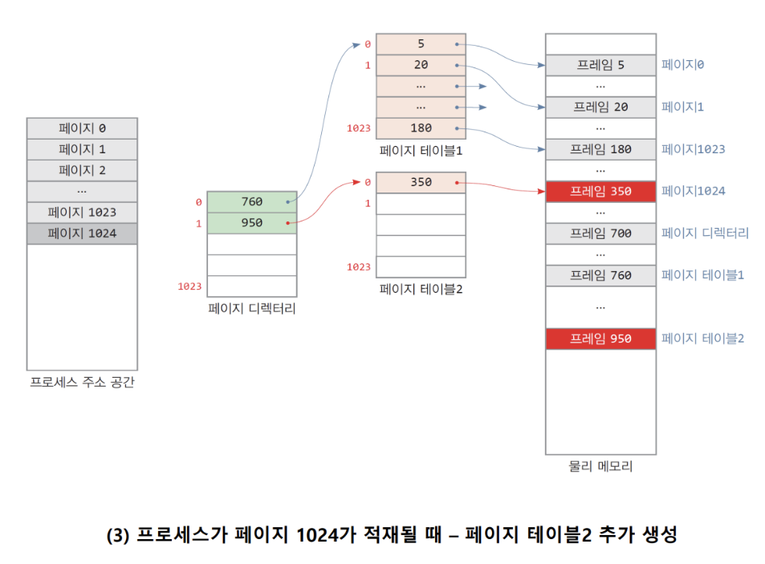

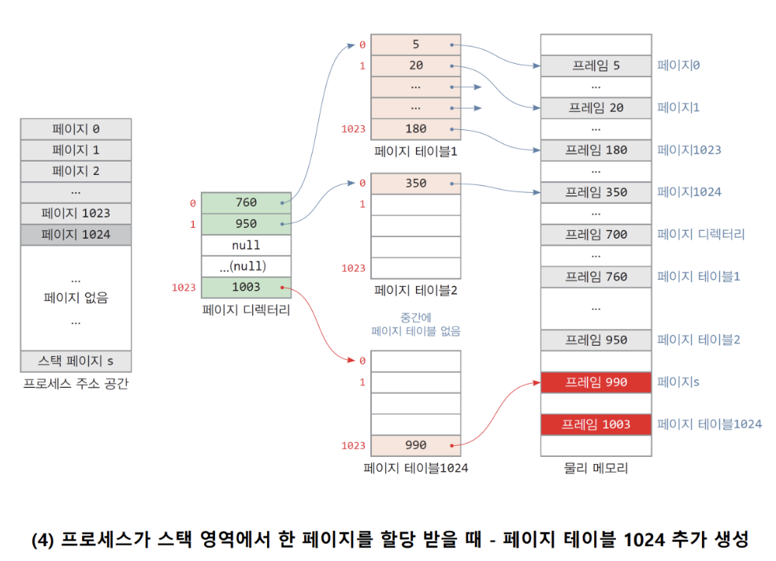

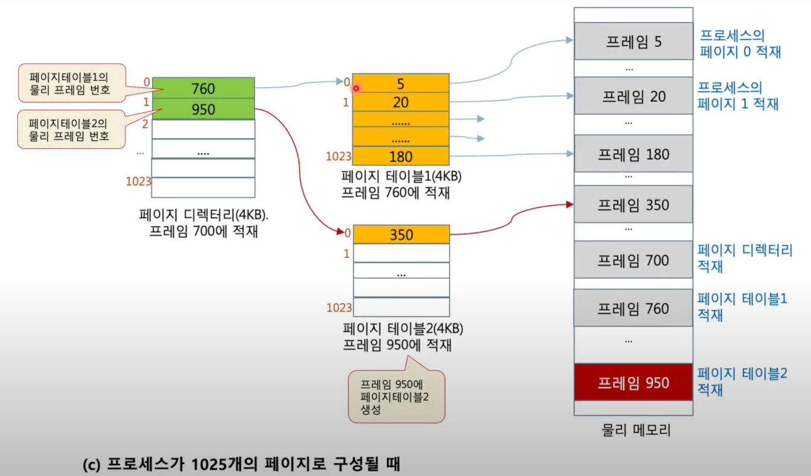

**💬 추가적인 페이지 테이블 생성 시**

첫 번째 디렉토리에 대한 모든 항목들의 프레임 할당이 이루어지게 되면, 이후 운영체제는 두 번째 디렉토리를 새로 할당을 해주어서, 예를 들어 950번 프레임이 할당되었다고 하면 950번 프레임에 하나의 페이지 테이블을 할당해주고, 그 공간을 활용해서 또 이후 할당들을 채워나갈 수 있는 방식으로 운영한다.

결국 이 예시에서 페이지 테이블의 크기 = 페이지 디렉토리 1개(4KB) + 3개의 페이지 테이블 (12KB) = 16KB

# 출처

https://www.youtube.com/watch?v=jHKjJ0IMUv8

[https://velog.io/@passion_man/운영체제-9.-페이징-메모리-관리](https://velog.io/@passion_man/%EC%9A%B4%EC%98%81%EC%B2%B4%EC%A0%9C-9.-%ED%8E%98%EC%9D%B4%EC%A7%95-%EB%A9%94%EB%AA%A8%EB%A6%AC-%EA%B4%80%EB%A6%AC)
