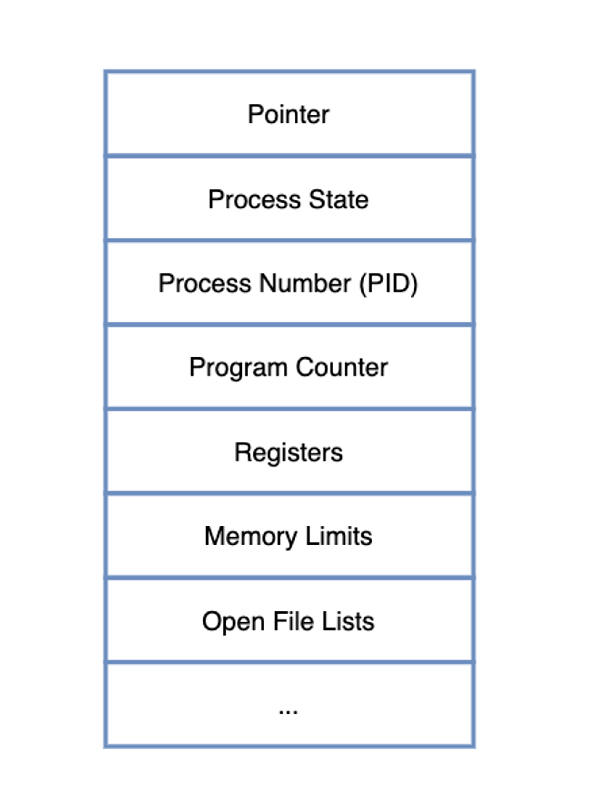
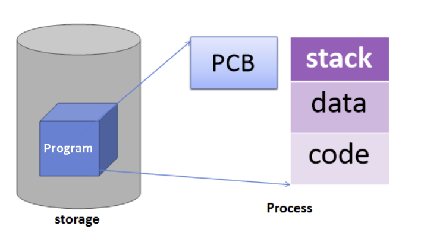
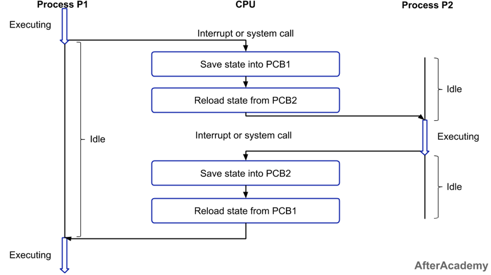

# PCB & Context Switching 

### 📔 Process?

- 컴퓨터에서 연속적으로 실행되고 있는 동적인 상태의 컴퓨터 프로그램, 즉 하나의 작업 단위.

***  간단히 생각하면 실행중인 프로그램! 구체적으로 메모리 상에서 실행 중인 프로그램으로 운영체제로부터 자원(주소 공간, 파일, 메모리)을 할당 받을 수 있는 것.

### 📔 프로세스 관리?

- 현대의 운영 체제 가운데 중요한 부분이다.
    
    운영 체제는 자원을 프로세스에 할당하고, 프로세스가 정보를 공유하고 교환할 수 있게 하며, 각 프로세스 자원을 다른 프로세스로부터 보호하며, 프로세스 간 동기화를 가능하게 해야 한다.
    
    이러한 요구를 충족하기 위하여 운영 체제는 각 프로세스를 위한 자료구조를 관리하며, 이로써 프로세스의 상태와 자원 소유권을 기술하고 운영 체제가 각 프로세스를 제어할 수 있다.
    
- 따라서 **각기다른 프로세스들의 본연의 특징을 갖고 있는 `Process Metadata` 라는 정보를 활용**한다.

### 📔 Process Metadata?

> 프로세스가 가지고있는 특징을 말한다
> 
> - `PID(Process-Id)` : 새로운 프로세스에 시스템이 할당해주는 고유 id
> - `Process-State` : 프로세스 상태. 
> - `Process Priority` : 프로세스 우선순위 등과 같은 스케줄링 관련 정보를 기억.
> - `Program Counter (PC)` : 다음에 실행되는 명령어의 주소를 기억.
> - `CPU 레지스터` : 프로세스의 레지스터 상태를 저장하는 공간 등. CPU 내 범용 레지스터(AX,BX,CX,DX), 데이터 레지스터(SP,BP,SI,DI), 세그먼트 레지스터(CS,DS,ES,SS) 등이 가지고 있는 값을 기억.
> - `Owner` : CPU 사용시간의 정보(Quantum), 각종 스케줄러에 필요한 정보를 기억.
> - `입출력 정보` : 프로세스 수행 시 필요한 주변 장치, 파일들의 정보를 기억.
> - `Memory Limit` : 프로세스의 메모리 할당량.
> - 기타 등등
> 
> **상세설명 링크 참고https://seungjjun.tistory.com/226
> 

이런 정보들이 담긴 메타데이터는 프로세스가 생성될 때마다 **`PCB (Process Control Block)`** 이라는 곳에 저장된다.

## 🎯 PCB (Process Control Block)

- 위에서 설명한 것 처럼 **프로세스들의 메타데이터를 저장하는 곳**을 말한다.
- PCB가 프로세스의 상태 및 제어 정보를 저장하는 자료구조.
- 하나의 **PCB** 안에는 하나의 **프로세스의 정보**가 담기게 된다.
- 프로그램이 실행되어 메모리에 적재됐을 때 **프로세스가 생겨나고, 프로세스 주소 공간에 코드&데이터&스택 공간이 생성**된다.
    
    이후 **해당 프로세스의 메타데이터들이 PCB 에 저장**된다.
    
    <aside>
    💡 `즉,`
    프로그램 실행 -> 프로세스 생성 -> 프로세스 주소 공간에(코드, 데이터, 스택) 생성 -> 이 프로세스의 메타 데이터들이 PCB에 저장
    
    </aside>
    

- CPU 에서는 프로세스의 상태에 따라 **프로세스 교체작업**이 이루어지게 된다.
    
    어떤 프로세스로부터 **인터럽트가 발생**해서, **현재 프로세스가 잠시 대기 상태**가 된 상황을 생각해보자. **인터럽트가 발생된 프로세스를 실행 상태**로 바꿔치기 할 때, **대기 중인 프로세스의 정보를 잃어버리게 되면** 프로그램을 처음부터 **다시 시작**해야 한다. 이렇게 되면 사용자 입장에선 당혹스러울 것이다.
    
    대기하다가 다시 실행할 때 **대기 상태로 바뀌기 직전의 실행 정보를 고스란히 저장**해둔다면 다시 실행 상태로 돌아왔을 때 **아무 일도 없었단 듯이 흘러갈 수 있을** 것이다.
    
    따라서 이 동작을 위해 **PCB** 가 필요한 것이다.
    

> 💁🏻‍♂️ 정리하자면, 프로세스 A 에서 B 로 교체될 때 아래와 같은 과정이 일어나게 된다.
> 
> 1. B 에서 인터럽트 발생
> 1. A 의 현재 실행 정보를 PCB 에 저장
> 1. A 를 대기 상태로 돌리고 B 를 실행 상태로 전환
> 1. B 의 PCB 정보를 기반으로 실행 재개
> 1. B 가 원하는 동작을 모두 수행함
> 1. B 의 현재 실행 정보를 PCB 에 저장
> 1. B 를 대기 상태로 돌리고 A 를 실행 상태로 전환
> 1. A 의 PCB 정보를 기반으로 실행 재개

### 🎯 PCB 의 관리 방식

한 프로세스에 한 PCB가 생성된다. 따라서 **PCB 는 프로세스가 생성될 때마다 하나씩 늘어나게** 되는데, 이 때 PCB 들을 관리하는 자료구조는 바로 **`Linked List`** 형태이다.

**PCB List Head 에 PCB 들이 생성될 때**마다 하나씩 **이어붙게 된다**. 주소값으로 연결되는 형태이기 때문에 **생성이나 삭제에서 높은 효율**을 보이게 된다. (삽입 삭제에 용이한 Linked List 의 특성)

> 당연한 이야기지만, 프로세스가 종료된다면 PCB 도 제거된다!
> 

## 🎯 Context Switching

위에서 프로세스를 갈아끼우는 사례를 예로 들었는데, 이 **프로세스를 갈아끼우는 행위** 자체를 **`Context Switching`** 이라고 한다.

> 현재 실행 중인 프로세스의 상태를 저장하고, 다음에 실행할 프로세스의 상태를 로드하는 과정을 말한다.
> 

** https://velog.io/@phc09188/%EC%9A%B4%EC%98%81%EC%B2%B4%EC%A0%9C-PCB%EC%99%80-Context-Switching

위의 그림을 보면 쉽게 이해할 수 있다.

1. 프로세스1을 실행하다 할당된 시간이 지났다는 알림(Interrupt or system call)이 울리면 PCB1에 실행하던 정보들을 저장한다. (Save state into PCB1)

2. 프로세스2에 대한 정보들이 담겨있는 PCB2를 불러온 다음에 프로세스2를 실행한다.

3. 이후 프로세스1에 대한 실행 순서가 오면 프로세스2는 PCB2에 작업하던 정보들을 저장하고 PCB1에 저장했던 정보들을 불러온다.

### 🎯 언제 발생?

보통 인터럽트 발생, 혹은 현재 프로세스의 선점 허용 기간을 모두 소모한 상황, 입출력을 위해 대기하는 경우에 **Context Switching** 이 발생하게 된다.

### 🎯 Context Switching이 왜 필요한가?

CPU는 한 번에 하나의 프로세스만 수행할 수 있지만 실생활에서 우리는 여러 개의 프로세스를 동시에 수행하는 것처럼 보이게 하기 위해서 Context Switching을 사용한다.

### 🎯 Context Switching Cost

Context Switching이 발생하게 되며 다음과 같은 Cost가 소용된다.

1. Cache 초기화
2. Memory Mapping 초기화
3. 메모리의 접근을 위해서 Kernel은 항상 실행되어야 한다.

### 🎯 Context Swiching과 시간 할당량

- 프로세스들의 시간 할당량(각 프로세스에 주어지는 최소의 시간)은 시스템 성능의 중요한 역할을 한다.
    
    시간 할당량이 적을 수록 사용자 입장에서는 여러 개는 프로세스가 거의 동시에 수행되는 느낌을 갖지만 인터럽트의 수와 문맥 교환의 수가 늘어난다.
    프로세스의 실행을 위한 부가적인 활동을 오버헤드(간접 부담 비용)이라고 하는데, 이 또한 문맥 교환 수와 같이 늘어나게 된다.
    
    > `오버헤드(Overhead)` ?
    > - 어떤 처리를 하기 위해 들어가는 간접적인 처리 시간 · 메모리 등을 말한다.
    > 
    > 
    > - 예를 들어 A라는 처리를 단순하게 실행한다면 10초 걸리는데, 안전성을 고려하고 부가적인 B라는 처리를 추가한 결과 처리시간이 15초 걸렸다면, 오버헤드는 5초가 된다.  
    > 또한, 이 처리 B를 개선해 B'라는 처리를 한 결과, 처리시간이 12초가 되었다면, 이 경우 오버헤드가 3초 단축되었다고 말한다
    > 
    > `인터럽트` ?
    > 
    > - 인터럽트는 프로세서가 현재 실행 중인 작업을 중단하고 외부에서 발생한 이벤트에 대응하기 위해 실행 흐름을 변경하는 메커니즘이다. 
    > - 이벤트는 주로 하드웨어나 소프트웨어적으로 발생하는데, 예를 들면 입출력 완료, 타이머 만료, 예외 상황 등이 있다.

- 시간 할당량이 적어지면 : 문맥 교환 수, 인터럽트 횟수, 오버헤드가 증가하지만 여러 개의 프로세스가 동시에 수행되는 느낌을 갖는다.
- 시간 할당량이 커지면 : 문맥 교환 수, 인터 럽트 횟수, 오버헤드가 감소하지만 여러 개의 프로세스가 동시에 수행되는 느낌을 갖지 못한다.

### 🎯 **Context Switching의 Overhead**?

사실 Context Switching 을 하는 동안에는 CPU 가 아무것도 하지 못하게 된다. 따라서, 만일 쓰레드 및 프로세스의 개수가 엄청 많아져 Context Switching 이 빈번히 일어나게 된다면, 오버헤드가 잦아져 성능이 악화될 가능성도 있다. 이를 **Context Switching Overhead** 라고 한다.

### ➕ 추가: Process vs Thread

Process가 Context Switching이 쓰이는 비용이 Thread보다 많이 든다. Thread는 Stack 영역을 제외한 모든 메모리를 공유하기에 Context Switching 발생 시 Stack 부분만 동작하면 되기 때문이다.

### 📔 출처

[PCB 와 Context Switching](https://velog.io/@heetaeheo/PCB-와-Context-Switching)

[PCB 와 Context Switching 알아보기](https://velog.io/@haero_kim/PCB-와-Context-Switching-알아보기)

[프로세스란? (PCB, Context Switching)](https://seungjjun.tistory.com/226)