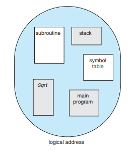
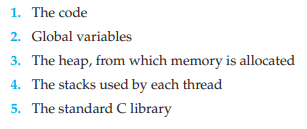
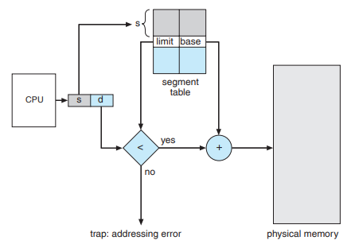
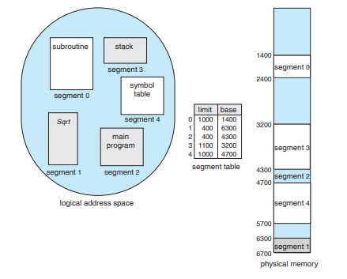

# 📖 세그멘테이션 ( Segmentation )

## 목차

- [1. ⚙️ 메모리 관리 기법](#-메모리-관리-기법)
  - [1.1 연속 메모리 기법](#연속-메모리-기법)
  - [1.2 불연속 메모리 관리](#불연속-메모리-관리)
- [2. 🔗 Memory Fragmentation (메모리 단편화)](#-memory-fragmentation-메모리-단편화)
  - [2.1 내부 단편화](#내부-단편화)
  - [2.2 외부 단편화](#외부-단편화)
- [3. 📚 세그멘테이션 ( Segmentation )](#-세그멘테이션--segmentation)
  - [3.1 ⛓ 세그멘테이션 구조](#-세그멘테이션-구조)
  - [3.2 🧪 세그멘테이션 구현](#-세그멘테이션-구현)
- [4. 참조](#-참조)

# ⚙️ 메모리 관리 기법

메모리 관리 기법은 크게 연속 메모리 관리와 불연속 메모리 관리로 나뉜다.

### 연속 메모리 기법

◈ 프로그램 전체가 메모리에 연속적으로 할당되어야 하는 관리 기법  
◈ 고정 분할 기법 : 메모리가 고정된 파티션으로 분할, 내부 단편화 발생  
◈ 동적 분할 기법 : 파티션들이 동적 생성, 자신의 크기와 같은 파티션에 적재, 외부 단편화 발생 

### 불연속 메모리 관리

◈ 프로그램의 일부가 서로 다른 주소 공간에 할당될 수 있는 기법  
◈ Page : 프로세스를 고정된 크기의 작은 블록들로 나눴을 때, 그 블록들을 페이지라 함  
&nbsp;&nbsp;&nbsp;&nbsp;◈ paging 은 고정 크기를 가짐  
&nbsp;&nbsp;&nbsp;&nbsp;◈ paging 은 내부 단편화 발생 가능  
◈ Segment : 서로 다른 크기의 논리적 단위  
&nbsp;&nbsp;&nbsp;&nbsp;◈ segmentation 은 가변 크기를 가짐  
&nbsp;&nbsp;&nbsp;&nbsp;◈ segmentation 은 외부 단편화 발생 가능  
◈ Frame : 페이지 크기와 같은 주 기억장치 메모리 블록 

# 🔗 Memory Fragmentation (메모리 단편화)

🔹 컴퓨터에서 어떤 프로그램을 실행할 때, 메모리의 공간을 연속적인 형태로 할당하여 사용하게 된다. 이렇게 프로그램이 메모리에 할당되고, 해제되고, 다시 새로운 프로그램이 할당되고, 해제되고를 반복하다보면 메모리 공간이 조각조각 나뉘게 되어 실제로는 사용가능한 메모리가 충분히 존재하지만 할당이 불가능한 상태가 발생하게 된다.

이를 메모리 단편화 (Memory Fragmentation) 라 하고, 내부 단편화와 외부 단편화가 존재한다.

### 내부 단편화

◈ 프로세스가 할당받은 메모리 영역 내부에 사용되지 않는 공간이 발생하는 현상  
◈ ex) 메모리 파티션이 100KB이고 프로세스가 95KB만 필요로 한다면, 남은 5KB는 해당 파티션 내에서 사용되지 않게 되며, 다른 프로세스도 이 공간을 사용할 수 없다. 이와 같이 할당된 공간 내부에 남는 부분이 내부 단편화이다.

### 외부 단편화

◈ 외부 단편화는 할당되지 않은 메모리 공간이 충분히 있지만, 연속적인 공간이 아니어서 큰 메모리 요청을 충족시키지 못하는 현상  
◈ 즉, 메모리에는 총합으로는 충분한 양의 비할당 공간이 있지만, 이 공간들이 작은 조각으로 분산되어 있어서 큰 블록의 메모리 요청을 수용할 수 없는 경우이다. 이로 인해 메모리에 충분한 공간이 있음에도 불구하고, 새로운 프로세스나 데이터를 위한 연속적인 공간을 확보할 수 없어 메모리가 충분히 활용되지 못하는 문제가 발생한다.

# 📚 세그멘테이션 ( Segmentation )

    

 

 

🔹 이러한 메모리 단편화 해결 방법으로 페이징과 세그멘테이션을 배우게 된다.

🔹 사용자/프로그래머 관점의 메모리 관리 기법으로 페이징은 프로세스를 물리적으로 일정한 크기로 나눠서 메모리에 할당하는 것을 의미하는 반면, 세그멘테이션은 프로세스를 같은 역할을 하는 논리적인 단위를 기반으로 나눠서 메모리에 배치하는 것을 의미한다.

**세그멘테이션의 필요성**

🔹 세그먼테이션은 가상 주소 공간을 세그먼트 단위로 실제 메모리 주소 공간에 독립적으로 각각 매핑하는 방식이다.

이로 인해 heap과 stack 사이의 사용하지 않는 비효율성인 문제를 해결하게 되었다.

[1] 더이상 메모리 공간이 낭비되지 않는다.

[2] 이전보다 훨씬 더 많은 주소 공간을 지원할 수 있다.

[3] 세그먼트는 주소 공간 간에 Code를 공유하면서 메모리를 절약할 수 있다.

 

## ⛓ 세그멘테이션 구조 

    

 

 

🔹대부분의 사용자는 메모리를 바이트의 연속적인 배열로 생각하지 않는다. 대신 메모리를 순서가 없는 가변 크기의 Segment(부분)의 모음으로 보게 된다. 마찬가지로 우리는 프로그램을 메소드, 함수, 자료구조 등의 집합으로 생각하게 된다. 프로그램이 어떤 메모리 주소에 담기는지는 신경쓰지 않는다.

세그먼테이션(Segmentation)은 이러한 사용자 관점의 메모리를 지원하는 메모리 관리 기법이다. 논리적 주소 공간은 세그먼트(Segment)의 모음이 되고 각 세그먼트는 각자의 이름과 길이를 가지고 사용자는 이를 지정함으로써 주소를 특정한다.

페이징 기법은 하드웨어에 의해 분리된 하나의 주소를 페이지 번호와 페이지 간격으로 특정하고, 사용자에게 이 과정은 보이지 않는다는 점에서 세그먼테이션 기법과 대비된다.

구현의 간단함을 위해 세그먼트들은 이름보다는 Segment Number(세그먼트 번호)로 구별된다. 따라서 논리적 주소는 세그먼트 번호, 세그먼트 간격(offset)의 두 요소로 정의된다. 일반적으로 사용자 프로그램이 컴파일된 후 컴파일러는 자동으로 프로그램에 대한 세그먼트를 만든다. 컴파일러는 다음과 같은 내용에 대한 세그먼트를 생성한다.

    

 

 

## 🧪 세그멘테이션 구현

    
    

 

 

🔹 사용자가 프로그램 내 어떤 객체의 주소를 2차원으로 생각할지라도, 실제 메모리는 1차원 byte의 연속이다. 따라서 우리는 2차원의 사용자 관점 주소들을 1차원의 실제 주소로 변환(mapping)해야 한다.

이러한 변환은 세그먼트 테이블(Segment Table)의 영향을 받는다. 세그먼트 테이블의 각 항목은 Segment Base와 Segment Limit을 갖는다. Base는 물리 주소의 시작점을 나타내고, Limit은 세그먼트의 길이를 나타낸다.

세그먼트의 논리적 주소는 세그먼트 번호 s와 간격 d를 갖는다. 세그먼트 번호는 세그먼트 테이블에서 인덱스로 사용된다. 세그먼트 간격은 반드시 0부터 Segment Limit 사이의 값을 가져야 한다. 그렇지 않다면 세그먼트 바깥의 메모리를 접근했다고 간주하여 운영체제에서 Trap을 발생시킨다.

그림에서 논리적 주소 s, d에 해당하는 물리적 주소를 찾기 위해, 세그먼트 테이블에서 s에 해당하는 세그먼트의 Base와 Limit 값을 찾는다. 논리적 주소의 d가 Limit보다 작은 값인지 검사하고, 이상이 없다면 Base + d가 물리적 주소가 된다.

    

 

 

상황) 왼쪽 메모리에서 20KB 크기를 갖는 세그먼트를 할당하려고 한다.

하지만, 전체로 보면 24KB 여유 공간(free)이 있지만 16KB, 4KB, 4KB로 인접하지 않은 세그먼트로 20KB 크기를 갖는 공간을 할당받을 수 없다.

이를 해결하기 위해 OS는 가운데 그림처럼 Compaction 이라는 방법으로 실제 메모리에 있는 기존의 세그먼트를 재배치시킨다. 하지만 Compaction 방법은 비용이 발생하여 성능이 떨어지는 문제점이 있다.

그래서 결국 맨 오른쪽 그림처럼 Paging(페이징) 이라는 기법을 통해 고정적인 크기(fixed-size)의 세그먼트로 외부 단편화를 제거하여 여유 공간을 관리할 수 있다.

하지만 페이징 기법 역시 내부 단편화(internal fragmentation) 문제가 남아 있다.

내부 단편화의 문제점은 다음과 같다. 15KB 요청이 오면 8KB * 2번으로 16KB를 주게 되면 1KB의 안쓰는 공간이 생긴다. 이때 이 1KB가 내부 단편화의 문제점이다.

 

## 📸 참조

https://resilient-923.tistory.com/394  
https://velog.io/@nnnyeong/OS-%EB%A9%94%EB%AA%A8%EB%A6%AC-%EB%8B%A8%ED%8E%B8%ED%99%94-%ED%8E%98%EC%9D%B4%EC%A7%95-%EC%84%B8%EA%B7%B8%EB%A9%98%ED%85%8C%EC%9D%B4%EC%85%98  
https://4legs-study.tistory.com/50