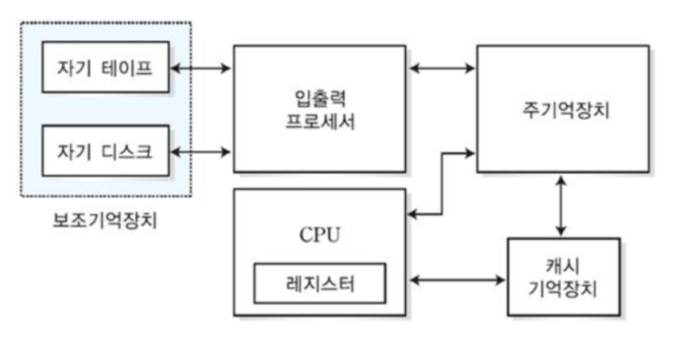
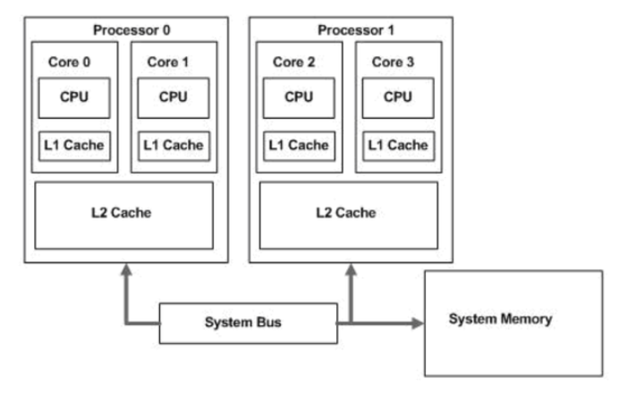
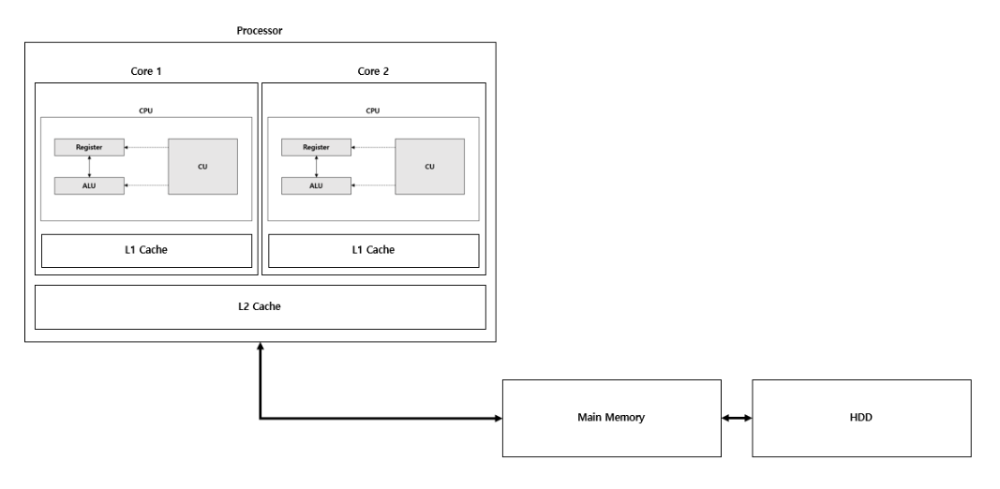

# 📖 세그멘테이션 ( Segmentation )

## 목차

- [1. 📚 메모리 계층 구조(Memory Hierachy)](#-메모리-계층-구조memory-hierachy)
  - [1.1 ⚙️ 레지스터 (Register)](#-레지스터-register)
  - [1.2 ⛓ 캐시](#-캐시)
  - [1.3 📌 메인 메모리](#-메인-메모리)
  - [1.4 🔗 하드 디스크 드라이브(Hard Disk Drive, HDD)](#-하드-디스크-드라이브hard-disk-drive-hdd)
- [2. 🔍 메모리 계층 구조의 필요성](#-메모리-계층-구조의-필요성)
  - [2.1 1) 디코딩(명령어 해독 단계) 속도](#1-디코딩명령어-해독-단계-속도)
  - [2.2 2) 자주 쓰는 데이터는 계속 자주 쓰임(참조의 지역성)](#2-자주-쓰는-데이터는-계속-자주-쓰임참조의-지역성)
  - [2.3 3) 경제성](#3-경제성)
- [3. 참조](#-참조)

# ⚙️ 메모리 관리 기법

메모리 관리 기법은 크게 연속 메모리 관리와 불연속 메모리 관리로 나뉜다.

### 연속 메모리 기법

◈ 프로그램 전체가 메모리에 연속적으로 할당되어야 하는 관리 기법  
◈ 고정 분할 기법 : 메모리가 고정된 파티션으로 분할, 내부 단편화 발생  
◈ 동적 분할 기법 : 파티션들이 동적 생성, 자신의 크기와 같은 파티션에 적재, 외부 단편화 발생 

### 불연속 메모리 관리

◈ 프로그램의 일부가 서로 다른 주소 공간에 할당될 수 있는 기법  
◈ Page : 프로세스를 고정된 크기의 작은 블록들로 나눴을 대, 그 블록들을 페이지라 함  
&nbsp;&nbsp;&nbsp;&nbsp;◈ paging 은 고정 크기를 가짐  
&nbsp;&nbsp;&nbsp;&nbsp;◈ paging은 내부 단편화 발생 가능  
◈ Frame : 페이지 크기와 같은 주 기억장치 메모리 블록  
&nbsp;&nbsp;&nbsp;&nbsp;◈ segmentation 은 가변 크기를 가짐  
&nbsp;&nbsp;&nbsp;&nbsp;◈ segmentation 은 외부 단편화 발생 가능  
◈ Segment : 서로 다른 크기의 논리적 단위

# 🔗 Memory Fragmentation (메모리 단편화)

🔹 컴퓨터에서 어떤 프로그램을 실행할 때, 메모리의 공간을 연속적인 형태로 할당하여 사용하게 된다. 이렇게 프로그램이 메모리에 할당되고, 해제되고, 다시 새로운 프로그램이 할당되고, 해제되고를 반복하다보면 메모리 공간이 조각조각 나뉘게 되어 실제로는 사용가능한 메모리가 충분히 존재하지만 할당이 불가능한 상태가 발생하게 된다. ( ? 메모리 단편화랑 내외부 차이 더 알아보기 )

이를 메모리 단편화 (Memory Fragmentation) 라 하고, 내부 단편화와 외부 단편화가 존재한다.

### 내부 단편화

◈ 메모리를 할당할 때 프로세스가 필요한 양보다 더 큰 메모리가 할당되어서 프로세스에서 사용하는 메모리 공간이 낭비되는 상황  
◈ ex) 만약 어떠한 프로그램에 OS 가 5MB 만큼의 메모리를 할당하였지만 실제로는 1MB 만큼의 메모리를 사용하고 있을 경우 -> 4MB 만큼 내부 단편화 발생

### 외부 단편화

◈ 메모리가 할당되고 해제되는 작업이 반복적으로 일어날 때  
◈ 할당된 메모리와 메모리 사이에 중간중간 사용하지 않는 작은 메모리가 생김  
◈ 총 메모리 공간을 충분하지만 실제로는 할당할 수 없는 상황 발생 -> 외부 단편화

# 📚 세그멘테이션 ( Segmentation )

    

 

 

🔹 이러한 메모리 단편화 해결 방법으로 페이징과 세그멘테이션을 배우게 된다.

🔹 사용자/프로그래머 관점의 메모리 관리 기법으로 페이징은 프로세스를 물리적으로 일정한 크기로 나눠서 메모리에 할당하는 것을 의미하는 반면, 세그멘테이션은 프로세스를 논리적 내용을 기반으로 나눠서 메모리에 배치하는 것을 의미한다. 프로세스를 Code, Data, Stack, Heap 으로 나누는 것 역시, 세그멘테이션

**세그멘테이션의 필요성**

🔹 세그먼테이션은 가상 주소 공간을 세그먼트 단위로 실제 메모리 주소 공간에 독립적으로 각각 매핑하는 방식이다.

이로 인해 heap과 stack 사이의 사용하지 않는 비효율성인 문제를 해결하게 되었다.

[1] 더이상 메모리 공간이 낭비되지 않는다.

[2] 이전보다 훨씬 더 많은 주소 공간을 지원할 수 있다.

[3] 세그먼트는 주소 공간 간에 Code를 공유하면서 메모리를 절약할 수 있다.

**OS는 3개의 세그먼트를 메모리에 배치하여 heap과 stack 사이의 공간을 낭비하지 않도록 하는 것이다.**

 

## ⚙️ 

> CPU가 요청을 처리하는 데 필요한 데이터를 일시적으로 저장하는 기억장치
>
> CPU에 위치한 고속 메모리로 CPU가 바로 사용할 수 있는 데이터를 저장한다. 

    

 

 

- CPU는 자체적으로 데이터를 저장할 방법이 없으므로 메모리로 직접 데이터를 전송할 수 없음
    - 연산을 위해서 반드시 레지스터를 거쳐야 하며, 이를 위해 레지스터는 특정 주소를 가리키거나 값을 읽어올 수 있음
- 프로세서에 위치한 고속 메모리로, 프로세스가 바로 사용할 수 있는 데이터(소량의 데이터, 처리 중인 중간 결과 등)를 담고 있는 영역   

|종류|설명|
|----|----|
|프로그램 계수기(PC, Program Counter)| 다음에 실행할 명령어(instruction)의 주소를 가지고 있는 레지스터|
|누산기(AC, ACcumulator)|연산 결과 데이터를 일시적으로 저장하는 레지스터|
|명령어 레지스터(IR, Instruction Register)|현재 수행 중인 명령어를 가지고 있는 레지스터|
|상태 레지스터(SR, Status Register)|현재 CPU의 상태를 가지고 있는 레지스터|
|메모리 주소 레지스터(MAR, Memory Address Register)|메모리로부터 읽어오거나 메모리에 쓰기 위한 주소를 가지고 있는 레지스터|
|메모리 버퍼 레지스터(MBR, Memory Buffer Register)|메모리로부터 읽어온 데이터 또는 메모리에 써야할 데이터를 가지고 있는 레지스터|
|입출력 주소 레지스터(I/O AR, I/O Address Register)|입출력 장치에 따른 입출력 모듈의 주소를 가지고 있는 레지스터|
|입출력 버퍼 레지스터(I/O BR, I/O Buffer Register)|입출력 모듈과 프로세서 간의 데이터 교환을 위해 사용되는 레지스터|

 

## ⛓ 캐시

> 캐시는 대용량의 메인 메모리 접근을 빠르게 하기 위해 CPU 칩 내부나 바로 옆에 탑재하는 작은 메모리이다.

    

 

 

🔹 캐시(cache)는 데이터를 미리 복사해 놓는 임시 저장소이자 빠른 장치와 느린 장치에서 속도 차이에 따른 병목 현상을 줄이기 위한 메모리를 말한다. 이를 통해 데이터를 접근하는 시간이 오래 걸리는 경우를 해결하고 무언가를 다시 계산하는 시간을 절약할 수 있다.

예를 들어, 프로세서가 아무리 빨라도 계산에 필요한 데이터를 얻기 위해서는 상대적으로 느린 메인메모리에 접근해야 하기 때문에 전체적인 시스템 성능 향상에 한계가 생긴다. 그래서 CPU 와 메인메모리 사이에 캐시를 두게 되었다. CPU -> 캐시-> 메인 메모리 따라서, 캐시는 CPU 와 메인 메모리 사이의 속도 간극을 줄여주는 완충재이며 버퍼라고 불리기도 한다.

캐시를 관통하는 중요한 개념은 데이터 지역성이다. 데이터 지역성을 활용하여 메인 메모리에 있는 데이터를 캐시 메모리에 불러와두고, CPU 가 상대적으로 접근 시간이 느린 메인 메모리 대신 캐시 메모리에 우선적으로 접근하게 하면 성능의 향상을 기대할 수 있다.

캐시에는 보통 가격이 비싸고 속도가 빠르지만 용량 대비 크기가 큰 SRAM 을 사용하고, 메인 메모리에는 가격이 싸고 속도가 느린 DRAM 을 사용한다.
이때, SRAM은 DRAM의 100배 이상으로 접근 속도가 빠르지만 구조가 복잡하여 공간을 많이 차지하므로 집적도를 높이기 어려워 가격이 비싸고 대용량으로 제작하기가 어렵다고 한다.

- Processor
    - 프로세서는 컴퓨터 운영을 위해 기본적인 명령어들을 처리하고 반응하기 위한 논리회로. (Processor >= CPU,  CPU는 디바이스가 해야 할 일을 총지휘하는 프로세서라고 보면 됨)

- Core
    - 코어는 각종 연산을 하는 프로세서의 핵심 요소로 프로세서의 내부에는 코어를 제외하고 컨트롤러, 캐시 메모리 등이 있습니다. 1개의 코어를 싱글코어, 2개인 코어를 듀얼코어라고 하며, 코어 수가 많을수록 병렬 처리 효율이 증가합니다.   

**캐시의 종류**

> L은 Level을 의미합니다.

- L1 캐시

🖋 L1 캐시는 일반적으로 코어안에 내장되어 데이터 사용/참조에 가장 먼저 사용된다. L1 캐시는 보통 8~64KB 정도의 용량으로 CPU가 가장 빠르게 접근하며, L1 캐시에서 데이터를 찾지 못하면 L2 캐시를 참조한다.

- L2 캐시

🖋 L2 캐시는 L1와 비슷하지만 상대적으로 속도가 느리고, 64KB~4MB의 용량으로 상대적으로 많은 용량을 저장할 수 있다.

- L3 캐시

🖋 L3 캐시도 동일한 원리로 작동하지만, 웬만한 프로세서에서는 L3 캐시 메모리를 사용하지 않는다. L3 캐시는 CPU 패키지 외부 ( 보통 메인보드 ) 에 위치한다. ( L2 캐시로 충분히 커버 가능)

**캐시를 언제 사용하면 좋을까?**

1. 단순한 데이터(정보)
2. 동일한 데이터를 반복적으로 제공해야하는 경우
3. 데이터의 변경주기가 빈번하지 않고, 단위 처리 시간이 오래걸리는 경우
4. 데이터의 최신화가 반드시 실시간으로 이뤄지지 않아도 서비스 품질에 영향을 거의 주지 않는 데이터

이렇게 캐시를 사용하면 서버간 불필요한 트래픽을 줄일 수 있으며, 그로 인해 웹 어플리케이션 서버의 부하가 감소된다. 또한 캐시에 저장된 데이터를 빠르게 읽어와 어플리케이션을 사용하는 고객에게 쾌적한 서비스 경험을 제공 할 수 있다.

 

## 📌 메인 메모리

> 주기억장치로 컴퓨터에서 수치, 명령, 자료 등을 기억하는 컴퓨터 하드웨어 장치이다.

 

**메인 메모리의 구성**

- RAM(Random Access Memory)
    - 빠른 접근을 위해 데이터를 단기간 저장하는 구성 요소
    - 사용자가 요청하는 프로그램이나 문서를 스토리지 디스크에서 메모리로 로드하여 각각의 정보에 접근
    - 휘발성 기억 장치(전원 종료시 기억된 내용 삭제)
    - 어느 위치에서든 똑같은 속도로 접근하여 읽고 쓸 수 있음
    - 전원이 유지되는 동안 CPU의 연산 및 동작에 필요한 모든 내용 저장
- ROM(Read Only Memory)
    - 컴퓨터에 지시사항을 영구히 저장하는 비휘발성 메모리(고정 기억 장치)
    - 변경 가능성이 희박한 기능 및 부품에 사용   

이러한 계층 구조는 일상 생활에서도 경험할 수 있다. 게임을 실행하다 보면 로딩 중이라는 메세지를 볼 수 있는데, 이는 하드디스크 또는 인터넷에서 데이터를 읽어 RAM으로 전송하는 과정이 아직 끝나지 않았음을 의미한다.

**RAM을 주기억장치라고 표현하는 이유는?**

실제 사용 중일 때 즉, 우리가 어떠한 프로그램을 컴퓨터에서 실행해서 그 컴퓨터가 동작을 하는 과정에서는 RAM과 CPU에서의 동작으로 이루어진다.

1. 보조기억장치에서 주기억장치로 프로그램을 불러온다. (부팅 또는 로딩)
2. 주기억장치에서 프로그램을 기억하고 CPU와 통신할 준비를 한다. (동작 및 구동)
3. 주기억장치와 CPU에서 데이터를 주고받으며 프로그램을 구동한다. (동작 및 구동)

대략적으로 이런 메커니즘을 통해 PC에서 프로그램에 대한 동작이 이루어지게 된다. 따라서 컴퓨터 입장에서는 SSD 또는 HDD는 필요한 것을 꺼내는 창고와 같고, RAM은 작업실, CPU는 작업자와 같은 역할을 하게 된다. 이러한 RAM의 역할 덕분에 주기억장치라고 RAM을 표현할 수 있게된다.

 

## 🔗 하드 디스크 드라이브(Hard Disk Drive, HDD)

    

 

 

**개념**

- 하드 디스크(Hard Disk), 하드 드라이브(Hard Drive), 고정 디스크(Fixed Drive)
- 비휘발성, 순차접근이 가능한 컴퓨터의 보조 기억 장치
- 비휘발성 데이터 저장소 가운데 가장 대중적이며 용량 대비 가격이 가장 저렴   

**작동 원리**

- 보호 케이스 내부의 플래터를 회전 → 플래터에 자기 패턴으로 정보 기록
- 플래터 표면의 코팅된 자성체에 데이터 기록
- 회전하는 플래터 위에 부상하는 입출력 헤드에 의해 자기적으로 데이터 기록 및 조회 가능

 

# 🔍 메모리 계층 구조의 필요성

### 1) 디코딩(명령어 해독 단계) 속도

🔹 CPU가 메모리에 접근할 때 컨트롤 신호를 복호화하여 해석해야 하는데 큰 메모리 용량을 사용할 경우 디코딩하는데 더 많은 시간이 소요됩니다. CPU가 빠르게 데이터에 접근하기 위해서는 더 작은 메모리를 사용해야 합니다.

### 2) 자주 쓰는 데이터는 계속 자주 쓰임(참조의 지역성)

🔹 큰 메모리를 사용한다 해도 그 메모리 안에 있는 모든 데이터를 고르게 접근하지 않는다. 자주 쓰이는 데이터는 계속 자주 쓰이고, 자주 쓰이지 않는 데이터는 계속 자주 쓰이지 않으며 자주 쓰이는 데이터는 전체 데이터의 일부이기 때문에 상위 메모리의 용량이 하위 메모리의 용량보다 적어도 된다.

즉, 자주 쓰이는 데이터는 전체 데이터 양에 비해 작은 양이므로 캐시는 메모리보다, 메모리는 하드디스크보다 더 작아도 됨

### 3) 경제성

- 메모리 구조에서 상층에 속할수록 더 비쌈
- 비싼 하드웨어는 꼭 필요한 만큼의 크기만 사용
- 싼 하드웨어를 넉넉한 크기만큼 사용

 

## 📸 참조

https://resilient-923.tistory.com/394  
https://velog.io/@nnnyeong/OS-%EB%A9%94%EB%AA%A8%EB%A6%AC-%EB%8B%A8%ED%8E%B8%ED%99%94-%ED%8E%98%EC%9D%B4%EC%A7%95-%EC%84%B8%EA%B7%B8%EB%A9%98%ED%85%8C%EC%9D%B4%EC%85%98