# 동기화(스핀락, 세마포어, 뮤텍스)

### 📌 **Race Condition?**

- 여러 프로세스/스레드가 공통 자원을 병행적으로(concurrently) 읽거나 쓰는 동작을 할 때, 공용 데이터에 대한 접근이 어떤 순서에 따라 이루어졌는지에 따라 그 실행 결과가 같지 않고 달라지는 상황.
    - 쉽게 말하면, 동시에 같은 데이터를 조작할 때 타이밍이나 접근 순서에 따라 결과가 달라질 수 있는 상황.
- Race의 뜻 그대로, 간단히 말하면 경쟁하는 상태. 즉, 두 개의 스레드가 하나의 자원을 놓고 서로 사용하려고 경쟁하는 상황을 말한다.

경쟁 프로세스의 경우, 세 가지 제어 문제에 직면한다. **Mutual exclusion, deadlock, starvation**이다.

- **Mutual exclusion**
    - Race condition을 막기 위해서는 두 개 이상의 프로세스가 공용 데이터에 동시에 접근을 하는 것을 막아야 한다. 즉, 한 프로세스가 공용 데이터를 사용하고 있으면 그 자원을 사용하지 못하도록 막거나, 다른 프로세스가 그 자원을 사용하지 못하도록 막으면 이 문제를 피할 수 있다. 이것을 상호 배제`(mutual exclusion)`라고 부른다.
- **Deadlock**
    - 그러나 위와 같은 상호 배제를 시행하면 추가적인 제어 문제가 발생한다.
    - 하나는 교착상태. 즉, 여기서 말하는 Deadlock이다. 프로세스가 각자 프로그램을 실행하기 위해 두 자원 모두에 엑세스 해야 한다고 가정할 때 프로세스는 두 자원 모두를 필요로 하므로 필요한 두 리소스를 사용하여 프로그램을 수행할 때까지 이미 소유한 리소스를 해제하지 않는다. 이러한 상황에서 두 프로세스는 교착 상태에 빠지게 되는 문제가 발생할 수 있다.
- **Starvation**
    - 이 제어 문제는 ‘기아 상태’라고도 한다. 이러한 문제는 프로세스들이 더 이상 진행을 하지 못하고 영구적으로 블록되어 있는 상태로, 시스템 자원에 대한 경쟁 도중에 발생할 수 있고 프로세스 간의 통신 과정에도 발생할 수 있는 문제이다. 두 개 이상의 작업이 서로 상대방의 작업이 끝나기만을 기다리고 있기 때문에 결과적으로는 아무것도 완료되지 못하는 상태가 되게 된다.

이렇게 race condition 인 경우에는 스레드의 실행 순서를 잘 조절해주지 않으면 이상한 상태, 비정상적인 상태(의도하지 않은 동작)이 나오게 된다. 이 문제는 항상 발생하는 것이 아니라 특정한 순서대로 수행되었을 때 발생하는 것이다. 이 문제는 디버깅을 할 때에는 전혀 보이지 않는 문제점이고, 발생 시에 모든 프로세스에 원하는 결과가 발생하는 것을 보장할 수 없으므로 후에 더욱 큰 문제를 야기할 수 있으므로 반드시 피해야 하는 상황이다.

⚡따라서 프로세스나 스레드를 동시에 실행해도 공유 데이터의 일관성을 유지하는 `동기화`⭐가 필요하다! (프로세스나 스레드를 공유 자원에 동시에 접근하지 못하도록 접근 순서를 제어하는 방법)

### 📌 Critical Section(임계 영역)

- 여러 스레드 또는 프로세스가 공유 자원에 접근할 수 있는 코드 영역.
- 이 임계 영역을 동기화하여 공유 데이터의 일관성을 보장하기 위해 특정 프로세스/스레드만 진입해서 실행 가능한 코드 영역으로 만들어야 한다.
- **특정 프로세스와 스레드만 접근해서 사용하는 것 =  ` [Mutual exclusion] `**

### 📌 **Mutual Exclusion (상호 배제) 구현**

- race condition을 예방할 수 있는 방법(= 상호 배제) → 락을 사용한다.
- `Semaphore(세마포어)`와 `Mutex(뮤텍스)`에 대해 알아보자.

### 📕Lock(락)

- 공유 자원을 특정 스레드가 사용하고 있을 때, 다른 스레드는 해당 공유 자원에 접근할 수 없도록 제한하는 것

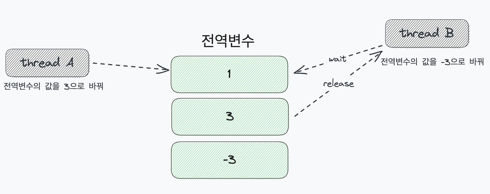

스레드 A가 접근하면 공유 자원에 락을 걸어 스레드 B가 접근하지 못하게 만든다. 스레드 A의 작업이 종료되면 락을 풀고 ( = release = unlock) 대기(wait) 중이던 스레드 B가 작업을 수행하게 만든다.

### 📕 Spin Lock(스핀락)

- 스레드가 락을 얻을 때까지 무한 루프를 돌며 확인하는 동기화 매커니즘

- 스레드가 실행되는 동안 (= CPU를 점유하는 동안) 공유 자원에 락을 걸고, 스레드의 작업이 종료되면 락을 해제한다. 따라서 다음 스레드가 CPU를 차지하기 위해선 공유 자원에 락이 걸렸는지 걸리지 않았는지를 파악하는 과정이 필요하다.
- 스핀락은 대기 중인 스레드가 공유 자원의 상태를 `무한 루프`를 이용해 확인하는 방식이다. 락이 걸려있으면 작업하지 못하고, 락이 걸려있지 않다면 작업할 수 있으니 그냥 무작정 반복적으로 Lock이 반환될 때까지 확인하며 대기하는 것이다.

⚡**특징**
- 이러한 스핀락은 OS의 스케줄링 지원을 받지 않기에, 해당 스레드에 대한 context switching (문맥 교환)이 일어나지 않는다는 특징이 있다.
- 락을 획득할 때 까지 반복해서 확인하므로 CPU를 계속 낭비한다. → 뮤텍스(락이 준비되면 나를 깨워)

### 📕 **Mutex(뮤텍스)**

- 여러개의 프로세스/스레드가 공유 자원에 동시에 접근하는 것을 제한하기 위한 락.
- 즉, Critical Section을 가진 쓰레드들의 Running time이 서로 겹치지 않게 각각 단독으로 실행되게 하는 기술.
- 다중 프로세스들이 공유 리소스에 대한 접근을 조율하기 위해 locking과 unloking을 사용한다.
- 하나의 `프로세스/스레드 1`이 뮤텍스 락을 걸고 임계영역에서 동작을 시작한다고 하자. 이때 다른 `프로세스/스레드 2`가 임계영역을 들어가려고 하면 뮤텍스 락이 걸려있기 때문에 접근할 수 없고, 대기큐에서 슬립상태로 존재하게 된다. 작업이 끝난 `프로세스/스레드 1` 이 뮤텍스락을 해제하고 떠나고 `프로세스/스레드 2`가 뮤텍스락과 함께 임계영역에 접근하게 되면서 자원을 점유한다.
- unlocking과정에서 큐에 대기중인 것이 있으면 그걸 깨운다. ⭐

⚡**특징**

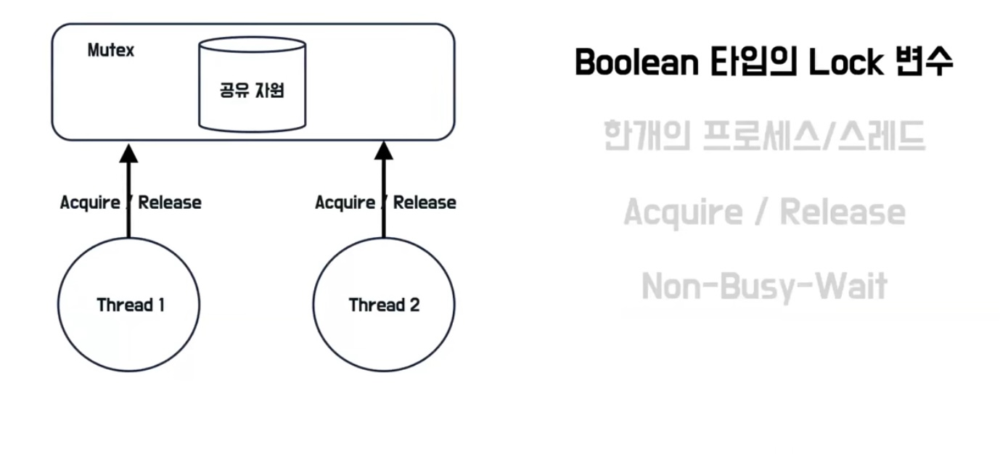

- 프로세스와 스레드는 뮤텍스를 소유하고 해제할 수 있는데 이를 통해 Boolean 타입의 잠금 여부를 확인한다.
- 한개의 프로세스와 스레드만 소유하고 해제 가능하다. 락을 소유한 프로세스와 스레드만 해제 가능.
- 프로세스와 스레드가 뮤텍스를 획득하기 위해서는 Acquire메소드로 뮤텍스락을 획득을 하고, Release메서드를 통해 뮤텍스를 해제할 수 있다.
- Non-Busy-Wait
    - 스레드1이 뮤텍스를 소유한 상태에서 스레드2가 뮤텍스를 소유하려 할 때
        - 계속해서 대기하려는게 Busy-Wait 방식이다. ⇒ `스핀락`은 이 기법을 사용
        - 뮤텍스는 대기 큐에서 CPU자원을 내려놓고 대기하는 Non-Busy-Wait 방식.

### 📕 **Semaphore(세마포어)**

- 여러개의 프로세스/스레드가 공유 자원에 동시에 접근하는 것을 제한하기 위한 정수를 의미한다.
- 예시

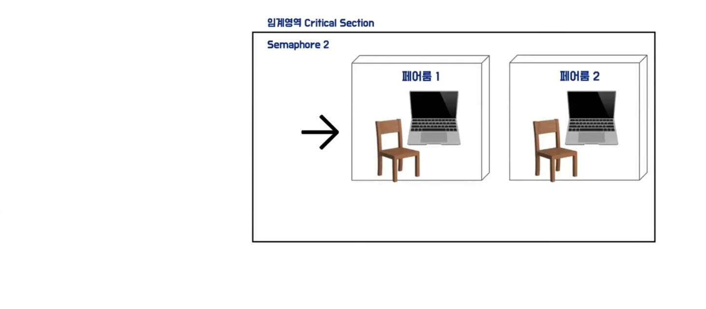

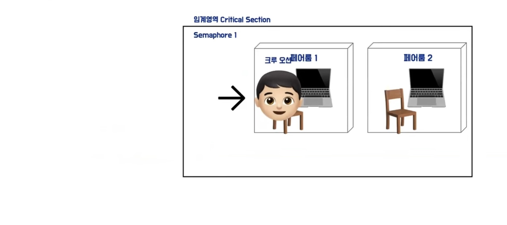

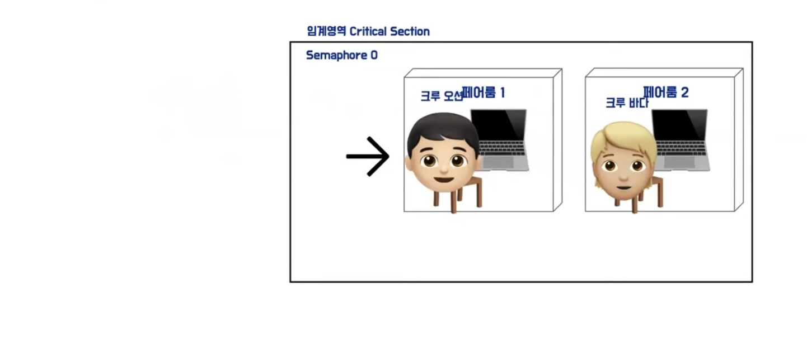

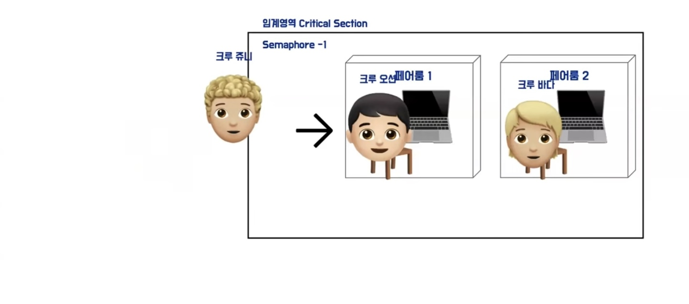

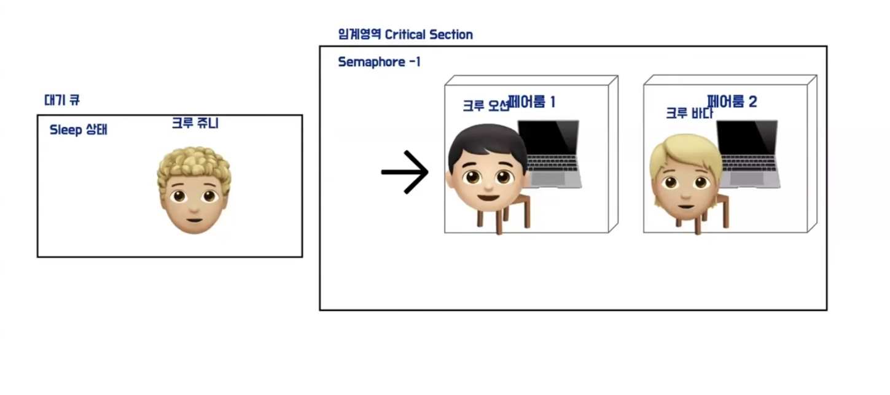

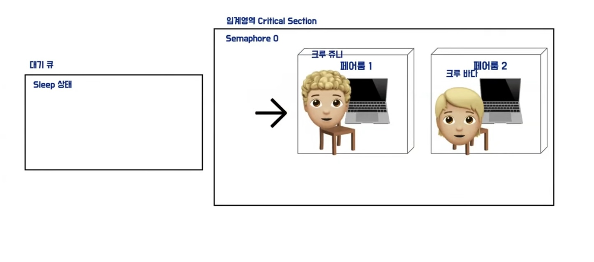

⚡**특징**

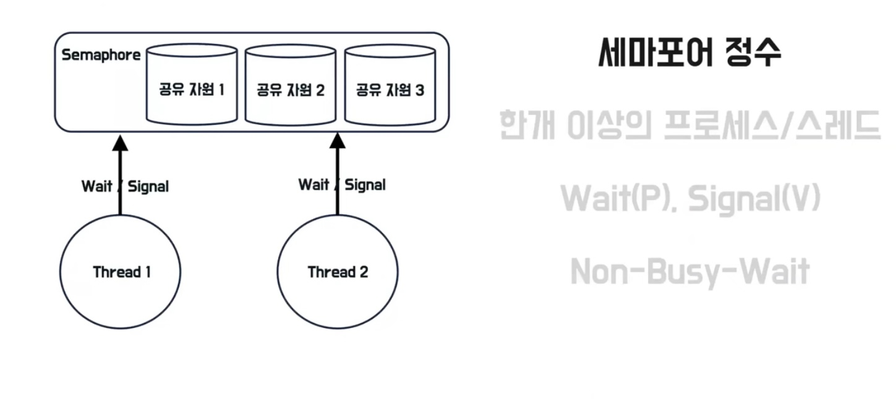

- 정수를 가지고있다.
    - 정수의 크기가 공유자원에 접근할 수 있는 최대 프로세스/스레드의 수
- Wait(p)로 정수값 감소, Signal(V)으로 정수값 증가.
- CPU자원을 내려놓고 대기.

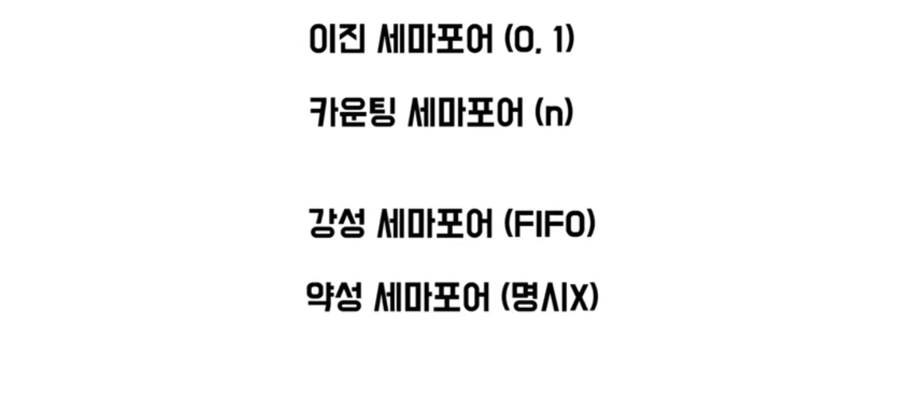

- 이진 세마포어 (0,1)과 카운팅 세마포어(n)로 나뉜다.

- 대기큐에서 나오는 방식에 따라 강성 세마포어, 약성 세마포어로 나뉜다.

### 📕 스핀락과 뮤텍스의 차이

- 스핀락의 구현부 코드는 뮤텍스에 비해 간결하다.
- 락을 기다리는 방식 ⭐
    - 스핀락은 프로세스가 락을 획득하지 못하면 프로세스는 다른 일(스케줄링)을 하지 않고 화장실 밖에서 계속 기다림. 무한루프를 돌며 스피닝(락을 얻으려고 시도하는 과정)
    - 프로세스가 뮤텍스를 획득하지 못하면 화장실의 문제 자신의 이름을 써 놓고 휴먼 상태로 진입.
- 락을 해제할 때의 동작 방식 ⭐
    - 스핀락→ 먼저 사용하던 A프로세스가 스핀락을 해제하면 기다리던 B프로세스는 스핀락을 바로 획득하고 임계 영역으로 진입.
    - 뮤텍스 → A프로세스가 뮤텍스락을 해제할 때, 항상 뮤텍스 wait-list를 확인한다. 뮤텍스를 획득하기 위해 슬립상태의 B프로세스가 있다면 깨운다.

### 📕 뮤텍스와 세마포어의 차이

⚡공통점

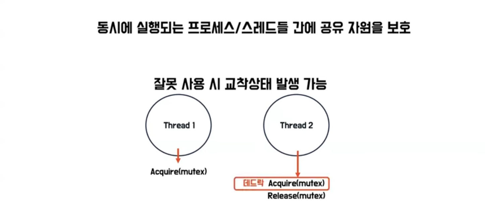

- 교착상태 발생 가능.
    - T1이 먼저 접근, T2가 나중에 접근하는 상황. [데드락]

⚡차이점

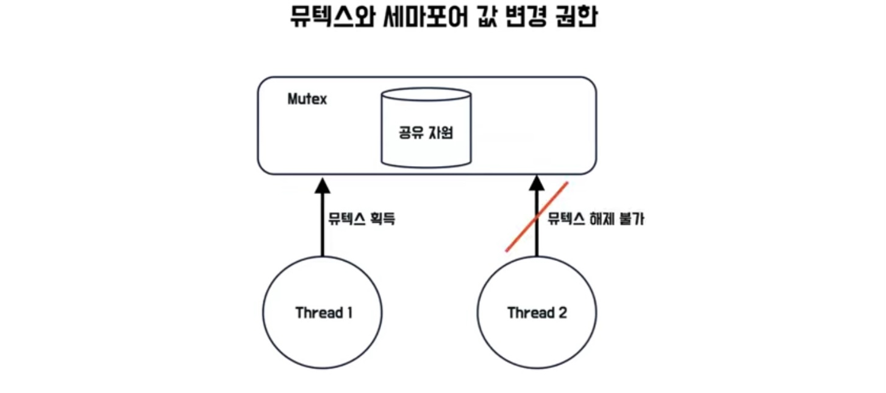

→ 뮤텍스

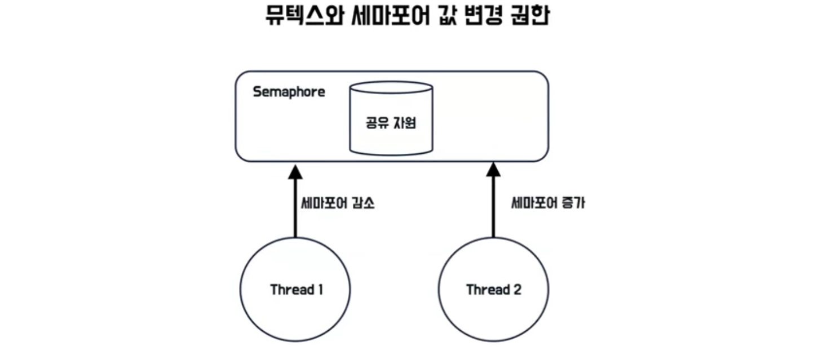

→ 세마포어

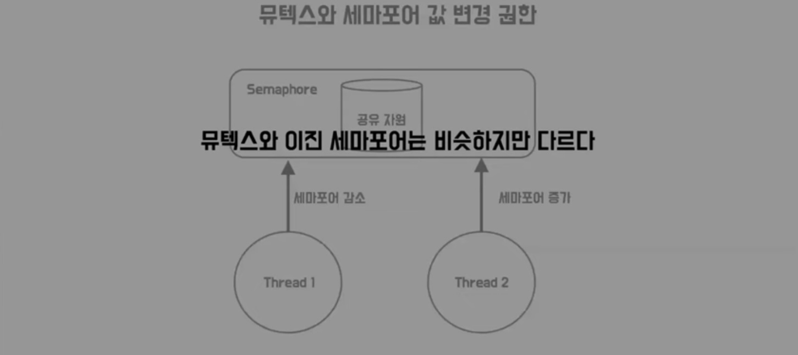

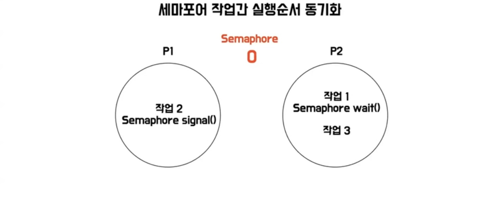

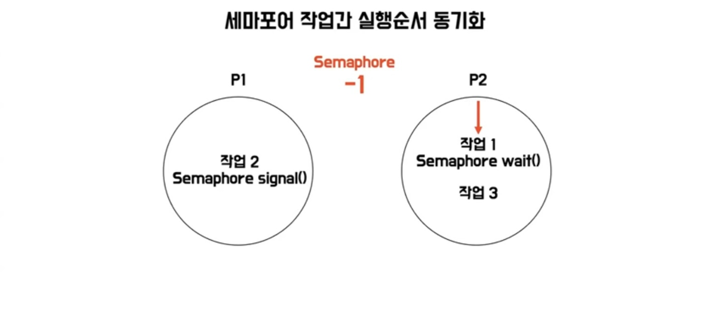

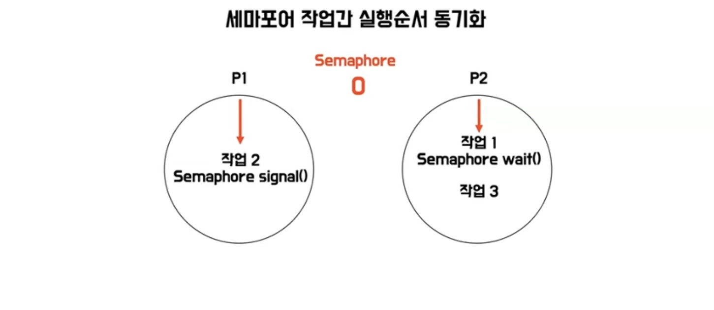

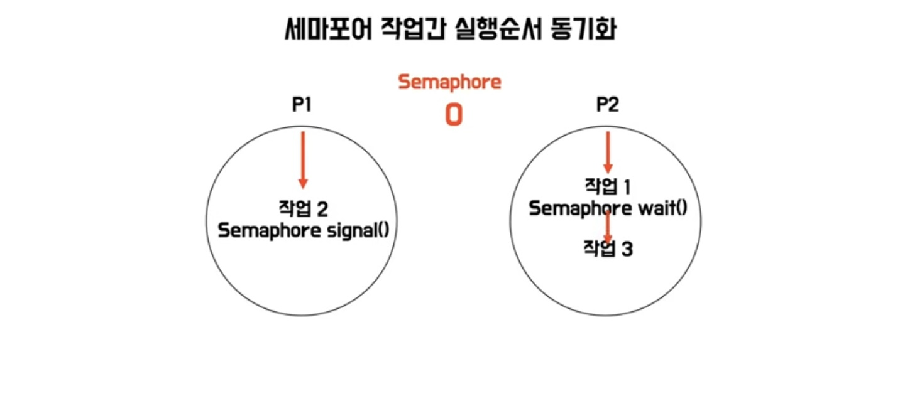

- 세마포어에 의해 작업 1→2→3 으로 진행하게 된다.

➕뮤텍스는 세마포어로서 사용될 수 없지만, 세마포어는 뮤텍스로서 사용할 수 있다. 

### 📌 출처

[[운영체제] Race Condition과 예방할 방법(세마포어, 뮤텍스)](https://iredays.tistory.com/125)

[[OS] Spin Lock (스핀락)에 대해 알아보자](https://hogwart-scholars.tistory.com/entry/OS-Spin-Lock-스핀락에-대해-알아보자)

[스핀락(spinlock) 뮤텍스(mutex) 세마포(semaphore) 각각의 특징과 차이 완벽 설명! 뮤텍스는 바이너리 세마포가 아니라는 것도 설명합니다!](https://www.youtube.com/watch?v=gTkvX2Awj6g)

[[리눅스 커널의 구조와 원리] 9.3.2 스핀락과 뮤텍스 기법의 차이점](https://youtu.be/R5KqFcZkXEM?si=UlyyeBVvandsKFaB)

[[10분 테코톡] 오션의 뮤텍스와 세마포어](https://www.youtube.com/watch?si=15zkdd1fIup5DA1o&v=NL9JQh5bbZ8&feature=youtu.be)
