[📌 **1. 기본 구조**](#📌-1-기본-구조)

- [💡 **1.1 커널**](#💡-11-커널)
- [💡 **1.2 driver**](#💡-12-driver)

[📌 **2. CPU mode: User Mode vs Kernel Mode**](#📌-2-cpu-mode-user-mode-vs-kernel-mode)

- [💡 **2.0 CPU 모드**](#💡-20-cpu-모드)
- [💡 **2.1 user mode**](#💡-21-user-mode)
- [💡 **2.2 user -> kernel**](#💡-22-user-mode-→-kernel-mode)
- [💡 **2.3 kernel mode**](#💡-23-kernel-mode)
- [💡 **2.4 kernel -> user**](#💡-24-kernel-mode-→-user-mode)

[📌 **3. Interrupt**](#📌-3-interrupt)

- [💡 3.1 개념](#💡-31-개념)
- [💡 3.2 종류](#💡-32-종류-多)
- [💡 3.3 동작](#💡-33-동작)

[📌 **4. System call**](#📌-4-system-call)

- [💡 4.1 정의](#💡-41-정의)
- [💡 4.2 구조](#💡-42-구조)
- [💡 4.3 종류](#💡-43-종류)
- [💡 4.4 동작](#💡-44-동작)
- [💡 4.5 예시](#💡-45-예시)
- [💡 4.6 사용 원리](#💡-46-high-level-언어-vs-low-level-system-call)

# **📌 1. 기본 구조**

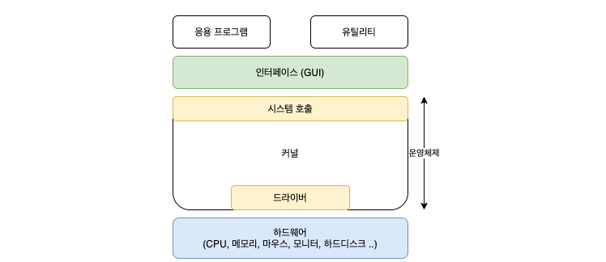

## **💡 1.1 커널**

> **메모리에 상주하는 부분으로써 운영체제의 핵심적인 부분을 뜻한다.**

(그래서 보통은 '운영체제'라고 하면 kernel을 뜻하기도 한다)

컴퓨터와 전원을 켜면 운영체제는 이와 동시에 수행된다. 소프트웨어가 컴퓨터 시스템에서 수행되기 위해서는 메모리에 그 프로그램이 올라가 있어야 한다. 마찬가지로 운영체제 자체도 소프트웨어로서 전원이 켜짐과 동시에 메모리에 올라가야한다.

하지만 운영체제처럼 규모가 큰 프로그램이 모두 메모리에 올라가면 한정된 메모리 공간이 낭비가 심할 것이다. 따라서 **운영체제 중 항상 필요한 부분만을 전원이 켜짐과 동시에 메모리에 올려놓고, 그렇지 않은 부분은 필요할 때 메모리에 올려서 사용하게 된다. 이때 메모리에 상주하는 운영체제의 부분을 kernel(커널)이라고 한다.**

## **💡 1.2 Driver**

응용 프로그램과 커널 사이의 인터페이스가 시스템 호출이라면, 커널과 하드웨어 사이의 인터페이스는 드라이버!

HW의 종류는 다양하고 직접 각 HW에 맞는 인터페이스를 개발하기는 어렵기 때문에 커널은 입출력의 기본적인 부분만 제작하고, **HW의 특성을 반영한 SW** 를 HW 제작자에게 받아 **커널이 실행될 때 함게 실행되도록** 한다. 이 때, HW 제작자가 만든 SW 를 디바이스 드라이버라고 부른다.

# **📌 2. CPU mode: User Mode vs Kernel Mode**

## **💡 2.0 CPU 모드**

CPU는 사용자 애플리케이션이 시스템을 손상시키는 것을 방지하기 위해 2가지 모드를 제공

CPU에 있는 Mode bit로 모드를 구분하여 0은 커널 모드, 1은 사용자 모드로 나누어서 구동

운영체제에서 프로그램이 구동되는 데 있어서 파일을 읽어오거나, 파일을 쓰거나, 혹은 화면에 메시지를 출력하는 등 많은 부분이 커널모드를 사용하게 된다.

**_아래 그림과 같이 사용자 process는 User Mode에서 실행되다가 시스템 자원을 사용해야할 때 시스템 콜을 호출해서 커널 모드로 전환되어 작업을 수행하고 완료 시 다시 사용자 모드로 전환한다._**

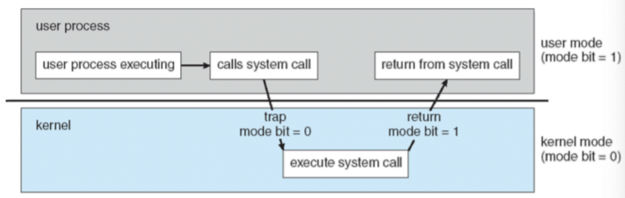

## **💡 2.1 User mode**

사용자 모드에서 사용자 애플리케이션 코드가 실행된다.

사용자가 접근할 수 있는 영역에 제한이 있기 대문에 해당 모드에서는 하드웨어 (디스크, I/O 등에 접근할 수 없다. )

우리가 개발하는 프로그램은 일반적으로 유저 모드에서 실행

## **💡 2.2 User mode → Kernel mode**

프로그램 실행 중에 **interrupt 발생** 하거나 **System call 을 호출**하게 되면 커널 모드로 전환

## **💡 2.3 Kernel mode**

**운영체제가 CPU를 사용하는 모드.**

시스템 콜을 통해 커널 모드로 전환이 되면 운영체제는 하드웨어를 제어하는 명령어 (Privileged Instruction)를 실행한다. Privileged Instructions는 사용자 모드에서 실행되면 exception이 발생한다.

> ### 💬 Kernel 모드의 이유 = 시스템을 보호하기 위해

- 만약 kernel 모드가 없다면? ~~우리가 만든 프로그램이 함부로 CPU를 점유해서 사용하고 다른 프로세스의 영향을 받게되고 그러다보면 자칫 잘못해서 전체 컴퓨터 시스템이 붕괴될 수도 있고…~~

- 우리가 개발한 프로그램은 시스템 기능이나 HW에 접근하려면 커널을 통해서 접근할 수 있게 설정함으로써 시스템이 안정적으로 동작할 수 있도록 함.

> ### 💬 대략적인 동작 순서
>
> (1) 프로그램의 현재 CPU 상태를 저장. 그래야 나중에 다시 이어서 실행을 할 수 있겠죠?

(2) 커널이 interrupt 또는 system call을 직접 처리. 즉, CPU에서 커널 코드가 실행됨

(3) 처리가 완료되면 중단됐던 프로그램의 CPU 상태를 복원 ( 항상 직전에 중단됐던 프로그램부터 시작하는 것은 아님. 예시로서만 보자. 다른 제 3 프로그램부터 시작할수도!)

## **💡 2.4 Kernel mode → User mode**

다시 통제권을 프로그램에게 반환

(아까 중단됐던 부분부터) 프로그램이 이어서 실행됨

# 📌 **3. Interrupt**

## **💡 3.1 개념**

시스템에서 발생한 다양한 종류의 이벤트 혹은 그런 이벤트를 알리는 메커니즘

## **💡 3.2 종류 (多)**

전원(power)에 문제가 생겼을 때

I/O 작업이 완료됐을 때

시간이 다 됐을 때 (timer라는 HW 관련)

프로그램 상에서 0으로 나눴을 때

프로그램에서 접근하면 안되는 잘못된 메모리 공간에 접근을 시도할 때

## **💡 3.3 동작**

인터럽트가 발생하면 CPU에서는 **즉각적으로** interrupt 처리를 위해 커널 코드를 커널 모드에서 실행

**즉각적으로** = interrupt는 언제든지 발생할 수 있기 때문에 interrupt 발생하는 순간, CPU에서는 사용자의 프로그램이 실행되고 있었을텐데, interrupt는 그럼 결국 어떠한 명령어 실행 중 발생한 것이기 때문에 실행중이던 명령어까지는 마무리를 한 뒤에 interrupt 처리를 위해 이제서야 커널이 동작권을 넘겨받아서 관련 처리를 하게 된다!

# 📌 4. System Call

> ### 💬 **시스템 콜은 왜 필요할까?**

우리가 일반적으로 사용하는 프로그램은 ‘응용 프로그램’!

유저 레벨의 프로그램은 유저 레벨의 함수들만으로는 많은 기능을 구현하기 힘들기 때문에 커널(kernel)의 도움을 반드시 받아야 한다. 이러한 작업은 응용 프로그램으로 대표되는 유저 프로세스 (User Process)에서(=유저모드에서)는 수행할 수 없다. 반드시 kernel에 관련된 것은 커널 모드로 전환한 후에야, 해당 작업을 수행할 권한이 생긴다.

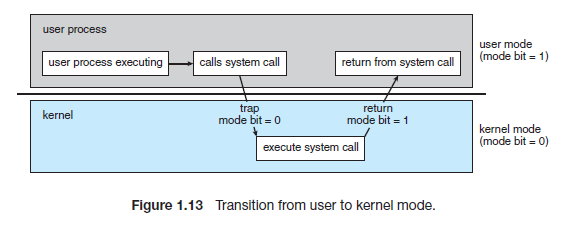

출처: Operating System Concepts 10th - SILBERSCHARTZ

> ### 💬 **권한은 왜 필요할까?**

해커가 피해를 입히기 위해 악의적으로 시스템 콜을 사용하는 경우,

초보 사용자가 HW 명령어를 잘 몰라서 아무렇게 함수를 호출했을 경우 시스템 전체를 망가뜨리는 경우 등을 방지

따라서 시스템 관련 명령어들을 특별하게 커널 모드에서만 실행할 수 있도록 설계했고, 만약 유저 모드에서 시스템 콜을 호출할 경우에는 운영체제에서 불법적인 접근이라 여기고 trap을 발생시킨다.

## **💡 4.1 정의**

**운영 체제의 커널이 제공하는 서비스에 대해, 응용 프로그램의 요청에 따라 커널에 접근하기 위한 인터페이스**

프로그램이 OS 커널이 제공하는 서비스를 이용하고 싶을 때 시스템 콜을 통해 실행

시스템 콜은 커널 영역의 기능을 사용자 모드가 가용 가능하게, 즉 프로세스가 하드웨어에 직접 접근해서 필요한 기능을 할 수 있게 해준다.

OS 는 다양한 서비스들을 수행하기 위해 HW를 직접적으로 관리한다. 반면, 응용 프로그램은 OS가 제공하는 인터페이스를 통해서만 자원을 사용할 수 있다. OS가 제공하는 이러한 인터페이스를 시스템 콜이라고 한다.

사용자 프로그램이 디스크 파일을 접근하거나 화면에 결과를 출력하는 등의 작업이 필요한 경우, 즉 사용자 프로그램이 특권 명령의 수행을 필요로 하는 경우, 운영체제에게 특권 명령의 대행을 요청하는 것

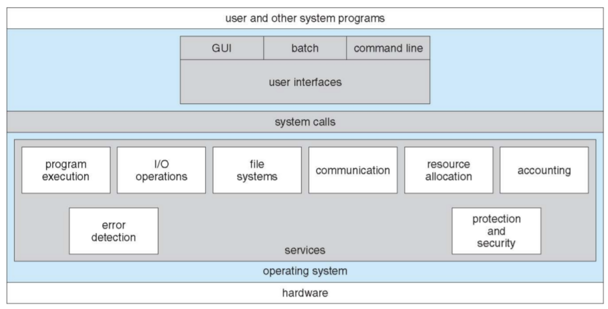

## **💡 4.2 구조**

각 시스템 콜에는 번호가 할당되고 시스템 콜 인터페이스는 **시스템 콜 번호와 시스템 콜 핸들러 함수 주소로 구성되는 시스템 콜 테이블**을 유지

- 운영체제는 자신의 커널 영역에서 해당 인덱스가 가리키는 주소에 저장되어 있는 루틴을 수행한다.
- 작업이 완료되면 CPU에게 인터럽트를 발생시켜 수행이 완료 되었음을 알린다.
- 아래 예시 : open() 이라는 시스템 콜의 인덱스가 가리키는 곳에 이에 대한 처리 과정이 저장되어 있다.

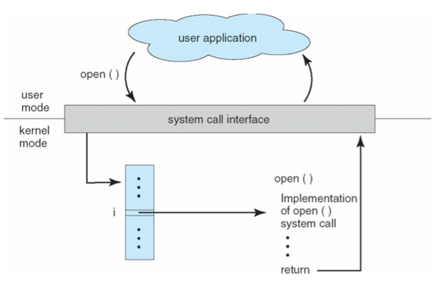

> ### 💬 OS에 매개변수 전달?

```
경우에 따라 시스템 콜이 발생했을 때, 추가적인 정보가 필요할 수도 있는데 그러한 정보가 담긴 매개변수들을 OS 에 어떻게 전달할까?

- 매개변수를 CPU 레지스터에 전달한다.
  - 전달해야 하는 매개변수 보다 레시스터의 수가 작을 수 있다.
- 매개변수를 메모리에 저장해 해당 메모리의 주소를 레지스터에 전달 할 수 있다.
- 매개변수는 프로그램에 의해 스택(stack)에 전달(push) 될 수도 있다.
- 2,3 번의 경우 매개변수의 갯수나 길이의 제한이 없기 때문에 선호되는 방식이다
```

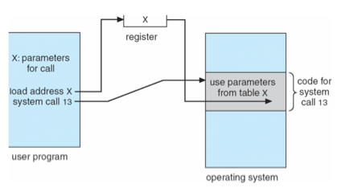

## **💡 4.3 종류**

[예시] 실제 UNIX system calls

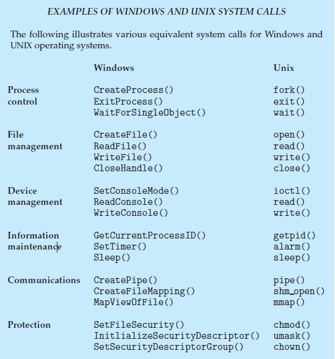

출처: Operating System Concepts 10th - SILBERSCHARTZ 68page

(1) 프로세스/스레드 제어 관련 (Process Control)

- 끝내기(exit), 중지(abort)
- 적재(load), 실행(execute)
- 프로세스 생성 (create process) -fork
- 프로세스 속성 획득과 속성 설정
- 시간 대기 (wait time)
- 사건 대기 (wait event)
- 사건을 알림 (signal event)
- 메모리 할당 및 해제

(2) 파일 I/O 관련 (File Manipulation)

- 파일 생성/삭제 (create, delete)
- 열기/닫기/읽기/쓰기 (open, close, read, write)
- 위치 변경 (reposition)
- 파일 속성 획득 및 설정 (get file attribute, set file attribute)

(3) 장치(device) 관련 (Device Manipulation)

- HW 제어와 상태 정보를 얻음 (ioctl)
- 장치를 요구 (request device), 장치를 방출 (release device)
- 읽기(read), 쓰기(write), 위치 변경
- 장치 속성 획득 및 설정
- 장치의 논리적 부착 및 분리

(4) 통신 (Communication)

- pipe(), shm_open(), mmap()
- 통신 연결의 생성, 제거
- 메시지의 송신, 수신
- 상태 정보 전달
- 원격 장치의 부착 및 분리

(5) 보호 (Protection)

- chmod()
- umask()
- chown()

## **💡 4.4 동작**

시스템 콜이 발생하면 해당 커널 코드가 커널 모드에서 실행된다.

ex. 리눅스에서 제공해주는 시스템 콜 종류

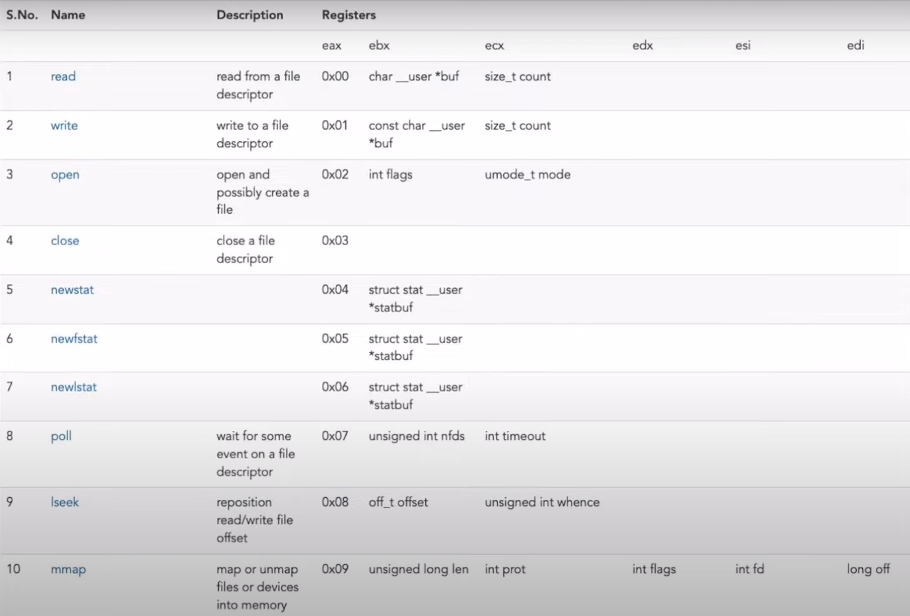

시스템 콜 & 인터럽트 예제

[파일 Read]

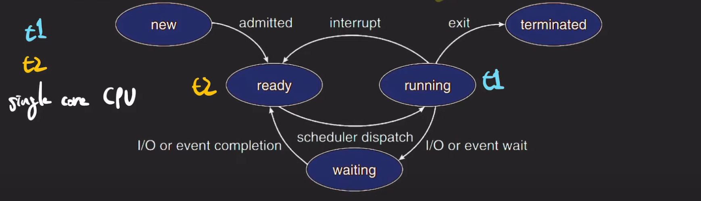

.

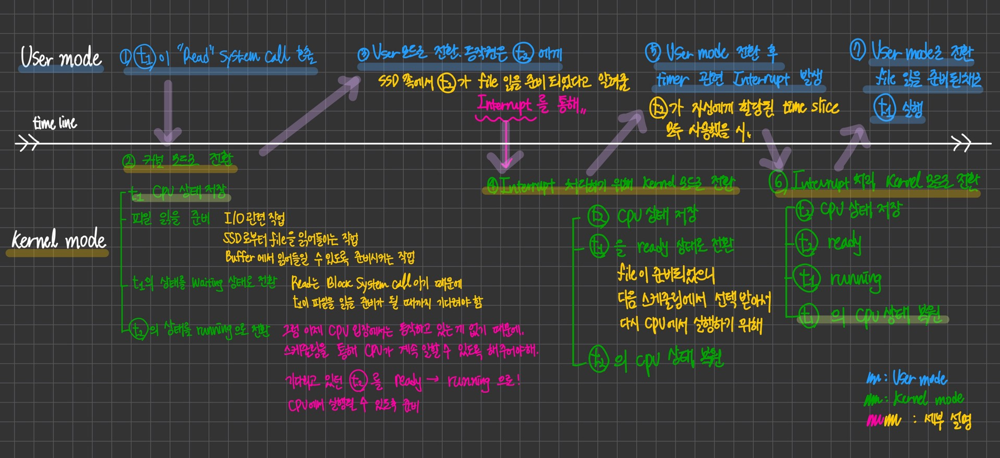

## **💡 4.5 예시**

리눅스 터미널에 아래와 같은 명령어를 입력한다고 가정해보자. 어떤 시스템 콜이 순차적으로 호출될까?

```java
cp in.txt out.txt
```

in.txt 에 있는 파일 내용과 같은 내용을 복사해 out.txt 파일을 만들겠다는 명령어

(1) 일반적으로 윈도우 운영체제라면 마우스가 / 리눅스라면 키보드가 사용자로부터 입력을 받는데 이떄 I/O 시스템 콜을 사용

(2) 먼저 ‘in.txt’파일이 현재 디렉토리에서 접근할 수 있는 파일인지를 검사하기 위해 시스템 콜을 호출

- 만약 파일이 존재하지 않는다면 에러를 발생시켜야 하고, 프로그램을 종료하는데 이 때 시스템 콜을 사용

(3) 만약 파일이 존재한다면, 복사한 파일을 저장하기 위해 ‘output.txt’ 파일 명이 있는지 검사. 이때도 마찬가지로 이 파일 명이 존재하는지 존재하지 않는지 검사하기 위해 시스템 콜을 통해 확인

- 그리고 만약 파일 명이 이미 존재한다면 덮어 씌워야 할지, 아니면 이어서 붙여야 하는지 User에게 물어볼 수도 있다.
- 만약 저장하고자 하는 파일 이름이 겹치지 않는다면, 파일을 저장해야 하는데 이 때도 시스템 콜을 이용

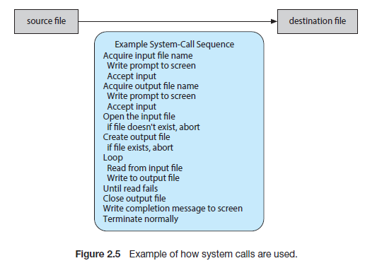
출처: Operating System Concepts 10th - SILBERSCHARTZ 63page

## **💡 4.6 high level 언어 vs low level System call**

그동안 우리는 어떻게 시스템 콜을 사용해온걸까?

우리가 사용하는 프로그래밍 언어들이 시스템 콜을 포장(wrapping)해 간접적으로 사용할 수 있도록 우리에게 제공해왔다..!

Java 에서 제공해주는 Thread class를 살펴보자

```java
**Thread** thread = new **Thread**();
thread.start();
```

```java
>> java.lang.Thread class

public synchronized void start(){
	// 생략
	boolean started = false;
	try{
		**start0**();
		started = true;
	} finally{
		// 이하 생략
```

```java
private native void start0();
// 구현체가 따로 없는 start0 라는 메서드
// 이 때 native란 주로 운영체제를 의미
```

Java native Interface를 통해 기반이 되는 OS의 system call 을 호출하겠다.

# 출처

https://fjvbn2003.tistory.com/306

Operating System Concepts 10th - SILBERSCHARTZ

https://didu-story.tistory.com/311

https://www.youtube.com/watch?v=v30ilCpITnY
