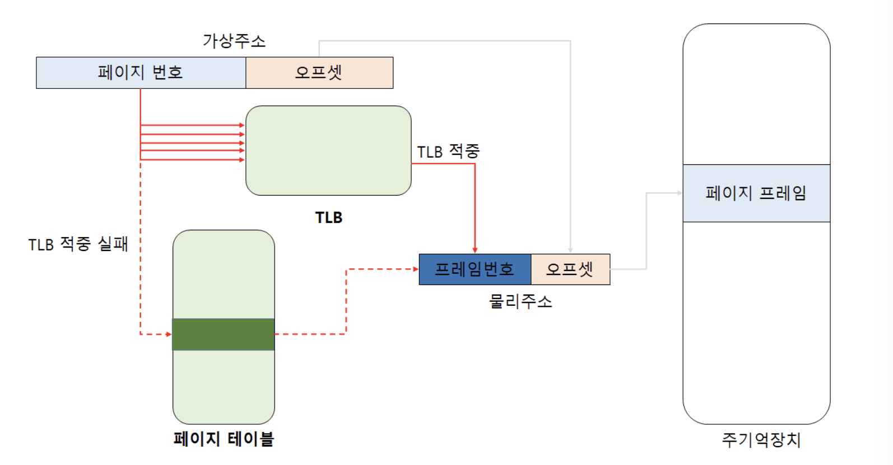
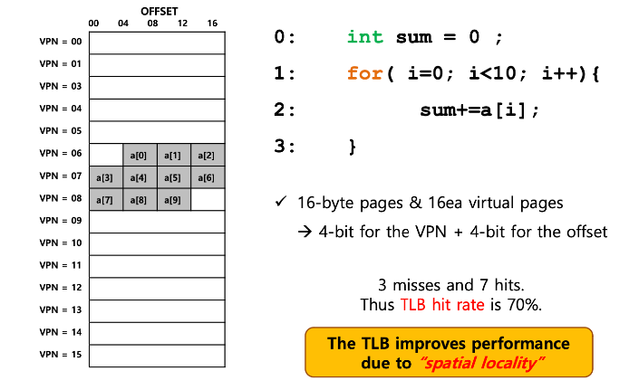
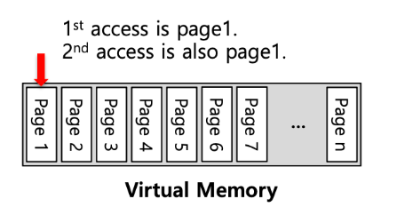
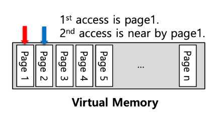
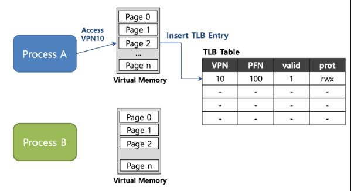
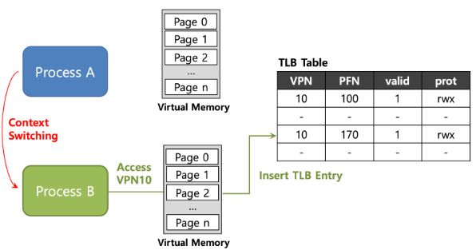
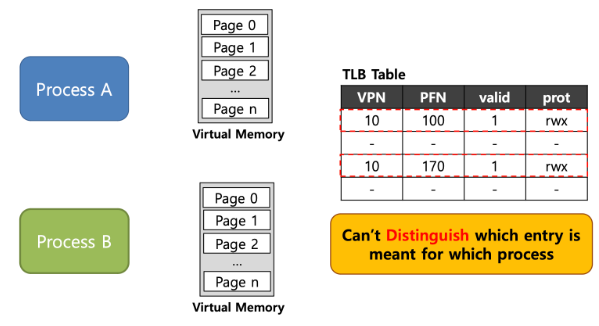
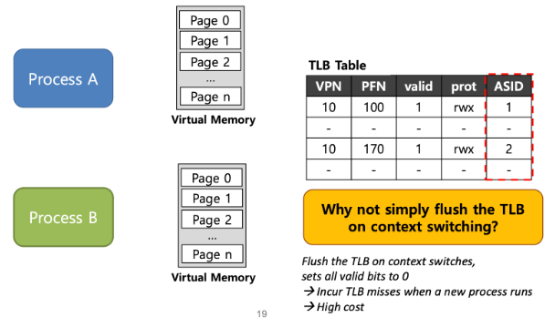
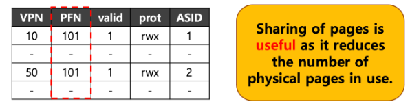
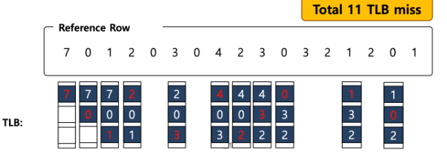

# 🎯 TLB(Translation Lookaside Buffer)
TLB란 가상 주소를 물리적 주소로 변환하는 과정에서 사용되는 고속 메모리 하드웨어이다. 이는 메모리 관리 유닛인 MMU에 의해 관리된다.

그러면 TLB는 왜 필요할까?

## 📍 TLB의 목적
> TLB : 가상 메모리 주소를 물리적 주소로 변환하는 속도를 높이기 위해 사용하는 캐시

페이지 테이블에 자주 접근하는 것은 여러가지 이유로 비효율적이다. 그 중 하나로는 추가적인 메모리 접근이다. 페이지 테이블은 메모리 상에 위치하고 가상 주소를 물리 주소로 변환하는 데 사용된다. CPU가 프로그램의 데이터가 접근하려 할 때마다 페이지 테이블을 조회하기 때문에 이러한 과정이 반복되면 시스템의 전반적인 성능에 부정적인 영향을 미칠 수 있다. 그렇기 때문에 TLB는 자주 사용되는 주소 변환을 제공하면서 이러한 비효율을 감소시킬 수 있다.

TLB는 CPU가 메모리에 접근할 때 발생하는 지연 시간을 줄여서 시스템의 전반적인 성능을 향상 시킨다. 메모리 접근할 때마다 페이지 테이블을 검색하는 대신, TLB를 먼저 확인하여 빠른 주소 변환을 한다.

## 📍 TLB 작동방식
-  CPU가 발생시킨 가상 주소가 TLB에 존재하는지 검사하고, 존재한다면 빠르게 물리 주소로 변환한다. 만약 TLB 미스가 발생한다면, 물리 메모리에 있는 페이지 테이블로부터 주소를 검색하여 TLB를 업데이트 한다.

- 만약 페이지 테이블에도 없다면 페이지 폴트 처리 루틴을 수행한다. 운영체제는 CPU에게 페이지를 Fetch하도록 명령한다. CPU는 입출력장치를 활성화시키고 디스크에서 주기억장치로 페이지를 전송한다. 만약 주기억장치가 가득 찼다면 페이지 교체가 수행된다. 페이지가 주기억 장치에 할당되면 페이지 테이블을 갱신한다. 그리고 CPU는 다시 TLB 검사를 하는데 TLB에는 아직 페이지 정보가 없다. 그렇기 때문에 페이지 테이블을 검사하고 새로 반입된 페이지가 존재하게 되면 이는 새로 참조된 페이지이므로 TLB를 갱신하고 CPU가 논리주소를 물리주소로 변환하면 과정을 끝난다.

- TLB 히트는 요청된 페이지의 주소 정보가 TLB에 이미 존재할 때 발생하며, TLB 미스는 해당 정보가 없을 때 발생한다.

- 오프셋은 주로 가상 주소와 물리 주소 모두에 있어서 페이지 내에서의 특정 위치를 가리키는 데 사용된다. 가상 주소를 물리 주소를 변환할 때 오프셋은 변환 과정에서 변경되지 않고 그대로 유지된다. 다시 말하면, 오프셋은 메모리 페이지 내에서의 상대적인 위치를 가리키며, 가상 주소를 물리 주소로 변환할 때 이 오프셋 값은 그대로 사용되어, 프로세스가 요청한 데이터를 정확한 메모리 위치에서 찾을 수 있도록 한다.

## 📍 TLB 한계점
TLB는 크기가 제한적이기 때문에 모든 페이지 정볼르 저장할 수 없고 이로 인해 TLB 미스가 발생할 수 있다. 또한 프로세스 간 context switching이 발생할 때, TLB 내용은 대부분 무효화 되거나 새로운 프로세스의 매핑으로 갱신된다.

## 📍 TLB entry
TLB에는 자주 사용하는 VPN(Virtual Page Number)와 PFN(Physical Frame Number) 정보가 쌍으로 존재하며 이를 사용해 가상 주소를 실제 주소로 변환하도록 도와주는 하드웨어 캐시이다.

TLB는 Full Associative method에 의해 관리된다. Full Associative는 캐시 내에 아무 장소에 매핑될 수 있음을 말한다. 따라서 주소 변환 정보가 TLB의 어디에나 존재할 수 있으며 하드웨어가 전체 TLB를 병렬로 검색해서 주소 변환 정보를 찾을 수 있다.

캐시란 임시로 쓰이는 버퍼 메모리이다. 자주 사용되는 데이터들을 하위 메모리보다 빠른 공간에 임시로 넣어두고, 필요할 때마다 바로 쓸 수 있도록 하기 위해 생겨난 기술이며 구조이자 장치라고 할 수 있다. 도서관의 예시가 있다.

> VPN | PFN | other bits

TLB는 위의 세 가지로 구성되어 있다. Other bits는 현재 존재하는 주소 변환 정보가 유효한지에 대한 비트, 페이지 테이블에서 같은 페이지에 접근할 수 있는지 확인하는 protection 비트, context switch에 사용되는 address-space identifier 비트, 그리고 수정 여부에 대한 dirty bit 등이 있다.

## 📍 TLB 효용 예시

위의 예시를 본다면 Page의 크기는 16 byte 이며 가상 주소 공간의 크기를 8 bit라고 가정한다. 가상 주소 공간에 존재하는 page 수는 16개가 된다.
위를 보면 TLB hit는 7개가 생겼고 TLB miss는 3개가 생겼다. 이를 통해 TLB hit rate = 70%를 요소 개수가 훨씬 많은 곳에 적용한다면 이보다 증가하는 모습을 보여줄 것이다.

TLB가 없는 상황이었다면 총 10번의 주소 변환을 해줬어야 했지만 TLB가 있는 사오항이라면 3번만 해주면 된다. 이렇듯 TLB는 공간 지역성으로 인해 성능을 향상 시킨다.

### 🏷️ Locality
Spatial Locality(공간 지역성)란 어떤 요소에 접근한 상황이라면 그 주변의 요소들에 접근할 가능성이 높다는 의미이다.

Time Locality(시간 지역성)란 최근에 접근한 명령이나 데이터에 조만간 또 접근할 가능성이 높음을 의미한다.

## 📍 TLB Miss
TLB 미스가 발생하면 메모리에 존재하는 페이지 테이블에 접근해야 하는데 이는 HW와 OS 하는 각각의 방법으로 나뉜다.

하드웨어는 TLB Miss를 처리할 때 하드웨어는 페이지 테이블이 메모리 어디에 존재하는지와 페이지 테이블에 존재하는 정보를 정확하게 알아야 한다. 이를 모른다면 하드웨어는 페이지 테이블을 walk하여 올바른 정보를 페이지 테이블에서 TLB로 업데이트 하고 주소 변환을 다시 시도한다.

OS가 TLB Miss를 처리하는 과정을 보자. TLB Miss가 발생하면 하드웨어는 현재 명령을 중지하고 권한을 커널 모드로 올리 뒤 트랩 처리기로 예외를 발생시킨다. 그리고 페이지 테이블을 조회해서 TLB를 업데이트하고 다시 주소 변환을 시도한다. 여기서 중요한 것은 트랩을 발생시킬 때 프로세스를 종료하는 것이 아니고 TLB를 업데이트 한 뒤에 다시 실행해야 하는 것이다. 이로 인해 OS로 TLB Miss를 처리할 때는 무한루프에 빠지지 않도록 주의해야 한다. 즉 TLB에 주소 변환 정보가 없어서 페이지 테이블에 접근했는데도 존재하지 않는다면 무한 루프에 빠질 수 있다. 그렇기 때문에 TLB의 일부를 영구적으로 유효한 주소 변환을 위해 저장해 두고 이러한 상황을 처리할 수 있다.

OS로  TLB를 관리할 때의 가장 큰 장점은 유연성이다. OS는 하드웨어의 변경 없이 페이지 테이블을 구현하는 모든 자료 구조를 사용할 수 있다.

또 다른 장점은 단순함이다. Miss가 발생해도 하드웨어가 할 일은 별로 없고 그저 OS TLB Miss 핸들러가 작동해서 이러한 문제를 해결한다.

## 📍 Effective Access Time(EAT)
EAT는 실제 메모리에 접근하는 시간을 말한다. EAT를 구하는 방법은 아래와 같다.

TLB hit ratio a = 80%

TLB search: 20ns(TLB에서 해당 정보를 찾는 시간)

Memory access: 100 ns(메모리에 한 번 접근하여 데이터를 가져오는 시간)

EAT = 0.80 * (20 + 100) + 0.20 * (20 + 100 + 100) = 140 ns

20 + 100 : TLB Hit이 된 경우 TLB에 가서 메모리가 접근한 시간을 의미(TLB가 있는 경우)

20 + 100 + 100 : TLB search + Page table에 접근한 시간 + Memory access 합한 값을 의미(TLB가 없는 경우)

## 📍 TLB Issue: Context Switching

process A의 VPN 10에 대한 주소 변환 정보가 TLB에 저장되어 있다.

참고로 process마다 각자의 Virtual Memory를 가지고 있다.

이 때 Context Switching이 발생하여 process B로 넘어가게 되는데, process B 역시 VPN 10에 대한 주소 변환 정보가 TLB에 저장되어 있다.

이런 경우 process A, B 둘 다 VPN은 10으로 동일하지만 PFN은 서로 다른 것을 확인할 수 있다.

하지만 위와 같이 TLB에 정보를 저장하게 되면 어떤 정보가 어떤 process의 정보인지 알 수 없다.

process에서 서로의 주소 공간이 아닌 곳에 접근을 하게 될 경우 문제가 발생하므로 이를 해결할 방법이 필요하다.

문제를 해결하기 위해 하드웨어의 도움을 받아 TLB에서 ASID(address space identifier)라는 정보를 추가해서 문제를 해결하는 것이다.

어떤 프로세스의 정보인지 구별하기 위해 TLB에서 ASID를 제공한다.

이를 통해 프로세스마다 다른 ASID 정보를 저장해서 주소 변환을 성공적으로 수행할 수 있도록 한다.

위에서는 VPN이 동일한 예시를 봤고 이제 PFN이 동일한 경우에 대해서 알아보자

위의 예시를 가정해보면 process 1은 process 2와 같은 PFN 값이 101로 동일하다.

process 1의 VPN은 10이고, process 2의 VPN은 50이다.

두 개의 process가 PFN 값이 같으므로 Page를 공유할 수 있다.

그러면 메모리의 사용을 줄일 수 있으므로 메모리의 공간을 이전보다 더 확보할 수 있게 된다.

하지만 어떤 프로세스인지 구별을 확인하기 위해 ASID 값도 같이 저장한다.

## 📍 TLB Replacement Policy
TLB에 저장 가능한 공간이 꽉 찼을 경우 새로운 프로세스가 실행된다면, 어떤 프로세스를 빼고 새로운 것을 넣어야 하는지에 대해 알아보자.

우선 목표는 TLB miss rate를 최소화하는 것이다.(TLB hit rate를 향상시키는 것과 같은 말이다.

전형적으로 2가지 간단한 접근 방법이 있다. (LRU, Random policy)

LRU(Least-recently-used): 최근에 사용하지 않는(예전에 사용하고 지금은 사용하지 않는) process 를 내보내는 방법. LRU는 위에서 설명한 Temporal Locality의 장점을 이용한다.

Random policy: 이름 그대로 랜덤하게 제거하는 방법이다.

예시) LRU

LRU 접근 방법을 이용하여 TLB miss rate를 최소화하는 과정을 알아보자

Reference Row: 주어진 새로운 숫자(process)가 순차적으로 실행한다는 것을 의미한다.

4번째에 숫자 ‘2’라는 새로운 프로세스가 발생했을 때, 가장 오래 사용하지 않았던 숫자 ‘7’를 빼고 ‘2’를 넣는 것을 확인할 수 있다.

이처럼 최근에 가장 사용하지 않았던 프로세스를 내보내고, 그 자리에 새로운 프로세스가 들어온다.

18번 중에 11번의 miss가 발생했기 때문에, 결론적으로 TLB miss ratio = 11/18 = 0.61 = 61%값을 확인할 수 있다.

# ✅ 출처
- https://velog.io/@becooq81/운영체제-TLB

- https://lordofkangs.tistory.com/244

- https://velog.io/@orcasuit/Translation-Lookaside-Buffer-TLB

- https://icksw.tistory.com/149

- https://github.com/devSquad-study/2023-CS-Study/blob/main/OS/os_tlb_advanced.md