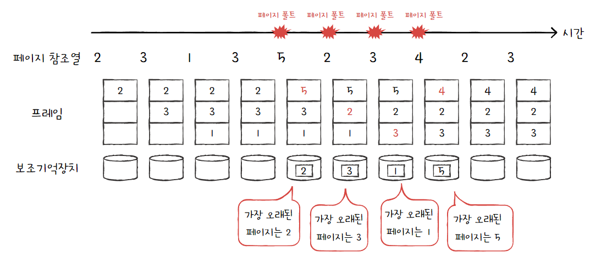
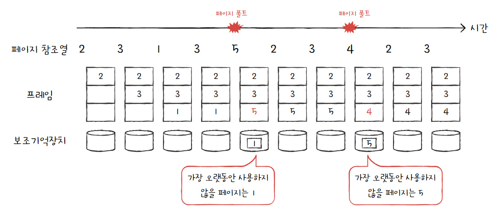
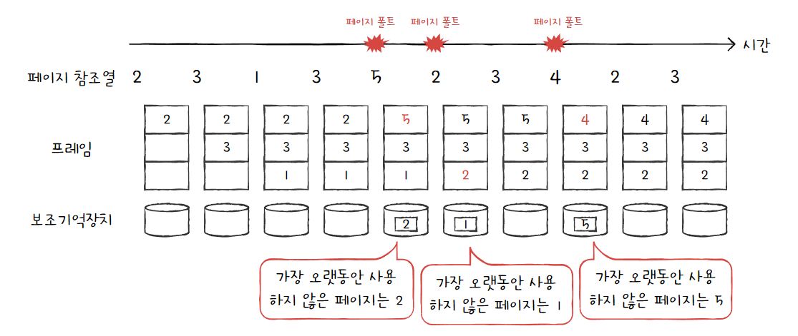
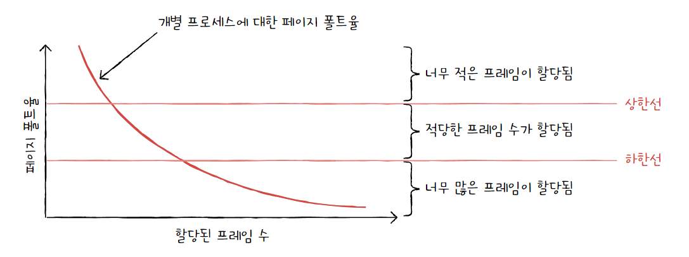

# 가상메모리와 요구 페이징, 페이지 교체

## 가상메모리

실행하고자 하는 프로그램을 일부만 메모리에 적재하여 실제 물리 메모리 크기보다 더 큰 프로세스를 실행할 수 있게 하는 기술이다.

이를 가능케 하는 기법에는 크게 페이징과 세그멘테이션이 있으며, 이번 주 내용에 포함되어 있어 여기서는 설명을 생략하려고 한다.

## 요구 페이징

프로세스를 메모리에 적재할 때 처음부터 모든 페이지를 적재하지 않고 필요한 페이지만을 메모리에 적재하는 기법을 요구 페이징이라고 한다.

요구 페이징의 기본적인 양상은 다음과 같다.

1. CPU가 특정 페이지에 접근하는 명령어를 실행한다.
2. 해당 페이지가 현재 메모리에 있을 경우(유효 비트가 1일 경우) CPU는 페이지가 적재된 프레임에 접근한다.
3. 해당 페이지가 현재 메모리에 없을 경우(유효 비트가 0일 경우) 페이지 폴트가 발생한다.
4. 페이지 폴트 처리 루틴은 해당 페이지를 메모리로 적재하고 유효비트를 1로 설정한다.
5. 다시 1번을 수행한다.

이러한 요구 페이징 시스템이 안정적으로 작동하려면 페이지 교체와 프레임 할당을 해결해야 한다.

## 페이지 교체

앞서 말한 두 가지 중 우선 페이지 교체에 대해 알아보고자 한다. 요구 페이징 기법으로 페이지들을 적재하다 보면 언젠가 메모리가 가득 차게 될 것이다. 이러면 당장 실행해야 하는 페이지를 적재할 공간을 확보하기 위해 메모리에 있는 페이지를 보조기억장치로 내보내야 한다. 이때 어떤 페이지를 내보낼 것인지를 결정하는 알고리즘을 페이지 교체 알고리즘이라고 한다.

## 페이지 교체 알고리즘

일반적으로 좋은 페이지 교체 알고리즘이란 페이지 폴트를 가장 적게 일으키는 알고리즘을 의미한다. 따라서 페이지 폴트 횟수를 아는 것이 중요하며, 이는 페이지 참조열을 통해 알 수 있다. 페이지 참조열이란 CPU가 참조하는 페이지들 중 연속된 페이지를 생략한 페이지열을 의미한다.

예를 들어 CPU가 다음과 같은 순서로 페이지에 접근했다고 가정해보자.

> 2 2 2 3 5 5 5 3 3 7

여기서 연속된 페이지를 생략한 아래와 같은 페이지열이 페이지 참조열이다.

> 2 3 5 3 7

연속된 페이지를 생략하는 이유는 중복된 페이지를 반복해서 참조하는 행위는 페이지 폴트를 발생시키지 않기 때문이다. 따라서 페이지 교체 알고리즘을 평가할 때 연속된 페이지를 생략한 페이지 참조열만 고려하면 된다.

이제부터 각 페이지 교체 알고리즘을 알아보고 평가해보고자 한다.

### 1. FIFO 페이지 교체 알고리즘

첫번째는 FIFO 페이지 교체 알고리즘이다. 이는 이름에서도 알 수 있듯 메모리에 올라온 순서대로 페이지를 내쫓는 방식이다. 

예시를 통해 더욱 자세히 알아보자. 프로세스가 사용할 수 있는 프레임이 세 개이며, 페이지 참조열은 아래와 같다고 가정한다.

> 2 3 1 3 5 2 3 4 2 3

그러면 아래와 같은 순서로 교체되어 총 네 번의 페이지 폴트가 발생한다.

(사실 엄밀히 따지면 처음에 페이지를 적재할 때에도 페이지 폴트가 발생하지만 여기서는 교체할 때의 페이지 폴트만을 페이지 폴트로 간주했다.)

FIFO 페이지 교체 알고리즘은 아이디어와 구현이 간단하지만 명확한 단점이 있다. 프로그램 초기에 실행하는 페이지 중에는 프로그램 실행 내내 사용될 내용이 있을 수도 있다. 이러한 페이지마저 먼저 적재되었다는 이유로 내쫓기는 알고리즘이기 때문에 비효율적이다.

### 2. 최적(OPT) 페이지 교체 알고리즘

최적 페이지 교체 알고리즘은 CPU에 의해 참조되는 횟수를 고려하는 페이지 교체 알고리즘이다. 앞으로의 사용 빈도가 가장 낮을 페이지를 교체하는 방식이 가장 합리적이라고 할 수 있으며, 이를 최적 페이지 교체 알고리즘이라고 한다.

FIFO 페이지 교체 알고리즘에서의 예시와 같은 상황을 가정해보자.

> 2 3 1 3 5 2 3 4 2 3

최적 페이지 교체 알고리즘은 아래와 같이 두 번의 페이지 폴트가 발생한다.

최적 페이지 교체 알고리즘은 이름에서부터 알 수 있듯이 가장 낮은 페이지 폴트율을 보장하는 알고리즘이다. 하지만 이는 실제 구현이 어렵다는 큰 단점을 가지고 있다. 앞으로의 사용 빈도가 낮을 페이지를 예측하는 것은 현실적으로 불가능에 가깝다.

따라서 최적 페이지 교체 알고리즘은 그 자체로 운영체제에서 사용되기 보다는 최적 페이지 교체 알고리즘에서의 페이지 폴트 횟수를 페이지 폴트의 하한선으로 정하고 다른 페이지 교체 알고리즘의 페이지 폴트 횟수와 비교하여 해당 알고리즘을 평가하는 데에 사용한다.

### 3. LRU 페이지 교체 알고리즘

최적 페이지 교체 알고리즘은 구현하기 어렵지만 그와 비슷한 컨셉으로 만들어진 알고리즘이다. LRU 페이지 교체 알고리즘은 최근에 사용되지 않은 페이지는 앞으로도 사용되지 않을 것이라는 아이디어에서 출발한 알고리즘이다. 즉, 가장 오랫동안 사용되지 **'않을'** 페이지가 아니라 가장 오랫동안 사용되지 **'않은'** 페이지를 교체하는 알고리즘이다.

앞의 예시와 같은 상황을 가정해보자.

> 2 3 1 3 5 2 3 4 2 3

LRU 페이지 교체 알고리즘 기준으로는 아래와 같이 3회의 페이지 폴트가 발생했다.

### 그 외 부가적인 알고리즘들

1. LFU 페이지 교체(LFU Page Replacement)
- LFU: Least Frequently Used
- 참조 횟수가 가장 적은 페이지를 교체하는 방법이다. 활발하게 사용되는 페이지는 참조 횟수가 많아질 거라는 가정에서 만들어진 알고리즘이다.
- 어떤 프로세스가 특정 페이지를 집중적으로 사용하다, 다른 기능을 사용하게되면 더 이상 사용하지 않아도 계속 메모리에 머물게 되어 초기 가정에 어긋나는 시점이 발생할 수 있다.
- 최적(OPT) 페이지 교체를 제대로 근사하지 못하기 때문에, 잘 쓰이지 않는다.

2. MFU 페이지 교체(MFU Page Replacement)
- MFU: Most Frequently Used
- 참조 회수가 가장 작은 페이지가 최근에 메모리에 올라왔고, 앞으로 계속 사용될 것이라는 가정에 기반한다.
- 최적(OPT) 페이지 교체를 제대로 근사하지 못하기 때문에, 잘 쓰이지 않는다.

 

---

 

## 스래싱과 프레임 할당

처음에 요구 페이징 시스템이 안정적으로 작동하려면 페이지 교체와 프레임 할당을 해결해야 한다고 했다. 이제 프레임 할당을 알아보려고 한다.

앞서 봤던 예시들에서는 프레임 수를 3개로 가정했었다. 이번에는 프레임이 무한히 많은 컴퓨터와 프레임이 하나뿐인 컴퓨터를 비교해보자. 전자는 페이지를 수용할 공간이 넉넉하여 모든 프로세스의 페이지가 메모리에 적재될 수 있기 때문에 페이지 폴트 발생 빈도가 적지만, 후자의 경우에는 새로운 페이지를 참조할 때마다 페이지 폴트가 발생한다.

이처럼 프레임이 부족하면 페이지 폴트가 자주 발생한다. 이러한 과정 속에서 CPU를 이용하지 못하고 페이지를 계속해서 교체한다면 성능이 저해될 수 밖에 없고 이를 스래싱이라고 한다.

## 프레임 할당 방식

스래싱이 발생하는 근본적인 원인은 각 프로세스가 필요로 하는 최소한의 프레임 수가 보장되지 않았기 때문이다. 따라서 운영체제는 각 프로세스들이 실행되기에 무리가 없는 최소한의 프레임 수를 파악하고 할당하는 것이 중요하다.

## 정적 할당

### 균등 할당

모든 프로세스에 균등하게 프레임을 배분하는 방식이다. 예를 들어 세 개의 프로세스에 300개의 프레임을 할당한다면 각 프로세스에 100개의 프레임을 할당하는 방식이다.

이는 당연하게도 프로세스마다 크기가 다른데 일괄적으로 동일한 프레임 개수를 할당하는 것은 비합리적이라는 단점을 가지고 있다.

### 비례 할당

비례 할당은 앞서 얘기한 균등 할당을 가장 간단한 방식으로 보완한 방식이다. 각 프로세스의 크기에 따라 크기가 크면 더 많은 프레임을 할당하고, 크기가 작으면 더 적은 프레임을 할당하는 방식을 말한다.

하지만 프로세스의 크기가 크더라도 막상 실행했을 때는 프레임이 많이 필요하지 않은 경우가 있으며, 반대의 경우도 마찬가지이다. 여기서 오는 비효율이 비례 할당의 단점이다.

## 동적 할당

### 작업 집합 모델 기반 프레임 할당

CPU는 메모리를 참조할 때 참조 지역성의 원리에 의거해 주로 비슷한 구역을 집중적으로 참조한다. 한 프로세스가 100개의 페이지로 이루어졌다고 해서 100개를 모두 고르게 참조하는 것이 아니라 특정 시간 동안에는 몇 개의 페이지를 집중적으로 참조한다.

실행 중인 프로세스가 일정 시간 동안 참조한 페이지의 집합을 작업 집합이라고 한다. 작업 집합 모델 기반 프레임 할당은 이처럼 작업 집합의 크기만큼 프레임을 할당하는 방식이다.

### 페이지 폴트 빈도 기반 프레임 할당

페이지 폴트 빈도 기반 프레임 할당은 페이지 폴트율이 너무 높으면 그 프로세스는 너무 적은 프레임을 가지고 있고, 너무 낮으면 너무 많은 프레임을 가지고 있다는 아이디어에서 출발한 프레임 할당 방식이다. 페이지 폴트율의 상한선과 하한선을 정해서 그 범위 안에서만 프레임을 할당한다.

### 출처
혼자 공부하는 컴퓨터 구조 + 운영체제 (강민철 지음, 한빛미디어) 
https://github.com/JaeYeopHan/Interview_Question_for_Beginner/tree/main/OS#%EA%B0%80%EC%83%81-%EB%A9%94%EB%AA%A8%EB%A6%AC 
