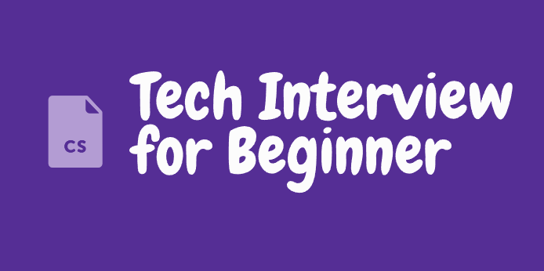

# Tech_Interview_for_Beginner 📖

**기술 면접을 대비하여 CS 관련 지식을 정리하는 Repository 입니다.**

> 📢 이제 막 개발자를 꿈꾸는 신입 개발자들이 작성하는 Repo 입니다.
> 
> :name_badge: 부족한 부분이 많을 수 있지만 면접을 준비하시면서 참고사항이 되었으면 좋겠습니다.

 

## 📌 Contents
- [DataStructure]()
- [Database]()
- [Network]()
- [Operating System]()
- [Interview]() 

--- 

## 📚 DataStructure
- [스택(Stack) & 큐(Queue)](https://github.com/techInterview-study/Tech_Interview_for_Beginner/blob/main/DataStructure/ds_stack_and_queue.md)
- [Array & LinkedList](https://github.com/techInterview-study/Tech_Interview_for_Beginner/blob/main/DataStructure/ds_array_and_linkedlist.md)
- [Tree](https://github.com/techInterview-study/Tech_Interview_for_Beginner/blob/main/DataStructure/ds_tree.md)
- [이진탐색트리 (Binary Search Tree)](https://github.com/techInterview-study/Tech_Interview_for_Beginner/blob/main/DataStructure/ds_binary_search_tree.md)
- [Red-Black Tree](https://github.com/techInterview-study/Tech_Interview_for_Beginner/blob/main/DataStructure/ds_red_black_tree.md)
- [Graph](https://github.com/techInterview-study/Tech_Interview_for_Beginner/blob/main/DataStructure/ds_graph.md)
- [힙(Heap)](https://github.com/techInterview-study/Tech_Interview_for_Beginner/blob/main/DataStructure/ds_heap.md)
- [거품 정렬 & 선택 정렬 & 삽입 정렬](https://github.com/techInterview-study/Tech_Interview_for_Beginner/blob/main/DataStructure/ds_bubble_selection_insertion_sort.md)
- [퀵 정렬 & 병합 정렬 & 힙 정렬](https://github.com/techInterview-study/Tech_Interview_for_Beginner/blob/main/DataStructure/ds_quick_merge_heap_sort.md)
- [해시 테이블](https://github.com/techInterview-study/Tech_Interview_for_Beginner/blob/main/DataStructure/ds_hash_table.md)
- [암호화 알고리즘](https://github.com/techInterview-study/Tech_Interview_for_Beginner/blob/main/DataStructure/ds_encryption_algorithm.md)   

##  Database
- [키(Key) 정리]()
- [ERD와 정규화 과정]()
- [트랜잭션 개념과 ACID 속성]()
- [트랜잭션 concurrency control(Serializability, Recoverable)]()
- [트랜잭션 Isolation level(격리 수준)과 이상 현상]()
- [SQL - JOIN]()
- [인덱스(INDEX)]()
- [스키마(Schema)]()
- [저장 프로시저(Stored PROCEDURE)]()
- [DBMS와 NoSQL]()
- [RDB와 NoSQL에서의 클러스터링/레플리케이션 방식]()
- [B-Tree & B+Tree]()
- [DB Locking]()
- [DB의 Connection Pool]()
- [Trigger]()
- [Redis]()   

##  Network
- [네트워크의 기초]()
- [대역폭]()
- [OSI 7계층]()
- [TCP 의 연결 및 해제 과정 (3,4-way hands shaking)]()
- [DNS & 웹 통신 흐름]()
- [Blocking I/O & Non-Blocking I/O]()
- [L7, L4 스위치 & 로드밸런싱]()
- [HTTP 진화 과정]()
- [HTTPS]()
- [쿠키 & 세션]()
- [프록시 서버]()
- [SOP와 CORS]()
- [네트워크 토폴로지 ]()
- [REST API & RESTful]()   

##  Operating System
- [운영체제와 컴퓨터 ]()
- [메모리 계층]()
- [프로세스와 스레드]()
- [CPU 스케줄링 알고리즘 ]()
- [인터럽트(Interrupt)]()
- [시스템 콜(System Call) ]()
- [PCB & Context Switching]()
- [주소 공간과 가상 메모리(Address Space, Virtual Memory)]()
- [주소 변환(Address Translation)]()
- [세그먼테이션(Segmentation) ]()
- [페이징(Paging)]()
- [가상메모리와 요구 페이징 & 페이지 교체]()
- [TLB(Translation Lookaside Buffers)]()
- [TLB 심화]()
- [Paging : Smaller Table]()
- [동기화(스핀락, 세마포어, 뮤텍스)]()
- [교착상태(DeadLock)]()
- [멀티프로세스 & 스레드 & 멀티스레딩]()   

## :octocat: Contributor

|  |  ||||||
|:---:|:---:|:---:|:---:|:---:|:---:|:---:|
| 치왕 | 재성 | 혜윤 | 성환 | 효림 | 예진 | 윤하 |